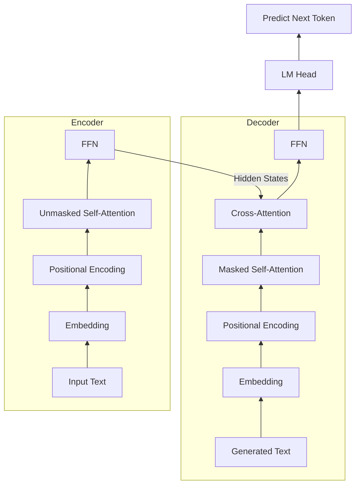
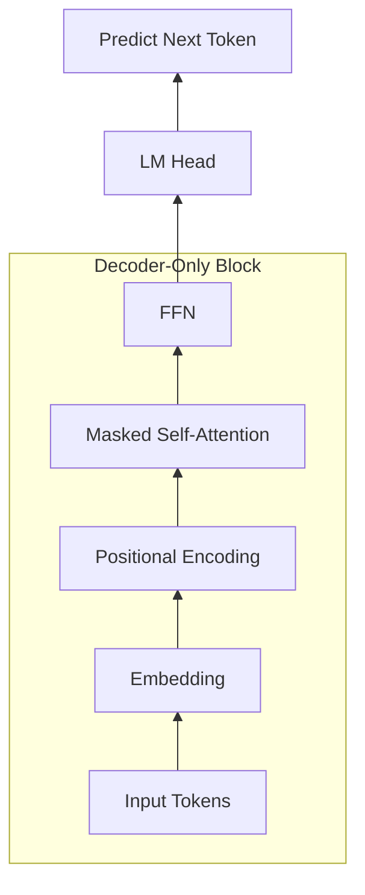
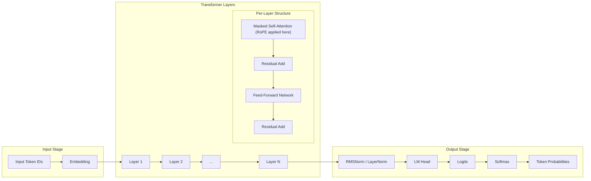
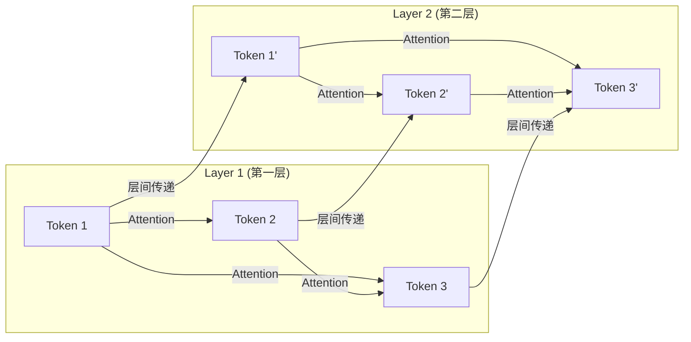

# LLM 从原理到生产级推理：系统化电子书大纲

<!-- TOC -->
- [前言](#前言)
- [第一部分：原理篇 —— Transformer 与 LLM 的工作底座](#第一部分原理篇--transformer-与-llm-的工作底座)
  - [第一章：揭秘 Transformer：Q、K、V 的魔力](#第一章揭秘-transformerqkv-的魔力)
    - [第一节：鸟瞰图：经典 Transformer 架构的宏观分工](#第一节鸟瞰图经典-transformer-架构的宏观分工)
    - [第二节：演进：现代 LLM 的 Decoder-Only 架构](#第二节演进现代-llm-的-decoder-only-架构)
    - [第三节：图书馆类比：理解自注意力 Q、K、V 的逻辑含义](#第三节图书馆类比理解自注意力-qkv-的逻辑含义)
    - [第四节：数学原理：自注意力的权重矩阵与动态向量生成](#第四节数学原理自注意力的权重矩阵与动态向量生成)
    - [第五节：前馈网络（FFN）：模型的高速公路与知识库](#第五节前馈网络ffn模型的高速公路与知识库)
    - [第六节：自注意力的拓展：多头注意力（Multi-Head Attention）](#第六节自注意力的拓展多头注意力multi-head-attention)
    - [第七节：FFN 的拓展：混合专家模型（MoE）](#第七节ffn-的拓展混合专家模型moe)
  - [第二章：建造摩天大楼：层层堆叠与数据流](#第二章建造摩天大楼层层堆叠与数据流)
    - [第一节：摩天大楼的入口：词嵌入与位置编码](#第一节摩天大楼的入口词嵌入与位置编码)
    - [第二节：层层堆叠的智慧：为什么要多层 Transformer？](#第二节层层堆叠的智慧为什么要多层-transformer)
    - [第三节：翻译官：LM Head](#第三节翻译官lm-head)
    - [第四节：Logits 和 Softmax：将原始分数转换为概率分布](#第四节logits-和-softmax将原始分数转换为概率分布)
    - [第五节：科普小贴士：我们常说的 8B/70B 参数到底存在哪里？](#第五节科普小贴士我们常说的-8b70b-参数到底存在哪里)
    - [第六节：数据流：从底层直达顶层的端到端全景](#第六节数据流从底层直达顶层的端到端全景)
  - [第三章：运转的艺术：自回归解码与文本生成](#第三章运转的艺术自回归解码与文本生成)
    - [第一节：Prefill（预填充）：处理输入的具体过程](#第一节prefill预填充处理输入的具体过程)
    - [第二节：Decode（解码）：自回归循环与文本生成](#第二节decode解码自回归循环与文本生成)
- [第二部分：瓶颈篇 —— 为什么 LLM 推理如此困难](#第二部分瓶颈篇--为什么-llm-推理如此困难)
  - [第四章：衡量大模型推理的“尺子”：核心指标解析](#第四章衡量大模型推理的尺子核心指标解析)
  - [第五章：从零开始：最朴素的 LLM 推理是如何运作的？](#第五章从零开始最朴素的-llm-推理是如何运作的)
    - [第一节：无优化推理流程](#第一节无优化推理流程)
    - [第二节：瓶颈剖析：计算复杂度爆炸](#第二节瓶颈剖析计算复杂度爆炸)
    - [第三节：引出优化：我们能否“记住”过去的计算？](#第三节引出优化我们能否记住过去的计算)
  - [第六章：破局者 KV Cache 及其带来的“显存海啸”](#第六章破局者-kv-cache-及其带来的显存海啸)
    - [第一节：空间换时间：缓存 K 和 V](#第一节空间换时间缓存-k-和-v)
    - [第二节：为什么只有 K 和 V？](#第二节为什么只有-k-和-v)
    - [第三节：显存海啸：TB 级的数学题](#第三节显存海啸tb-级的数学题)
  - [第七章：最大化 GPU 利用率：批处理的演进](#第七章最大化-gpu-利用率批处理的演进)
    - [第一节：计算密集 vs 内存密集](#第一节计算密集-vs-内存密集)
    - [第二节：批处理矩阵乘法（BMM）](#第二节批处理矩阵乘法bmm)
    - [第三节：填充问题：“静态批处理”的缺陷](#第三节填充问题静态批处理的缺陷)
  - [第八章：核心不对称性：Prefill 与 Decode](#第八章核心不对称性prefill-与-decode)
    - [第一节：Prefill 阶段 —— 吞噬算力的“闪电战”（计算密集型）](#第一节prefill-阶段--吞噬算力的闪电战计算密集型)
    - [第二节：Decode 阶段 —— 压垮带宽的“持久战”（内存带宽密集型）](#第二节decode-阶段--压垮带宽的持久战内存带宽密集型)
    - [第三节：数据视角下的“不对称性”](#第三节数据视角下的不对称性)
- [第三部分：工程与架构优化篇 —— 高性能推理服务](#第三部分工程与架构优化篇--高性能推理服务)
  - [第九章：模型架构层面的显存瘦身：GQA](#第九章模型架构层面的显存瘦身gqa)
    - [第一节：从 MHA 到 GQA 的演进](#第一节从-mha-到-gqa-的演进)
    - [第二节：深层思考 —— 为什么只砍 $K$ 和 $V$ 行得通？](#第二节深层思考--为什么只砍-k-和-v-行得通)
    - [第三节：百花齐放：压缩 KV 的其他前沿进展](#第三节百花齐放压缩-kv-的其他前沿进展)
  - [第十章：精度降维：KV Cache 量化（FP8/INT8）](#第十章精度降维kv-cache-量化fp8int8)
    - [第一节：以计算换带宽的划算买卖](#第一节以计算换带宽的划算买卖)
    - [第二节：为什么这很划算？](#第二节为什么这很划算)
  - [第十一章：引擎层面的显存管理：PagedAttention](#第十一章引擎层面的显存管理pagedattention)
    - [第一节：碎片化危机：包场浪费](#第一节碎片化危机包场浪费)
    - [第二节：OS 的灵感：虚拟内存分页](#第二节os-的灵感虚拟内存分页)
    - [第三节：块表（Block Tables）：近乎零的内存浪费](#第三节块表block-tables近乎零的内存浪费)
  - [第十二章：内存时光机：前缀缓存 (RadixAttention)](#第十二章内存时光机前缀缓存-radixattention)
    - [第一节：RAG 与多轮对话的困境](#第一节rag-与多轮对话的困境)
    - [第二节：基数树（Radix Trees）：共享物理内存](#第二节基数树radix-trees共享物理内存)
  - [第十三章：永不停歇的列车：连续批处理与分块预填充](#第十三章永不停歇的列车连续批处理与分块预填充)
    - [第一节：连续批处理（Continuous Batching）：旋转门机制](#第一节连续批处理continuous-batching旋转门机制)
    - [第二节：分块预填充（Chunked Prefill）：完美互补](#第二节分块预填充chunked-prefill完美互补)
  - [第十四章：当显存爆满时：抢占与调度](#第十四章当显存爆满时抢占与调度)
    - [第一节：调度器的困境](#第一节调度器的困境)
    - [第二节：非活跃缓存的淘汰与分层卸载（Tiered Offloading）](#第二节非活跃缓存的淘汰与分层卸载tiered-offloading)
    - [第三节：活跃请求的抢占：Swap vs. Recompute](#第三节活跃请求的抢占swap-vs-recompute)
    - [第四节：SGLang 的树状管理：将抢占与淘汰融为一体](#第四节sglang-的树状管理将抢占与淘汰融为一体)
  - [第十五章：用“闲置算力”换取“极致延迟”：投机采样（Speculative Decoding）](#第十五章用闲置算力换取极致延迟投机采样speculative-decoding)
    - [第一节：教授与助手 —— 投机采样的核心逻辑](#第一节教授与助手--投机采样的核心逻辑)
    - [第二节：计算强度的“逆向交易”](#第二节计算强度的逆向交易)
    - [第三节：从双模型到外挂头：架构的演进](#第三节从双模型到外挂头架构的演进)
    - [第四节：树状注意力与生产环境的取舍](#第四节树状注意力与生产环境的取舍)
- [第四部分：集群篇 —— 分布式推理与未来趋势](#第四部分集群篇--分布式推理与未来趋势)
  - [第十六章：切分巨人：张量、流水线与上下文并行](#第十六章切分巨人张量流水线与上下文并行)
    - [第一节：多机必要性：装不下的巨人](#第一节多机必要性装不下的巨人)
    - [第二节：TP 与 PP：垂直切分与水平切分](#第二节tp-与-pp垂直切分与水平切分)
    - [第三节：自动分发：计算与内存的分布式解耦](#第三节自动分发计算与内存的分布式解耦)
    - [第四节：TP 与 PP 对核心指标（Metrics）的影响](#第四节tp-与-pp-对核心指标metrics的影响)
  - [第十七章：完美的劳动力分工：分离式推理 (Disaggregated Serving)](#第十七章完美的劳动力分工分离式推理-disaggregated-serving)
    - [第一节：硬件错配：屠龙刀砍柴的尴尬](#第一节硬件错配屠龙刀砍柴的尴尬)
    - [第二节：物理分离：让专业的机器干专业的事](#第二节物理分离让专业的机器干专业的事)
    - [第三节：RDMA 的魔力：零拷贝网络传输](#第三节rdma-的魔力零拷贝网络传输)
  - [第十八章：全知的交通警察：内容感知路由](#第十八章全知的交通警察内容感知路由)
    - [第一节：AI 网关：懂业务的交通警察](#第一节ai-网关懂业务的交通警察)
    - [第二节：缓存感知路由：直奔有记忆的节点](#第二节缓存感知路由直奔有记忆的节点)
    - [第三节：动态副本：解决惊群效应](#第三节动态副本解决惊群效应)
  - [第十九章：云原生底座：Kubernetes 适配分布式推理的优化与演进](#第十九章云原生底座kubernetes-适配分布式推理的优化与演进)
    - [第一节：第一性原理：审视分布式推理下的生命周期](#第一节第一性原理审视分布式推理下的生命周期)
    - [第二节：现状分析：Kubernetes 已经做了什么？](#第二节现状分析kubernetes-已经做了什么)
    - [第三节：未来展望：Kubernetes 还需要做什么？](#第三节未来展望kubernetes-还需要做什么)
    - [第一节：生产实践中的核心优化](#第一节生产实践中的核心优化)
    - [第二节：未来的演进方向](#第二节未来的演进方向)
- [第五部分：前沿篇 —— 现代 LLM 推理的复杂场景与极限挑战](#第五部分前沿篇--现代-llm-推理的复杂场景与极限挑战)
  - [第二十章：计算与推理范式的突变：MoE 架构与 CoT 思考](#第二十章计算与推理范式的突变moe-架构与-cot-思考)
    - [第一节：混合专家模型（MoE）的混乱](#第一节混合专家模型moe的混乱)
    - [第二节：思考模式（CoT）与 KV Cache 爆炸](#第二节思考模式cot与-kv-cache-爆炸)
  - [第二十一章：大模型“操作系统”化：智能体、检索增强与动态适配](#第二十一章大模型操作系统化智能体检索增强与动态适配)
    - [第一节：Agent 与 MCP 的长链路阻断](#第一节agent-与-mcp-的长链路阻断)
    - [第二节：RAG 与外部记忆的“冷启动与碎片化](#第二节rag-与外部记忆的冷启动与碎片化)
    - [第三节：Multi-LoRA 适配器的“千人千面”](#第三节multi-lora-适配器的千人千面)
    - [第四节：安全护栏（Guardrails）的瀑布延迟](#第四节安全护栏guardrails的瀑布延迟)
\n\n<!-- /TOC -->

## 前言

本书是大语言模型（LLM）推理技术的系统化整理，源于作者的学习笔记与实践思考。

**本书的核心目标** ：
1.  **沉淀学习笔记** ：将零散的知识点串联成线，形成体系。
2.  **构建心智模型** ：帮助读者理解大模型底层的核心原理，从而对大模型推理（Inference）的优化建立起完整的全局认知与思维模式（Mindset）。

**免责与定位** ：
本书不是一本深奥的数学推导书，也不是追踪每日最新论文的“前沿追踪”。我们不会在复杂的数学公式和过于琐碎的代码细节中过度纠缠。我们的重点在于 **揭示技术背后的本质逻辑** 。

**目标读者** ：
本书主要面向需要建立端到端（End-to-End）理解的读者，例如系统架构师、后端工程师、AI 产品经理，以及所有对大模型底层运转机制感兴趣的开发者。如果你希望知道大模型是如何从一行行代码变成高效服务的，这本书将是你的绝佳向导。

---

# 第一部分：原理篇 —— Transformer 与 LLM 的工作底座

## 第一章：揭秘 Transformer：Q、K、V 的魔力

在大语言模型（LLM）的世界里，一切魔法的起点都源于一个叫做 **Transformer** 的架构，而 Transformer 的核心则是 **自注意力机制（Self-Attention）** 。在这一章中，我们将拆解自注意力机制中最著名的三个字母：**Q（Query）**、**K（Key）** 和 **V（Value）**。它们是模型理解上下文、捕捉词语间复杂关系的灵魂所在。

### 第一节：鸟瞰图：经典 Transformer 架构的宏观分工



在深入 QKV 的微观世界之前，我们先借助上面这张图，从宏观上理解 Transformer 的工作流程。 **请注意，这张图展示的是经典的 Encoder-Decoder（编码器-解码器）架构，也就是 Transformer 的原版设计。**

我们可以把这个过程类比为**同声传译**：

1.  **左侧：Encoder（编码器）——“听懂并记录”** 经过多层处理。
    *   **输入**：比如英文句子 "The cat is black"。
    *   **工作**：数据从底部进入，经过多层处理。
    *   **核心机制** ：每一层都包含“自注意力机制”（Self-Attention）。 **请注意，这里的自注意力是“无掩码”的（Unmasked）** 。这与你可能熟悉的、GPT 等模型中只能看前文的 Masked Self-Attention 不同。在 Encoder 中，句子里所有的词都可以 **互相观察** ，无死角地理解彼此的语境。在翻译任务中是完全合理的，因为输入的源句子是 **已知且完整** 的，我们不需要预测它，只需要彻底榨干它的语义，最大化地提取上下文信息。
    *   **输出**：最终顶端吐出的不是文字，而是包含了丰富语境信息的**隐藏状态向量**。它代表 Encoder 已经完全“听懂”了这句话。

2.  **右侧：Decoder（解码器）——“翻译并表达”**
    *   **输入** ：它接收两部分信息：一是 Encoder 传过来的“听懂的秘密报告”；二是 **它自己上一时刻已经翻译出来的词** 。
    *   **工作**：
        *   底部的 **Masked Self-Attention** ：这是解码器的核心机制。让它在预测下一个词时，只能看前面已经说出来的词，不能“偷看”未来的词。 **为什么？** 因为在推理时，未来的词根本还没生出来；而在训练时，如果允许看未来的词，模型就会学会“偷看答案”的作弊技巧，从而无法学会真正的预测能力。
        *   中间的 **Multi-Head Cross-Attention（交叉注意力）** ： **这是最关键的一步！** Decoder 用自己当前的意图（Query），去 Encoder 的秘密报告里寻找匹配的线索（Key 和 Value）。
    *   **输出**：经过 Softmax，预测出下一个词（比如 "est"）的概率。

**总结** ：Encoder 负责“理解输入”（双向观察），Decoder 负责“根据理解生成输出”（单向生成）。

### 第二节：演进：现代 LLM 的 Decoder-Only 架构



在经典的 Transformer 之后，大语言模型经历了一次重大的架构演进。如今我们熟知的 GPT、Llama、DeepSeek 等主流大模型，并没有沿用原生的 Encoder-Decoder 双塔架构，而是走向了极简的 **Decoder-Only（仅解码器）** 架构——也就是说，它们去掉了左半边的 Encoder，只保留了右半边的 Decoder。

看到这里，读者可能会产生一个非常自然的疑问： **既然 Encoder 这么擅长理解，为什么现在的模型反而把它丢弃了，全都变成了只有 Decoder 的“单塔”架构了呢？**

这涉及到一个极其优雅的范式转变（历史的转折）：
1.  **Transformer 最初是为了“翻译”而生的** ：在翻译任务中，“输入”和“输出”是天然割裂的两个语言实体（比如英文和中文）。因此需要 Encoder 先完整听懂英文，Decoder 再翻译成中文。
2.  **现代 LLM 玩的是“文本接龙”** ：科学家们发现，世界上所有的自然语言任务（问答、代码生成、推理甚至翻译），都可以统一为 **“给出上一段话，预测下一个词”** 的接龙游戏。
3.  **Decoder 搞定一切** ：既然只是一段连续的文本，我们就不再需要物理上隔离的两个塔了。我们直接把提示词（Prompt）和回答（Response）拼在一起，全部喂给 Decoder。

从上面的架构图可以看出，Decoder-Only 架构相比经典架构（你可以对比第一节的图，去掉了左边的 Encoder 塔和中间的交叉注意力）进行了极大的简化：
1.  **去掉了 Encoder** ：不再有左侧的独立编码器塔。
2.  **去掉了 Cross-Attention** ：因为没有了 Encoder，自然也就不再需要用于跨塔交互的交叉注意力机制了。
3.  **统一的输入** ：Prompt（提示词）和 Response（回答）被拼接成一个连续的序列，从底部统一输入。
4.  **核心机制** ：整个模型完全由堆叠的 **Masked Self-Attention** 块和 **Feed-Forward Network (FFN)** 块组成。

在这种架构下，模型是如何工作的呢？
*   **Prefill（预填充）阶段** ：你输入的 Prompt 会被一次性喂给模型。虽然使用的是 Masked Self-Attention，但因为 Prompt 是已知的，模型可以在内部并行地计算 Prompt 中各个词之间的关系（类似于 Encoder 的工作）。
*   **Decode（生成）阶段** ：模型开始逐字生成回答。每生成一个新词，就把它加到输入序列的末尾，然后预测下一个词。此时，Masked Self-Attention 确保了生成新词时只能看到前面的 Prompt 和已经生成的词，保证了因果关系。

这种“大道至简”的架构设计，不仅让模型在海量数据上的预训练变得更加高效，也为后续章节我们将要讨论的 **KV Cache** 等生产级推理优化技术提供了统一的物理基础。

### 第三节：图书馆类比：理解自注意力 Q、K、V 的逻辑含义

在深入复杂的数学公式之前，我们先用一个极其直观的现实场景来理解 Q、K、V 的逻辑意义。

想象一下，你走进了一家巨大的**科技图书馆**，想要寻找关于“降噪蓝牙耳机”的资料。在这个场景中，Q、K、V 分别扮演着不同的角色：

1.  **Q (Query / 查询)**：代表**你当前的意图**。也就是你在图书馆检索电脑里输入的搜索词：“降噪蓝牙耳机”。这代表你现在“想要寻找具备什么特征”的信息。
2.  **K (Key / 键)**：代表**书中内容的标签或索引**。图书馆里的每本书都有它的书名、作者、摘要和分类标签。比如：
    *   书本 A 的 Key 是：“有线游戏耳机评测”。
    *   书本 B 的 Key 是：“索尼降噪蓝牙耳机拆解与芯片分析”。
3.  **V (Value / 值)**：代表**书本实际包含的知识内容**。如果你最终决定阅读书本 B，你真正读进脑子里的那些关于降噪芯片、声学原理的详细文字，就是 Value。

**自注意力机制的整体逻辑流**，就是用你的 **Query** 去和图书馆里所有书的 **Key** 进行匹配，计算出一个相关性得分；然后根据这个得分，决定你花多少精力去读每本书的 **Value**。

映射回大模型中，我们用“苹果”这个词来做个具体而形象的对比：

假设我们有两句话：
*   句子 A：“在今天的**新品发布会**上，**苹果**推出了……”
*   句子 B：“我在**超市**买的这一箱**苹果**非常……”

当模型处理到“苹果”这个词时：
1.  **它会生成自己的 Query (Q)**：代表它的“搜寻意图”。
    > [!NOTE]
    > 现实中，这个 Query 是一个极其复杂的高维连续向量，包含了成百上千个抽象的搜寻维度，这些都是在海量数据训练中“固化”在矩阵里的知识。这里我们用“我是‘苹果’，我需要寻找‘科技’或‘水果’线索”这种拟人化的语言，只是为了方便人类直观理解。
2.  **它去和前文所有词（即前面已经生成的词或已知的 Prompt）的 Key (K) 进行匹配**：
    *   在**句子 A** 中，“苹果”的 **Q** 与前文“**新品发布会**”的 **K** 匹配度极高（因为发布会通常与科技公司强相关）。
    *   在**句子 B** 中，“苹果”的 **Q** 与前文“**超市**”的 **K** 匹配度极高（因为超市与食品、水果强相关）。
3.  **根据权重提取 Value (V)**：
    *   在**句子 A** 中，因为与“新品发布会”高度匹配，模型会给“新品发布会”的 **V** 分配大权重，最终融合成的“苹果”向量会偏向**“苹果公司”**的语义。
    *   在**句子 B** 中，因为与“超市”高度匹配，模型会给“超市”的 **V** 分配大权重，最终融合成的“苹果”向量会偏向**“水果”**的语义。

通过这种动态匹配，同一个词在不同的语境下，就能被赋予完全不同的、精准的含义。

---

### 第四节：数学原理：自注意力的权重矩阵与动态向量生成

理解了逻辑意义后，我们来看大模型在底层是如何通过矩阵乘法动态计算出 Q、K、V 的。

#### 0. 什么是词向量（Embedding）？
在开始计算之前，我们需要先把文字变成电脑能懂的数字。假设输入是“苹果”这个词，模型首先会查阅一本字典（Embedding 表），把“苹果”转换成一串连续的数字，比如一个 4096 维的向量 $X$。这串数字就代表了“苹果”在多维语义空间中的初始坐标（请注意，这个字典里的数值也是通过海量数据训练学出来的，而不是人为指定的）。

#### 1. 线性映射（从词向量到 Q, K, V）
假设我们有了输入的词向量 $X$。在 Transformer 模型中，存在三个核心的、通过海量数据训练学习到的**权重矩阵**：$W_Q$、$W_K$ 和 $W_V$。

输入词向量分别乘以这三个矩阵，就动态地生成了该词对应的 Q、K、V 向量：

$$Q = X W_Q$$
$$K = X W_K$$
$$V = X W_V$$

> [!NOTE]
> **静态权重 vs 动态数据**
> 这里有一个极其重要的概念边界：$W_Q, W_K, W_V$ 是**静态的模型权重**，它们在训练完成后就固定在显存里了，对所有 Token 都是共享的“加工规则”。而 Q、K、V 则是**动态生成的数据**，它们是每次你输入不同的句子时，由输入向量 $X$ 实时乘以权重矩阵临时计算出来的。这也是为什么同一个词在不同语境下能生成不同语义的根源。

#### 2. 计算相似度与注意力权重
为了知道当前词（Query）应该对句子里的其他词（Keys）投入多少注意力，模型会计算 Q 和 K 的**点积（Dot Product）**。点积的结果越大，说明两个向量在语义空间中越相似。

$$\text{Score} = Q \cdot K^T$$

为了防止点积结果过大导致梯度消失，模型会除以一个缩放因子 $\sqrt{d_k}$（$d_k$ 是向量的维度）。随后，通过 **Softmax** 函数将这些得分转化为概率分布，使所有权重相加等于 1：

$$\text{Attention Weights} = \text{softmax}\left(\frac{Q K^T}{\sqrt{d_k}}\right)$$

#### 3. 提取信息（加权求和）
最后一步，模型用计算出来的注意力权重，对所有词的 **Value** 进行加权求和。这就完成了上下文信息的抓取：

$$\text{Output} = \sum (\text{Attention Weights} \times V)$$

> [!NOTE]
> 这里的关键在于**动态生成**。同一个词（比如“苹果”），在不同的句子中，其初始词向量 $X$ 经过查表是相同的，但通过与不同的上下文词进行注意力计算，最终融合出来的输出向量（Output）会截然不同。这就是自注意力机制的魅力所在。

---

### 第五节：前馈网络（FFN）：模型的高速公路与知识库

在自注意力机制完成了词与词之间的信息交换后，向量会进入 **Feed-Forward Network (FFN，前馈网络)**。如果说注意力机制负责“找词语之间的关系”，那么 FFN 就负责每个词的“闭门思考”。

#### 1. FFN 的经典工作流程

很多人在学完 Attention 之后，以为进入 FFN 的直接就是 Q、K 或者是 V。实际上，进入 FFN 的输入向量 $H$，并不是单纯的 Attention 输出，而是 **Attention 的输出**与**进入 Attention 之前的输入向量 $X$** 进行**残差相加（Residual Connection）**之后的结果。

这个 $H$ 向量包含了“我是谁”（原始词意）和“我经历了什么”（全局语境）的混合信息。FFN 的处理流程通常包含以下三步：

1.  **第一步：升维映射（Up-Projection）**
    输入的向量 $H$ 首先乘以一个权重矩阵 $W_1$。在很多大模型中，这一步会把向量的维度从比如 4096 维扩展到 16384 维。这就像是把信息展开，提供一个更大的空间来进行复杂的特征提取。
2.  **第二步：非线性激活（Activation）**
    升维后的向量会经过一个非线性激活函数 $\sigma$（如 ReLU、GeLU 或现代模型常用的 SwiGLU）。这一步引入了非线性能力，并且起到了“过滤”和“选择”信息的作用。
3.  **第三步：降维映射（Down-Projection）**
    最后，被激活的向量乘以另一个权重矩阵 $W_2$，把维度重新从 16384 维压缩回原始的 4096 维，以便与输入进行残差相加。

#### 2. 与 Attention 的精妙对比：FFN 是隐藏的“软 KV 记忆库”

你既然已经习惯了 Attention 里 Q,K,V “三足鼎立”的框架，现在看 FFN 只有 $W_1$ 和 $W_2$ 两个矩阵，自然会觉得少了点什么。学术界在 2020 年的一篇著名论文中给出了极其优美的数学对称性解释：**FFN 在本质上，也是一个 Key-Value 记忆检索系统！**

我们把 Attention 和 FFN 的核心公式放在一起做个绝妙的对比：
*   **Attention 的核心公式**：$\text{Output}_{attn} = \text{Softmax}(Q \cdot K^T) \cdot V$
*   **FFN 的核心公式**：$\text{Output}_{ffn} = \sigma(H \cdot W_1) \cdot W_2$

在这个视角下，FFN 的计算过程可以完美对应到 Q、K、V 的逻辑中：

1.  **输入向量 $H$ 就是那个 Q（Query）！**
    它站在 FFN 面前，本身就是一个“提问”：“我现在的状态是这样的（包含了上下文），知识库里有什么关于我的补充信息吗？”
2.  **升维矩阵 $W_1$ 扮演 K (Keys)**
    我们将 $W_1$ 按列切分，看作是 16384 个列向量。这里的每一个列向量，代表着大模型学到的一个特定的“模式”或“前置条件”（比如“词意是水果，且处于‘超市’或‘食物’的语境中”）。计算 $H \cdot W_1$，就是在计算提问 $H$ (Query) 和知识库里所有钥匙 $W_1$ (Keys) 的点积相似度。
3.  **降维矩阵 $W_2$ 扮演 V (Values)**
    我们将 $W_2$ 按行切分，看作是 16384 个行向量。这里的每一个行向量，代表着与对应模式绑定的“具象知识”（比如“清脆、多汁”的特征向量）。

当向量 $H$ 走进来时，FFN 通过以下三步完成知识检索（我们继续沿用上一节“苹果”的例子）：

如果我们处理的是**句子 B**（“我在**超市**买的这一箱**苹果**非常……”）：
1.  **模式匹配**：输入向量 $H$（此时已经通过 Attention 融合成为了“水果苹果”）与 $W_1$ 的所有列向量做内积。它会与 $W_1$ 中代表“水果、食物”的模式向量产生极高的匹配分。
2.  **激活过滤**：激活函数 $\sigma$ 介入，把与“科技公司”、“电子产品”等无关模式的得分归零，只保留“水果”模式的激活。
3.  **知识提取**：用这些激活系数去和 $W_2$ 中的 Values 做加权求和，提取出“清脆、多汁”等关于水果的具象知识，融合成最终的输出。

反之，如果我们处理的是**句子 A**（“在今天的新品发布会上，苹果推出了……”）：
1.  **模式匹配**：输入向量 $H$（此时是“科技公司苹果”）会与 $W_1$ 中代表“科技、数码、公司”的模式向量产生高分。
2.  **激活过滤**：激活函数过滤掉“水果”模式。
3.  **知识提取**：从 $W_2$ 中提取出“iPhone、高科技”等关于公司的具象知识。

#### 3. 融合与 Token 的完整一生
FFN 查出的知识，不会直接替换掉原本的向量，而是通过 **残差连接（相加）** 融合在一起：
$$x_{new} = H + FFN(H)$$

这就像 Token 随身带的 **“记事本”** ：
*   $H$（记事本上写着）：我是一个“苹果”，我处于“吃”的语境中。
*   $FFN(H)$（知识库补充）：属性是“清脆、多汁”。
*   **相加**：把补充资料钉在记事本下一页。Token 既懂了语境，又懂了知识。

**总结**：一个 Token 在一层 Transformer 里的旅程，就是**先去 Attention 开会（懂语境）**，**再去 FFN 查图书馆（懂知识）**，最后带着丰满的记忆走向下一层！

---

### 第六节：自注意力的拓展：多头注意力（Multi-Head Attention）

在前面的讨论中，我们为了简化，假设模型只有一套 $W_Q, W_K, W_V$。当模型只有一个“头”时，它被迫把所有的语义关系都揉杂在一个向量里，很容易顾此失彼。

但在实际的工业级大模型中，每一层中都包含几十套这样的矩阵（比如 32 个或 64 个）。这就叫做**多头注意力（Multi-Head Attention）**。

**为什么模型需要多个“头”？**
因为人类的语言太复杂了，一个词在句子里可能同时扮演着多种角色，具有多重语义。
*   **头 1（语法头）**：可能专门负责寻找主谓宾关系，看哪个词是动词的发出者。
*   **头 2（情感头）**：可能专门负责捕捉带有情绪色彩的形容词。
*   **头 3（指代头）**：可能专门负责寻找“他”、“它”这些代词到底指代前文的哪个名词。

通过多头机制，模型可以并行地从几十个不同的“语义视角”去观察这个句子，极大地增强了模型的表达能力。在理解了单头注意力的数学原理后，你可以简单地把多头注意力理解为：**多个单头注意力并行计算，最后把它们的输出拼接（Concatenate）在一起，再通过一个线性层进行整合。**

为了让大家彻底搞懂，我们以 **Llama 3 405B** 的真实参数规模为例，拆解一下标准 MHA 的完整计算过程（物理实现层面）：
1.  **输入准备**：输入的句子矩阵形状为 `[N, 16384]`（$N$ 个词，每个词长达 16384 维）。
2.  **投影得到 Q、K、V**：使用三个大小为 `[16384, 16384]` 的大矩阵 $W_Q, W_K, W_V$，计算得到 $Q, K, V$ 矩阵，形状均为 `[N, 16384]`。
3.  **切分成多头**：在逻辑上把 16384 维切分成 $H = 128$ 个头，每个头维度 $d_k = 128$。形状变为 `[N, 128, 128]`。
4.  **计算注意力分数**：在 128 个头内部各自独立计算，每个头的 $Q$（形状 `[N, 128]`）与 $K$ 的转置（形状 `[128, N]`）相乘，得到注意力分数矩阵 `[N, N]`。
5.  **结合 Value 矩阵**：用分数矩阵乘以当前头的 $V$（形状 `[N, 128]`），得到每个头的输出，形状为 `[N, 128]`。
6.  **拼接多头**：将 128 个头的输出拼接回去，恢复成 `[N, 16384]`。
7.  **输出投影（$W_O$ 登场）**：使用大小为 `[16384, 16384]` 的输出矩阵 $W_O$ 对拼接结果进行融合，得到最终输出 `[N, 16384]`。

通过这最后一步的 $W_O$ 矩阵乘法，模型将 128 个头的信息进行了深度融合，打破了头与头之间的壁垒。

---

### 第七节：FFN 的拓展：混合专家模型（MoE）

在理解了 FFN 是模型的“知识库”之后，我们很容易理解当今最火热的 **MoE（Mixture of Experts，混合专家模型）** 架构。MoE 本质上就是 **FFN 的多副本升级版**。

#### 1. 稠密模型的痛点
在传统的 **稠密（Dense）** 模型中，每一层只有一个 FFN。所有的 Token，无论是聊“量子力学”还是聊“红烧肉怎么做”，都必须穿过同一个 FFN。随着模型想要记住的知识越来越多，FFN 的体积就必须变得极大。这导致计算量（FLOPs）急剧飙升，推理成本高昂。

#### 2. MoE 的解法：术业有专攻
MoE 引入了“分工”的思想。它把原本那一个巨大的 FFN，拆分成了多个（比如 8 个或 16 个）较小的 FFN，每一个被称为一个 **“专家”（Expert）** 。

MoE 的工作流程包含两个核心组件：
*   **门控网络（Router / 路由器）**：当一个 Token 走进来时，Router 会根据它的语境（Query），计算它与各个专家的匹配度。
*   **专家网络（Experts）**：每个专家在底层依然是一个标准的 FFN。在训练过程中，不同的专家会自动学会专注于不同的知识领域（比如专家 1 擅长代码，专家 2 擅长文学）。

#### 3. 稀疏激活：用小模型的成本，享大模型的智商
当 Token 进来时：
1.  **Router 算分**：发现这个 Token 在聊“量子力学”。
2.  **稀疏激活（Sparse Activation）**：Router 只会激活与物理最相关的 Top-K 个专家（比如只激活专家 3 和专家 5），而让其他专家“休息”。
3.  **知识提取与融合**：只让激活的专家处理这个 Token，最后把它们的结果按权重融合。

**总结** ：MoE 实现了 **“总参数量巨大（知识海量），但每次激活的参数量很小（计算省钱）”** 的绝妙效果。这也正是 DeepSeek 等模型能以极低成本提供顶尖能力的核心秘密。

---

## 第二章：建造摩天大楼：层层堆叠与数据流

在第一章中，我们拆解了 Transformer 最核心的“零件”——自注意力机制与 FFN。但仅有这些零件还不足以构成一个能思考的大模型。在这一章中，我们将把视线放大，看看这些零件是如何被组装成一座庞大的大模型“摩天大楼”的，以及数据是如何在其中穿梭的。

**完整模型架构图**

为了让你对接下来要讨论的“大楼”有一个全局的认识，我们先来看一张完整的 Decoder-Only 模型架构图。它展示了一个 Token 从进入大楼到最终输出预测的完整旅程：



### 第一节：摩天大楼的入口：词嵌入与位置编码

在数据进入多层 Transformer 之前，必须先经过“门厅”的处理，将其转化为模型能理解的格式并注入关键信息。

1.  **词嵌入（Embedding）**：正如我们在第一章第四节提到的，输入的文字（Token）首先会通过查表转化为一个高维向量（例如 4096 维）。这代表了词语的初始语义坐标。
2.  **位置编码（Positional Encoding）**：
    自注意力机制有一个天然的物理缺陷：**它是“时间盲”的**。在 Attention 的公式里，词语与词语之间只是在算向量的相似度，并没有包含它们在句子里的先后顺序信息。如果不做任何处理，“我吃苹果”和“苹果吃我”在 Attention 看来是完全一样的。
    
    因此，在大楼的入口处，我们必须为人为地给向量注入**位置感**。
    *   **旋转位置编码（RoPE）** ：当今最顶尖的开源大模型（如 Llama 系列、Qwen 等）普遍采用 RoPE。它的思想非常具有几何美感：它不在初始阶段把位置揉进词向量，而是在模型计算 Q 和 K 的点积时，用复数旋转的数学矩阵，直接把 Q 向量和 K 向量在多维空间中 **“扭转”** 一个角度。
    *   如果两个词挨得很近，它们的 Q 和 K 被扭转的角度差就很小，点积结果就大；反之则小。这优雅地将相对位置信息编码进了注意力计算中。

---

### 第二节：层层堆叠的智慧：为什么要多层 Transformer？

有了带位置信息的词向量后，它就开始了在 Transformer 大楼里的攀爬之旅。现在的 LLM 通常由几十层甚至上百层高度标准化的 **Transformer 块（Blocks）** 堆叠而成（例如 Llama-3 70B 有 80 层）。

**为什么要搞这么多层？**

这涉及到一个极其重要的概念：**层次化特征提取（Hierarchical Feature Extraction）**。

1.  **单层能力的极限**：只用一层自注意力，模型只能识别非常表面的、局部的词语关联（比如把“苹果”和“超市”连在一起）。它无法进行深度的逻辑推理或复杂语义的抽象。
2.  **低层（底层的几层）**：主要负责“提取语法和局部关系”。比如识别哪些词是主语，哪些词是修饰语。
3.  **中层（中间的几十层）**：开始理解“实体关系与常识知识”。FFN 在这里疯狂查阅它的“软记忆库”，把各种背景知识补充进向量里。
4.  **高层（顶层的几层）**：负责“抽象概念与逻辑推理”。在这个阶段，模型已经不再看具体的词了，而是把整个句子的语义提炼成一个抽象的意图，准备好回答问题。

这种层层递进、从具象到抽象的处理方式，正是大模型具备“智能”的关键所在。

这里还隐藏着一个关于“信息如何流动”的精妙设计。很多初学者会误以为，词语是像排队一样一个接一个穿过模型的。但实际上，在处理提示词（Prompt）时，所有的词是**齐头并进、一层一层往上爬的**。

当所有的词一起进入第 1 层时，第 4 个词去匹配第 3 个词，拿到的并不是第 3 个词“刚刚与 1、2 融合完”的最新状态，而是第 3 个词刚进入第 1 层时的独立状态。因为大家是并行计算的，互不等待。

那么第 3 个词在第 1 层融合了 1 和 2 的信息，结果有什么用呢？答案是：**带到第 2 层去**。第 3 个词带着融合后的结果上了第 2 层，当第 4 个词也在第 2 层开会时，它读取第 3 个词的 Key 和 Value，就间接地读到了 1 和 2 的信息。

信息不是在同一层内“横向流动”，而是跨层“斜向上流动”。这种设计不仅让 GPU 能够高效地并行计算所有词，还通过层数的堆叠，实现了极其复杂的深度语义融合。



---

### 第三节：翻译官：LM Head
当我们的输入数据穿过 Transformer 大楼的顶层时，每一个 Token 都会吐出一个最终的隐藏状态向量（$h_{last}$）。这个向量已经吸干了整栋大楼所有层的智慧，包含了极度复杂的语义。

但是，人类看不懂向量，人类只能看懂词汇。

于是，模型在最顶层设置了一个特殊的“翻译官”——**LM Head（Language Model Head）**。LM Head 本质上是一个巨大的线性映射矩阵，它的形状是 `[向量维度, 词表大小]`（词表大小通常在 50,000 到 150,000 之间）。

模型用 $h_{last}$ 去乘以这个 LM Head 矩阵，把高维的向量重新投影回这个巨大的词表空间中。计算出来的结果，就是词表中每一个词的**原始得分（Logits）**。

> [!NOTE]
> **为什么中间层没有“翻译官（LM Head）”？**
> 这是一个常见的直觉疑问：既然每一层都输出了向量，为什么不顺便预测一下词呢？
> 因为在数据穿过中间的几十层时，它们始终以“高维稠密向量”的形式流动（可以理解为模型的“潜意识”）。如果我们在中间层就强行把它映射回具体的词，就会破坏这种高维的、复杂的抽象逻辑，造成严重的信息损失。只有让信息在内部充分“思考”（流动）到顶层，最后一次性输出，才能得到最准确的结果。

> [!NOTE]
> **工程彩蛋：权重绑定（Weight Tying）**
> 在很多经典模型（如 GPT-2、Llama 2 等）的设计中，为了节省宝贵的显存，第一步的“词嵌入矩阵（Embedding Matrix）”和最后一步的“LM Head 矩阵”其实是**共享同一个物理矩阵**的。也就是用同一套向量既当大楼的“入口”，又当大楼的“出口”。不过在一些最新的超大模型中，为了追求极致的表达能力，这两者也会选择解耦，使用独立的参数。

---

### 第四节：Logits 和 Softmax：将原始分数转换为概率分布

LM Head 吐出来的 Logits 是一堆毫无规律的实数（比如“苹果”得分 12.5，“手机”得分 8.2，“跑”得分 -3.1）。

为了决定最终输出哪个词，系统必须把这些原始分数转化为人类和程序更容易理解的**概率分布**。这里再次用到了我们在第一章见过的 **Softmax** 函数。

Softmax 会把这几万个词的 Logits 进行指数化和归一化，确保：
1.  所有的概率都在 0 到 1 之间。
2.  所有词的概率相加严格等于 1。

经过 Softmax 之后，我们得到了一个概率分布，比如：`{"苹果": 0.7, "手机": 0.2, "跑": 0.001 ...}`。

---

### 第五节：科普小贴士：我们常说的 8B/70B 参数到底存在哪里？

在学完了大模型的各个构件（Embedding、Attention、FFN、LM Head）之后，我们终于可以解开大模型身世中最著名的一个谜团：**当我们说一个模型是 8B（80亿）或 70B（700亿）参数时，这些参数到底指的是什么？它们分布在哪里？**

简单来说，**参数（Parameters）就是模型中所有可学习的权重矩阵里的数字总和**。它们是模型在海量数据训练中“固化”下来的智慧结晶。

为了让你有最直观的感受，我们以目前最顶级的开源大模型 **Llama 3 (405B)** 为例，来拆解一下它的 4050 亿参数到底分布在哪里。

**Llama 3 (405B) 的核心配置**：
*   词表大小（Vocab Size）：$128,256$
*   隐藏层维度（$d$）：$16384$
*   层数（$L$）：$126$
*   FFN 中间维度：$53248$
*   采用 GQA（分组查询注意力），Query 头数 128，KV 头数 8。

我们来算算每一部分的账：

1.  **词嵌入层（Embedding）**：
    *   **公式**：`词表大小 * 隐藏层维度`
    *   **计算**：$128,256 \times 16384 \approx 21.0$ 亿参数。
    *   **大白话**：字典里有 12.8 万个词，每个词用一个 16384 维的向量表示。
2.  **Transformer 层（需要乘以总层数 126）**：
    *   每一层包含：
        *   **注意力机制**：$W_Q, W_K, W_V, W_O$ 四个矩阵。加起来每层大约有 $5.7$ 亿参数。
        *   **前馈网络（FFN）**：包含 Gate、Up、Down 三个巨大的矩阵（尺寸为 $16384 \times 53248$）。加起来每层高达 $26.17$ 亿参数。
    *   **单层合计**：约 $31.87$ 亿参数。
    *   **126 层总计**：$126 \times 31.87 \approx 401.6$ 亿参数。
    *   **划重点**：你可以看到，**FFN 占据了 Transformer 层中绝大多数的参数量（约 82%）！** 模型学到的绝大多数“硬知识”都存在 FFN 的矩阵里。
3.  **输出层（LM Head）**：
    *   **公式**：`隐藏层维度 * 词表大小`
    *   **计算**：$16384 \times 128,256 \approx 21.0$ 亿参数。
    *   负责把高维向量翻译回人类词汇的原始得分。

**总账单**：
$2.1 \text{ 亿 (Embedding)} + 401.6 \text{ 亿 (126层)} + 2.1 \text{ 亿 (LM Head)} \approx 405.8 \text{ 亿参数！}$

**总结**：
所以，当你下载一个 405B 的模型时，你实际上是在下载一个包含约 4050 亿个浮点数（如果用 FP16 格式，大约占用 810GB 显存）的巨大文件。这些数字整整齐齐地填满了上面提到的那些矩阵。当你输入 Prompt 时，数据就是与这 4050 亿个数字进行疯狂的矩阵乘法，最终才蹦出了智能的火花。

---

### 第六节：数据流：从底层直达顶层的端到端全景

现在我们把整座大楼的各个部件串联起来，看看一个 Token 从进入大楼到最终输出的完整“登顶之旅”（End-to-End）：

1.  **输入阶段**：Prompt 里的所有 Token 同时通过查表转化为词向量，作为初始输入 $X_0$。
    > [!NOTE]
    > 如果模型使用的是经典的绝对位置编码（如 BERT），位置信息会在这里与词向量相加。如果使用的是现代的 RoPE，则初始输入不包含位置信息。
2.  **逐层穿梭阶段**：
    *   $X_0$ 进入第 1 层 Block 的 Attention 部门。如果使用 RoPE，此时会在这里动态注入位置旋转。
    *   词与词交换信息后，通过**残差连接**与原向量相加，防止特征丢失。
    *   进入第 1 层 Block 的 FFN 部门，查阅知识并闭门思考。
    *   再次通过残差连接相加，得到第 1 层的输出 $X_1$。
    *   $X_1$ 坐电梯进入第 2 层，重复上述过程，直至穿过最后一层（如第 80 层），得到最终的隐藏状态向量 $h_{last}$。
3.  **输出阶段**：
    *   $h_{last}$ 经过归一化（Norm）后，进入 **LM Head**。
    *   LM Head 将其投影回庞大的词表空间，计算出每个词的原始得分（Logits）。
    *   Logits 经过 **Softmax** 归一化，转化为所有词的概率分布。

至此，大模型的**完整单次前向传播**就全部完成了。我们成功地将输入的文字，转化为了对下一个词的精准概率预测。

---

## 第三章：运转的艺术：自回归解码与文本生成

在第二章中，我们了解了摩天大楼的静态结构。现在，我们要让这座大楼真正运转起来。当一个用户的请求（输入）到来时，模型是如何一步步处理，并最终把答案“说”出来的呢？

### 第一节：Prefill（预填充）：处理输入的具体过程

假设用户输入了一个问题：“什么是人工智能？”

1.  **分词（Tokenization）**：输入文本首先被切分成一个个 Token（如“什么”、“是”、“人工”、“智能”）。
2.  **一次性灌入**：这些 Token 对应的向量被**同时**喂入模型。
3.  **并行计算**：虽然使用的是 Masked Self-Attention，但因为输入的 Prompt 是**已知且完整**的，模型可以在内部并行地计算这些词之间的相互关系。这一步的主要目的是**彻底理解输入的语境**，并为生成后续文本做好准备。
    > [!TIP]
    > **理解 Prefill 的并行**：这里包含两步并行。第一步是**并行生成**所有 Token 的 Q、K、V 向量（每个 Token 独立与权重矩阵相乘，互不依赖）；第二步是**并行计算**所有 Token 之间的注意力权重并加权融合。这两步在 GPU 上都是以矩阵乘法的形式高效并行完成的。
4.  **产生第一个词的概率**：数据流流过所有层和 LM Head 后，生成了针对下一个词的概率分布。

---

### 第二节：Decode（解码）：自回归循环与文本生成

基于 Prefill 阶段最后输出的概率分布，模型可能会挑选出“AI”作为最可能的下一个词。

1.  **吐出第一个词**：模型输出“AI”。
2.  **循环往复的“接龙”**：
    *   模型把刚刚生成的“AI”**原封不动地拼接到原句的末尾**，输入序列变成：“什么是人工智能？AI”。
    *   这个新的、更长的序列被**再次**从第 1 层楼喂进去，重新走一遍整栋大楼的旅程。
    *   大楼顶层吐出新的概率分布，预测下一个词（比如“是”）。
    *   把“是”再拼接到末尾，继续下一轮循环……

这就是 **自回归（Autoregressive）** 的本质： **前一次的输出，成为下一次的输入** 。

这种“一个字一个字往外蹦”的机制虽然保证了上下文的连贯性，但它带来了一个极其残酷的物理现实：如果你要模型生成一个 1000 字的故事，大模型就必须把整栋大楼完整地跑完 1000 遍！

在第一部分中，我们完成了对 Transformer 摩天大楼的“毛坯房”拆解，理解了自注意力机制与前馈网络是如何协同工作的，以及数据是如何在多层网络中流动并最终转化为概率输出的。然而，这种优雅的“接龙”游戏在面对海量请求和超长文本时，会暴露出惊人的算力与显存饥渴。

到底是什么在卡死大模型的推理速度？显存又是如何被一步步吞噬的？让我们带着这些问题，翻开本书的**第二部分**，一起去直面那些残酷的物理与数学瓶颈。

---

## 第二部分：瓶颈篇 —— 为什么 LLM 推理如此困难

这一部分解释了工程师在将 LLM投入生产时所遭遇的物理和数学“撞墙”期。

### 第四章：衡量大模型推理的“尺子”：核心指标解析

在探讨大模型推理的各种优化技术之前，我们必须先建立一套衡量的标准。大模型“一个字一个字往外蹦”的自回归特性，决定了它不能简单地用传统 Web 服务的“响应时间”来评估。本章将介绍大模型推理中最核心的几个性能指标。

*   **TTFT（Time to First Token，首字延迟）**：从用户发送请求到模型吐出**第一个字**的耗时。它对应的是 **Prefill 阶段**，决定了系统是否“跟手”。
*   **TBT（Time Between Tokens，吐字间隔）**：相邻两个 Token 之间的生成耗时。它对应的是 **Decode 阶段**，决定了流式输出的流畅度。
*   **TPS（Tokens Per Second，生成速率）**：每秒钟模型能吐出多少个 Token，与 TBT 互为倒数（$TPS = 1 / TBT$），用于直观衡量生成速度。
*   **Latency（总延迟）**：完成整个请求的总耗时。计算公式为 $Latency = TTFT + (生成Token数 - 1) \times TBT$。
*   **Throughput（吞吐量）**：系统每秒钟总共能处理多少 Token 或请求。这是衡量服务器并发能力和成本（TCO）的核心指标。

---

### 第五章：从零开始：最朴素的 LLM 推理是如何运作的？

在讨论各种高大上的优化技术之前，我们必须先看看“原始人”是如何进行 LLM 推理的。理解了最朴素的推理方式，我们才能切身体会到大模型推理的瓶颈有多么可怕。

#### 第一节：无优化推理流程

假设我们要让模型基于提示词（Prompt）“大模型是”生成后续的文本。在没有任何优化的情况下，生成第 1 个词到第 3 个词的过程如下：

1.  **生成第 1 个词**：
    *   **输入**：["大", "模型", "是"]
    *   **处理**：整个句子穿过 80 层 Transformer 大楼。
    *   **输出**：预测出下一个词是“未”。此时我们得到了 ["大", "模型", "是", "未"]。
2.  **生成第 2 个词**：
    *   **输入**：["大", "模型", "是", "未"]
    *   **处理**：**把这 4 个字重新从第 1 层楼喂进去**，重新走一遍 80 层楼！
    *   **输出**：预测出下一个词是“来”。此时得到 ["大", "模型", "是", "未", "来"]。
3.  **生成第 3 个词**：
    *   **输入**：["大", "模型", "是", "未", "来"]
    *   **处理**：**再次把这 5 个字重新从第 1 层楼喂进去**，再走一遍 80 层楼！
    *   **输出**：预测出下一个词是“。”。

#### 第二节：瓶颈剖析：计算复杂度爆炸

这种按部就班的推理方式在学术上被称为 **Naive Inference（朴素推理）** 。我们以一个具体的步骤为例来剖析其本质：假设当前句子长度为 $N$，模型隐藏层维度为 $d$（即每个词向量的特征维度，代表模型理解词语的精细程度），层数为 $L$。在 Naive 模式下，为了生成下一个词而进行的 **单轮** 计算中，它在计算、存储和并行度上有着截然不同的表现：

1.  **计算复杂度（Compute Complexity）** ：单轮时间复杂度为 $O(L \cdot (N \cdot d^2 + N^2 \cdot d))$
    *   **线性层计算** ：$O(N \cdot d^2)$ （注：每一层都要计算，总共 $L$ 层）。我们需要对所有 $N$ 个词进行 QKV 投影、FFN 映射等矩阵乘法。
    *   **注意力计算** ：$O(N^2 \cdot d)$ （注：每一层都要计算，总共 $L$ 层）。所有 $N$ 个词，每一个词的Query都要与它前面词的Key算点乘积。所以是$N \times N$的矩阵相乘。

2.  **存储复杂度（Storage Complexity）** ：单轮空间复杂度为 $O(L \cdot d^2) + O(N \cdot d + N^2)$
    *   **静态权重** ：$O(L \cdot d^2)$。模型的参数矩阵必须常驻显存，与输入长度无关。
    *   **动态激活值** ：$O(N \cdot d + N^2)$。为了算这一轮而临时开辟的内存（计算完即释放）。由于不需要显式存储过去词的中间计算结果（即不需要 KV Cache），这是一种典型的“用时间换空间”的极端做法。

3.  **并行化能力（Parallelization）** ：
    *   **Prefill 阶段** ：因为输入的 Prompt 是完整的，所有词的计算都可以 **高度并行化** 执行，充分榨干 GPU 的多核算力。
    *   **Decode 阶段** ：由于自回归的特性，当前词必须依赖前一个词的输出，因此步骤之间是 **绝对串行** 的，无法跨时间步并行化。雪上加霜的是，Naive Inference 每一轮串行都要重新并行算一遍历史词，造成了极大的算力闲置和浪费。

**真实案例推演：以 Llama 3 (405B) 为例**

为了让大家对 Naive 模式的“灾难性”后果有具象的认知，我们用目前最顶级的开源大模型 **Llama 3 (405B)** 来做一次真实场景的近似计算。

*   **模型参数** ：隐藏层维度 $d = 16384$，层数 $L = 126$。
*   **场景设定** ：当前句子长度为 $N = 1000$（比如输入了 1000 字的提示词），我们准备生成下一个词。
*   **单轮计算量** ：根据公式，这一轮的线性层计算量大约为 $2 \times L \times (11 \times N \times d^2)$（注：系数 11 源于 Attention 的 4 个线性层与 SwiGLU FFN 的 3 个线性层折算系数。不同模型由于设计不同，该系数通常在 10~12 之间，此处取 11 作近似；乘以 2 是因为每次乘加操作计为 2 次浮点运算）。带入数字：$2 \times 126 \times 11 \times 1000 \times (16384^2) \approx 744$ 万亿次浮点运算（TFLOPs）。
*   **预计耗时** ：假设我们使用目前主流的顶级 AI 显卡 **NVIDIA H100**，其半精度（FP16）的理论峰值算力约为每秒 1000 万亿次（1 PFLOPS）。在理想状态下（算力利用率 100%），仅仅算这 **1 个词** 的纯计算耗时就高达：$744 \div 1000 \approx 0.74$ 秒。

这意味着，在 Naive 模式下，哪怕用最顶级的显卡，模型每秒也只能蹦出一两个字，随着上下文变长还会更慢。因为在长文本场景下，Attention 的 $N^2$ 复杂度会占据绝对的主导地位。这意味着我们绝对不能每蹦出一个词，就把前面所有的词都重新计算一遍。如果我们将上下文长度 $N$ 推到如今模型动辄支持的 **100 万**，为了生成第 100 万零 1 个词，计算量将彻底爆发，**仅仅蹦出这一个词就需要耗时 2.5 小时左右**！这种速度在生产环境中是完全不可接受的。

#### 第三节：引出优化：我们能否“记住”过去的计算？

这种低效的运作方式直接给大模型推理判了死刑——它根本无法支持长文本的生成，也无法承受高并发的压力。

系统工程师们开始思考：既然前面的词已经算过了，我们能不能把它们的计算结果“缓存”起来，每次只计算新加入的那个词？
这个朴素的思想，直接催生了大模型推理史上最重要的基石技术——**KV Cache**。

---

### 第六章：破局者 KV Cache 及其带来的“显存海啸”

为了打破 $O(N^2)$ 的计算死循环，KV Cache 应运而生。它用空间换时间，彻底改变了大模型推理的游戏规则。

#### 第一节：空间换时间：缓存 K 和 V

回到我们在第一章讨论的 Attention 公式：$\text{Attention}(Q, K, V) = \text{softmax}(\frac{Q K^T}{\sqrt{d_k}})V$。

工程师们惊奇地发现：
*   当生成新词时，新词的 **Query (Q)** 必须由新词自己产生，因为这是当前的意图。
*   但是，前文中所有词的 **Key (K)** 和 **Value (V)** 在生成出来之后，**就再也不会改变了**！

既然 K 和 V 是固定不变的“固定资产”，我们为什么不在第一轮算完它们之后，把它们存在显存里呢？
这就是 **KV Cache（键值缓存）**。在后续的推理中，GPU 只需要为新进来的那**一个** Token 计算 Q、K、V，然后把新计算出的 K 和 V 拼接到缓存中，再去和缓存里所有的 K 和 V 做注意力计算即可。
计算复杂度直接从 $O(N^2)$ 降到了 $O(N)$！

#### 第二节：为什么只有 K 和 V？

这是一个经常被问到的 Aha Moment：**为什么我们不缓存 Q 呢？**

因为 Q 代表的是“寻找的意图”，它是消耗品。
*   当模型预测第 4 个词时，我们需要用第 4 个词的 Q 去看前 3 个词。
*   当模型预测第 5 个词时，我们需要用第 5 个词的 Q 去看前 4 个词。
第 4 个词的 Q 在第 4 步用完就作废了，它对第 5 步的预测毫无帮助。因此，**Q 不需要缓存，只需要缓存承载特征的 K 和 V**。

#### 第三节：显存海啸：TB 级的数学题

为了更直观地看清 KV Cache 带来的改变，我们先来对比一下在生成第 N 个词时，**无优化模式 (Naive)** 与 **有 KV Cache 模式** 在计算和存储复杂度上的差异（假设模型层数为 L，维度为 d）：

| 维度 | 无优化模式 (Naive) | 有 KV Cache 模式 |
| :--- | :--- | :--- |
| **单步计算复杂度** | `O(N * d^2 + N^2 * d)` | `O(d^2 + N * d)` |
| **状态存储复杂度** | `O(L * d^2)` (仅模型权重) | `O(L * d^2 + L * N * d)` (权重 + 缓存) |

**核心差异剖析**：
1. **计算降维打击**：KV Cache 把每次生成新词的线性层计算量从 `O(N)` 降到了 `O(1)`（只算当前一个新词），注意力计算量从 `O(N^2)` 降到了 `O(N)`。
2. **显存空间换时间**：天下没有免费的午餐。计算量虽然暴降，但代价是显存占用从几乎不随 N 增长，变成了随 N 线性暴增（`O(L * N * d)`）。
3. **关于动态激活值**：表中的存储复杂度忽略了计算过程中产生的**动态激活值（Activations）**。因为激活值是瞬时的（Ephemeral），在单次前向传播结束后就会被释放，不会像 KV Cache 那样随着生成长度 N 的增加而在显存中持续累积，因此在分析长期静态存储瓶颈时通常忽略不计。

这就是为什么 KV Cache 虽然拯救了算力，却引发了一场可怕的**显存海啸**。

因为大模型不仅层数深（比如 126 层），而且每个词的 K 和 V 向量维度都很大。这意味着你必须为**每一个用户的每一个 Token，在每一层楼里都存一份 K 和 V**。

我们来算一笔账：假设使用我们之前提到的 **Llama 3 (405B)** 模型（层数 126，隐藏层维度为 16384），在不考虑任何优化（即标准 MHA 模式）的情况下，上下文窗口为 100 万 Token：
*   **每个 Token 的大小**：在每一层，K 和 V 向量维度均为 16384，每个元素占 2 字节（FP16），即 `16384 * 2 * 2 = 64 KB`。穿过 126 层，每个 Token 总共需要 `64 KB * 126 = 8064 KB`（约 8 MB）的缓存。
*   **总大小**：`8064 KB * 1,000,000 \approx 8.26 TB`！仅仅这**一个请求**的 KV Cache 就会吃掉高达 **8 TB 以上** 的显存！

这直接将大模型推理从“计算密集型”（算力不够）推向了“内存密集型”（显存不够）。

这种任由显存随上下文线性暴增的“原始”KV Cache 机制显然是不可持续的。为了解决这个显存怪兽，业界后来发明了 **GQA（分组查询注意力）**、**PagedAttention（分页注意力）** 以及 **RadixAttention** 等神技，我们将在后续章节为你逐一揭秘。

---

### 第七章：最大化 GPU 利用率：批处理的演进

解决了单用户推理的算力瓶颈（通过 KV Cache）后，工程师们面临的下一个噩梦是：**如何同时服务成千上万的用户？**

#### 第一节：计算密集 vs 内存密集

你可能会认为，GPU 最怕的是计算量太大。但对于大模型推理而言，最致命的其实是**显存带宽**。

大模型的权重矩阵（几百 GB）以及随着上下文增长的 KV Cache 都存储在 GPU 的显存（VRAM）中，而计算发生在线程核心（SMC）中。
*   **如果一次只处理一个用户**：每生成一个 Token，GPU 不仅要把整栋大楼的几百 GB 权重参数从显存搬进核心，还要把历史累积的 KV Cache 也一起搬进去！算完这一个 Token 后，这些数据在核心中就被释放。下一轮循环，再重新全部搬一遍！
*   这种情况下，数据搬运量极大，严重卡住了显存带宽，GPU 的计算核心绝大多数时间都在**闲置等数据**。算力被极大地浪费了。


#### 第二节：批处理矩阵乘法（BMM）

为了不让 GPU 的算力闲置，最直接的办法就是**批处理（Batching）**。

既然搬运一次模型权重建设这么费劲，那我们就一次性多搬几个用户的请求进来！
通过**批处理矩阵乘法（BMM）**，我们把 $N$ 个用户的输入向量堆叠成一个 3D 张量。GPU 只需要搬运一次权重矩阵，就可以同时为这 $N$ 个用户进行计算。吞吐量成倍提升。

> [!NOTE]
> 虽然 N 个用户共享同一套模型权重（只需搬运一次），但每个用户的 KV Cache 是完全独立的私有数据。在计算 Attention 时，GPU 必须把这 N 个用户各自的 KV Cache 分别从显存中搬进计算核心，这会导致 KV Cache 的搬运量随着 Batch Size 线性增长。

#### 第三节：填充问题：“静态批处理”的缺陷

然而，传统的**静态批处理（Static Batching）**在 LLM 时代遇到了巨大的尴尬——**句子长度不一样**。

*   用户 A 问了一句：“你好”（2个字）。
*   用户 B 问了一句：“请帮我写一篇关于量子力学的论文”（15个字）。

为了把它们打包成一个整齐的矩阵，系统必须以最长的那个句子为基准，把短句子用无意义的符号（Padding）填满。
*   这导致 GPU 浪费了大量的算力去计算那些 Padding 符号。
*   为了防止模型被这些无意义的 Padding 符号误导，工程师还必须设计复杂的**填充掩码（Padding Masks）**，在 Attention 计算中强行把这些位置抹零。
*   **严重的“木桶效应”**：这会导致短请求被长请求“绑架”。一个只需要生成 5 个词的短请求，必须死死等待同批次另一个要生成 500 个词的长请求全部结束才能“下车”，极大地拉高了平均延迟。

这种“削足适履”的静态批处理显然是不完美的。为了解决这个问题，vLLM 等现代引擎发明了**连续批处理（Continuous Batching）**，我们将在第三部分为你揭秘。

---

### 第八章：核心不对称性：Prefill 与 Decode

在深入分析 vLLM 等推理框架的优化原理之前，我们需要先明确大模型推理的核心痛点。大模型推理分为 Prefill 和 Decode 两个阶段，它们分别面临着算力受限（Compute-Bound）和带宽受限（Memory-Bound）的物理瓶颈。理解这两个阶段的核心不对称性，是理解后续所有系统级优化技术的基础。

#### 第一节：Prefill 阶段 —— 吞噬算力的“闪电战”（计算密集型）

**1. 物理过程与计算复杂度**

在这一阶段，模型一次性接收用户输入的 **$N$ 个 Token** 作为输入。
*   **线性层计算**：这 $N$ 个 Token 的向量与模型权重矩阵相乘。这在数学上是标准的**矩阵-矩阵乘法（GEMM）**，计算量与 Token 数 $N$ 成正比，复杂度为 $O(L \cdot N \cdot d^2)$。
*   **注意力计算**：由于 Decoder-Only 架构的因果掩码（Causal Mask）限制，**每个词只能与它前面的词**计算注意力，生成一个下三角的 $N \times N$ 注意力分数矩阵。计算量与 Token 数的平方成正比，复杂度为 $O(L \cdot N^2 \cdot d)$。
*   **单轮计算复杂度**：两者相加，总复杂度为 $O(L \cdot (N \cdot d^2 + N^2 \cdot d))$。其中 $L$ 为模型层数，$d$ 为隐藏层维度。可以看出，当输入长度 $N$ 极大时，注意力计算的二次方复杂度会迅速上升。

**2. 为什么它是“计算密集型”（Compute-Bound）？**
这里涉及到一个核心概念：**计算强度（Arithmetic Intensity）**，即“每从显存读取一个字节的数据，GPU 能进行多少次浮点运算”。

我们可以计算一下 Prefill 阶段的完整计算强度（包含线性层、Attention 以及 KV Cache 的显存写入）：

$$\text{总计算强度} = \frac{\text{线性层计算量} + \text{Attention 计算量}}{\text{模型权重大小} + \text{KV Cache 写入量}}$$

我们以 **$N = 100,000$**（十万上下文）的 Llama 3 405B 为例进行估算：
1. **总计算量**：
   *   **线性层**：$2 \times N \times P = 2 \times 10^5 \times 405 \times 10^9 = 8.1 \times 10^{16}$ FLOPs。
   *   **Attention**：$4 \times L \times N^2 \times d = 4 \times 126 \times (10^5)^2 \times 16384 \approx 8.26 \times 10^{16}$ FLOPs。
   *   **合计**：约 **$1.64 \times 10^{17}$ FLOPs**（此时 Attention 计算量已与线性层相当）。
2. **总显存流量**：
   *   **读取权重**：**$810$ GB**（FP16 格式下 405B 模型权重）。
   *   **写入 KV Cache**：约 **$51.6$ GB**。
   *   **合计**：约 **$861.6$ GB**。

最终的**总计算强度**为：
$$\frac{1.64 \times 10^{17} \text{ FLOPs}}{861.6 \times 10^9 \text{ Bytes}} \approx \mathbf{190,000} \text{ FLOPs/Byte}$$

这意味着，每从显存读取一个字节的数据，GPU 需要进行约 19 万次浮点运算。而现代顶级 GPU（如 H100）的“算力/带宽”平衡点（拐点）通常在几百 FLOPs/Byte 左右（例如 H100 SXM 在 FP16 下的算力约为 1000 TFLOPS，带宽约 3.3 TB/s，拐点约 $300$ FLOPs/Byte）。

由于 $190,000$ 远超拐点 $300$，GPU 必然处于**算力受限（Compute-Bound）**状态。加载进来的这批权重被这十万个 Token 充分共享复用，GPU 的数千个计算核心（ALU）会被塞满并高速运转。此时，限制推理速度的瓶颈是 GPU 的**理论算力峰值（TFLOPS）**，而不是显存带宽。

---

#### 第二节：Decode 阶段 —— 压垮带宽的“持久战”（内存带宽密集型）

当 Prefill 吐出第一个词后，游戏规则瞬间改变。模型进入自回归的 Decode 阶段，开始逐字生成文本。

**1. 物理过程与计算复杂度**
在这一阶段的每一步，模型都只接收**上一步生成的 1 个新 Token** 作为输入。
*   **线性层计算**：这 1 个 Token 的向量与模型权重矩阵相乘。这在数学上退化为了**矩阵-向量乘法（GEMV）**。
*   **注意力计算**：这个新 Token 的 Query 向量，要去和 KV Cache 中缓存的过去所有 $N$ 个词的 Key 向量做点积。
*   **单步计算复杂度**：$O(L \cdot (d^2 + N \cdot d))$。随着上下文长度 $N$ 的增长，注意力计算的占比会逐渐增加。

**2. 为什么它是“内存带宽密集型”（Memory-Bound）？**
这是大模型推理中最让人痛苦的“内存墙”问题。
为了生成这**仅仅 1 个词**，GPU 必须做一件极其荒谬的事：**它必须把常驻在显存里的、高达几百 GB 的完整模型权重，以及随着对话不断增长的 KV Cache，全部从显存（VRAM）搬运到计算核心（SRAM）中走一遭！**
*   **计算量极小**：因为输入只有 1 个 Token，矩阵-向量乘法的计算量非常微薄，GPU 的绝大多数核心都在闲置。
*   **搬运量极大**：显存带宽（如 H100 的 HBM3 带宽约 3.3 TB/s）被彻底拉满。
我们可以计算一下 Decode 阶段**生成单个 Token** 的单步计算强度公式：

$$\text{单步计算强度} = \frac{\text{线性层计算量} + \text{Attention 计算量}}{\text{模型权重大小} + \text{KV Cache 读取量}}$$

我们同样以 **$N = 100,000$**（当前已累计十万字上下文）的 Llama 3 405B 为例进行估算：
1. **单步计算量**：
   *   **线性层**：$2 \times 1 \times P = 8.1 \times 10^{11}$ FLOPs。
   *   **Attention**：$4 \times L \times 1 \times N \times d = 4 \times 126 \times 1 \times 10^5 \times 16384 \approx 8.25 \times 10^{11}$ FLOPs。
   *   **合计**：约 **$1.635 \times 10^{12}$ FLOPs**。
2. **单步显存流量**：
   *   **读取权重**：**$810$ GB**（每一轮生成都必须完整读取一次权重！）。
   *   **读取 KV Cache**：由于需要和过去十万个词做注意力，我们需要从显存中读取这十万个词的 KV Cache，大小约为 **$51.6$ GB**。
   *   **合计**：约 **$861.6$ GB**。

最终的**单步计算强度**为：
$$\frac{1.635 \times 10^{12} \text{ FLOPs}}{861.6 \times 10^9 \text{ Bytes}} \approx \mathbf{1.9} \text{ FLOPs/Byte}$$

此时，计算强度（1.9）极低，远远低于硬件拐点（约 300）。限制推理速度的瓶颈不再是 GPU 能算多快，而是**显存能以多快的速度把数据喂给核心**。这就是为什么哪怕你换了算力更强的显卡，Decode 阶段的速度（每秒蹦出的字数）可能也提升有限，除非新显卡拥有更高的显存带宽。

---

#### 第三节：数据视角下的“不对称性”

为了让你对这种不对称性有更直观的量化认知，我们来看一组对比（假设上下文长度为 $N$，隐藏层维度为 $d$，层数为 $L$）：

| 特性 | Prefill 阶段 (预填充) | Decode 阶段 (单步解码) |
| :--- | :--- | :--- |
| **输入规模** | $N$ 个 Token (大) | $1$ 个 Token (极小) |
| **数学算子** | 矩阵-矩阵乘法 (GEMM) | 矩阵-向量乘法 (GEMV) |
| **单步计算复杂度** | $O(L \cdot (N \cdot d^2 + N^2 \cdot d))$ | $O(L \cdot (d^2 + N \cdot d))$ |
| **显存访问** | 加载权重 + 写入 KV Cache | 加载权重 + 读取 KV Cache + 追加 KV Cache |
| **硬件瓶颈** | **算力受限** (Compute-Bound) | **带宽受限** (Memory-Bound) |
| **GPU 利用率** | 极高 (适合榨干算力) | 极低 (算力被严重闲置) |

**工程上的终极矛盾**
这种不对称性直接导致了以下工程难题：
1.  **吞吐量与延迟的冲突**：为了提高吞吐量，我们希望加大 Batch Size。对于 Prefill，这会让 GPU 更饱和、更高效；但对于 Decode，更大的 Batch Size 意味着要搬运更多用户的 KV Cache，会让原本就拥堵的显存带宽雪上加霜，拉长每个用户的延迟。
2.  **调度器的噩梦**：当一个新用户的 Prefill 请求（重度计算）到达时，如果直接强行插队到正在进行 Decode（重度访存）的批处理队列中，会导致正在 Decode 的用户遭遇严重的卡顿（Straggler Effect）。

这正是我们在本书第三部分将要看到的：vLLM 的 **连续批处理（Continuous Batching）** 和 **分块预填充（Chunked Prefill）** 想要解决的终极矛盾。

在第二部分中，我们直面了大模型推理的“两座大山”：由 KV Cache 引发的**显存海啸**，以及由 Prefill 和 Decode 机制差异导致的**核心不对称性**。这些物理法则像一道紧箍咒，死死卡住了大模型的并发能力和响应速度。

既然困难已经摆在眼前，工程师们又是如何破局的呢？在接下来的**第三部分**中，我们将深入探讨现代高性能推理引擎（如 vLLM 和 SGLang）的救赎之道，看看它们是如何通过精妙的算法和架构设计，粉碎显存墙并征服这种不对称性的。

---

## 第三部分：工程与架构优化篇 —— 高性能推理服务

在第二部分中，我们剖析了 LLM 推理的物理与数学瓶颈：**KV Cache 引发的显存海啸**，以及 **Prefill 与 Decode 之间的核心不对称性**。这些瓶颈直接卡死了大模型在生产环境中的并发能力和响应速度。

为了破局，系统工程师和算法科学家们展开了一场软硬件协同的饱和式救援。这一部分将深入探讨现代推理引擎（如 vLLM 和 SGLang）以及模型架构本身是如何解决上述瓶颈的。我们将从两个核心战场展开：
1. **粉碎显存墙**：通过 GQA（模型架构）、PagedAttention（分页管理）和 RadixAttention（前缀缓存），将显存利用率提升数倍。
2. **征服不对称性**：通过连续批处理（Continuous Batching）和分块预填充（Chunked Prefill），消灭 Padding 浪费，让 GPU 的算力与带宽时刻保持饱和。

> [!IMPORTANT]
> 需要注意的是，连续批处理和分块预填充虽然极大地提升了单机效率，但它们属于“战术级”的局部优化，并未从根本上解决 Prefill 和 Decode 的硬件错配与资源竞争。我们将在第四部分的集群篇中，揭秘更彻底的“战略级”演进——**分离式推理（Disaggregated Serving）**。

下面，让我们首先切入第一个战场——从模型架构层面为显存“瘦身”。


### 第九章：模型架构层面的显存瘦身：GQA

#### 第一节：从 MHA 到 GQA 的演进

在 Transformer 的早期设计中，采用的是 **MHA（Multi-Head Attention，多头注意力）**。
*   **MHA**：如果有 $H$ 个 Query 头，就必须对应有 $H$ 个 Key 头和 $H$ 个 Value 头。正如我们在第六章第三节所讨论的，KV Cache 的空间复杂度为 $O(L \cdot N \cdot d)$。在 MHA 中，虽然隐藏层维度 $d$ 被切分为了 $H$ 个头（即 $d = H \times d_k$），但因为 KV 头数与 Query 头数完全相等，所以总的 KV Cache 大小依然由完整的维度 $d$ 决定。对于千亿参数的模型，为了保证表达能力，$d$ 通常设定得非常大（例如 Llama 3 405B 的 $d = 16384$），这直接导致了 KV Cache 极其庞大。

为了缩减 KV Cache，研究人员提出了 **MQA（Multi-Query Attention）**：
*   **MQA**：所有的 Query 头**共享同一组** Key 和 Value 头。这样 KV Cache 的大小直接缩减到了原来的 $1/H$！显存压力暴降，但代价是模型的表达能力有所下降。

**GQA（Grouped Query Attention，分组查询注意力）** 则是两者的完美折中，目前已被广泛应用于各类开源和闭源大模型中（例如 Llama 3 405B 也采用了该方案）：
*   **GQA**：将 Query 头进行分组（例如 8 个一组），每一组共享一组 Key 和 Value 头。
*   **收益**：既大幅削减了 KV Cache 的显存占用，**提升了系统的 Throughput（能容纳更多并发）**，同时因为减少了 Decode 阶段的数据搬运量，**也间接提升了单请求的 TPS**，且几乎没有损失模型的性能。

**实战对比：基于 Llama 3 405B 的 KV Cache 计算**

为了让大家对这三种机制的显存瘦身效果有更直观的认识，我们再次以 **Llama 3 405B** 的参数规格为例（层数 $L=126$，隐藏层维度 $d=16384$，Query 头数 $H=128$，每个头维度 $d_k=128$，FP16 格式），计算在 **100 万 Token** 上下文时，不同机制下的 KV Cache 大小：

*   **标准 MHA 模式**（假设每个 Query 头都有独立的 KV 头）：
    *   每个 Token 每层大小：$2 \times 128 \times 128 \times 2 \text{ 字节} = 64 \text{ KB}$
    *   总大小：$64 \text{ KB} \times 126 \text{ 层} \times 1,000,000 \approx \mathbf{8.06 \text{ TB}}$
*   **MQA 模式**（所有 Query 头共享 1 组 KV 头）：
    *   每个 Token 每层大小：$2 \times 1 \times 128 \times 2 \text{ 字节} = 0.5 \text{ KB}$
    *   总大小：$0.5 \text{ KB} \times 126 \text{ 层} \times 1,000,000 \approx \mathbf{63 \text{ GB}}$
*   **GQA 模式**（实际 Llama 3 采用，8 组 KV 头）：
    *   每个 Token 每层大小：$2 \times 8 \times 128 \times 2 \text{ 字节} = 4 \text{ KB}$
    *   总大小：$4 \text{ KB} \times 126 \text{ 层} \times 1,000,000 \approx \mathbf{504 \text{ GB}}$

从 $8 \text{ TB}$ 降到 $504 \text{ GB}$，GQA 实现了 16 倍的显存压缩，直接让单卡或小规模集群处理长上下文成为可能！

#### 第二节：深层思考 —— 为什么只砍 $K$ 和 $V$ 行得通？

这是一个非常深刻的问题：**凭什么只砍 $K$ 和 $V$，不砍 $Q$，模型的表达能力依然没有显著受影响？**

要理解这背后的含义，我们需要从 **$Q$、$K$、$V$ 的角色分工**、**信息冗余** 以及 **大模型的知识存储** 三个层面来剖析。

**1. 角色不对称：提问者（$Q$）与被查者（$K$、$V$）**
在 Attention 机制中，$Q$、$K$、$V$ 扮演着完全不同的角色：
*   **Query（$Q$）** 代表**“意图”或“问题”**（我现在要找什么？）。它是动态的，随着模型生成每一个新词，意图都在变。
*   **Key（$K$）** 代表**“索引”或“标签”**（我这里有什么？）。
*   **Value（$V$）** 代表**“内容”或“实质”**（我这里真正的信息是什么？）。

**这背后的物理含义是：同一个客观事实（$K$ 和 $V$），可以回答很多个不同的问题（$Q$）。**

> [!NOTE]
> **比喻：图书馆里的研究员**
> 想象一个场景：图书馆里有 **128 个研究员**（代表 128 个 $Q$ 头），他们每个人都在研究不同的课题，提出不同的问题。
> *   **在普通的 MHA 中**：系统非常奢侈。为了服务这 128 个研究员，图书馆不仅配备了 128 个研究员，还为每个人复印了 128 套完全一样的百科全书（128 个 $K$ 和 $V$ 头）。每个研究员只翻看自己桌上的那一套。这显然造成了极大的空间浪费。
> *   **在 GQA 中**：系统进行了优化。图书馆里依然有 **128 个研究员**，但现在只买了 **8 套百科全书**（8 个 $K$ 和 $V$ 头）。每 16 个研究员共享一套书。
> 
> 虽然 16 个研究员问的问题千奇百怪（$Q$ 不同），但他们要查找的**历史背景和客观事实（$K$ 和 $V$）是完全相同的**。一套书足够回答他们所有人的问题。这就是为什么 $Q$ 头不能少（保证思考的多样性），而 $K$、$V$ 头可以少（共享知识库）。

**2. MHA 中存在严重的“信息冗余”**
在标准的 MHA 中，研究人员通过可视化分析发现：**很多不同的 Key 头和 Value 头学到的特征是高度重复的。** 比如，可能有 5 个头都在关注“句子的主语是谁”，另外 4 个头都在关注“代词指代的是谁”。GQA 的本质就是**强行去重**：既然你们几个头关注的都是类似的信息，那你们就共享同一组 Key 和 Value 吧！这种共享迫使模型在训练时更加高效地利用参数，把冗余的信息压缩，从而在不损失表达能力的情况下，大幅削减了显存占用。

**3. 大模型的“硬知识”根本不在 KV 里**
这是最根本的底气所在：**大模型的绝大多数知识，其实都存在 FFN（前馈网络）中，而不是 Attention 里。**
我们在前面的章节算过账：在 Transformer 的每一层中，FFN 的参数量占了大约 82%，而 Attention 只占了不到 20%。
*   **FFN** 像是一个巨大的“知识硬盘”，存储了海量的客观规律和事实。
*   **Attention** 则像是一个“调度器”和“路由器”，负责在上下文之间搬运信息、建立关联。
既然 Attention 只是负责**搬运和关联**上下文的，那么我们把它的 KV 缓存压缩一下，并不会破坏模型本身在 FFN 里存储的千亿级知识储备。模型依然知道“法国的首都是巴黎”，它只是在推理时，用更少的“内存指针”（KV）去指向这个知识而已。

#### 第三节：百花齐放：压缩 KV 的其他前沿进展

除了 GQA 这种在主流模型中被广泛采用的方案外，为了进一步对抗“显存海啸”，学术界和工业界最近涌现出了许多令人兴奋的新进展。虽然我们不在此深挖细节，但了解这些方向对于把握大模型的技术走向至关重要：

1.  **MLA (Multi-head Latent Attention)**：
    *   **原理**：由 DeepSeek 团队在 DeepSeek-V2 中提出。它通过低秩联合压缩（Low-Rank Joint Compression）技术，将 Key 和 Value 投影到一个低维的潜空间（Latent Space）中。在推理时，只需要缓存这个极小的潜向量，从而实现比 GQA 还要夸张的 KV Cache 压缩比（最高可达数倍）。
    *   **参考**：[DeepSeek-V2 Paper](https://arxiv.org/abs/2405.04434)
2.  **滑动窗口注意力 (Sliding Window Attention)**：
    *   **原理**：模型在计算注意力时，不再关注“从头到尾”的所有历史 Token，而是只维护一个固定大小的滑动窗口（例如只看最近的 4096 个 Token）。超出窗口的 KV Cache 会被直接丢弃，从而将 KV Cache 的空间复杂度从 $O(N)$ 降到了 $O(1)$。
    *   **参考**：[Mistral 7B Paper](https://arxiv.org/abs/2310.06825)
3.  **交错局部/全局注意力 (Interleaved Local/Global Attention)**：
    *   **原理**：结合了滑动窗口和全局注意力的优点。在模型的某些层使用滑动窗口注意力以节省显存，而在另一些层保留全局注意力以捕捉长距离依赖（例如 Gemma 2 和 Mistral 的部分模型采用了类似策略）。
    *   **参考**：可以参考相关模型的官方技术报告。
4.  **压缩内存注意力 (Infini-Attention)**：
    *   **原理**：由 Google 提出，通过在标准的点积注意力中引入“压缩内存”机制，将旧的 KV 状态存储在固定大小的内存中。它结合了局部掩码注意力和长期线性注意力，使得模型能够理论上处理无限长的上下文，而不会导致 KV Cache 爆炸。
    *   **参考**：[Leave No Context Behind Paper](https://arxiv.org/abs/2404.07143)

这些进展向我们揭示了一个清晰的趋势：**通过模型的架构优化，进一步减少 K 和 V 的大小，依然是当前大模型优化的核心战场之一。**

GQA 和上述的架构优化都是**模型本身**的改进，需要模型在训练时就采用这种架构。然而，除了从架构层面砍掉 KV 头数，我们还可以在不改变架构的情况下，从**精度层面**对 KV Cache 进行压缩。

### 第十章：精度降维：KV Cache 量化（FP8/INT8）

如果说 GQA 是在**空间结构**上做到了极致（减少数据量），那么 KV Cache 量化则是在**数据密度**上挥下了重锤。

#### 第一节：以计算换带宽的划算买卖

读者可能会问：**这难道不是用额外的计算，去压缩 KV Cache 的存储吗？**

答案是：**完全正确！但这绝对是一场在 Decode 阶段稳赚不赔的交易。**

在标准的推理中，K 和 V 都是以 16 位（FP16 或 BF16）的精度存储的，每个元素占 2 字节。而 KV Cache 量化的核心思想，就是将它们压缩为 8 位（FP8 或 INT8），每个元素仅占 1 字节。

这确实引入了额外的计算开销：
1. **写入时**：当 Decode 阶段生成一个新的 Token 时，它的 K 和 V 向量必须先经过缩放（Scaling）和截断，从 16 位转化为 8 位，然后才能存入显存。
2. **读取时**：在计算 Attention 时，GPU 从显存中读取这 8 位的 K 和 V，必须先将它们“反量化”回 16 位（或者直接在支持低精度的硬件上进行计算）。

#### 第二节：为什么这很划算？

我们在第八章深入讨论过，Decode 阶段是典型的**内存带宽密集型（Memory-Bound）**。GPU 的计算核心绝大多数时间都在闲置，苦苦等待数据从显存搬运过来。

* **不进行量化**：数据体积大，搬运慢，GPU 核心处于饥饿状态。
* **进行量化**：虽然多了几步量化转换的计算，但**需要搬运的数据量直接砍半**！显存带宽的压力减轻了一半，数据更快地喂饱了 GPU 核心。

在 NVIDIA H100 等现代 GPU 上，硬件已经原生支持 FP8 的张量计算，这种量化转换的计算开销几乎可以忽略不计。因此，用微不足道的计算代价，换取显存占用减半、搬运速度翻倍，成为了现代高性能推理引擎的标配。

---

虽然通过 GQA 和量化技术，KV Cache 的体积被大幅压缩，但随着上下文的增长，它在显存中依然会引发严重的碎片化问题。这就是为什么我们仍然需要 **PagedAttention**。

### 第十一章：引擎层面的显存管理：PagedAttention

#### 第一节：碎片化危机：包场浪费

在大模型生成文本时，由于无法预知用户最终生成的序列长度（可能仅有几个 Token，也可能达到模型的最大上下文长度），传统的显存管理方式采用了**静态连续分配**策略。系统必须根据模型的最大上下文长度（例如 8000 Token），为每个请求预先分配一块足够大的连续显存空间。

这导致了严重的内存浪费：
*   **内部碎片（Internal Fragmentation）与预留浪费**：系统必须按**最大上下文长度**为每个请求预先分配一整块连续显存。在请求处理期间，这块显存被完全独占。这意味着，无论请求最终是长是短，**那些尚未使用的空间（预留给未来 Token）以及请求提前结束而永远用不上的空间**，在请求被最终释放前都无法被其他请求复用。这种“包场”机制造成了严重的显存闲置。
*   **外部碎片（External Fragmentation）**：即使显存中仍有足够的总空闲空间，但如果这些空间在物理上是不连续的，系统也无法将其分配给需要大块连续空间的新请求。

根据 vLLM 论文的统计，在传统静态连续分配方式下，由于碎片化问题，真正用来存储有效 KV Cache 的显存往往不到 20%，多达 80% 的内存被白白浪费。

---

#### 第二节：OS 的灵感：虚拟内存分页

面对这个惊人的显存黑洞，加州大学伯克利分校的研究人员（vLLM 的作者们）敏锐地发现：这不就是几十年前，早期计算机内存不够用时遇到的问题吗？

在计算机操作系统中，为了解决内存碎片化问题，早已发明了**虚拟内存分页机制（Paging）**。操作系统将物理内存切分成固定大小的“页（Pages）”，程序在逻辑上看到的是连续的内存，但在物理上可以分散在内存的任何角落。

vLLM 的核心思想就是**将操作系统的虚拟内存分页机制（Paging）移植到 GPU 显存管理上**：
1.  **块化管理（Blocks）**：不再为单个请求分配巨型连续显存，而是将物理显存划分为固定大小的物理块（Physical Blocks）。例如，每个块固定存放 16 个 Token 的 K 和 V 矩阵。
2.  **非连续物理分配**：在逻辑上，一个请求的 Token 序列是连续的；但在物理显存中，这些 Token 对应的块可以离散地分布在显存的任何位置，无需物理连续。

---

#### 第三节：块表（Block Tables）：近乎零的内存浪费

既然物理位置是打散的，模型在计算注意力时，怎么找得到前面所有的词呢？

为了在非连续的物理空间中高效进行注意力计算，PagedAttention 引入了**块表（Block Tables）**。块表负责维护逻辑块与物理块之间的映射关系，类似于操作系统中的页表（Page Table）。在计算 $Q \cdot K^T$ 时，注意力机制通过查询块表，动态地从离散的物理块中读取对应的 K 和 V 向量，完成计算。
**解析（直观理解映射机制）**：

为了让你彻底看懂 `BlockTable` 是如何维护 `Request -> Token Block -> Memory Block` 的映射的，我们来看它的张量维度设计：

`block_table` 在底层是一个二维张量，形状为 `[max_num_reqs, max_num_blocks_per_req]`。
- **第一维（行）**：对应不同的 **Request**（请求），用 `req_idx` 索引。
- **第二维（列）**：对应某个请求的第几个 **Token Block**（逻辑块），用 `logical_block_idx` 索引。
- **存储的值**：就是对应的 **Memory Block**（物理显存块 ID）。

也就是说，查找公式为：`physical_block_id = block_table[req_idx][logical_block_idx]`。

**PagedAttention 带来的魔法级收益**：

**显存浪费几乎降为零**：因为是按需分配（填满一个 16 座的小包厢，才开下一个），显存的浪费被严格限制在了最后一个没填满的 Block 里（最多浪费 15 个 Token 的位置）。整体显存的碎片浪费率从 80% 骤降到了 4% 以下。


然而，PagedAttention 主要解决的是**显存碎片化**和**单请求内的浪费**问题。在默认情况下，**不同 Request 之间的 KV Cache 仍然是严格分开存储的**。如果两个独立的请求在不同时间段到达，即使它们包含了完全相同的前缀（例如相同的背景文档），PagedAttention 也无法自动识别并重用之前算好的物理块。

这种更高级的、跨请求的动态“缓存重用”，正是我们下一章要讨论的核心。

---

### 第十二章：内存时光机：前缀缓存 (RadixAttention)

在第八章中，我们提到了多用户共享系统提示词的场景。然而，在实际应用中，尤其是多轮对话和 RAG（检索增强生成）场景下，情况要复杂得多。本章将介绍如何利用**基数树（Radix Tree）**实现更高级的缓存复用——**前缀缓存（Prefix Caching）**。

#### 第一节：RAG 与多轮对话的困境

在大模型的实际应用中，我们输入的 Prompt 往往包含大量的背景资料。

**场景一：多轮对话**
*   第一轮：你问“什么是苹果？”（模型计算并生成回答）。
*   第二轮：你接着问“它好吃吗？”。此时输入给模型的实际 Prompt 是：[第一轮你的问题 + 第一轮AI的回答 + 第二轮你的问题]。

这里涉及到一个非常基础但容易被忽略的工程细节：**HTTP 协议是无状态的**。
这意味着，从大模型服务引擎（如 vLLM）的角度来看，第二轮对话是一个**完全独立的、全新的 Request**，会被系统分配一个**全新的 Request ID**。

在传统的 PagedAttention 中，显存中的块表（Block Table）是与 Request ID 强绑定的。虽然第二轮请求的 Prompt 里包含了第一轮的内容，但引擎只认 Request ID。由于 ID 不同，引擎无法自动识别并复用第一轮已经算好的 KV Cache。

因此，在没有前缀缓存的时代，大模型只能像个极其死板的复读机，把第一轮已经算过的内容重新计算一遍 QKV！随着对话轮数的增加，Prompt 越来越长，首字延迟（TTFT）就会呈线性飙升。这种跨请求的显存孤岛，直接催生了引入**前缀缓存（Prefix Caching）**的绝对必要性。

**场景二：RAG（知识库问答）**
你上传了一本 10 万字的手册，然后不断向它提问。每次提问，这 10 万字都会作为前置背景。如果没有优化，每次提问都要重新处理这 10 万字，**首字延迟（TTFT）**会高得让人无法忍受。

**场景三：固定系统提示词与 Few-Shot 示例**
在企业级应用或 Agent 中，通常会在每次请求前塞入一段冗长且固定的 System Prompt 或 Few-Shot 示例。如果没有优化，哪怕有 1000 个用户并发访问，系统也会为这 1000 个独立的请求重复计算 1000 遍相同的 KV Cache，造成算力和显存的极度浪费。

**场景四：并行采样与 Beam Search**
在代码生成（要求模型输出多个候选方案）或使用 Beam Search（束搜索）时，系统需要为同一个 Prompt 生成多个不同的后续。如果没有优化，系统需要为每个分支复制并重复计算 Prompt 的 KV Cache。而在 Radix Tree 中，共享的 Prompt 自然成为父节点，各个生成分支只需从该节点分叉即可，避免了重复计算。

---

#### 第二节：基数树（Radix Trees）：共享物理内存

为了解决这个问题，SGLang 等框架（以及后来的 vLLM）引入了 **RadixAttention**，利用**基数树（Radix Tree）**数据结构来管理 KV Cache。

在 Transformer 中，由于位置编码和自注意力的特性，只要前面的词汇序列完全一样，它们算出来的 KV Cache 就绝对是一模一样的。

基数树的运作方式如下：
*   **根节点**：空序列。
*   **边**：代表一串连续的 Token 序列（例如 16 个 Token 的 Block）。
*   **节点**：指向这些 Token 对应的物理块。

当一个新请求进来时，系统从根节点出发，拿请求的 Token 序列去和树的边做**最长前缀匹配**。
如果匹配成功，直接复用该节点指向的物理块，跳过这些 Token 的矩阵乘法计算！对于后面不匹配的部分（比如用户的新问题），再分配新的物理块并在树上长出新的叶子节点。

通过这种方式，多轮对话的历史记录、RAG 的公共文档，都可以像“时光机”一样被瞬间复用，首字弹出的速度从几秒钟骤降到几十毫秒。

> [!NOTE]
> **深入细节：Token 如何索引与引擎差异**
> 1. **Token 是如何索引的？**：基数树上的索引**绝非文本比较**。大模型在处理文本时，早已将文本转化为了 **Token ID**（整数）。树的边存储的就是这些整数序列。在匹配时，系统进行的是高效的**整数序列比对**，或者对 Token 序列进行 **Hash 计算**（如 vLLM 依靠哈希值来快速锚定 Block）。
> 2. **vLLM 与 SGLang 的实现差异**：虽然两者都利用了基数树来实现前缀缓存，但它们的颗粒度不同。**SGLang** 的 RadixAttention 是 **Token 级别** 的，匹配非常灵活（边可以代表任意长度的 Token 序列）；而 **vLLM** 的 APC（Automatic Prefix Caching）则继承了 PagedAttention 的基因，是 **Block 级别** 的（通常以 16 个 Token 为一个固定大小的块进行管理和哈希匹配）。
> 3. **基数树与 Block Table 的关系**：你的理解非常准确。基数树并没有替换 Block Table，它们最终都指向相同的物理块（Physical Blocks），只是索引的维度不同：
>    * **Block Table** 是基于 **`Request -> 逻辑块 -> 物理块`** 的索引。它是为单个请求服务的，平铺在 GPU 端供执行使用。
>    * **基数树** 是基于 **`去重的 Token 序列前缀 -> 物理块`** 的索引。它是全局的，活在 CPU 端用于跨请求的缓存共享和 LRU 淘汰。
>    * **协同工作流**：CPU 调度器利用基数树找到可复用的物理块，再加上新分配的块，拼装成某个请求的 Block Table 传给 GPU。GPU 的查找逻辑完全不需要改变。
> 
> 为了让你更直观地看清它们的关系，我们可以用下面这张图来表示：
> 
> ```mermaid
> graph TD
>     subgraph CPU ["CPU 管理面"]
>         RadixTree["基数树 (Radix Tree)<br>索引: Token 序列 ➔ 物理块 ID"]
>     end
> 
>     subgraph GPU_Mem ["GPU 显存 (数据面)"]
>         BlockTable["Block Table (按请求组织)<br>索引: Request ➔ 逻辑块 ➔ 物理块 ID"]
>         
>         subgraph KV_Cache ["物理块池 (Physical Blocks)"]
>             B10["物理块 10<br>缓存: 'System Prompt...'"]
>             B11["物理块 11<br>缓存: 'User Question...'"]
>         end
>     end
> 
>     RadixTree -->|映射到| B10
>     
>     RequestA["请求 A (命中前缀)"] -->|1. 查树| RadixTree
>     RequestA -->|2. 组装| BT_A["Block Table A: [10, 11]"]
>     
>     BT_A -->|3. 传给 GPU| BlockTable
>     
>     BlockTable -->|4. 指向| B10
>     BlockTable -->|4. 指向| B11
>     
>     GPU_Kernel["GPU Attention Kernel"] -->|5. 读取| BlockTable
> ```

---

### 第十三章：永不停歇的列车：连续批处理与分块预填充

在第七章中，我们看到了“静态批处理”的缺陷：为了迁就长句子，短句子被迫填充大量的 Padding，浪费了算力和显存。本章将介绍现代推理引擎是如何通过**连续批处理**和**分块预填充**彻底解决这个问题的。

#### 第一节：连续批处理（Continuous Batching）：旋转门机制

为了打破静态批处理中“短请求必须死等长请求”的木桶效应，Orca 论文提出并由 vLLM 等引擎发扬光大的**连续批处理（Continuous Batching，也叫 In-flight Batching）**应运而生。

**比喻：旋转门与永不停歇的高铁**
想象一台永远在运行的高铁，每一站（每一次模型前向传播，耗时几十毫秒）都有人上车，有人下车。
*   **动态进出**：系统不再死等一整个 Batch 的请求全部生成完毕。在每一次生成 Token 的间隙，调度器都会检查：哪个请求遇到了结束符（EOS）？立刻把它踢出 Batch（下车）；队列里有没有新请求在排队？立刻把它塞进 Batch（上车）。
*   **消灭填充**：在底层，vLLM 借助了 FlashAttention 等高级算子，将不同请求的 Token 展平成一个一维的连续数据流送给 GPU。通过传入每个请求的“边界路标”（cu_seqlens 数组），GPU 能够物理隔离不同请求的计算，**彻底消灭了 Padding**。

这种 Iteration 级别的调度，让 GPU 算力时刻保持饱满，**Throughput（吞吐量）**相比静态批处理提升了数倍，同时保证了每个请求的 **TBT（吐字间隔）** 相对稳定，避免了短请求被长请求卡死的尴尬。

#### 连续批处理的底层运转流程与三大数据结构

为了让“永不停歇的高铁”能够高效运转，并在 GPU 内部精准识别不同请求的 Token，推理引擎在底层依赖三个关键的“账本”（数据结构）。这解释了 GPU 到底是如何在没有复杂指针和动态查找的情况下，快准狠地定位数据的：

1. **`cu_seqlens`（累积序列长度数组）**：
   * **作用**：负责 **Prefill** 阶段的**边界隔离**。
   * **原理**：在连续批处理中，不同请求的 Prompt 被展平成一个一维的连续 Token 流送给 GPU。`cu_seqlens` 记录了每个请求的起止边界（例如 `[0, 3, 5]` 表示前 3 个属于请求 A，后 2 个属于请求 B）。Attention Kernel 看到它，就知道在计算自注意力时绝不能“跨界”去读邻居请求的数据。

2. **`Block Table`（块表）**：
   * **作用**：负责**历史 KV 追溯**（不仅用于 **Decode** 阶段寻找历史，在 **Chunked Prefill** 读取前半部分长 Prompt 以及**前缀缓存**读取共享前缀时，GPU 同样需要通过它来查找历史 KV）。
   * **原理**：这是一个平铺的二维数组，行对应 Batch 中的请求 index，列对应物理块 ID。当 GPU 拿到 Batch 中某个请求的当前新 Token 时，它不会去按指针遍历历史，而是直接用该请求在 Batch 中的 index（比如第 3 个）去查 `BlockTable[3]`，直接拿到该请求所有的物理块 ID 列表，然后按部就班地去显存里把历史 KV 读出来。

3. **`slot_mapping`（槽位映射）**：
   * **作用**：负责所有阶段的**精准写入**。
   * **原理**：这是一个长度等于当前 Batch 总 Token 数的一维数组。它由 CPU 调度器提前算好，直接告诉 GPU 当前 Batch 里的每一个新 Token 算完 KV 后，应该写入到物理显存的哪一个**绝对槽位**（Slot）中。GPU 只需要执行极速的 `kv_cache[slot_mapping[i]] = new_kv` 即可，完全避免了在 GPU 内部做复杂的物理地址计算。

这种“CPU 准备账本，GPU 纯粹靠张量索引（Tensor Indexing）直接砸向显存地址”的设计，是实现高并发、低延迟的终极密码。

**引出特殊情况：队头阻塞与长 Prompt**
上述的连续批处理机制在处理 Decode 请求（每次只吐 1 个 Token，访存密集）时非常完美。但是，当队列中突然塞进一个包含几万字的长 Prompt 请求时，如果系统老老实实在一次迭代中把它全部 Prefill 算完，会占用 GPU 较长的时间，导致车上其他正在 Decode 的老请求被迫“卡住”不吐字。这种“队头阻塞”的尴尬，直接催生了我们下一节要讨论的——分期付款式的**分块预填充**。

---

#### 第二节：分块预填充（Chunked Prefill）：完美互补

虽然连续批处理解决了 Decode 阶段的卡顿，但在 **Prefill 阶段**（处理用户输入的 Prompt）又遇到了新的问题：**队头阻塞**。

假设来了一个包含 1000 个 Token 的长 Prompt 请求。如果系统老老实实地在一次迭代中把它全部算完，会占用 GPU 较长的时间，导致其他正在 Decode 的老请求被迫“卡住”不吐字，引发首字延迟的剧烈波动。

**破局方案：分期付款**
为了解决这个问题，业界引入了 **Chunked Prefill（分块预填充）**：
*   系统会设定一个单次迭代的最大 Token 预算（例如 256）。
*   那 1000 个 Token 的长 Prompt 会被切成小块（比如 `[256, 256, 256, 232]`），分在多次迭代中“分期付款”式地处理。

**终极合体：算力与带宽的完美拼车**
更绝妙的是，系统可以将**“1 个被切小的 Prefill 块”**和**“几十个正在 Decode 的老请求”**打包在同一个 Batch 里发送给 GPU！
*   **Decode 请求**每次只生成 1 个 Token，是**访存密集型**的，大量闲置了 GPU 的 Tensor Core 算力，但榨干了显存带宽。
*   **Prefill 块**包含几百个 Token，是**计算密集型**的，刚好填补了 Decode 请求闲置出来的 GPU 算力！

这种“拼车”模式让 GPU 的算力和带宽同时达到饱和，实现了极致的资源利用率。

---

### 第十四章：当显存爆满时：抢占与调度

即使有了 PagedAttention 的精细化管理，在极端高并发或超长文本的轰炸下， GPU 显存依然有被 100% 榨干的一天。当显存爆满但仍有请求挂起时，调度器该如何做出抉择？

#### 第一节：调度器的困境

想象一下，你的 GPU 显存已经 100% 满负荷运转，连一个多余的 Block 都开辟不出来了。此时系统面临两类不同的内存需求：
1.  **非活跃数据**：之前交互产生的、缓存在基数树中的前缀 KV Cache（引用计数为 0）。
2.  **活跃数据**：当前正在“车上”处理的请求，在下一步生成新 Token 时需要申请新的物理块。

如果不做处理，系统就会直接发生 **OOM（显存溢出）** 崩溃。作为系统的“大脑”，调度器必须启动不同的应对机制。

---

#### 第二节：非活跃缓存的淘汰与分层卸载（Tiered Offloading）

当显存爆满时，系统首先会尝试清理那些暂时没人在用的缓存数据。

系统采用了类似于操作系统的 **LRU（最近最少使用）** 淘汰策略：
*   系统会维护每个节点的最后访问时间戳与引用计数。
*   引用计数大于 0 的节点（说明正有请求在使用）绝对不能碰。
*   系统会扫描那些引用计数为 0 的叶子节点，找出最久未被访问的进行回收。

**从“二选一”到“多级存储”：Tiered Offloading**

在传统的缓存管理中，满员意味着“丢弃”。但为了不直接丢弃宝贵的计算结果，现代引擎（如支持大上下文的先进系统）引入了 **Tiered KV Cache Offloading（分层 KV Cache 卸载）** 机制。

它将计算机经典的多级存储架构（Memory Hierarchy）应用到了 KV Cache 管理中：
*   **热数据（GPU HBM）**：极高带宽，极低延迟，存放当前最活跃的 KV Cache。
*   **温数据（CPU RAM）**：通过 PCIe 总线连接，带宽较 GPU 降了一个数量级，但容量大且便宜。最久未使用的物理块会被**卸载（Offload）**到这里。
*   **冷数据（NVMe SSD）**：容量近乎无限，但访问速度最慢。在极致的长文本或海量历史对话场景下，数据可进一步下沉到 SSD。

当该用户再次提问并命中这些历史缓存时，系统会异步将数据从 SSD/CPU 内存拉回到 GPU 显存。这种“空间换时间”的精细化管理，赋予了系统近乎无限的“短期记忆”容量。

---

#### 第三节：活跃请求的抢占：Swap vs. Recompute

如果清理了缓存后显存依然不够，调度器就必须对**正在运行的请求**痛下杀手了，即启动**抢占（Preemption）**机制：暂停一部分请求，释放它们的显存，优先保证其他请求顺利完成。

**谁是“牺牲品”？—— 活跃请求的抢占选择策略**

在决定启动抢占时，调度器面临的第一个问题是：**在当前“车上”的所有活跃请求中，应该挑哪一个作为牺牲品？**

与非活跃缓存使用 LRU（最近最少使用）这种“看过去”的策略不同，对于活跃请求，现代推理引擎（如 vLLM）通常遵循 **“保护老请求，牺牲新请求”** 的原则，采用 **逆向先来先服务（Reverse FCFS）** 策略：
1. **沉没成本（Wasted Work）最小化**：老请求已经完成了庞大的 Prefill 计算，并生成了较多 Token，抢占它们会造成巨大的算力浪费。而新请求刚开始，损失最小。
2. **保证最终完成（避免饥饿）**：如果随机抢占或优先抢占老请求，长文本请求可能会因为不断被中断而永远无法完成。
3. **优先级机制**：如果系统支持请求优先级，则低优先级的活跃请求会被优先挑出来。

在决定了抢占哪个请求之后，接下来的问题是：如何处理它已经算好的 KV Cache？vLLM 提供了两种经典的权衡策略：

**策略 A：换出与换入（Swapping）**
*   **做法**：把被暂停请求的 KV Cache 从昂贵的 GPU 显存，通过 PCIe 总线拷贝到便宜的 **CPU 内存（Host RAM）**中。等 GPU 显存宽裕了，再从 CPU 内存拷回来（Swap In）继续算。
*   **优缺点**：它**节省了 GPU 算力**（不需要重算），但极其**消耗 PCIe 带宽**。在大并发下，海量数据的频繁搬运很容易把 PCIe 通道彻底堵死，导致系统吞吐量断崖式下跌。

**策略 B：丢弃并重计算（Recomputation）**
*   **做法**：直接把被暂停请求在 GPU 里的 KV Cache **彻底删掉**！等轮到它再次执行时，把它的历史输入重新走一遍 Prefill 阶段，把丢掉的 KV Cache 重新算出来。
*   **优缺点**：听起来很蠢对吧？但在 A100/H100 等顶级显卡上，GPU 的**计算能力是严重过剩的**，而显存和带宽才是真正的瓶颈。重新计算的代价，在很多时候**比通过 PCIe 搬运几十 GB 数据还要快**！

vLLM 默认会优先尝试 Swap，但在显存和带宽极度紧张的极限场景下，Recomputation 往往是保证系统不崩的终极救命稻草。

---

#### 第四节：SGLang 的树状管理：将抢占与淘汰融为一体

在讨论完传统的 Swap 和 Recompute 策略后，我们来看看以 **SGLang** 为代表的、原生基于 **Radix Tree（基数树）** 的推理引擎是如何处理显存饱满情况的。

SGLang 的核心思想是将**缓存共享、淘汰与活跃请求的抢占**完全统一到了一棵树的拓扑结构中：

1. **抢占即解引用**：
   在 SGLang 中，所有请求的 KV Cache 都是树上的分支。当一个活跃请求因为显存不足需要被抢占（暂停）时，系统不需要做任何跨介质的数据搬运（如 Swap），也不需要立即抹除数据（如 Recompute）。它只需要将该请求暂停，其在 Radix Tree 上对应节点的**引用计数归零**即可。

2. **最佳努力缓存（Best-effort Retention）**：
   这些引用计数归零的节点依然保留在显存中，退化为“非活跃缓存”。如果接下来的显存压力得到缓解，且这些节点在 LRU（最近最少使用）淘汰机制中幸存下来，那么当该请求恢复时，系统会直接**命中缓存**，实现“零成本”恢复。

3. **极致的简洁性**：
   这种设计避免了显式的 Swap 状态机 and 复杂的跨设备内存调度。如果显存实在不够用，树的 LRU 机制会自然地剔除最久未使用的叶子节点，被剔除的请求在恢复时则自动退化为 Recompute。这种“无为而治”的设计，在处理多轮对话 and 智能体分支等复杂场景时表现得极其优雅。

---

### 第十五章：用“闲置算力”换取“极致延迟”：投机采样（Speculative Decoding）

在大模型推理的战场上，我们已经通过 PagedAttention 解决了显存碎片的“圈地浪费”，通过连续批处理消灭了“Padding 泡沫”。然而，在自回归的 Decode 阶段，我们依然面临着一个残酷的物理现实：**显存带宽瓶颈（Memory-Bound）**。

正如我们在第八章所描述的，Decode 阶段就像是“开着重型卡车去送一颗螺丝钉”。为了生成仅仅 1 个 Token，GPU 必须把几百 GB 的模型权重从显存完整搬运到计算核心一次。GPU 强大的 Tensor Core 算力绝大多数时间都在“睡大觉”等数据。

既然硬件的显存带宽已经锁死，大模型在每次搬运权重后，能不能**多干点活**？系统工程师和算法科学家们联合推出了一项巧妙的技术——**投机采样（Speculative Decoding）**。它的核心思想是：**它并不试图去改变显存带宽这一物理限制，而是通过“空间（增加计算量）换时间（降低延迟）”的策略，充分利用 GPU 闲置的算力，提高单次访存的计算强度（Arithmetic Intensity），从而大幅降低低并发下的生成延迟，显著减小 TBT（提升单用户 TPS）。但需要注意的是，它在极高并发场景下可能会争抢算力，反而对系统整体的 Throughput 产生负面影响。**

#### 第一节：教授与助手 —— 投机采样的核心逻辑

投机采样的工作原理可以用一个**“教授与助手”**的比喻来理解：
*   **目标模型（Target Model）**：知识渊博的老教授（大模型）。学识顶级，但写字极慢，不过一眼就能看出别人写得对不对。
*   **草稿模型（Draft Model）**：年轻手快的助手（超小模型或外挂头）。学识一般，但手速极快，虽然偶尔会犯错。

如果让老教授自己一个字一个字地写，耗时极长。投机采样的做法是：
1.  **助手打草稿（Drafting）**：助手凭感觉刷刷刷写下 $K$ 个词（比如 5 个词）。因为助手模型很小，这 5 个词生成得极快。
2.  **教授批改（Verification）**：大模型一次性把这 5 个词全部吃进去。**注意：这里大模型不是一个字一个字地去读，而是利用 GPU 的并行能力（类似 Prefill），一次性计算出这 5 个位置上自己想说的词。**
3.  **接受与纠正**：如果老教授发现前 3 个词助手猜对了，第 4 个词用词不当。教授会把第 4 个词改成正确的，把第 5 个字扔掉（即回滚 KV Cache）。
这一轮下来，老教授只进行了一次“前向传播”，但我们实际上得到了 4 个完全由老教授认可的高质量词！这比老教授自己写 4 次快得多。

#### 第二节：计算强度的“逆向交易”

你可能会敏锐地发现：小模型算了一遍，大模型又验证了一遍，**总计算量（FLOPs）不是增加了吗？**

**是的，总计算量确实增加了。但这绝对是一场稳赚不赔的交易。**

我们在第八章算过，Decode 阶段的计算强度极低（比如 1.9 FLOPs/Byte），远远低于硬件的拐点。GPU 的计算核心处于严重的饥饿状态。
投机采样虽然增加了计算量，但它让大模型**一次性处理多个 Token**。大模型验证 5 个词所需要读取的权重，和生成 1 个词所需要读取的权重是**完全一样**的（都是几百 GB）。我们只搬运了一次大楼（权重），却顺便处理了 5 个工作。
这虽然没有物理性地改变显存带宽的限制，但它显著提高了单次访存的计算密度，让原本饥饿的 GPU 核心得以饱餐，“挪动了指针”（Move the needle），用闲置的算力换取了更短的耗时。

#### 第三节：从双模型到外挂头：架构的演进

如何优雅地“打草稿”，是近年来技术演进的核心。这里经历了从“双模型”到“单模型外挂”的演进。

**1. 经典的双模型方案（Dual-Model）**
*   **原理**：这是投机采样的鼻祖。它在显存中同时加载两个独立的模型：一个参数量巨大的**目标模型**（如 Llama-3 70B）和一个参数量极小的**草稿模型**（如 Llama-3 8B，甚至更小的蒸馏模型）。
*   **工作流**：小模型老老实实做自回归 Decode，生成 $K$ 个词；大模型并行验证这 $K$ 个词。
*   **痛点**：工程实现极重。你需要同时 serve 两个模型，管理两套独立的 KV Cache。如果小模型独立性太强，猜中率难以保证，且小模型本身也会占用宝贵的显存。

**2. Medusa（美杜莎）：多头“盲猜”**
为了解决双模型的笨重，**Medusa** 提出了一个非常激进的思路：**不要小模型！** 它直接在大模型的最后一层特征（Hidden State）上，接了几个并列的、超轻量级的外挂头（Heads）。
*   **原理**：Head 1 预测 $t+1$ 的词；Head 2 **直接盲猜** $t+2$ 的词；Head 3 **直接盲猜** $t+3$ 的词。
*   **局限**：这是一种非自回归的“盲猜”。Head 2 在不知道 $t+1$ 是什么的情况下硬猜 $t+2$，随着步数增加，准确率会像断崖一样下跌。

**3. Eagle（老鹰）：特征级自回归**
为了解决 Medusa 的“不优雅”，**Eagle** 引入了更符合语言链式法则的设计。
*   **原理**：它在特征层面引入了一个极小的单层 Transformer。它把大模型的特征 $h_t$ 和预测的 Token 结合，用小网络自回归地推导出 $h'_{t+1}$，再基于它预测 $t+2$。这既保持了极高的预测准确率，又避免了大模型几十层网络带来的巨大耗时，是一种更优雅的“打草稿”方式。

> [!NOTE]
> **核心思考：这些“外挂”是谁训练的？为什么大模型不自带？又是在哪里实现的？**
> 1. **谁训练的？**：通常是开源社区或企业针对特定场景（如代码生成、法律文档）训练的。因为猜中率极度依赖业务场景的词汇分布，通用的头往往不如场景定制的头有效。
> 2. **为什么不自带？**：Base Model 的创作者（如 Meta）专注于打造最聪明的“大脑”，而投机采样属于“系统级加速”。解耦可以让大模型保持纯粹，而让下游根据需求定制加速插件。
> 3. **在哪里实现？**：所有的调度、双模型通信、以及最难的**树状 KV Cache 动态修剪（回滚）**，全都是在**推理框架（Inference Framework，如 vLLM, SGLang）**中实现的。大模型本身只负责做矩阵乘法，框架才是那个精密的指挥官。

#### 第四节：树状注意力与生产环境的取舍

**1. 树状注意力（Tree Attention）**
无论是 Medusa 还是 Eagle，为了提高猜中率，都会采用“广撒网”的策略：在每一步都分叉给出 Top-K 个候选词。这在自回归的过程中，自然而然地长出了一棵**“草稿树”**。
推理框架（如 vLLM）会把这棵树一次性喂给大模型。大模型的 KV Cache 会在验证瞬间**膨胀成树状**，大模型用 Tree Attention 找出那条最正确的路径，然后框架会把其他分支的缓存**修剪（Pruning，即 KV Cache 回滚）**掉，重新变回直线。

需要指出的是，虽然有大模型（老教授）的绝对权威托底，最终输出的正确率不会受到任何影响，但在 GPU 上进行这种 KV Cache 的树状修剪和物理回滚并不是免费的午餐。如果草稿模型（助手）的“命中率”太低，系统频繁地在“生成-验证-丢弃-回滚”的无效循环中打转，不仅无法加速，反而会因为频繁的显存指针操作和管理开销拖慢整体的推理速度。这进一步解释了为什么投机采样在生产环境中需要根据并发情况和命中率进行“动态取舍”。

**2. 生产环境的动态取舍**
在生产环境中，投机采样并不是无脑开启的：
*   **低并发/追求极致延迟时**（如 Batch Size = 1，实时对话）：开启投机采样。GPU 算力空闲，用多余的算力换取更快的吐字速度。
*   **高并发/追求极致吞吐时**（高峰期）：**关闭或降低**投机采样。因为此时 GPU 的计算核心已经被海量的 Batch 塞满，再做投机采样就是纯粹的浪费，反而会导致排队时间变长。此时，多 Batch 几个请求比多猜几个词更划算。


第三部分我们深入了单机推理优化的最前线，见证了 GQA、PagedAttention、连续批处理以及投机采样等“战术级”神技是如何各显神通，将单张显卡的性能压榨到极致的。这些优化成功地让大模型走出了实验室，具备了服务海量用户的底气。

然而，当模型的参数量走向千亿、万亿，当上下文窗口走向百万级别，单台机器的物理极限终究会被击碎。我们该如何让成百上千张显卡协同工作？如何实现更彻底的“战略级”资源隔离？请随我进入**第四部分**，我们将跳出单机的束缚，俯瞰分布式推理与集群调度的宏大棋局。

---

## 第四部分：集群篇 —— 分布式推理与未来趋势

最后一部分将视角放大到集群级架构，以及顶级科技公司如何服务数十亿次请求。

### 第十六章：切分巨人：张量、流水线与上下文并行

当模型的参数量从 7B（70亿）飙升到 400B（4000亿）甚至更大时，单张显卡乃至单台服务器的物理限制就会被彻底击碎。我们必须将这个“巨人”切碎，分发到多台机器上协同推理。本章将介绍分布式推理的核心技术。

#### 第一节：多机必要性：装不下的巨人

为什么我们必须进行分布式推理？最直接的原因就是**显存装不下**。

以一个 400B 参数的模型为例：
*   如果使用半精度（FP16）存储，仅仅是模型权重本身就需要占用 **800 GB** 的显存！
*   以经典的 **NVIDIA H100** 为例，其单卡显存通常为 80 GB。这意味着，你至少需要 10 张 H100 显卡，才能勉强把这个模型“装”进去（这还没有预留任何空间给 KV Cache）。

虽然随着硬件的飞速演进，目前 Blackwell 架构（如 B200，单卡显存达 192 GB）已经走向台前，未来还会有更强的 Rubin 架构，所需的卡数会相应减少。但“单卡装不下超大模型权重与海量 KV Cache”的物理极限依然存在。因此，多机多卡分布式推理不是一种选择，而是绝对的刚需。

---

#### 第二节：TP 与 PP：垂直切分与水平切分

为了让多张显卡协同工作，业界主要有两种经典的切分策略：

**1. 张量并行（Tensor Parallelism, TP）—— 垂直切分**
*   **做法**：把模型中的某一个巨大的矩阵乘法（张量）“竖着切一刀”或“横着切一刀”，分给不同的 GPU 去算。比如，GPU 1 算左半部分，GPU 2 算右半部分，最后通过高速互联（如 NVLink）进行结果汇总（AllReduce）。
*   **特点**：它发生在**每一层网络内部**。通信极其频繁，对带宽要求极高，因此通常被限制在**单机内部**的多张卡之间进行。

**2. 流水线并行（Pipeline Parallelism, PP）—— 水平切分**
*   **做法**：把模型的层（Layers）拆开。假设模型有 80 层，机器 A 负责 1~40 层，机器 B 负责 41~80 层。机器 A 算完前 40 层的隐藏状态，通过网络发给机器 B 继续算。
*   **特点**：它发生在**层与层之间**。通信频率相对较低，非常适合跨越不同物理主机（Multi-host）进行分布式部署。

通过 TP 和 PP 的结合（比如 8 卡 TP + 2 机 PP），我们可以优雅地把超大模型切分在 16 张甚至更多显卡上。

---

#### 第三节：自动分发：计算与内存的分布式解耦

当我们将大模型切分到多张显卡或多台机器上时，**计算（Compute）**和**内存（Memory）**的占用都会随之发生天然的分布式解耦。

我们可以从计算和内存两个维度来审视这种分发：

**一、 计算的分布式分发**
*   **张量并行（TP）**：将**单层内的计算**打散。一个巨大的矩阵乘法被切分成几块，分给不同的 GPU 并行计算。这意味着每张卡只承担了一部分算力负荷。
*   **流水线并行（PP）**：将**层与层之间的计算**打散。机器 A 算前几层，机器 B 算后几层，计算在时间上呈现出流水线式的接力。

**二、 内存的分布式分发（显存的真正构成）**
在分布式环境下，显存的占用主要由以下几部分构成，它们都会被自然隔离和分摊：

1.  **模型权重（Model Weights）**：在 TP 下，每张卡只存储自己负责切分的那部分矩阵权重；在 PP 下，每台机器只存储自己负责的那几十层网络的权重。这彻底解决了“单机装不下”的终极难题。
2.  **KV Cache（注意力缓存）**：在 TP 下，由于注意力头被切分，每个 GPU 只负责存储自己那部分头对应的 K 和 V 向量；在 PP 下，KV Cache 是与层强绑定的，只有负责处理特定层的机器，才会持有该层的 KV Cache。
3.  **激活值（Activations）与临时缓冲区**：在模型前向传播过程中产生的中间特征图等临时数据，也会随着计算的切分而散落在各自的 GPU 上。TP 组内需要频繁同步这些激活值，而 PP 组则需要将阶段边界的激活值跨机传递。

这种“各管各的、自然隔离”的分布式架构，避免了构建中心化巨型内存池的复杂性，但也对芯片间的高速互联（NVLink/RDMA）提出了极高的要求，以确保这些被打散的碎片能完美地拼凑出最终的智能。

---

#### 第四节：TP 与 PP 对核心指标（Metrics）的影响

在理解了 TP 和 PP 的基本原理后，我们来系统分析它们对我们在第四章定义的核心性能指标（TTFT、TBT、Throughput）的影响。为了更精准地分析，我们必须严格区分以下几个时间概念：
*   **排队时间（Queueing Time）**：请求在调度队列中等待 GPU 资源的时间。
*   **执行 TTFT（Execution TTFT）**：模型真正开始处理请求到吐出第一个 Token 的纯计算时间。
*   **用户感知的 TTFT（User-facing TTFT）**：从用户按下发送键到屏幕上看到第一个字的总时间（大致等于 排队时间 + 执行 TTFT + 网络传输延迟）。

**一、 张量并行（TP）的指标影响：大力飞砖与车道扩容**
*   **对执行 TTFT 的影响**：**显著降低**。Prefill 阶段是计算密集型的，TP 通过分摊矩阵乘法计算，直接缩短了模型运行的纯计算时间。
*   **对 TBT / TPS 的影响**：**有所降低（提升 TPS）**。在 Decode 阶段，TP 仍能加速每步计算。但由于计算量小，跨卡 All-Reduce 的通信开销占比会上升，加速比并非线性。
*   **对排队时间与吞吐量的影响**：**双重优化但有 Trade-off**。
    1.  **缩短服务时间**：因为 TP 算得快，老请求快速下车，后请求的排队时间自然变短。
    2.  **扩张并发容量**：TP 聚合了多卡显存，允许开启更大的 Batch Size，原本排队的请求可以直接被拉入 Batch 共同处理，排队时间降为 0。
    *   *权衡*：如果模型本能装进单卡，强行 TP 引入的通信开销会损耗总算力，反而降低吞吐量。

**二、 流水线并行（PP）的指标影响：多段接力与吞吐为王**
*   **对执行 TTFT 的影响**：**略微增加**。请求需按顺序流经不同机器层，跨机通信和流水线启动带来了固定延迟开销。
*   **对 TBT / TPS 的影响**：**几乎没有改善**。它仅是层与层之间的物理拆分，并没有加速单个 Token 的前向计算。
*   **对排队时间与吞吐量的影响**：**显著提升**。
    *   **流水线效应减少排队**：当请求 A 在第一台机器完成第一阶段 Prefill 并流向下一台机器时，第一台机器立刻被释放，排队中的请求 B 可以马上开始它的 Prefill。这种空间复用使得新请求能更早地进入系统。
    *   **吞吐为王**：通过流水线机制（不同机器同时处理不同 Batch 的不同层），极大提升了 GPU 利用率，是做大集群吞吐的利器。高吞吐有助于消化队列，从宏观上降低平均排队时间。

---

TODO: Context parallelism
TODO: Networking: RDMA, NVLink, NVSwitch, InfiniBand

### 第十七章：完美的劳动力分工：分离式推理 (Disaggregated Serving)

在第三部分中，我们介绍了**连续批处理**和**分块预填充**，它们在单机层面实现了 Prefill 和 Decode 的“完美拼车”，极大地压榨了单张显卡的性能。你可能会问：既然单机问题已经解决了，为什么还要大费周章搞分离式推理？

答案是：单机优化只是**“战术级”**的极限压榨，它并没有从根本上解决硬件错配和资源竞争的问题。当服务规模达到 Google 或 OpenAI 的量级时，单机内的“完美”就变成了宏观上的“浪费”。本章将揭秘目前最前沿的集群架构——**分离式推理（Disaggregated Serving）**。

#### 第一节：硬件错配：屠龙刀砍柴的尴尬

我们在第八章提到过，Prefill 和 Decode 对硬件的需求是完全相反的：
*   **Prefill**：处理海量输入，需要极高的**计算算力（FLOPs）**，但对显存容量要求相对较小。
*   **Decode**：逐字吐出 Token，计算量很小（算力闲置），但需要频繁从显存搬运庞大的 KV Cache，极度渴望**显存带宽**和**显存容量**。

如果使用传统的统一架构（混合部署）：
当你用昂贵的 H100 显卡去跑 Decode 阶段时，它那毁天灭地的 Tensor Core 算力绝大多数时间都在“睡大觉”等显存搬数据。这无异于用屠龙刀去砍柴，造成了极大的成本浪费。

> [!NOTE]
> **为什么分块预填充（Chunked Prefill）救不了它？**
> 尽管我们可以把 Prefill 的计算切碎，塞进 Decode 的空闲时间里，但这依然要求我们为了照顾 Decode 的显存带宽，去购买昂贵的高带宽显卡。而在长文本生成（如写小说）或高并发场景下，GPU 依然会长时间处于“带宽受限”状态，昂贵的算力依然在被浪费。此外，两者在同一张卡上竞争资源，必然会导致首字延迟（TTFT）和吐字间隔（TBT）的抖动。


---

#### 第二节：物理分离：让专业的机器干专业的事

为了解决硬件错配，顶级科技公司开始采用 **Disaggregated Serving（分离式推理）** 架构（如 Google 内部的各种系统和开源的 DistServe）。

核心思想是**物理隔离**：
1.  **Prefill 集群**：由算力极强但显存一般的机器组成，专门负责接收用户的长 Prompt，以最快的速度完成预填充，生成初始的 KV Cache。
2.  **Decode 集群**：由算力一般、但配备了海量 HBM 显存和超高显存带宽的机器组成，专门负责存储 KV Cache 并逐字吐出 Token。

通过这种分工，我们可以针对不同的集群进行独立的硬件采购和扩缩容，**在 Prefill 集群追求极致的 TTFT，在 Decode 集群追求极致的 TPS 和 TBT 稳定性**，将每一种硬件的特性压榨到极致，大幅降低了整体 TCO（总拥有成本）。

---

#### 第三节：RDMA 的魔力：零拷贝网络传输

分离式推理带来了一个致命的工程问题：**数据搬运**。

Prefill 节点算完了一个 10 万 Token 的 Prompt，产生了几十 GB 的 KV Cache。它必须把这几十 GB 的数据发送给 Decode 节点，Decode 节点才能开始干活。如果网络传输慢了，用户就会感到明显的卡顿。

为了跨越这条“生死线”，业界全面采用了 **RDMA（远程直接内存访问）** 技术：
*   **零拷贝**：传统的网络传输需要 CPU 参与多次内存拷贝。而 RDMA 允许 Prefill 节点的 GPU 显存数据，直接通过高速网卡“拍”到 Decode 节点的 GPU 显存里，完全绕过 CPU 和操作系统内核。
*   **极致速度**：在配备了 400Gbps 甚至 800Gbps 的 InfiniBand 网络中，数十 GB 的 KV Cache 可以在毫秒级完成跨机传输，用户几乎感知不到任何延迟。

配合 **KV Cache 量化**（将数据压缩为 INT8 或 FP8）技术，分离式推理终于从理论走向了工业级落地。

---

### 第十八章：全知的交通警察：内容感知路由

在第十六章中，我们把集群拆分成了 Prefill 池和 Decode 池。那么，当海量的 HTTP 请求涌入时，谁来决定哪个请求去哪台机器？本章将介绍大模型集群中的“交通警察”——**内容感知路由**。

#### 第一节：AI 网关：懂业务的交通警察

传统的负载均衡器（如 Nginx 或 F5）只关心网络流量和服务器的 CPU 负载。它们看一个 HTTP 请求，只是一堆无意义的字节。

但在 LLM 推理集群中，这种“盲目”的路由会导致灾难。因为大模型推理的成本几乎完全由 **Prompt 的内容和长度** 决定。

于是，**AI 网关（AI Gateway）** 应运而生。它是懂业务的交通警察：
*   **请求检查**：在请求到达 GPU 之前，网关会先对其进行解析，看它包含多少个 Token，属于什么业务类型。
*   **分流决策**：如果是长文本 RAG 请求，就发给显存充裕的节点；如果是简短的对话，就发给算力更空闲的节点。

---

#### 第二节：缓存感知路由：直奔有记忆的节点

AI 网关最强悍的能力是**缓存感知路由（Cache-aware Routing）**。结合我们在第十一章学过的 **RadixAttention（前缀缓存）**：
*   系统会在全局维护一张路由表，记录哪台 Decode 节点上缓存了哪些公共前缀（比如某个特定的 System Prompt 或某份财报的 KV Cache）。
*   当一个带有相同前缀的新请求进来时，AI 网关会像雷达一样瞬间扫描到：“请求 A 的前缀，在节点 5 上已经有缓存了！”
*   于是，网关会**精准地**把这个请求发送给节点 5。

这种“直奔记忆节点”的策略，将全局的 Cache 命中率拉到了极致，节省了海量的重复计算。

---

#### 第三节：动态副本：解决惊群效应

如果某个前缀（比如一个全网爆火的系统提示词）成了超级热点，所有的请求都疯狂涌向持有该缓存的节点 5，该怎么办？这会导致节点 5 瞬间被打爆，产生“惊群效应”。

AI 网关的终极绝招是**动态副本（Dynamic Replication）**：
*   当网关发现某个前缀的请求量飙升时，它会向集群发出指令，让其他空闲节点也去复制一份该前缀的 KV Cache。
*   路由表动态更新，后续的请求会被均匀地分发到这些拥有“热点副本”的多个节点上。

通过内容感知和动态调度，AI 网关将散落的 GPU 节点凝聚成了一个高效运转的有机整体。

---

### 第十九章：云原生底座：Kubernetes 适配分布式推理的优化与演进

在前几章中，我们探讨了分布式推理的物理架构（分离式推理）和流量调度（内容感知路由）。那么，这套复杂的系统最终由谁来调度 and 管理？答案通常是 **Kubernetes (K8s)**。

> [!NOTE]
> **作者注：从 Kubernetes Maintainer 的视角看 AI 推理**
> 作为一名拥有 10 年经验的 OSS Kubernetes maintainer，并在 GKE (Google Kubernetes Engine) 和 Google Distributed Cloud 领域深耕多年的工程师，我写这本书的目的之一是了解 AI 推理 end-to-end 是如何工作的，但更核心的重点在于：**了解在 Kubernetes 以及集群 Level，到底存在哪些痛点，以及我们需要做些什么改进。** 这是本书的写作重点之一。

传统的 K8s 是为无状态、CPU 密集、低网络耦合的微服务设计的。而大模型分布式推理彻底颠覆了这些假设。本章我们将从第一性原理出发，审视整个工作负载和集群的生命周期，分析 K8s 已经解决了什么，以及未来还需要在哪些方面进行演进。

#### 第一节：第一性原理：审视分布式推理下的生命周期

为了看清 K8s 需要做什么，我们必须回归本质，从工作负载和集群的生命周期来审视分布式推理带来的特殊挑战。

**1. 工作负载生命周期（Workload Lifecycle）的异变**

*   **定义与打包 (Packaging)**：
    *   *现状与挑战*：传统方式将代码和模型权重打包进同一个 Docker 镜像，导致镜像体积达数百 GB，拉取极慢。
    *   *本质需求*：动静分离。软件运行环境是不可变的，而模型权重是海量数据。
*   **调度 (Scheduling)**：
    *   *现状与挑战*：传统 K8s 调度器是“Pod-by-Pod”的。而分布式推理（如 TP=8）少一个 Pod 都无法工作（All-or-Nothing），且 Pod 间的物理位置（NVLink 拓扑、网络跳数）极大影响性能。
    *   *本质需求*：组调度（Gang Scheduling）与拓扑感知（Topology Awareness）。
*   **初始化与启动 (Initialization)**：
    *   *现状与挑战*：模型加载需要几分钟，传统健康检查容易超时；首字延迟可能因为未预热而偏高。
    *   *本质需求*：分阶段就绪检查与自动化预热。
*   **运行与服务 (Runtime & Serving)**：
    *   *现状与挑战*：CPU/Mem 利用率对 LLM 失效，流量调度无法感知 Prompt 长度 and KV Cache 状态。
    *   *本质需求*：基于语义和并发的自定义指标扩缩容，以及 L7 内容感知路由。
*   **终结 (Termination)**：
    *   *现状与挑战*：直接 kill Pod 会中断流式输出，破坏用户体验。
    *   *本质需求*：优雅的流量 Drain 与请求保护。

**2. 集群生命周期（Cluster Lifecycle）的挑战**

*   **节点供应与弹性 (Provisioning)**：GPU 节点昂贵且启动慢，需要“温水池”（Warm Pool）或更激进的弹性策略。
*   **维护与升级 (Maintenance)**：驱逐（Drain）一个节点上的 Pod 可能会打破整个分布式推理组，需要“组感知”的维护策略。

**3. 分布式推理的独特属性**

*   **网络是第一等公民**：跨节点 TP/PP 需要 RDMA/RoCE 绕过内核，网络不再是外部 I/O，而是芯片间互联的延伸。
*   **“伪无状态”的沉重**：虽然推理服务不持久化数据，但内存中的 KV Cache 使得它在状态上极其沉重，难以在节点间自由迁移。

---

#### 第二节：现状分析：Kubernetes 已经做了什么？

基于上述生命周期的挑战，Kubernetes 社区和云厂商（如 GKE）已经付出了巨大的努力，目前在生产实践中已经落地了诸多优化：

1.  **在调度层面：打破单 Pod 假设**
    *   **Gang Scheduling**：通过 Volcano 或 K8s 调度器框架的 Coscheduling 插件，实现了“全有或全无”的调度，解决了分布式推理组的死锁问题。
    *   **JobSet**：K8s SIG-Scheduling 推出的项目，提供了比 StatefulSet 更适合 AI 场景的并发 Pod 组管理能力，完美契合 Ray Cluster 或推理引擎的多机部署。
    *   **Topology Manager**：配合节点标签，尽可能让 TP 组内的 Pod 靠近，最大化利用 NVLink。

2.  **在网络层面：引入高速直通**
    *   **Multus CNI**：允许 Pod 绑定多个网卡，将 K8s 管理流量与大模型通信的 RDMA/RoCE 流量物理隔离，实现了微秒级的跨机通信。

3.  **在资源管理层面：精细化共享**
    *   **NVIDIA MPS (Multi-Process Service)**：在 K8s 中原生支持 MPS，允许对 GPU 进行空间隔离 and 资源切分，提高了小模型或低频服务的资源利用率。
    *   **KubeRay**：为 Ray 提供了云原生底座，成为 vLLM、SGLang 等引擎多机部署的事实标准。

---

#### 第三节：未来展望：Kubernetes 还需要做什么？

尽管取得了长足的进步，但站在一个 10 年 K8s 维护者的角度来看，当前的解决方案很多仍然是“补丁式”的（例如依赖外部的 Ray 或复杂的 CNI 配置）。要真正成为 AI 时代的原生底座，Kubernetes 未来还需要在以下几个方面进行深水区演进：

1.  **原生支持分离式推理（Disaggregated Serving）的调度与路由**
    *   K8s 目前很难原生处理 Prefill 池和 Decode 池之间的动态协同。未来需要 K8s 能够感知这两种负载的差异，并在 Service/Ingress 层面提供原生的、基于 KV Cache 容量 and Prompt 长度的七层智能路由。

2.  **动态资源分配（DRA, Dynamic Resource Allocation）的全面落地**
    *   传统的 Device Plugin 机制太粗糙（按卡分配）。DRA 是 K8s 的未来，它允许更细粒度地按需声明 GPU VRAM、特定的互联拓扑和网络带宽，实现真正的资源解耦与动态绑定。

3.  **KV Cache 状态的云原生管理**
    *   目前 KV Cache 活在推理引擎的内存里，K8s 完全感知不到。如果发生节点故障或需要扩缩容， KV Cache 就会丢失或需要重算。
    *   *未来设想*：K8s 能否提供一种“跨 Pod 共享内存”或“分布式 Prefix Caching”的底座支持？让 KV Cache 成为类似 PVC 的一等公民资产，虽然它是易失的，但可以在集群级别被感知 and 复用。

4.  **更智能的故障隔离与级联失败处理**
    *   在分布式推理中，一个 Pod 掉卡会导致整个组僵死。目前的 K8s 重启策略太死板。
    *   *未来设想*：K8s 需要原生支持“组级别”的健康检查和恢复策略，一旦组内某个成员损坏，自动重置整个 Gang，并配合推理引擎进行快速的 KV Cache 恢复或重算。

---

#### 第一节：生产实践中的核心优化

1.  **调度与拓扑感知**
    *   **组调度 (Gang Scheduling)**：分布式推理（如张量并行 TP）要求一组 Pod 必须同时启动。如果只启动了一半，会造成死锁和资源浪费。生产中常用 **Volcano** 或 K8s 原生调度器框架的 **Coscheduling** 插件，确保“全有或全无”的调度。
    *   **拓扑感知调度**：GPU 之间的通信带宽（NVLink vs. 跨节点）差异巨大。通过 **Topology Manager** 和节点标签，调度器可以确保 TP 组的 Pod 尽量调度在同一个物理节点或同一个机架内，最大化利用 NVLink。

2.  **GPU 资源管理与共享**
    *   **NVIDIA MPS (Multi-Process Service)**：这是目前生产中最推荐的推理 GPU 共享方案。它允许空间隔离，为每个容器限制最大显存和计算资源百分比，极大地提高了小模型或低 QPS 服务的资源利用率。
    *   **Device Plugins**：配合 `node-feature-discovery`，自动为节点打上 GPU 型号等标签，供调度器精准匹配。

3.  **网络架构优化**
    *   **Multus CNI (多网卡支持)**：大模型推理跨节点通信对带宽要求极高。通过 Multus CNI，Pod 可以同时绑定普通 K8s 网络和直通的 **RDMA/RoCE** 高速网络，绕过 TCP/IP 协议栈，大幅降低通信延迟。

4.  **工作负载编排**
    *   **KubeRay**：目前分布式大模型推理的事实标准底座。vLLM、SGLang 等引擎多机部署时，底层大多依赖 Ray。KubeRay 提供了 CRD，方便在 K8s 上拉起 Ray Cluster。
    *   **JobSet**：K8s SIG-Scheduling 的新项目，适合管理具有特定拓扑关系的并发 Pod 组，比原生 Job 或 StatefulSet 更适合大模型推理单元的部署。

#### 第二节：未来的演进方向

这些技术代表了未来的趋势，在生产中还没有完全普及：
1.  **DRA (Dynamic Resource Allocation)**：未来将取代 Device Plugin，提供更细粒度的 GPU 和网络资源动态协调能力。
2.  **原生支持解耦服务 (Disaggregated Serving)**：未来需要 K8s 生态（或配合 Service Mesh）提供智能的七层路由，将 Prefill 和 Decode 请求精准路由到不同的 Pod 池，并实现独立扩缩容。
3.  **基于推理指标的自定义扩缩容**：利用 **KEDA**，结合从 vLLM 等引擎暴露的自定义指标（如 KV Cache 使用率、队列长度）进行精准的自动扩缩容。

---

## 第五部分：前沿篇 —— 现代 LLM 推理的复杂场景与极限挑战

### 第二十章：计算与推理范式的突变：MoE 架构与 CoT 思考

大模型的发展日新月异。当我们刚刚用 PagedAttention 和分离式推理驯服了传统的稠密 Transformer 时，新的模型架构与交互模式又带来了全新的梦魇。本章将探讨未来的两大挑战：MoE 与思考模式。

#### 第一节：混合专家模型（MoE）的混乱

以 DeepSeek、Mixtral 为代表的**混合专家模型（MoE, Mixture of Experts）**成为了当今大模型时代的绝对主流。它在维持极高能力的同时，大幅降低了激活参数量。

然而，MoE 却是推理工程师的噩梦：
*   **破坏连续性**：在传统的稠密模型中，所有 Token 都走相同的路径（经过相同的矩阵）。而在 MoE 中，每个 Token 会被“门控网络”分发给不同的“专家”（不同的神经网络块）。
*   这导致了**严重的负载不均**和**访存随机性**。原本整齐的一维 Token 流被瞬间打散，传统的连续批处理（Continuous Batching）在 MoE 面前变得支离破碎。
*   工程师们不得不开发更复杂的“专家并行”策略，在多张卡之间动态搬运 Token，以求在混乱中维持极高的 GPU 利用率。

---

#### 第二节：思考模式（CoT）与 KV Cache 爆炸

如果说 MoE 是架构上的颠覆，那么以 OpenAI o1 为代表的**思考模式（Reasoning/CoT）**则是应用模式上的巨变。

这类模型在给出最终答案之前，会先在内部进行长达几千字甚至几万字的“不可见思考”。

这给推理基建带来了毁灭性的打击：
*   **KV Cache 爆炸**：用户只问了一句 10 个字的问题，模型在背后疯狂“自言自语”了 30,000 字。这 30,000 字产生的 KV Cache 会瞬间挤爆物理显存！
*   **选择性 KV 淘汰（Selective KV Eviction）**：为了不让系统崩溃，工程师们被迫发明了选择性淘汰技术。既然思考过程用户看不见，且后续生成答案时可能只需要思考过程中的“结论”部分，系统就会动态分析，只保留关键的思考 Block，把中间无意义的“碎碎念”从显存中剔除。

---

### 第二十一章：大模型“操作系统”化：智能体、检索增强与动态适配

大模型生态的繁荣催生了各种各样的“外挂”组件。它们虽然极大地扩展了模型的能力，但对推理系统而言，每一个外挂都是一个新的梦魇。

#### 第一节：Agent 与 MCP 的长链路阻断

随着 AI 从“单次问答”走向“自主循环（Agent）”，模型需要频繁与外部世界交互——调用工具（Skill）、读取数据库、或者通过 **MCP（Model Context Protocol，模型上下文协议）** 与第三方服务通信。

这给推理带来了全新的挑战：
*   **推理流的碎片化**：传统的推理是一气呵成的。而 Agent 推理变成了“生成文本 -> 触发工具调用 -> 暂停推理 -> 等待外部系统返回结果 -> 拼接结果 -> 唤醒模型继续生成”的复杂状态机。
*   **上下文切换的开销**：每次唤醒模型，系统都必须高效地处理新加入的工具返回结果。如果每次都重新计算整个对话的 KV Cache，延迟将不可接受。这要求推理引擎具备极高的**多轮对话状态保持**和**增量 KV Cache 追加**能力。

#### 第二节：RAG 与外部记忆的“冷启动”与碎片化

**RAG（检索增强生成）** 通过外挂向量数据库或知识图谱，解决了大模型的幻觉问题与时效性问题。

然而，RAG 却是显存管理的隐形杀手：
*   **冷启动延迟**：虽然前缀缓存（Prefix Caching）能解决公共前缀的问题，但 RAG 每次检索出来的文档切片（Chunks）都是动态的、因人而异的。对于一个新的文档组合，模型必须在第一步进行庞大的 Prefill 计算，导致首字延迟（TTFT）飙升。
*   **KV Cache 的碎片化**：海量的、低重合度的动态检索内容，会向 PagedAttention 申请大量零散的物理块（Blocks）。如果管理不当，会导致显存中充斥着大量生命周期极短的“僵尸缓存”，极大地降低了全局缓存的命中率。

#### 第三节：Multi-LoRA 适配器的“千人千面”

为了让基座模型（如 Llama 3）具备专业能力，企业通常会为其训练大量的 **LoRA（低秩适应）** 技能包。

在生产环境中服务这些“外挂技能包”带来了巨大的挑战：
*   **批处理的噩梦**：当 100 个并发请求涌入时，用户 A 要用“法律专家 LoRA”，用户 B 要用“代码专家 LoRA”。
*   如果无法在同一个批处理（Batch）中同时处理它们，系统就必须为每个 LoRA 独立分配显存与计算流，成本会成倍增加。
*   现代推理引擎（如 vLLM 的 S-LoRA）被迫采用了**动态权重加载**和**碎片化权重管理**技术，在 GPU 算力的间隙中，以微秒级的速度在显存里动态拼装和切换不同的 LoRA 矩阵，才勉强实现了 Multi-LoRA 的高效共享服务。

#### 第四节：安全护栏（Guardrails）的瀑布延迟

为了防止模型吐出不当言论，系统通常会在最外层挂载“安全护栏”外挂（如 Llama Guard 等审查模型）。

这直接导致了**瀑布式的延迟叠加**：
*   **多重推理**：用户的输入首先要经过安全小模型的“安检”（一次完整的推理）。
*   安全模型确认无误后，请求才真正到达大模型（第二次推理）。
*   大模型生成的每一个字，在吐给用户前，可能还要再过一遍输出端审查（第三次推理）。
*   这种“层层审批”的链条，让原本就昂贵的推理时间直接翻倍，如何在保证安全的同时维持极致的吞吐量，依然是系统工程师们头疼的问题。

---

大模型推理是一场永无止境的猫鼠游戏。新的算法在不断突破极限，而系统工程师们也必将发明出更新的基建，去承载 AI 的未来。
