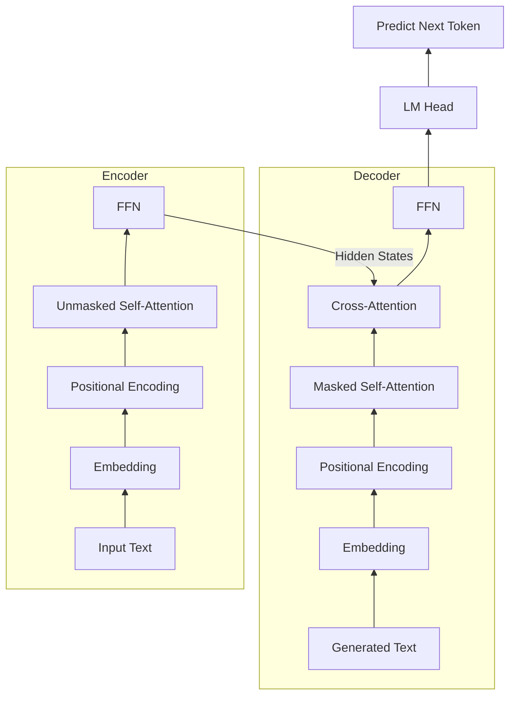
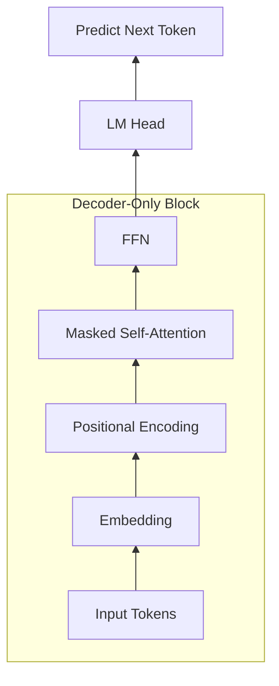
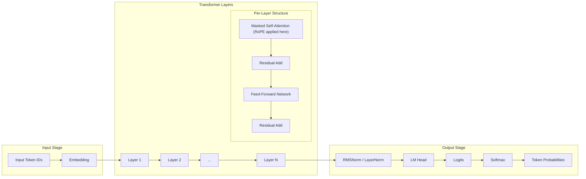
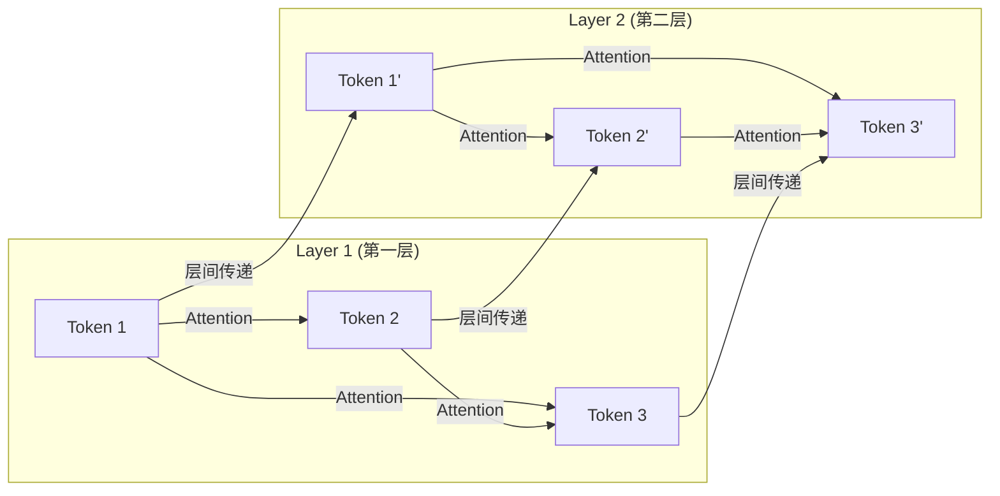

# 第一部分：原理篇 —— Transformer 与 LLM 的工作底座

## 第一章：Transformer 架构解析：Q、K、V 的机制

在大语言模型（LLM）的世界里，核心的基础架构是 **Transformer** ，而 Transformer 的核心则是 **自注意力机制（Self-Attention）** 。在这一章中，我们将解析 Q、K、V 三个核心向量：**Q（Query）**、**K（Key）** 和 **V（Value）**。它们是模型理解上下文、捕捉词语间复杂关系的核心所在。

### 第一节：鸟瞰图：经典 Transformer 架构的宏观分工

在深入 QKV 的微观世界之前，我们先借助上面这张图，从宏观上理解 Transformer 的工作流程。 **请注意，这张图展示的是经典的 Encoder-Decoder（编码器-解码器）架构，也就是 Transformer 的原版设计。**

我们可以把这个过程类比为**同声传译**：

1.  **左侧：Encoder（编码器）——“听懂并记录”** 经过多层处理。
    *   **输入**：比如英文句子 "The cat is black"。
    *   **工作**：数据从底部进入，经过多层处理。
    *   **核心机制** ：每一层都包含“自注意力机制”（Self-Attention）。 **请注意，这里的自注意力是“无掩码”的（Unmasked）** 。这与你可能熟悉的、GPT 等模型中只能看前文的 Masked Self-Attention 不同。在 Encoder 中，句子里所有的词都可以 **互相观察** ，全面地理解彼此的语境。在翻译任务中是完全合理的，因为输入的源句子是 **已知且完整** 的，我们不需要预测它，只需要充分提取其语义，最大化地提取上下文信息。
    *   **输出**：最终顶层输出的不是文字，而是包含了丰富语境信息的**隐藏状态向量**。它代表 Encoder 已经完全“听懂”了这句话。

2.  **右侧：Decoder（解码器）——“翻译并表达”**
    *   **输入** ：它接收两部分信息：一是 Encoder 传过来的“听懂的秘密报告”；二是 **它自己上一时刻已经翻译出来的词** 。
    *   **工作**：
        *   底部的 **Masked Self-Attention** ：这是解码器的核心机制。让它在预测下一个词时，只能看前面已经说出来的词，不能访问未来的词。 **为什么？** 因为在推理时，未来的词根本还没生出来；而在训练时，如果允许看未来的词，模型就会利用未来的信息，从而无法学会真正的预测能力。
        *   中间的 **Multi-Head Cross-Attention（交叉注意力）** ： **这是最关键的一步！** Decoder 用自己当前的意图（Query），去 Encoder 的秘密报告里寻找匹配的线索（Key 和 Value）。
    *   **输出**：经过 Softmax，基于前面已翻译出的 "Le chat"，预测出下一个词（比如 "est"）的概率。

**总结** ：Encoder 负责“理解输入”（双向观察），Decoder 负责“根据理解生成输出”（单向生成）。

### 第二节：演进：现代 LLM 的 Decoder-Only 架构

在经典的 Transformer 之后，大语言模型经历了一次重大的架构演进。如今我们熟知的 GPT、Llama、DeepSeek 等主流大模型，并没有沿用原生的 Encoder-Decoder 双塔架构，而是走向了极简的 **Decoder-Only（仅解码器）** 架构——也就是说，它们去掉了左半边的 Encoder，只保留了右半边的 Decoder。

看到这里，读者可能会产生一个非常自然的疑问： **既然 Encoder 擅长理解，现代模型为何不再沿用该结构，全都变成了只有 Decoder 的“单塔”架构了呢？**

这涉及到一个重要的范式转变：

1.  **Transformer 最初是为了“翻译”而生的** ：在翻译任务中，“输入”和“输出”是天然割裂的两个语言实体（比如英文和中文）。因此需要 Encoder 先完整听懂英文，Decoder 再翻译成中文。
2.  **现代 LLM 的核心任务是“文本接龙”** ：科学家们发现，世界上所有的自然语言任务（问答、代码生成、推理甚至翻译），都可以统一为 **“给出上一段话，预测下一个词”** 的接龙游戏。
3.  **Decoder 搞定一切** ：既然只是一段连续的文本，我们就不再需要物理上隔离的两个塔了。我们直接把提示词（Prompt）和回答（Response）拼在一起，全部喂给 Decoder。

从上面的架构图可以看出，Decoder-Only 架构相比经典架构（你可以对比第一节的图，去掉了左边的 Encoder 塔和中间的交叉注意力）进行了极大的简化：

1.  **去掉了 Encoder** ：不再有左侧的独立编码器塔。
2.  **去掉了 Cross-Attention** ：因为没有了 Encoder，自然也就不再需要用于跨塔交互的交叉注意力机制了。
3.  **统一的输入** ：Prompt（提示词）和 Response（回答）被拼接成一个连续的序列，从底部统一输入。
4.  **核心机制** ：整个模型完全由堆叠的 **Masked Self-Attention** 块和 **Feed-Forward Network (FFN)** 块组成。

在这种架构下，模型是如何工作的呢？

*   **Prefill（预填充）阶段** ：你输入的 Prompt 会被一次性喂给模型。虽然使用的是 Masked Self-Attention，但因为 Prompt 是已知的，模型可以在内部并行地计算 Prompt 中各个词之间的关系（类似于 Encoder 的工作）。
*   **Decode（生成）阶段** ：模型开始逐字生成回答。每生成一个新词，就把它加到输入序列的末尾，然后预测下一个词。此时，Masked Self-Attention 确保了生成新词时只能看到前面的 Prompt 和已经生成的词，保证了因果关系。

这种高度简化的架构设计，不仅让模型在海量数据上的预训练变得更加高效，也为后续章节我们将要讨论的 **KV Cache** 等生产级推理优化技术提供了统一的物理基础。

### 第三节：图书馆类比：理解自注意力 Q、K、V 的逻辑含义

在深入复杂的数学公式之前，我们先用一个直观的现实场景来理解 Q、K、V 的逻辑意义。

想象一下，你走进了一家巨大的**科技图书馆**，想要寻找关于“降噪蓝牙耳机”的资料。在这个场景中，Q、K、V 分别扮演着不同的角色：

1.  **Q (Query / 查询)**：代表**你当前的意图**。也就是你在图书馆检索电脑里输入的搜索词：“降噪蓝牙耳机”。这代表你现在“想要寻找具备什么特征”的信息。
2.  **K (Key / 键)**：代表**书中内容的标签或索引**。图书馆里的每本书都有它的书名、作者、摘要和分类标签。比如：
    *   书本 A 的 Key 是：“有线游戏耳机评测”。
    *   书本 B 的 Key 是：“索尼降噪蓝牙耳机拆解与芯片分析”。
3.  **V (Value / 值)**：代表**书本实际包含的知识内容**。如果你最终决定阅读书本 B，你真正获取的那些关于降噪芯片、声学原理的详细文字，就是 Value。

**自注意力机制的整体逻辑流**，就是用你的 **Query** 去和图书馆里所有书的 **Key** 进行匹配，计算出一个相关性得分；然后根据这个得分，决定你花多少精力去读每本书的 **Value**。

映射回大模型中，我们用“苹果”这个词来做个具体的对比：

假设我们有两句话：

*   句子 A：“在今天的**新品发布会**上，**苹果**推出了……”
*   句子 B：“我在**超市**买的这一箱**苹果**非常……”

当模型处理到“苹果”这个词时：

1.  **它会生成自己的 Query (Q)**：代表它的“搜寻意图”。
    > [!NOTE]
    > 现实中，这个 Query 是一个复杂的高维连续向量，包含了成百上千个抽象的搜寻维度，这些都是在海量数据训练中“固化”在矩阵里的知识。这里我们用“我是‘苹果’，我需要寻找‘科技’或‘水果’线索”这种拟人化的语言，只是为了方便直观理解。
2.  **它去和前文所有词（即前面已经生成的词或已知的 Prompt）的 Key (K) 进行匹配**：
    *   在**句子 A** 中，“苹果”的 **Q** 与前文“**新品发布会**”的 **K** 匹配度极高（因为发布会通常与科技公司强相关）。
    *   在**句子 B** 中，“苹果”的 **Q** 与前文“**超市**”的 **K** 匹配度极高（因为超市与食品、水果强相关）。
3.  **根据权重提取 Value (V)**：
    *   在**句子 A** 中，因为与“新品发布会”高度匹配，模型会给“新品发布会”的 **V** 分配大权重，最终融合成的“苹果”向量会偏向 **“苹果公司”** 的语义。
    *   在**句子 B** 中，因为与“超市”高度匹配，模型会给“超市”的 **V** 分配大权重，最终融合成的“苹果”向量会偏向 **“水果”** 的语义。

通过这种动态匹配，同一个词在不同的语境下，就能被赋予完全不同的、精准的含义。

---

### 第四节：数学原理：自注意力的权重矩阵与动态向量生成

理解了逻辑意义后，我们来看大模型在底层是如何通过矩阵乘法动态计算出 Q、K、V 的。

#### 0. 什么是词向量（Embedding）？
在开始计算之前，我们需要先把文字转换为数值表示。假设输入是“苹果”这个词，模型首先会查阅一本字典（Embedding 表），把“苹果”转换成一串连续的数字，比如一个 4096 维的向量 $X$ 。这串数字就代表了“苹果”在多维语义空间中的初始坐标（请注意，这个字典里的数值也是通过海量数据训练得到的，而不是人为指定的）。

#### 1. 线性映射（从词向量到 Q, K, V）
假设我们有了输入的词向量 $X$ 。在 Transformer 模型中，存在三个核心的、通过海量数据训练得到的**权重矩阵**： $W_Q$ 、 $W_K$ 和 $W_V$ 。

输入词向量分别乘以这三个矩阵，就动态地生成了该词对应的 Q、K、V 向量：

$$
\begin{aligned}
Q &= X W_Q \\
K &= X W_K \\
V &= X W_V
\end{aligned}
$$

> [!NOTE]
> **静态权重 vs 动态数据**
> 这是一个重要的概念边界： $W_Q, W_K, W_V$ 是**静态的模型权重**，它们在训练完成后就固定在显存里了，对所有 Token 都是共享的“加工规则”。而 Q、K、V 则是**动态生成的数据**，它们是每次你输入不同的句子时，由输入向量 $X$ 实时乘以权重矩阵临时计算出来的。这也是为什么同一个词在不同语境下能生成不同语义的根源。

#### 2. 计算相似度与注意力权重
为了知道当前词（Query）应该对前文所有词（Keys）投入多少注意力，模型会计算当前词的 Q 和前文词的 K 的**点积（Dot Product）**。点积的结果越大，说明两个向量在语义空间中越相似。

$$\text{Score} = Q \cdot K^T$$

为了防止点积结果过大导致梯度消失，模型会除以一个缩放因子 $\sqrt{d_k}$ （$d_k$ 是向量的维度）。随后，通过 **Softmax** 函数将这些得分转化为概率分布，使所有权重相加等于 1：

$$\text{Attention Weights} = \text{softmax}\left(\frac{Q K^T}{\sqrt{d_k}}\right)$$

#### 3. 提取信息（加权求和）
最后一步，模型用计算出来的注意力权重，对所有词的 **Value** 进行加权求和。这就完成了上下文信息的抓取：

$$\text{Output} = \sum (\text{Attention Weights} \times V)$$

> [!NOTE]
> 这里的关键在于**动态生成**。同一个词（比如“苹果”），在不同的句子中，其初始词向量 $X$ 经过查表是相同的，但通过与不同的上下文词进行注意力计算，最终融合出来的输出向量（Output）会截然不同。这就是自注意力机制实现上下文动态理解的核心机制。

---

### 第五节：前馈网络（FFN）：模型的知识库

在自注意力机制完成了词与词之间的信息交换后，向量会进入 **Feed-Forward Network (FFN，前馈网络)**。如果说注意力机制负责“找词语之间的关系”，那么 FFN 就负责每个词的“闭门思考”。

#### 1. FFN 的经典工作流程

许多读者可能会误以为进入 FFN 的是 Attention 的直接输出 Q、K 或 V。实际上，进入 FFN 的输入向量 $H$ ，并不是单纯的 Attention 输出，而是 **Attention 的输出**与**进入 Attention 之前的输入向量 $X$** 进行 **残差相加（Residual Connection）** 之后的结果。

这个 $H$ 向量包含了“我是谁”（原始词意）和“我经历了什么”（全局语境）的混合信息。FFN 的处理流程通常包含以下三步：

1.  **第一步：升维映射（Up-Projection）**
    输入的向量 $H$ 首先乘以一个权重矩阵 $W_1$ 。在很多大模型中，这一步会把向量的维度从比如 4096 维扩展到 16384 维。这就像是把信息展开，提供一个更大的空间来进行复杂的特征提取。

2.  **第二步：非线性激活（Activation）**
    升维后的向量会经过一个非线性激活函数 $\sigma$ （如 ReLU、GeLU 或现代模型常用的 SwiGLU）。这一步引入了非线性能力，并且起到了“过滤”和“选择”信息的作用。

3.  **第三步：降维映射（Down-Projection）**
    最后，被激活的向量乘以另一个权重矩阵 $W_2$ ，把维度重新从 16384 维压缩回原始的 4096 维，以便与输入进行残差相加。

#### 2. 与 Attention 的精妙对比：FFN 是隐藏的“软 KV 记忆库”

在习惯了 Attention 中 Q、K、V 的框架后，看到 FFN 仅有 $W_1$ 和 $W_2$ 两个矩阵，可能会产生缺少某些组件的直觉。学术界在 2020 年的一篇著名论文中揭示了其背后的数学对称性：**FFN 在本质上，也是一个 Key-Value 记忆检索系统！**

我们把 Attention 和 FFN 的核心公式放在一起进行对比：

*   **Attention 的核心公式**： $\text{Output}_{attn} = \text{Softmax}(Q \cdot K^T) \cdot V$
*   **FFN 的核心公式**： $\text{Output}_{ffn} = \sigma(H \cdot W_1) \cdot W_2$

在这个视角下，FFN 的计算过程可以对应到 Q、K、V 的逻辑中：

1.  **输入向量 $H$ 就是那个 Q（Query）！**
    它站在 FFN 面前，本身就是一个“提问”：“我现在的状态是这样的（包含了上下文），知识库里有什么关于我的补充信息吗？”

2.  **升维矩阵 $W_1$ 扮演 K (Keys)**
    我们将 $W_1$ 按列切分，看作是 16384 个列向量。这里的每一个列向量，代表着大模型学到的一个特定的“模式”或“前置条件”（比如“词意是水果，且处于‘超市’或‘食物’的语境中”）。计算 $H \cdot W_1$ ，就是在计算提问 $H$ (Query) 和知识库里所有钥匙 $W_1$ (Keys) 的点积相似度。

3.  **降维矩阵 $W_2$ 扮演 V (Values)**
    我们将 $W_2$ 按行切分，看作是 16384 个行向量。这里的每一个行向量，代表着与对应模式绑定的“具象知识”（比如“清脆、多汁”的特征向量）。

当向量 $H$ 走进来时，FFN 通过以下三步完成知识检索（我们继续沿用上一节“苹果”的例子）：

如果我们处理的是**句子 B**（“我在**超市**买的这一箱**苹果**非常……”）：

1.  **模式匹配**：输入向量 $H$ （此时已经通过 Attention 融合成为了“水果苹果”）与 $W_1$ 的所有列向量做内积。它会与 $W_1$ 中代表“水果、食物”的模式向量产生极高的匹配分。
2.  **激活过滤**：激活函数 $\sigma$ 介入，把与“科技公司”、“电子产品”等无关模式的得分归零，只保留“水果”模式的激活。
3.  **知识提取**：用这些激活系数去和 $W_2$ 中的 Values 做加权求和，提取出“清脆、多汁”等关于水果的具象知识，融合成最终的输出。

反之，如果我们处理的是**句子 A**（“在今天的新品发布会上，苹果推出了……”）：

1.  **模式匹配**：输入向量 $H$ （此时是“科技公司苹果”）会与 $W_1$ 中代表“科技、数码、公司”的模式向量产生高分。
2.  **激活过滤**：激活函数过滤掉“水果”模式。
3.  **知识提取**：从 $W_2$ 中提取出“iPhone、高科技”等关于公司的具象知识。

#### 3. 融合与 Token 的完整一生
FFN 查出的知识，不会直接替换掉原本的向量，而是通过 **残差连接（相加）** 融合在一起：
$$x_{new} = H + FFN(H)$$

这就像 Token 随身带的 **“记事本”** ：

*   $H$ （记事本上写着）：我是一个“苹果”，我处于“吃”的语境中。
*   $FFN(H)$ （知识库补充）：属性是“清脆、多汁”。
*   **相加**：把补充资料钉在记事本下一页。Token 既懂了语境，又懂了知识。

**总结：一个 Token 在一层 Transformer 里的旅程，就是**先去 Attention 开会（懂语境）**，**再去 FFN 查图书馆（懂知识）**，最后带着更新后的状态传递到下一层。

---

### 第六节：自注意力的拓展：多头注意力（Multi-Head Attention）

在前面的讨论中，我们为了简化，假设模型只有一套 $W_Q, W_K, W_V$ 。当模型只有一个“头”时，它需要把所有的语义关系都融合在一个向量中，这限制了其捕捉多种语义关系的能力。

但在实际的工业级大模型中，每一层中都包含几十套这样的矩阵（比如 32 个或 64 个）。这就叫做**多头注意力（Multi-Head Attention）**。

**为什么模型需要多个“头”？**
因为人类的语言太复杂了，一个词在句子里可能同时扮演着多种角色，具有多重语义。

*   **头 1（语法头）**：可能专门负责寻找主谓宾关系，看哪个词是动词的发出者。
*   **头 2（情感头）**：可能专门负责捕捉带有情绪色彩的形容词。
*   **头 3（指代头）**：可能专门负责寻找“他”、“它”这些代词到底指代前文的哪个名词。

通过多头机制，模型可以并行地从几十个不同的“语义视角”去观察这个句子，极大地增强了模型的表达能力。在理解了单头注意力的数学原理后，你可以简单地把多头注意力理解为： **多个单头注意力并行计算，最后把它们的输出拼接（Concatenate）在一起。**

> [!IMPORTANT]
> **关键的第四个矩阵： $W_O$**
> 多头注意力不仅是把 $W_Q$ 、 $W_K$ 、 $W_V$ 复制了多份。为了把各个头拼接后的“碎片化”信息重新整合、压缩回模型原本的维度，模型必须引入第四个矩阵——**输出投影矩阵 $W_O$** 。它负责打破头与头之间的壁垒，进行深度的信息融合。

为了更清晰地说明，我们以 **Llama 3 405B** 的真实参数规模为例，拆解一下标准 MHA 的完整计算过程（物理实现层面）：

1.  **输入准备**：输入的句子矩阵形状为 `[N, 16384]`（ $N$ 个词，每个词长达 16384 维）。
2.  **投影得到 Q、K、V**：使用三个大小为 `[16384, 16384]` 的大矩阵 $W_Q, W_K, W_V$ ，计算得到 $Q, K, V$ 矩阵，形状均为 `[N, 16384]`。
3.  **切分成多头**：在逻辑上把 16384 维切分成 $H = 128$ 个头，每个头维度 $d_k = 128$ 。形状变为 `[N, 128, 128]`。
4.  **计算注意力分数**：在 128 个头内部各自独立计算，每个头的 $Q$ （形状 `[N, 128]`）与 $K$ 的转置（形状 `[128, N]`）相乘，得到注意力分数矩阵 `[N, N]`。
5.  **结合 Value 矩阵**：用分数矩阵乘以当前头的 $V$ （形状 `[N, 128]`），得到每个头的输出，形状为 `[N, 128]`。
6.  **拼接多头**：将 128 个头的输出拼接回去，恢复成 `[N, 16384]`。
7.  **输出投影（ $W_O$ 登场）**：使用大小为 `[16384, 16384]` 的输出矩阵 $W_O$ 对拼接结果进行融合，得到最终输出 `[N, 16384]`。

通过这最后一步的 $W_O$ 矩阵乘法，模型将 128 个头的信息进行了深度融合，打破了头与头之间的壁垒。

---

### 第七节：FFN 的拓展：混合专家模型（MoE）

在理解了 FFN 是模型的“知识库”之后，我们很容易理解备受关注的 **MoE（Mixture of Experts，混合专家模型）** 架构。MoE 本质上就是 **FFN 的多副本升级版**。

#### 1. 稠密模型的痛点
在传统的 **稠密（Dense）** 模型中，每一层只有一个 FFN。所有的 Token，无论是聊“量子力学”还是聊“红烧肉怎么做”，都必须穿过同一个 FFN。随着模型想要记住的知识越来越多，FFN 的体积就必须变得极大。这导致计算量（FLOPs）急剧增加，推理成本高昂。

#### 2. MoE 的解法：分工与稀疏路由
MoE 引入了“分工”的思想。它把原本那一个巨大的 FFN，拆分成了多个（比如 8 个或 16 个）较小的 FFN，每一个被称为一个 **“专家”（Expert）** 。

MoE 的工作流程包含两个核心组件：

*   **门控网络（Router / 路由器）**：当一个 Token 走进来时，Router 会根据它的语境（Query），计算它与各个专家的匹配度。
*   **专家网络（Experts）**：每个专家在底层依然是一个标准的 FFN。在训练过程中，不同的专家会自动学会专注于不同的知识领域（比如专家 1 擅长代码，专家 2 擅长文学）。

#### 3. 稀疏激活：用小模型的成本，享大模型的性能
当 Token 进来时：

1.  **Router 算分**：发现这个 Token 在聊“量子力学”。
2.  **稀疏激活（Sparse Activation）**：Router 只会激活与物理最相关的 Top-K 个专家（比如只激活专家 3 和专家 5），而让其他专家“休息”。
3.  **知识提取与融合**：只让激活的专家处理这个 Token，最后把它们的结果按权重融合。

**总结 ：MoE 实现了 **“总参数量巨大，但每次激活的参数量很小”** 的有效平衡。这也正是 DeepSeek 等模型能以极低成本提供顶尖能力的关键所在。

不过需要注意的是，MoE 减少的只是 **计算成本** （因为每次只激活少数专家）。在 **显存成本** （VRAM）方面，它并没有带来节省——为了随时准备处理各种领域的 Token，所有的专家权重都必须常驻在显存中。这意味着要把如此庞大的参数量全部加载进显存，对硬件的显存容量要求依然极其严苛。关于这部分的显存成本与优化，我们将在本书的后续推理（Inference）篇章中再深入讨论。

---

## 第二章：多层堆叠与数据流机制

在第一章中，我们拆解了 Transformer 最核心的“零件”——自注意力机制与 FFN。但仅有这些零件还不足以构成一个具备推理能力的大模型。在这一章中，我们将从更宏观的角度，看看这些零件是如何被组装成一座庞大的大模型“摩天大楼”的，以及数据是如何在其中穿梭的。

**完整模型架构图**

为了让你对接下来要讨论的“大楼”有一个全局的认识，我们先来看一张完整的 Decoder-Only 模型架构图。它展示了一个 Token 从进入大楼到最终输出预测的完整旅程：

### 第一节：摩天大楼的入口：词嵌入与位置编码

在数据进入多层 Transformer 之前，必须先经过“门厅”的处理，将其转化为模型能理解的格式并注入关键信息。

1.  **词嵌入（Embedding）**：正如我们在第一章第四节提到的，输入的文字（Token）首先会通过查表转化为一个高维向量（例如 4096 维）。这代表了词语的初始语义坐标。
2.  **位置编码（Positional Encoding）**：
    自注意力机制有一个天然的物理缺陷：**它无法感知序列的先后顺序**。在 Attention 的公式里，词语与词语之间只是在算向量的相似度，并没有包含它们在句子里的先后顺序信息。如果不做任何处理，“我吃苹果”和“苹果吃我”在 Attention 看来是完全一样的。
    
    因此，在大楼的入口处，我们必须人为地给向量注入**位置感**。

    *   **旋转位置编码（RoPE）** ：当今最顶尖的开源大模型（如 Llama 系列、Qwen 等）普遍采用 RoPE。它的核心思想是利用复数旋转的数学矩阵，直接把 Q 向量和 K 向量在多维空间中 **“扭转”** 一个角度。
    *   如果两个词挨得很近，它们的 Q 和 K 被扭转的角度差就很小，点积结果就大；反之则小。这有效地将相对位置信息编码进了注意力计算中。

---

### 第二节：多层堆叠的机制：为什么要多层 Transformer？

有了带位置信息的词向量后，它就开始了在 Transformer 大楼里的攀爬之旅。现在的 LLM 通常由几十层甚至上百层高度标准化的 **Transformer 块（Blocks）** 堆叠而成（例如 Llama-3 70B 有 80 层）。

**为什么要搞这么多层？**

这涉及到一个重要的概念：**层次化特征提取（Hierarchical Feature Extraction）**。

1.  **单层能力的极限**：只用一层自注意力，模型只能识别非常表面的、局部的词语关联（比如把“苹果”和“超市”连在一起）。它无法进行深度的逻辑推理或复杂语义的抽象。
2.  **多层能力的涌现**：
    *   **低层（底层的几层）**：主要负责“提取语法和局部关系”。比如识别哪些词是主语，哪些词是修饰语。
    *   **中层（中间的几十层）**：开始理解“实体关系与常识知识”。FFN 在这里大量检索其“软记忆库”，把各种背景知识补充进向量里。
    *   **高层（顶层的几层）**：负责“抽象概念与逻辑推理”。在这个阶段，模型已经不再处理具体的词汇，而是把整个句子的语义提炼成一个抽象的意图，准备好回答问题。

这种层层递进、从具象到抽象的处理方式，正是大模型具备“智能”的关键所在。

这里还隐藏着一个关于“信息如何流动”的精妙设计。很多初学者会误以为，词语是像排队一样一个接一个穿过模型的。但实际上，在处理提示词（Prompt）时，所有的词是**齐头并进、一层一层往上爬的**。

当所有的词一起进入第 1 层时，第 4 个词去匹配第 3 个词，拿到的并不是第 3 个词“刚刚与 1、2 融合完”的最新状态，而是第 3 个词刚进入第 1 层时的独立状态。因为大家是并行计算的，互不等待。

那么第 3 个词在第 1 层融合了 1 和 2 的信息，结果有什么用呢？答案是：**带到第 2 层去**。第 3 个词带着融合后的结果上了第 2 层，当第 4 个词也在第 2 层开会时，它读取第 3 个词的 Key 和 Value，就间接地读到了 1 和 2 的信息。

信息不是在同一层内“横向流动”，而是跨层“斜向上流动”。这种设计不仅让 GPU 能够高效地并行计算所有词，还通过层数的堆叠，实现了极其复杂的深度语义融合。

---

### 第三节：翻译官：LM Head
当我们的输入数据穿过 Transformer 大楼的顶层时，每一个 Token 都会输出一个最终的隐藏状态向量（ $h_{last}$ ）。这个向量已经融合了所有层提取的特征信息，包含了复杂的语义。

但是，人类看不懂向量，人类只能看懂词汇。

于是，模型在最顶层设置了一个特殊的“翻译官”——**LM Head（Language Model Head）**。LM Head 本质上是一个巨大的线性映射矩阵，它的形状是 `[向量维度, 词表大小]`（词表大小通常在 50,000 到 150,000 之间）。

模型用 $h_{last}$ 去乘以这个 LM Head 矩阵，把高维的向量重新投影回这个巨大的词表空间中。计算出来的结果，就是词表中每一个词的**原始得分（Logits）**。

> [!NOTE]
> **为什么中间层没有“翻译官（LM Head）”？**
> 这是一个常见的直觉疑问：既然每一层都输出了向量，为什么不顺便预测一下词呢？
> 因为在数据穿过中间的几十层时，它们始终以“高维稠密向量”的形式流动（可以理解为模型的“潜意识”）。如果我们在中间层就强行把它映射回具体的词，就会破坏这种高维的、复杂的抽象逻辑，造成严重的信息损失。只有让信息在内部充分“思考”（流动）到顶层，最后一次性输出，才能得到最准确的结果。

> [!NOTE]
> **工程彩蛋：权重绑定（Weight Tying）**
> 在很多经典模型（如 GPT-2、Llama 2 等）的设计中，为了节省宝贵的显存，第一步的“词嵌入矩阵（Embedding Matrix）”和最后一步的“LM Head 矩阵”其实是**共享同一个物理矩阵**的。也就是用同一套向量既当大楼的“入口”，又当大楼的“出口”。不过在一些最新的超大模型中，为了追求更高的表达能力，这两者也会选择解耦，使用独立的参数。

---

### 第四节：Logits 和 Softmax：将原始分数转换为概率分布

LM Head 输出的 Logits 是一系列未归一化的实数（比如“苹果”得分 12.5，“手机”得分 8.2，“跑”得分 -3.1）。

为了决定最终输出哪个词，系统必须把这些原始分数转化为人类和程序更容易理解的**概率分布**。这里再次用到了我们在第一章见过的 **Softmax** 函数。

Softmax 会把这几万个词的 Logits 进行指数化和归一化，确保：

1.  所有的概率都在 0 到 1 之间。
2.  所有词的概率相加严格等于 1。

经过 Softmax 之后，我们得到了一个概率分布，比如：`{"苹果": 0.7, "手机": 0.2, "跑": 0.001 ...}`。

---

### 第五节：科普小贴士：我们常说的 8B/70B 参数到底是指哪些权重？

在学完了大模型的各个构件（Embedding、Attention、FFN、LM Head）之后，我们终于可以解答大模型中一个核心的概念问题： **当我们说一个模型是 8B（80亿）或 70B（700亿）参数时，这些参数到底是指哪些权重？它们是由哪些部分构成的？**

简单来说，**参数（Parameters）就是模型中所有可学习的权重矩阵里的数字总和**。它们是模型在海量数据训练中“固化”下来的参数值。

为了让你有最直观的感受，我们以目前最顶级的开源大模型 **Llama 3 (405B)** 为例，来拆解一下它的 4050 亿参数到底是由哪些部分的权重构成的。

**Llama 3 (405B) 的核心配置**：

*   词表大小（Vocab Size）： $128,256$
*   隐藏层维度（ $d$ ）： $16384$
*   层数（ $L$ ）： $126$
*   FFN 中间维度： $53248$
*   采用 GQA（分组查询注意力），Query 头数 128，KV 头数 8。

我们来算算每一部分的账：

1.  **词嵌入层（Embedding）**：
    *   **公式**：`词表大小 * 隐藏层维度`
    *   **计算**： $128,256 \times 16384 \approx 21.0$ 亿参数。
    *   **通俗地理解**：字典里有 12.8 万个词，每个词用一个 16384 维的向量表示。
2.  **Transformer 层（需要乘以总层数 126）**：
    *   每一层包含：
        *   **注意力机制**： $W_Q, W_K, W_V, W_O$ 四个矩阵。加起来每层大约有 $5.7$ 亿参数。
        *   **前馈网络（FFN）**：包含 Gate、Up、Down 三个巨大的矩阵（尺寸为 $16384 \times 53248$ ）。加起来每层高达 $26.17$ 亿参数。
    *   **单层合计**：约 $31.87$ 亿参数。
    *   **126 层总计**： $126 \times 31.87 \approx 401.6$ 亿参数。
    *   **划重点**：你可以看到，**FFN 占据了 Transformer 层中绝大多数的参数量（约 82%）！** 模型学到的绝大多数“硬知识”都存在 FFN 的矩阵里。
3.  **输出层（LM Head）**：
    *   **公式**：`隐藏层维度 * 词表大小`
    *   **计算**： $16384 \times 128,256 \approx 21.0$ 亿参数。
    *   负责把高维向量翻译回自然语言词汇的原始得分。

**总账单**：
$2.1 \text{ 亿 (Embedding)} + 401.6 \text{ 亿 (126层)} + 2.1 \text{ 亿 (LM Head)} \approx 405.8 \text{ 亿参数！}$

**总结**：
所以，当你下载一个 405B 的模型时，你实际上是在下载一个包含约 4050 亿个浮点数（如果用 FP16 格式，大约占用 810GB 显存）的巨大文件。这些数字存储在上面提到的那些矩阵中。当你输入 Prompt 时，数据就是与这 4050 亿个数字进行大量的矩阵乘法计算，最终生成输出。

---

### 第六节：数据流：从底层直达顶层的端到端全景

现在我们把整座大楼的各个部件串联起来，看看一个 Token 从进入大楼到最终输出的完整“登顶之旅”（End-to-End）：

1.  **输入阶段**：Prompt 里的所有 Token 同时通过查表转化为词向量，作为初始输入 $X_0$ 。
    > [!NOTE]
    > 如果模型使用的是经典的绝对位置编码（如 BERT），位置信息会在这里与词向量相加。如果使用的是现代的 RoPE，则初始输入不包含位置信息。
2.  **逐层穿梭阶段**：
    *   $X_0$ 进入第 1 层 Block 的 Attention 部门。如果使用 RoPE，此时会在这里动态注入位置旋转。
    *   词与词交换信息后，通过**残差连接**与原向量相加，防止特征丢失。
    *   进入第 1 层 Block 的 FFN 部门，查阅知识并闭门思考。
    *   再次通过残差连接相加，得到第 1 层的输出 $X_1$ 。
    *   $X_1$ 坐电梯进入第 2 层，重复上述过程，直至穿过最后一层（如第 80 层），得到最终的隐藏状态向量 $h_{last}$ 。
3.  **输出阶段**：
    *   $h_{last}$ 经过归一化（Norm）后，进入 **LM Head**。
    *   LM Head 将其投影回庞大的词表空间，计算出每个词的原始得分（Logits）。
    *   Logits 经过 **Softmax** 归一化，转化为所有词的概率分布。

至此，大模型的**完整单次前向传播**就全部完成了。我们成功地将输入的文字，转化为了对下一个词的精准概率预测。

---

## 第三章：自回归解码与文本生成机制

在第二章中，我们了解了摩天大楼的静态结构。现在，我们要让这座大楼真正运转起来。当一个用户的请求（输入）到来时，模型是如何一步步处理，并最终输出答案的呢？

### 第一节：Prefill（预填充）：处理输入的具体过程

假设用户输入了一个问题：“什么是人工智能？”

1.  **分词（Tokenization）**：输入文本首先被切分成一个个 Token（如“什么”、“是”、“人工”、“智能”）。
2.  **一次性输入**：这些 Token 对应的向量被**同时**喂入模型。
3.  **并行计算**：虽然使用的是 Masked Self-Attention，但因为输入的 Prompt 是**已知且完整**的，模型可以在内部并行地计算这些词之间的相互关系。这一步的主要目的是**充分理解输入的语境**，并为生成后续文本做好准备。
    > [!TIP]
    > **理解 Prefill 的并行**：这里包含两步并行。第一步是**并行生成**所有 Token 的 Q、K、V 向量（每个 Token 独立与权重矩阵相乘，互不依赖）；第二步是**并行计算**所有 Token 之间的注意力权重并加权融合。这两步在 GPU 上都是以矩阵乘法的形式高效并行完成的。
4.  **产生第一个词的概率**：数据流流过所有层和 LM Head 后，生成了针对下一个词的概率分布。

---

### 第二节：Decode（解码）：自回归循环与文本生成

基于 Prefill 阶段最后输出的概率分布，模型可能会挑选出“AI”作为最可能的下一个词。

1.  **输出第一个词**：模型输出“AI”。
2.  **循环往复的“接龙”**：
    *   模型把刚刚生成的“AI”**原封不动地拼接到原句的末尾**，输入序列变成：“什么是人工智能？AI”。
    *   这个新的、更长的序列被**再次**从第 1 层楼喂进去，重新走一遍整栋大楼的旅程。
    *   大楼顶层输出新的概率分布，预测下一个词（比如“是”）。
    *   把“是”再拼接到末尾，继续下一轮循环……

这就是 **自回归（Autoregressive）** 的本质： **前一次的输出，成为下一次的输入** 。

这种“逐字生成”的机制虽然保证了上下文的连贯性，但它带来了显著的物理限制：如果你要模型生成一个 1000 字的故事，大模型就必须把整栋大楼完整地跑完 1000 遍！

在第一部分中，我们完成了对 Transformer 摩天大楼的拆解，理解了自注意力机制与前馈网络是如何协同工作的，以及数据是如何在多层网络中流动并最终转化为概率输出的。然而，这种“接龙”游戏在面对海量请求和超长文本时，会带来极大的算力与显存需求。

制约大模型推理速度的因素以及显存的消耗方式，是接下来我们需要关注的问题。让我们带着这些问题，翻开本书的**第二部分**，一起去分析这些物理与数学层面的瓶颈。

---

