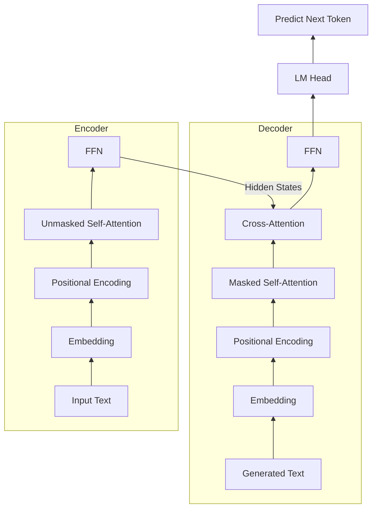
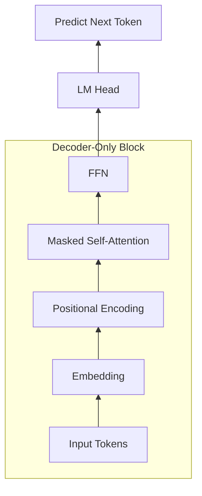
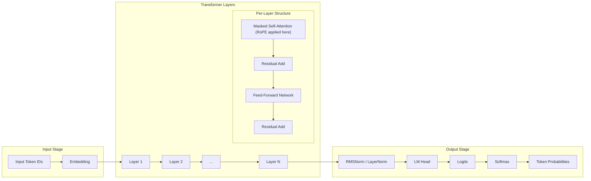

# Part One: Principles — The Foundational Engine of Transformers and LLMs

## Chapter 1: Demystifying the Transformer: The Magic of Q, K, and V

In the world of Large Language Models (LLMs), the origin of all magic stems from an architecture called the **Transformer**, and the core of the Transformer is the **Self-Attention mechanism**. In this chapter, we will break down the three most famous letters in the self-attention mechanism: **Q (Query)**, **K (Key)**, and **V (Value)**. They are the soul of the model's ability to understand context and capture complex relationships between words.

### Section 1: A Bird's-Eye View: The Macro Division of Labor in the Classic Transformer Architecture

Before diving into the microscopic world of QKV, let's use the diagram above to grasp the workflow of the Transformer from a macroscopic perspective. **Please note that this diagram illustrates the classic Encoder-Decoder architecture, which is the original design of the Transformer.**

We can draw an analogy between this process and **simultaneous interpretation**:

1.  **Left Side: Encoder — "Listening and Comprehending"** through multiple layers of processing.
    *   **Input**: For example, the English sentence "The cat is black".
    *   **Workflow**: Data enters from the bottom and goes through multiple layers of processing.
    *   **Core Mechanism**: Each layer contains a "Self-Attention" mechanism. **Please note that the self-attention here is "Unmasked".** This is different from the Masked Self-Attention you might be familiar with in models like GPT, which can only look at preceding text. In the Encoder, all words in the sentence can **observe each other**, understanding the context of one another without any blind spots. This makes perfect sense in translation tasks because the input source sentence is **known and complete**; we do not need to predict it, but rather fully extract its semantics and maximize the extraction of contextual information.
    *   **Output**: What ultimately comes out of the top is not text, but **hidden state vectors** rich in contextual information. It represents that the Encoder has fully "understood" the sentence.

2.  **Right Side: Decoder — "Translating and Expressing"**
    *   **Input**: It receives two pieces of information: first, the "secret report of understanding" passed from the Encoder; second, **the words it has already translated in previous moments**.
    *   **Workflow**:
        *   The bottom **Masked Self-Attention**: This is the core mechanism of the decoder. It forces the decoder to only look at the previously generated words when predicting the next word, preventing it from "peeking" at future words. **Why?** Because during inference, future words have not even been generated yet; and during training, if allowed to see future words, the model would learn the cheating trick of "peeking at the answers," thereby failing to learn true predictive capabilities.
        *   The middle **Multi-Head Cross-Attention**: **This is the most critical step!** The Decoder uses its current intention (Query) to search for matching clues (Key and Value) within the Encoder's secret report.
    *   **Output**: After passing through Softmax, it predicts the probability of the next word (e.g., "est").

**Summary**: The Encoder is responsible for "understanding the input" (bidirectional observation), while the Decoder is responsible for "generating output based on understanding" (unidirectional generation).

### Section 2: Evolution: The Decoder-Only Architecture of Modern LLMs

Following the classic Transformer, large language models underwent a major architectural evolution. The mainstream large models we are familiar with today, such as GPT, Llama, and DeepSeek, did not inherit the original Encoder-Decoder dual-tower architecture. Instead, they moved towards a minimalist **Decoder-Only** architecture—meaning, they discarded the left-hand Encoder and retained only the right-hand Decoder.

Seeing this, readers might naturally wonder: **Since the Encoder is so good at understanding, why have current models discarded it and all become "single-tower" architectures with only a Decoder?**

This involves an extremely elegant paradigm shift (a historical turning point):
1.  **The Transformer was originally born for "translation"**: In translation tasks, the "input" and "output" are naturally separated linguistic entities (like English and Chinese). Therefore, an Encoder is needed to fully understand the English first, and then a Decoder translates it into Chinese.
2.  **Modern LLMs play "text continuation"**: Scientists discovered that all natural language tasks in the world (Q&A, code generation, reasoning, and even translation) can be unified into a word-solitaire game of **"given the preceding text, predict the next word."**
3.  **The Decoder handles everything**: Since it's just a continuous piece of text, we no longer need two physically isolated towers. We directly concatenate the prompt and the response, feeding them entirely to the Decoder.

From the architectural diagram above, it can be seen that the Decoder-Only architecture has been vastly simplified compared to the classic architecture (you can compare it with the diagram in Section 1, removing the left Encoder tower and the middle cross-attention):
1.  **Removed the Encoder**: There is no longer an independent encoder tower on the left.
2.  **Removed Cross-Attention**: Without the Encoder, the cross-attention mechanism used for inter-tower interaction is naturally no longer needed.
3.  **Unified Input**: The Prompt and Response are concatenated into a continuous sequence and fed uniformly from the bottom.
4.  **Core Mechanism**: The entire model is composed entirely of stacked **Masked Self-Attention** blocks and **Feed-Forward Network (FFN)** blocks.

How does the model work under this architecture?
*   **Prefill Phase**: Your input Prompt is fed into the model all at once. Although Masked Self-Attention is used, because the Prompt is known, the model can compute the relationships between the words in the Prompt in parallel internally (similar to the Encoder's work).
*   **Decode (Generation) Phase**: The model starts generating the response word by word. Each time a new word is generated, it is appended to the end of the input sequence, and then the next word is predicted. At this point, Masked Self-Attention ensures that when generating a new word, only the preceding Prompt and the already generated words can be seen, maintaining causality.

This "great truth is simple" architectural design not only makes the model's pre-training on massive data much more efficient, but also provides a unified physical foundation for production-level inference optimization technologies like **KV Cache**, which we will discuss in subsequent chapters.

### Section 3: The Library Analogy: Understanding the Logical Meaning of Self-Attention Q, K, V

Before diving into complex mathematical formulas, let's use an extremely intuitive real-world scenario to understand the logical meaning of Q, K, and V.

Imagine you walk into a massive **technology library**, looking for information on "noise-canceling Bluetooth headphones". In this scenario, Q, K, and V play different roles respectively:

1.  **Q (Query)**: Represents **your current intention**. That is the search term you type into the library's retrieval computer: "noise-canceling Bluetooth headphones". This represents what characteristics of information you "want to find right now".
2.  **K (Key)**: Represents **the labels or index of the book's contents**. Every book in the library has its title, author, abstract, and classification tags. For instance:
    *   The Key for Book A is: "Wired Gaming Headset Review".
    *   The Key for Book B is: "Teardown and Chip Analysis of Sony Noise-Canceling Bluetooth Headphones".
3.  **V (Value)**: Represents **the actual knowledge content contained within the book**. If you ultimately decide to read Book B, the detailed text you actually absorb into your brain regarding noise-canceling chips and acoustic principles is the Value.

**The overall logic flow of the self-attention mechanism** is to use your **Query** to match with the **Keys** of all the books in the library to calculate a relevance score; then, based on this score, decide how much effort you should spend reading the **Value** of each book.

Mapping back to large models, let's use the word "apple" for a specific and vivid comparison:

Suppose we have two sentences:
*   Sentence A: "At today's **new product launch**, **Apple** introduced..."
*   Sentence B: "At the **supermarket**, the box of **apples** I bought is very..."

When the model processes the word "apple":
1.  **It generates its own Query (Q)**: Representing its "search intention".
    > [!NOTE]
    > In reality, this Query is an extremely complex, high-dimensional continuous vector containing hundreds or thousands of abstract search dimensions, which are all knowledge "solidified" in matrices through massive data training. Here, we use anthropomorphic language like "I am an 'apple', and I need to find 'technology' or 'fruit' clues" simply to facilitate intuitive human understanding.
2.  **It matches with the Keys (K) of all preceding words (i.e., previously generated words or known Prompts)**:
    *   In **Sentence A**, the **Q** of "Apple" has an extremely high match rate with the **K** of the preceding "**new product launch**" (because product launches are typically strongly associated with tech companies).
    *   In **Sentence B**, the **Q** of "apples" has an extremely high match rate with the **K** of the preceding "**supermarket**" (because supermarkets are strongly associated with food and fruit).
3.  **Extract Value (V) based on weights**:
    *   In **Sentence A**, because of the high match with "new product launch", the model assigns a large weight to the **V** of "new product launch", and the resulting fused vector for "Apple" will lean towards the semantics of **"Apple Inc."**
    *   In **Sentence B**, because of the high match with "supermarket", the model assigns a large weight to the **V** of "supermarket", and the resulting fused vector for "apples" will lean towards the semantics of **"fruit"**.

Through this dynamic matching, the same word can be given completely different, precise meanings under different contexts.

---

### Section 4: Mathematical Principles: Self-Attention Weight Matrices and Dynamic Vector Generation

Having understood the logical meaning, let's see how large models dynamically calculate Q, K, and V underneath the hood using matrix multiplication.

#### 0. What is a Word Vector (Embedding)?
Before starting calculations, we must first convert words into numbers the computer understands. Assuming the input is the word "apple", the model will first consult a dictionary (Embedding table) to convert "apple" into a continuous sequence of numbers, for instance, a 4096-dimensional vector $X$. This sequence of numbers represents the initial coordinates of "apple" in the multi-dimensional semantic space (please note that the values in this dictionary are also learned through massive data training, not manually specified).

#### 1. Linear Projection (From Word Vector to Q, K, V)
Assume we have the input word vector $X$. In the Transformer model, there are three core **weight matrices** learned through massive data training: $W_Q$, $W_K$, and $W_V$.

The input word vector is multiplied by these three matrices respectively to dynamically generate the corresponding Q, K, and V vectors for that word:

$$Q = X W_Q$$
$$K = X W_K$$
$$V = X W_V$$

> [!NOTE]
> **Static Weights vs Dynamic Data**
> There is an extremely important conceptual boundary here: $W_Q, W_K, W_V$ are **static model weights**. After training, they are fixed in VRAM and are shared "processing rules" for all Tokens. On the other hand, Q, K, and V are **dynamically generated data**. They are calculated on the fly by multiplying the input vector $X$ with the weight matrices each time you input a different sentence. This is also the root cause of why the same word can generate different semantics in different contexts.

#### 2. Calculating Similarity and Attention Weights
To know how much attention the current word (Query) should allocate to other words in the sentence (Keys), the model calculates the **Dot Product** of Q and K. The larger the dot product result, the more similar the two vectors are in the semantic space.

$$\text{Score} = Q \cdot K^T$$

To prevent the dot product result from becoming too large and causing gradient vanishing, the model divides it by a scaling factor $\sqrt{d_k}$ ($d_k$ is the dimensionality of the vector). Subsequently, through the **Softmax** function, these scores are converted into a probability distribution, making the sum of all weights equal to 1:

$$\text{Attention Weights} = \text{softmax}\left(\frac{Q K^T}{\sqrt{d_k}}\right)$$

#### 3. Extracting Information (Weighted Sum)
In the final step, the model uses the calculated attention weights to perform a weighted sum of the **Values** of all words. This completes the capture of contextual information:

$$\text{Output} = \sum (\text{Attention Weights} \times V)$$

> [!NOTE]
> The key here lies in **dynamic generation**. The same word (e.g., "apple"), in different sentences, has the same initial word vector $X$ retrieved via table lookup, but through attention calculation with different contextual words, the ultimately fused output vector (Output) will be entirely different. This is the charm of the self-attention mechanism.

---

### Section 5: Feed-Forward Network (FFN): The Model's Highway and Knowledge Base

After the self-attention mechanism completes the information exchange between words, the vector enters the **Feed-Forward Network (FFN)**. If the attention mechanism is responsible for "finding relationships between words", then the FFN is responsible for each word's "closed-door thinking".

#### 1. The Classic Workflow of FFN

Many people, after learning about Attention, assume that what enters the FFN directly is Q, K, or V. In reality, the input vector $H$ entering the FFN is not simply the Output of Attention, but the result of a **Residual Connection (addition)** between **the Output of Attention** and **the input vector $X$ before entering Attention**.

This vector $H$ contains a mixture of information about "who I am" (original word meaning) and "what I have experienced" (global context). The FFN processing pipeline typically includes the following three steps:

1.  **Step One: Up-Projection**
    The input vector $H$ is first multiplied by a weight matrix $W_1$. In many large models, this step expands the dimension of the vector from, say, 4096 dimensions to 16384 dimensions. This is like unfolding the information, providing a larger space for complex feature extraction.
2.  **Step Two: Non-linear Activation**
    The up-projected vector passes through a non-linear activation function $\sigma$ (such as ReLU, GeLU, or SwiGLU, commonly used in modern models). This step introduces non-linear capabilities and plays the role of "filtering" and "selecting" information.
3.  **Step Three: Down-Projection**
    Finally, the activated vector is multiplied by another weight matrix $W_2$, compressing the dimension from 16384 back to the original 4096 dimensions, in order to perform residual addition with the input.

#### 2. An Elegant Comparison with Attention: FFN is a Hidden "Soft KV Memory Base"

Since you are already accustomed to the "three-legged stool" framework of Q, K, and V in Attention, you will naturally feel something is missing when looking at FFN, which only has two matrices, $W_1$ and $W_2$. The academic community provided an extremely beautiful mathematical symmetry explanation in a famous 2020 paper: **The FFN is, in essence, also a Key-Value memory retrieval system!**

Let's place the core formulas of Attention and FFN side by side for a brilliant comparison:
*   **Core formula of Attention**: $\text{Output}_{attn} = \text{Softmax}(Q \cdot K^T) \cdot V$
*   **Core formula of FFN**: $\text{Output}_{ffn} = \sigma(H \cdot W_1) \cdot W_2$

From this perspective, the calculation process of the FFN can perfectly correspond to the logic of Q, K, and V:

1.  **The input vector $H$ is that Q (Query)!**
    Standing in front of the FFN, it is itself a "question": "My current state is like this (including context), is there any supplementary information about me in the knowledge base?"
2.  **The Up-Projection Matrix $W_1$ acts as K (Keys)**
    We split $W_1$ by columns and treat it as 16384 column vectors. Each column vector here represents a specific "pattern" or "precondition" learned by the large model (for example, "the meaning is a fruit, and it is in a 'supermarket' or 'food' context"). Calculating $H \cdot W_1$ is calculating the dot product similarity between the question $H$ (Query) and all the keys $W_1$ (Keys) in the knowledge base.
3.  **The Down-Projection Matrix $W_2$ acts as V (Values)**
    We split $W_2$ by rows and treat it as 16384 row vectors. Each row vector here represents the "concrete knowledge" bound to the corresponding pattern (for example, the feature vector for "crisp, juicy").

When the vector $H$ enters, the FFN completes the knowledge retrieval through the following three steps (we continue with the "apple" example from the previous section):

If we are processing **Sentence B** ("At the **supermarket**, the box of **apples** I bought is very..."):
1.  **Pattern Matching**: The input vector $H$ (which has already fused into "fruit apple" through Attention) takes the inner product with all column vectors of $W_1$. It will generate an extremely high matching score with the pattern vector in $W_1$ representing "fruit, food".
2.  **Activation Filtering**: The activation function $\sigma$ intervenes, zeroing out scores for patterns unrelated like "tech company" or "electronic products", retaining only the activation for the "fruit" pattern.
3.  **Knowledge Extraction**: These activation coefficients are used to perform a weighted sum with the Values in $W_2$, extracting concrete knowledge about fruit such as "crisp, juicy", and fusing it into the final output.

Conversely, if we are processing **Sentence A** ("At today's new product launch, Apple introduced..."):
1.  **Pattern Matching**: The input vector $H$ (now "tech company Apple") will generate high scores with pattern vectors in $W_1$ representing "technology, digital, company".
2.  **Activation Filtering**: The activation function filters out the "fruit" pattern.
3.  **Knowledge Extraction**: It extracts concrete knowledge about the company like "iPhone, high-tech" from $W_2$.

#### 3. Fusion and the Complete Life of a Token
The knowledge retrieved by the FFN will not directly replace the original vector, but is fused together through a **Residual Connection (addition)**:
$$x_{new} = H + FFN(H)$$

This is like a **"scratchpad"** carried by the Token:
*   $H$ (written on the scratchpad): I am an "apple", and I am in the context of "eating".
*   $FFN(H)$ (knowledge base supplement): Attributes are "crisp, juicy".
*   **Addition**: Staple the supplementary material to the next page of the scratchpad. The Token now understands both context and knowledge.

**Summary**: A Token's journey in one layer of the Transformer is: **first go to the Attention meeting (understand context)**, **then go to the FFN library (understand knowledge)**, and finally walk to the next layer with enriched memory!

---

### Section 6: Extension of Self-Attention: Multi-Head Attention (MHA)

In our previous discussion, for the sake of simplicity, we assumed the model had only one set of $W_Q, W_K, W_V$. When a model has only one "head", it is forced to blend all semantic relationships into a single vector, making it easy to lose focus.

But in practical, industrial-grade large models, each layer contains dozens of such sets of matrices (for example, 32 or 64). This is called **Multi-Head Attention (MHA)**.

**Why does the model need multiple "heads"?**
Because human language is too complex; a word in a sentence might simultaneously play multiple roles and carry multiple semantics.
*   **Head 1 (Grammar Head)**: Might specialize in finding subject-verb-object relationships, looking for the initiator of a verb.
*   **Head 2 (Emotion Head)**: Might specialize in capturing adjectives with emotional color.
*   **Head 3 (Coreference Head)**: Might specialize in finding out exactly which noun "he" or "it" refers to in the preceding text.

Through the multi-head mechanism, the model can observe the sentence in parallel from dozens of different "semantic perspectives", greatly enhancing the model's expressive power. After understanding the mathematical principles of single-head attention, you can simply understand multi-head attention as: **multiple single-head attentions computed in parallel, their outputs concatenated together, and then integrated through a linear layer.**

To make it completely clear, let's break down the complete computation process (at the physical implementation level) of standard MHA, taking the actual parameter scale of **Llama 3 405B** as an example:
1.  **Input Preparation**: The shape of the input sentence matrix is `[N, 16384]` ($N$ words, each word 16384 dimensions long).
2.  **Projecting to get Q, K, V**: Three large matrices $W_Q, W_K, W_V$ of size `[16384, 16384]` are used to calculate the $Q, K, V$ matrices, all with the shape `[N, 16384]`.
3.  **Splitting into Multiple Heads**: Logically slice the 16384 dimensions into $H = 128$ heads, each with a dimension $d_k = 128$. The shape becomes `[N, 128, 128]`.
4.  **Calculating Attention Scores**: Computed independently within the 128 heads; each head's $Q$ (shape `[N, 128]`) is multiplied by the transpose of $K$ (shape `[128, N]`), resulting in an attention score matrix `[N, N]`.
5.  **Combining with Value Matrix**: Multiply the score matrix by the current head's $V$ (shape `[N, 128]`), yielding an output for each head with the shape `[N, 128]`.
6.  **Concatenating Multiple Heads**: Concatenate the outputs of the 128 heads back together to restore `[N, 16384]`.
7.  **Output Projection ($W_O$ enters the stage)**: Use an output matrix $W_O$ of size `[16384, 16384]` to fuse the concatenated results, yielding the final output `[N, 16384]`.

Through this final matrix multiplication with $W_O$, the model deeply integrates the information from the 128 heads, breaking down the barriers between them.

---

### Section 7: Extension of FFN: Mixture of Experts (MoE)

After understanding that the FFN is the model's "knowledge base", it is very easy to comprehend the currently hottest **MoE (Mixture of Experts)** architecture. MoE is essentially **a multi-replica upgrade of the FFN**.

#### 1. The Pain Points of Dense Models
In a traditional **Dense** model, there is only one FFN per layer. All Tokens, whether discussing "quantum mechanics" or "how to cook braised pork", must pass through the exact same FFN. As the model tries to memorize more and more knowledge, the FFN's volume must become massive. This leads to a sharp surge in computational cost (FLOPs) and expensive inference.

#### 2. The MoE Solution: Specialized Expertise
MoE introduces the concept of "division of labor". It splits that originally massive single FFN into multiple (say, 8 or 16) smaller FFNs, each of which is called an **"Expert"**.

The workflow of MoE includes two core components:
*   **Router (Gating Network)**: When a Token enters, the Router calculates its match score with each expert based on its context (Query).
*   **Experts (Expert Networks)**: Each expert remains a standard FFN at its core. During training, different experts automatically learn to specialize in different knowledge domains (e.g., Expert 1 is good at code, Expert 2 is good at literature).

#### 3. Sparse Activation: Enjoying Big Model Intelligence at Small Model Costs
When a Token enters:
1.  **Router Scoring**: It discovers this Token is talking about "quantum mechanics".
2.  **Sparse Activation**: The Router will only activate the Top-K experts most relevant to physics (e.g., only activating Expert 3 and Expert 5), while letting other experts "rest".
3.  **Knowledge Extraction and Fusion**: It only lets the activated experts process this Token, and finally fuses their results according to their weights.

**Summary**: MoE achieves the brilliant effect of having a **"massive total parameter count (vast knowledge) but a very small active parameter count per forward pass (cheap computation)"**. This is exactly the core secret behind how models like DeepSeek can provide top-tier capabilities at extremely low costs.

---

## Chapter 2: Building the Skyscraper: Stacking Layers and Data Flow

In the first chapter, we tore down the core "parts" of the Transformer—the self-attention mechanism and the FFN. But having just these parts isn't enough to build a large model capable of thinking. In this chapter, we will zoom out to see how these parts are assembled into a massive large model "skyscraper", and how data shuttles through it.

**Complete Model Architecture Diagram**

To give you a global understanding of the "skyscraper" we are about to discuss, let's first look at a complete Decoder-Only model architecture diagram. It illustrates the complete journey of a Token from entering the building to ultimately outputting a prediction:

### Section 1: The Entrance to the Skyscraper: Word Embeddings and Positional Encoding

Before data enters the multi-layer Transformer, it must first be processed in the "lobby", converting it into a format the model can understand and injecting critical information.

1.  **Word Embedding**: As we mentioned in Chapter 1, Section 4, the input text (Token) is first converted into a high-dimensional vector (e.g., 4096 dimensions) via table lookup. This represents the word's initial semantic coordinates.
2.  **Positional Encoding**:
    The self-attention mechanism has an inherent physical flaw: **it is "time-blind"**. In the Attention formula, words are simply calculating vector similarity with each other, without containing any information about their sequential order in the sentence. Without any processing, "I eat the apple" and "the apple eats me" would look exactly the same to Attention.
    
    Therefore, at the entrance to the building, we must artificially inject a **sense of position** into the vectors.
    *   **Rotary Position Embedding (RoPE)**: Today's top open-source large models (such as the Llama series, Qwen, etc.) universally adopt RoPE. Its idea has great geometric beauty: instead of kneading position into the word vector at the initial stage, it directly **"twists"** the Q vector and K vector by an angle in the multi-dimensional space using complex rotation mathematical matrices at the moment the model calculates the dot product of Q and K.
    *   If two words are close to each other, the difference in the angles by which their Q and K are twisted is small, resulting in a large dot product; conversely, the dot product is small. This elegantly encodes relative positional information into the attention calculation.

---

### Section 2: The Wisdom of Stacking: Why Multiple Transformer Layers?

Having obtained a word vector with positional information, it begins its climb up the Transformer skyscraper. Current LLMs are typically stacked from dozens or even over a hundred highly standardized **Transformer Blocks** (e.g., Llama-3 70B has 80 layers).

**Why build so many layers?**

This involves an extremely important concept: **Hierarchical Feature Extraction**.

1.  **The Limits of a Single Layer**: Using only a single layer of self-attention, the model can only recognize very superficial, local word associations (like connecting "apple" and "supermarket"). It cannot perform deep logical reasoning or abstract complex semantics.
2.  **Low Layers (The bottom few layers)**: Primarily responsible for "extracting grammar and local relationships". For instance, identifying which words are subjects and which are modifiers.
3.  **Middle Layers (The middle dozens of layers)**: Begin to understand "entity relationships and common sense knowledge". The FFN frantically consults its "soft memory base" here, supplementing various background knowledge into the vector.
4.  **High Layers (The top few layers)**: Responsible for "abstract concepts and logical reasoning". At this stage, the model is no longer looking at concrete words, but distilling the semantics of the entire sentence into an abstract intent, ready to answer the question.

This layer-by-layer progression, from concrete to abstract processing, is exactly the key to large models possessing "intelligence".

There is also an exquisite design hidden here regarding "how information flows". Many beginners mistakenly think that words pass through the model one by one like standing in line. But in reality, when processing the Prompt, all words are **advancing side by side, climbing up layer by layer simultaneously**.

When all words enter Layer 1 together, when the 4th word goes to match with the 3rd word, what it gets is not the latest state of the 3rd word "just fused with 1 and 2", but the independent state of the 3rd word when it just entered Layer 1. Because everyone is computing in parallel, they don't wait for each other.

Then what is the use of the result of the 3rd word fusing information from 1 and 2 in Layer 1? The answer is: **bring it to Layer 2**. The 3rd word brings the fused result up to Layer 2. When the 4th word is also having a meeting in Layer 2, by reading the 3rd word's Key and Value, it indirectly reads the information from 1 and 2.

Information does not "flow horizontally" within the same layer, but "flows diagonally upwards" across layers. This design not only allows the GPU to efficiently compute all words in parallel, but also achieves extremely complex deep semantic fusion through the stacking of layers.

---

### Section 3: The Translator: LM Head
When our input data passes through the top floor of the Transformer skyscraper, every Token spits out a final hidden state vector ($h_{last}$). This vector has absorbed the wisdom of all layers of the entire building and contains extremely complex semantics.

However, humans don't understand vectors; humans only understand words.

Thus, the model has set up a special "translator" on the top floor — the **LM Head (Language Model Head)**. The LM Head is essentially a huge linear projection matrix, its shape being `[vector dimension, vocabulary size]` (vocabulary size is typically between 50,000 and 150,000).

The model multiplies $h_{last}$ with this LM Head matrix, projecting the high-dimensional vector back into this massive vocabulary space. The calculated result is the **raw score (Logits)** for every single word in the vocabulary.

> [!NOTE]
> **Why is there no "translator (LM Head)" in the middle layers?**
> This is a common intuitive question: since every layer outputs vectors, why not conveniently predict the word right then and there?
> Because as data flows through the dozens of middle layers, it always flows in the form of "high-dimensional dense vectors" (which can be understood as the model's "subconscious"). If we forcibly map it back to concrete words in the middle layers, it would destroy this high-dimensional, complex abstract logic, causing severe information loss. Only by letting the information fully "think" (flow) internally all the way to the top layer and outputting it all at once at the very end can the most accurate result be obtained.

> [!NOTE]
> **Engineering Easter Egg: Weight Tying**
> In the design of many classic models (such as GPT-2, Llama 2, etc.), in order to save precious VRAM, the "Embedding Matrix" in the first step and the "LM Head matrix" in the final step actually **share the same physical matrix**. That is, using the same set of vectors as both the "entrance" and the "exit" of the building. However, in some of the latest ultra-large models, in pursuit of ultimate expressive power, the two will be decoupled and use independent parameters.

---

### Section 4: Logits and Softmax: Converting Raw Scores to a Probability Distribution

The Logits spat out by the LM Head are a bunch of irregular real numbers (for example, "apple" scores 12.5, "phone" scores 8.2, "run" scores -3.1).

To decide which word to ultimately output, the system must convert these raw scores into a **probability distribution** that is easier for humans and programs to understand. Here, we once again use the **Softmax** function we saw in Chapter 1.

Softmax exponentiates and normalizes the Logits of these tens of thousands of words, ensuring:
1.  All probabilities are between 0 and 1.
2.  The probabilities of all words add up strictly to 1.

After passing through Softmax, we obtain a probability distribution, for instance: `{"apple": 0.7, "phone": 0.2, "run": 0.001 ...}`.

---

### Section 5: A Popular Science Tip: Where Exactly Are the 8B/70B Parameters We Often Talk About Stored?

After learning about the various components of large models (Embedding, Attention, FFN, LM Head), we can finally solve one of the most famous mysteries regarding large models: **When we say a model has 8B (8 billion) or 70B (70 billion) parameters, what exactly do these parameters refer to? Where are they distributed?**

Simply put, **Parameters are the sum total of all numbers in the learnable weight matrices within the model**. They are the crystallization of wisdom "solidified" by the model during massive data training.

To give you the most intuitive feeling, let's take the current top open-source large model **Llama 3 (405B)** as an example, to break down exactly where its 405 billion parameters are distributed.

**Core configuration of Llama 3 (405B)**:
*   Vocabulary Size (Vocab Size): $128,256$
*   Hidden Dimension ($d$): $16384$
*   Number of Layers ($L$): $126$
*   FFN Intermediate Dimension: $53248$
*   Adopts GQA (Grouped-Query Attention), Query Heads 128, KV Heads 8.

Let's calculate the bill for each part:

1.  **Embedding Layer**:
    *   **Formula**: `Vocabulary Size * Hidden Dimension`
    *   **Calculation**: $128,256 \times 16384 \approx 2.10$ billion parameters.
    *   **In Plain English**: There are 128.2k words in the dictionary, each word is represented by a 16384-dimensional vector.
2.  **Transformer Layers (need to multiply by the total number of layers 126)**:
    *   Each layer contains:
        *   **Attention Mechanism**: $W_Q, W_K, W_V, W_O$ four matrices. Added together, there are about $5.7$ billion parameters per layer.
        *   **Feed-Forward Network (FFN)**: Contains Gate, Up, Down three massive matrices (dimensions are $16384 \times 53248$). Added together, this reaches up to $26.17$ billion parameters per layer.
    *   **Single Layer Total**: About $31.87$ billion parameters.
    *   **126 Layers Total**: $126 \times 31.87 \approx 401.6$ billion parameters.
    *   **Key Point**: You can see that **the FFN occupies the vast majority of the parameter count in the Transformer layers (about 82%)!** Most of the "hard knowledge" the model learns is stored in the matrices of the FFN.
3.  **Output Layer (LM Head)**:
    *   **Formula**: `Hidden Dimension * Vocabulary Size`
    *   **Calculation**: $16384 \times 128,256 \approx 2.10$ billion parameters.
    *   Responsible for translating high-dimensional vectors back into raw scores for human vocabulary.

**Total Bill**:
$2.1 \text{ Billion (Embedding)} + 401.6 \text{ Billion (126 Layers)} + 2.1 \text{ Billion (LM Head)} \approx 405.8 \text{ Billion Parameters!}$

**Summary**:
So, when you download a 405B model, you are actually downloading a massive file containing about 405 billion floating-point numbers (if using the FP16 format, taking up about 810GB of VRAM). These numbers neatly fill those matrices mentioned above. When you input a Prompt, the data engages in frantic matrix multiplication with these 405 billion numbers, ultimately sparking the flash of intelligence.

---

### Section 6: Data Flow: An End-to-End Panorama from Bottom Straight to Top

Now let's connect the various components of the entire building and look at a Token's complete "summit journey" (End-to-End) from entering the building to final output:

1.  **Input Stage**: All Tokens in the Prompt are converted into word vectors via table lookup simultaneously, serving as the initial input $X_0$.
    > [!NOTE]
    > If the model uses classic absolute positional encoding (like BERT), positional information is added to the word vectors here. If using modern RoPE, the initial input does not contain positional information.
2.  **Layer-by-Layer Shuttle Stage**:
    *   $X_0$ enters the Attention department of the Layer 1 Block. If using RoPE, positional rotation is dynamically injected here.
    *   After words exchange information with each other, they are added back to the original vector via a **Residual Connection** to prevent feature loss.
    *   Enters the FFN department of the Layer 1 Block, consulting knowledge and engaging in closed-door thinking.
    *   Added together via another residual connection to obtain the output of Layer 1, $X_1$.
    *   $X_1$ takes the elevator to Layer 2 and repeats the above process, until it passes through the final layer (e.g., Layer 80), obtaining the final hidden state vector $h_{last}$.
3.  **Output Stage**:
    *   After normalization (Norm), $h_{last}$ enters the **LM Head**.
    *   The LM Head projects it back into the massive vocabulary space, calculating the raw score (Logits) for each word.
    *   Logits undergo **Softmax** normalization, converting into a probability distribution over all words.

At this point, a **complete single forward pass** of the large model is entirely finished. We have successfully converted the input text into a precise probability prediction for the next word.

---

## Chapter 3: The Art of Operation: Autoregressive Decoding and Text Generation

In Chapter 2, we understood the static structure of the skyscraper. Now, we are going to make this building truly operate. When a user's request (input) arrives, how does the model process it step by step and ultimately "speak" the answer out?

### Section 1: Prefill: The Specific Process of Handling Input

Suppose the user inputs a question: "What is artificial intelligence?"

1.  **Tokenization**: The input text is first split into individual Tokens (like "What", "is", "artificial", "intelligence", "?").
2.  **Poured in All at Once**: The vectors corresponding to these Tokens are fed into the model **simultaneously**.
3.  **Parallel Computation**: Although Masked Self-Attention is used, because the input Prompt is **known and complete**, the model can compute the mutual relationships between these words in parallel internally. The primary purpose of this step is to **thoroughly understand the context of the input** and prepare for generating the subsequent text.
    > [!TIP]
    > **Understanding the parallelism of Prefill**: This involves two steps of parallelism. The first step is the **parallel generation** of Q, K, V vectors for all Tokens (each Token independently multiplies with weight matrices, without mutual dependency); the second step is the **parallel computation** of attention weights between all Tokens and their weighted fusion. Both steps are efficiently completed in parallel on the GPU in the form of matrix multiplications.
4.  **Generating the Probability for the First Word**: After the data flow passes through all layers and the LM Head, a probability distribution for the next word is generated.

---

### Section 2: Decode: The Autoregressive Loop and Text Generation

Based on the probability distribution finally output in the Prefill stage, the model might select "AI" as the most likely next word.

1.  **Spitting Out the First Word**: The model outputs "AI".
2.  **The Cyclic "Solitaire"**:
    *   The model **appends the newly generated "AI" intact to the end of the original sentence**, making the input sequence: "What is artificial intelligence? AI".
    *   This new, longer sequence is **fed in again** from the 1st floor, going through the entire building's journey all over again.
    *   The top floor of the building spits out a new probability distribution, predicting the next word (e.g., "is").
    *   Append "is" to the end again, and continue the next round of the loop...

This is the essence of **Autoregressive**: **The output of the previous step becomes the input of the next step**.

Although this "popping out one word at a time" mechanism guarantees contextual coherence, it brings an extremely cruel physical reality: if you want the model to generate a 1000-word story, the large model must run through the entire building completely 1000 times!

In the first part, we completed the teardown of the "rough shell" of the Transformer skyscraper, understanding how the self-attention mechanism and feed-forward networks work together, and how data flows through multi-layer networks and is ultimately converted into probability outputs. However, this elegant "solitaire" game exposes an astonishing thirst for compute and VRAM when faced with massive requests and ultra-long texts.

What exactly is bottlenecking the inference speed of large models? How is VRAM swallowed up step by step? With these questions in mind, let's open the **second part** of this book and directly confront those cruel physical and mathematical bottlenecks.

---
