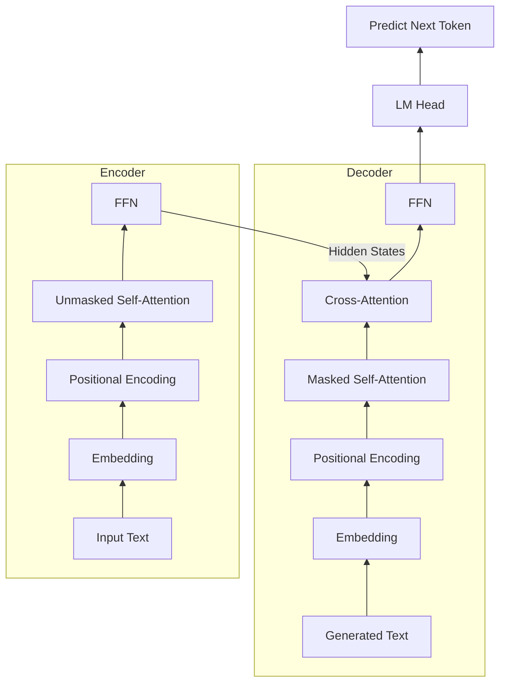
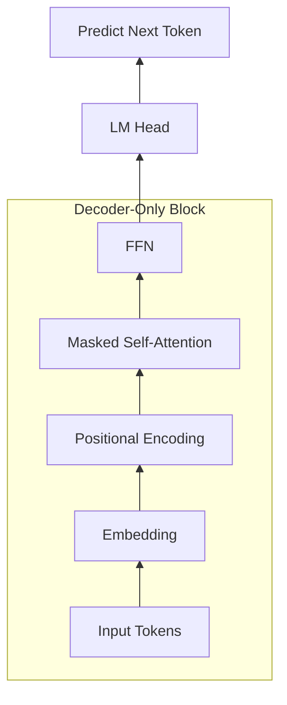
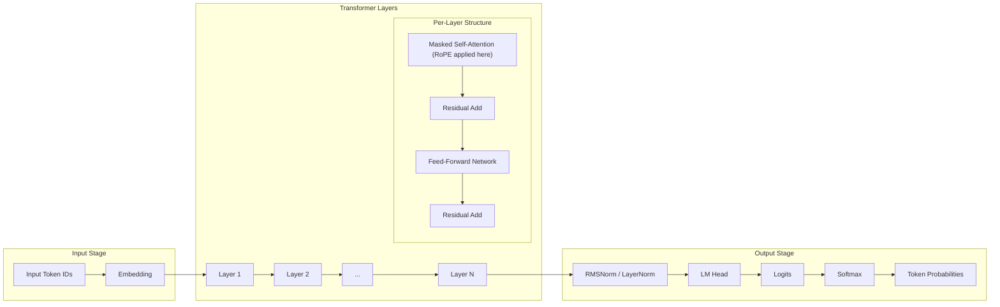

# Part One: Principles — The Foundational Engine of Transformers and LLMs

## Chapter 1: Demystifying the Transformer: The Magic of Q, K, and V

In Large Language Models (LLMs), all magic stems from the **Transformer** architecture, and its core is the **Self-Attention mechanism**. This chapter breaks down the three most famous letters in self-attention: **Q (Query)**, **K (Key)**, and **V (Value)**. They are the soul of the model's ability to understand context.

### Section 1: A Bird's-Eye View: Classic Transformer Architecture

Before diving into QKV, let's grasp the macro workflow of the classic **Encoder-Decoder** Transformer architecture (the original design).

We can compare this to **simultaneous interpretation**:

1.  **Left Side: Encoder — "Listening and Comprehending"**
    *   **Input**: For example, "The cat is black".
    *   **Workflow**: Data enters at the bottom and flows up through layers.
    *   **Core Mechanism**: Each layer uses unmasked **Self-Attention**. Unlike GPT's Masked Self-Attention which only looks backward, the Encoder allows all words to attend to each other. This bidirectional view captures full context. This suits translation perfectly because the source sentence is known and complete; the model extracts semantics rather than predicting the next word.
    *   **Output**: Hidden state vectors rich in context, representing full comprehension of the sentence.

2.  **Right Side: Decoder — "Translating and Expressing"**
    *   **Input**: The Encoder's context vectors and **previously generated words**.
    *   **Workflow**:
        *   **Masked Self-Attention**: The decoder's core mechanism. It restricts the model to look only at preceding words when predicting the next, preventing it from "peeking" at the future. This maintains causality: during inference, future words do not exist yet; during training, peeking would prevent the model from learning true predictive capabilities.
        *   **Multi-Head Cross-Attention**: The Decoder uses its current Query to search for matching Keys and Values in the Encoder's output.
    *   **Output**: Softmax converts outputs to probabilities for the next word (e.g., "est" based on the previously translated "Le chat").

**Summary**: The Encoder understands the input (bidirectional), while the Decoder generates output (unidirectional).

### Section 2: Evolution: Decoder-Only Architecture

Modern LLMs (like GPT, Llama, and DeepSeek) evolved from the dual-tower Encoder-Decoder to a minimalist **Decoder-Only** architecture, discarding the Encoder.

Why abandon the Encoder if it excels at understanding?

This reflects an elegant paradigm shift:
1.  **Translation vs. Continuation**: Transformers originally served translation, where input and output are separate (e.g., English and Chinese), requiring an Encoder to understand and a Decoder to translate.
2.  **The Solitaire Paradigm**: Modern LLMs treat all tasks (Q&A, coding, reasoning) as text continuation: predict the next word given the preceding text.
3.  **Unified Decoder**: Since everything is continuous text, we directly concatenate the prompt and response into the Decoder, eliminating the need for isolated towers.

The Decoder-Only architecture simplifies the design:
1.  **No Encoder**: Removes the independent encoder tower.
2.  **No Cross-Attention**: Eliminates inter-tower interaction.
3.  **Unified Input**: Concatenates Prompt and Response into a single sequence.
4.  **Core Mechanism**: Composed entirely of stacked **Masked Self-Attention** and **Feed-Forward Network (FFN)** blocks.

How it works:
*   **Prefill Phase**: The model processes the Prompt all at once. Although using Masked Self-Attention, the known Prompt allows parallel computation of word relationships (like an Encoder).
*   **Decode Phase**: The model generates words one by one. Each new word appends to the sequence to predict the next. Masked Self-Attention ensures the query only attends to preceding tokens, maintaining causality.

This "great truth is simple" design makes training more efficient and provides the foundation for inference optimizations like **KV Cache**.

### Section 3: The Library Analogy: Intuitive Meaning of QKV

Let's use a library analogy to understand Q, K, and V before diving into math.

Imagine walking into a library to find "noise-canceling Bluetooth headphones". Here is how Q, K, and V operate:

1.  **Q (Query)**: Your search term ("noise-canceling Bluetooth headphones"). It represents what you want to find.
2.  **K (Key)**: The book's index or tags (e.g., title, author, abstract).
    *   Book A Key: "Wired Gaming Headset Review".
    *   Book B Key: "Teardown of Sony Noise-Canceling Bluetooth Headphones".
3.  **V (Value)**: The actual content inside the book. If you read Book B, the text you absorb about acoustic principles is the Value.

**Self-Attention** matches your **Query** against all **Keys** to calculate relevance scores, then uses these scores to weight how much you read from each book's **Value**.

Mapping back to large models, let's use the word "apple":

Suppose we have two sentences:
*   Sentence A: "At today's **new product launch**, **Apple** introduced..."
*   Sentence B: "At the **supermarket**, the box of **apples** I bought is very..."

When the model processes the word "apple":
1.  **It generates its own Query (Q)**: Representing its "search intention".
    > [!NOTE]
    > This Query is a high-dimensional vector containing hundreds of abstract search dimensions learned during training. We use anthropomorphic language like "searching for 'technology' or 'fruit' clues" for intuition.
2.  **Match with Keys of preceding words**: The Query of "Apple" matches with Keys of words before it.
    *   In **Sentence A**, "Apple" matches strongly with "new product launch".
    *   In **Sentence B**, "apples" matches strongly with "supermarket".
3.  **Extract Value based on weights**:
    *   In **Sentence A**, the high match with "new product launch" pulls the semantics of "Apple" toward the tech company.
    *   In **Sentence B**, the high match with "supermarket" pulls the semantics toward fruit.

Through this dynamic matching, the same word can be given completely different, precise meanings under different contexts.

---

### Section 4: Mathematical Principles: Matrix Computation of QKV

Let's see how matrices dynamically calculate Q, K, and V.

#### 0. Word Vector (Embedding)
Computers need numbers. The model converts "apple" via a learned Embedding table into a high-dimensional vector $X$ (e.g., 4096 dimensions), representing its initial coordinates in semantic space.

#### 1. Linear Projection
The model multiplies the input vector $X$ by three learned weight matrices ($W_Q$, $W_K$, $W_V$) to generate Q, K, and V:

$$Q = X W_Q$$
$$K = X W_K$$
$$V = X W_V$$

> [!NOTE]
> **Static Weights vs. Dynamic Data**
> $W_Q, W_K, W_V$ are **static model weights** fixed in VRAM. Q, K, and V are **dynamically generated data**, calculated on the fly for each specific input. This enables the same word to yield different semantics in different contexts.

#### 2. Calculating Similarity and Attention Weights
To determine how much attention the current word (Query) gives to others (Keys), the model computes the dot product of Q and K:

$$\text{Score} = Q \cdot K^T$$

To prevent gradient vanishing from large scores, the model divides by $\sqrt{d_k}$ (vector dimension). Softmax then converts these scaled scores into probabilities totaling 1:

$$\text{Attention Weights} = \text{softmax}\left(\frac{Q K^T}{\sqrt{d_k}}\right)$$

#### 3. Extracting Information (Weighted Sum)
Finally, the model sums the **Values** of all words weighted by the attention weights, capturing the context:

$$\text{Output} = \sum (\text{Attention Weights} \times V)$$

> [!NOTE]
> **Dynamic Generation**: While a word (e.g., "apple") always starts with the same lookup vector $X$, attending to different contexts yields completely different output vectors. This is the power of self-attention.

---

### Section 5: Feed-Forward Network: Highway and Knowledge Base

After the self-attention mechanism completes the information exchange between words, the vector enters the **Feed-Forward Network (FFN)**. If the attention mechanism is responsible for "finding relationships between words", then the FFN is responsible for each word's "closed-door thinking".

#### 1. The FFN Workflow

The input vector $H$ to the FFN is the sum of the Attention output and the original input vector $X$ (Residual Connection).

$H$ blends "who I am" (original meaning) with "what I experienced" (context). The FFN processes it in three steps:

1.  **Up-Projection**: Multiplying $H$ by weight matrix $W_1$ expands dimensions (e.g., 4096 to 16384), unfolding information for feature extraction.
2.  **Non-linear Activation**: The expanded vector passes through a non-linear function $\sigma$ (like SwiGLU), filtering and selecting information.
3.  **Down-Projection**: Multiplying by $W_2$ compresses the vector back to original dimensions (e.g., 4096) for residual addition.

#### 2. FFN as a "Soft KV Memory Base"

With only two matrices ($W_1$ and $W_2$), FFN seems to lack the QKV structure of Attention. However, a famous 2020 paper showed that **the FFN operates as a Key-Value memory retrieval system**.

Compare the core formulas:
*   **Attention**: $\text{Output}_{attn} = \text{Softmax}(Q \cdot K^T) \cdot V$
*   **FFN**: $\text{Output}_{ffn} = \sigma(H \cdot W_1) \cdot W_2$

Here, the FFN calculation maps to Q, K, and V logic:

1.  **Input vector $H$ acts as the Query**: It asks, "Given my current state, what supplementary information exists in the knowledge base?"
2.  **Up-Projection Matrix $W_1$ acts as the Keys**: Slicing $W_1$ by columns yields vectors representing specific "patterns" (e.g., "fruit in a supermarket context"). $H \cdot W_1$ calculates similarity between the Query and these Keys.
3.  **Down-Projection Matrix $W_2$ acts as the Values**: Slicing $W_2$ by rows yields vectors representing concrete knowledge (e.g., "crisp, juicy").

Processing the "apple" example:

For **Sentence B** ("At the **supermarket**, the box of **apples** I bought is very..."):
1.  **Pattern Matching**: The input vector $H$ (already fused into "fruit apple" by Attention) yields a high matching score with the "fruit, food" pattern in $W_1$.
2.  **Activation Filtering**: Function $\sigma$ zeroes out scores for unrelated patterns (like "tech company"), retaining only the "fruit" pattern.
3.  **Knowledge Extraction**: The model weights the Values in $W_2$ by these scores, extracting knowledge like "crisp, juicy".

For **Sentence A** ("At today's new product launch, Apple introduced..."):
1.  **Pattern Matching**: The input vector $H$ ("tech company Apple") scores high with "technology, company" patterns in $W_1$.
2.  **Activation Filtering**: The function filters out the "fruit" pattern.
3.  **Knowledge Extraction**: The model extracts knowledge like "iPhone, high-tech" from $W_2$.

#### 3. Fusion and the Complete Life of a Token
The knowledge retrieved by the FFN will not directly replace the original vector, but is fused together through a **Residual Connection (addition)**:
$$x_{new} = H + FFN(H)$$

This is like a **"scratchpad"** carried by the Token:
*   $H$ (written on the scratchpad): I am an "apple", and I am in the context of "eating".
*   $FFN(H)$ (knowledge base supplement): Attributes are "crisp, juicy".
*   **Addition**: Staple the supplementary material to the next page of the scratchpad. The Token now understands both context and knowledge.

**Summary**: A Token's journey in one layer of the Transformer is: **first go to the Attention meeting (understand context)**, **then go to the FFN library (understand knowledge)**, and finally walk to the next layer with enriched memory!

---

### Section 6: Multi-Head Attention: Parallel Perspectives

Single-head attention blends all semantic relationships into one vector, risking loss of focus. Industrial models use dozens of heads (sets of matrices) per layer, called **Multi-Head Attention (MHA)**.

**Why multiple heads?**
Language is complex; a word plays multiple roles simultaneously.
*   **Grammar Head**: Finds subject-verb-object relationships.
*   **Emotion Head**: Captures emotional adjectives.
*   **Coreference Head**: Resolves pronouns (like "he" or "it").

MHA observes sentences from dozens of perspectives in parallel. It concatenates parallel outputs and integrates them via a linear layer.

**Llama 3 405B MHA Workflow**:
1.  **Input**: Sentence matrix of shape `[N, 16384]` ($N$ words, 16384 dimensions).
2.  **Projection**: Matrices $W_Q, W_K, W_V$ (size `[16384, 16384]`) generate $Q, K, V$ of shape `[N, 16384]`.
3.  **Split**: Slices the 16384 dimensions into 128 heads, each dimension 128. Shape becomes `[N, 128, 128]`.
4.  **Scores**: Each head computes scores independently ($Q \times K^T$), resulting in `[N, N]`.
5.  **Combine**: Multiplies scores by $V$, yielding output `[N, 128]` per head.
6.  **Concatenate**: Joins the 128 head outputs to restore `[N, 16384]`.
7.  **Output Projection**: Matrix $W_O$ (`[16384, 16384]`) fuses results into the final output `[N, 16384]`.

---

### Section 7: Mixture of Experts: Sparse Activation

MoE upgrades the FFN by creating multiple replicas.

#### 1. Dense Model Pain Points
Traditional **Dense** models use one FFN per layer. All tokens pass through it, whether discussing quantum mechanics or cooking. Memorizing more knowledge requires a massive FFN, surging compute costs (FLOPs).

#### 2. The MoE Solution: Division of Labor
MoE splits the massive FFN into multiple smaller FFNs, called **Experts** (e.g., 8 or 16).

Components:
*   **Router (Gating Network)**: Calculates match scores between the token (Query) and each expert.
*   **Experts**: Standard FFNs specializing in specific domains (e.g., code, literature) during training.

#### 3. Sparse Activation
When a token enters:
1.  **Router Scoring**: Identifies the topic (e.g., quantum mechanics).
2.  **Sparse Activation**: Activates only the Top-K relevant experts (e.g., Expert 3 and 5), leaving others idle.
3.  **Fusion**: Fuses results from active experts based on weights.

**Summary**: MoE enables a massive total parameter count (broad knowledge) with a small active parameter count per forward pass (cheap compute). This is the secret to DeepSeek's efficiency.

---

## Chapter 2: Building the Skyscraper: Stacking Layers and Data Flow

We have explored the core parts: self-attention and FFN. Now, let's see how they assemble into a large model "skyscraper" and how data flows through it.

**Complete Model Architecture Diagram**

This diagram shows the complete journey of a token in a Decoder-Only model, from entry to prediction:

### Section 1: Input Stage: Embeddings and Positional Encoding

Before entering the layers, data undergoes processing in the "lobby" to become model-readable and acquire critical context.

1.  **Word Embedding**: Converts tokens into high-dimensional vectors (e.g., 4096 dimensions) via table lookup, establishing initial semantic coordinates.
2.  **Positional Encoding**:
    Self-attention is **time-blind**; it computes vector similarity without sequence order. Without help, "I eat the apple" and "the apple eats me" look identical. We must inject position information.
    *   **Rotary Position Embedding (RoPE)**: Modern models (like Llama and Qwen) use RoPE. Instead of adding position values early, it **twists** the Q and K vectors by an angle in multi-dimensional space when computing the dot product.
    *   Closer words have smaller angle differences, yielding larger dot products. This elegantly encodes relative position into the attention calculation.

---

### Section 2: Wisdom of Stacking: Hierarchical Feature Extraction

After embedding, the word vector begins climbing the Transformer skyscraper. Modern LLMs stack dozens or hundreds of **Transformer Blocks** (e.g., Llama-3 70B has 80 layers).

**Why so many layers?**

This stacking enables **Hierarchical Feature Extraction**:

1.  **Single Layer Limits**: A single layer only recognizes superficial associations (e.g., "apple" and "supermarket"). It cannot perform deep reasoning.
2.  **Bottom Layers**: Extract grammar and local relationships (e.g., identifying subjects and modifiers).
3.  **Middle Layers**: Capture entity relationships and common sense. The FFN consults its "soft memory base" to add background knowledge.
4.  **Top Layers**: Handle abstract concepts and logical reasoning, distilling the sentence into an abstract intent to answer the prompt.

This layer-by-layer progression from concrete to abstract is key to LLM "intelligence".

Information flows diagonally upwards across layers, not horizontally within a layer. When processing the Prompt, all words advance side by side, climbing layers simultaneously.

In Layer 1, when the 4th word attends to the 3rd, it sees the 3rd word's initial state at Layer 1 entry, not a state already fused with words 1 and 2. Parallel computation prevents waiting.

The output state of the 3rd word from Layer 1 (carrying info from words 1 and 2) serves as its input to Layer 2. When the 4th word attends to it in Layer 2, it matches with its Key and reads its Value, indirectly accessing information from words 1 and 2. This design enables massive GPU parallelism while achieving deep semantic fusion.

---

### Section 3: The Translator: LM Head

At the top floor, each token emits a final hidden state vector ($h_{last}$), containing complex semantics distilled from all layers.

Since humans read words, not vectors, the model uses a "translator": the **LM Head**. This massive linear projection matrix (shape: `[vector dimension, vocabulary size]`) maps the vector back to the vocabulary.

Multiplying $h_{last}$ by the LM Head yields **raw scores (Logits)** for every word in the vocabulary.

> [!NOTE]
> **Why no LM Head in middle layers?**
> Mapping high-dimensional vectors back to words in middle layers would destroy the complex abstract logic and cause information loss. The model must process information fully before outputting.

> [!NOTE]
> **Engineering Easter Egg: Weight Tying**
> Classic models (like GPT-2, Llama 2) share the same physical matrix for Embedding and LM Head to save VRAM. Some newer, larger models decouple them for better expressive power.

---

### Section 4: Logits and Softmax: Probabilistic Normalization

Logits are irregular real numbers (e.g., "apple": 12.5, "phone": 8.2). To select a word, the system converts these scores into a probability distribution using **Softmax**.

Softmax exponentiates and normalizes logits across the vocabulary, ensuring:
1.  All probabilities fall between 0 and 1.
2.  Probabilities sum to 1.

The result is a distribution like `{"apple": 0.7, "phone": 0.2, "run": 0.001}`.

---

### Section 5: Parameter Breakdown: What Makes Up 8B/70B Models

What do 8B or 70B parameters refer to?

**Parameters are the sum of all numbers in the model's learnable weight matrices**, representing the knowledge "solidified" during training.

Let's break down the 405 billion parameters of **Llama 3 405B**:

**Core configuration**:
*   Vocabulary Size: $128,256$
*   Hidden Dimension ($d$): $16384$
*   Number of Layers: $126$
*   FFN Intermediate Dimension: $53248$
*   GQA: 128 Query Heads, 8 KV Heads

**The Bill**:
1.  **Embedding Layer**: `Vocabulary Size * Hidden Dimension` = $128,256 \times 16384 \approx 2.10$ billion. (128.2k words $\times$ 16384 dimensions).
2.  **Transformer Layers** ($126$ layers):
    *   **Attention**: $W_Q, W_K, W_V, W_O$ total $\approx 5.7$ billion per layer.
    *   **FFN**: Gate, Up, Down matrices total $\approx 26.17$ billion per layer.
    *   **Total per layer**: $\approx 31.87$ billion.
    *   **Total for 126 layers**: $126 \times 31.87 \approx 401.6$ billion.
    *   **Note**: **FFN occupies about 82% of the parameter count** in Transformer layers. Most "hard knowledge" lives here.
3.  **Output Layer (LM Head)**: `Hidden Dimension * Vocabulary Size` = $16384 \times 128,256 \approx 2.10$ billion. Maps vectors back to vocabulary scores.

**Total**: $2.1\text{B} + 401.6\text{B} + 2.1\text{B} \approx 405.8$ billion parameters.

Downloading a 405B model means downloading 405 billion floating-point numbers (about 810GB in FP16). Input prompts trigger matrix multiplications with these numbers to generate responses.

---

### Section 6: Data Flow: End-to-End Pipeline

Let's trace a token's journey from entry to output:

1.  **Input Stage**: Table lookup converts all prompt tokens into word vectors simultaneously, forming initial input $X_0$.
    > [!NOTE]
    > Models with absolute position encoding (like BERT) add position info here. RoPE models do not add it here.
2.  **Layer-by-Layer Shuttle**:
    *   $X_0$ enters Layer 1 Attention. RoPE injects position rotation here.
    *   Words exchange info, then add to the original vector (Residual Connection) to prevent feature loss.
    *   The result enters Layer 1 FFN to consult knowledge.
    *   Another residual connection yields Layer 1 output, $X_1$.
    *   $X_1$ ascends to Layer 2 and repeats the process up to the final layer, yielding hidden state $h_{last}$.
3.  **Output Stage**:
    *   After normalization (Norm), $h_{last}$ enters the **LM Head**.
    *   The LM Head projects it back to vocabulary scores (Logits).
    *   **Softmax** converts logits to a probability distribution.

This completes a **single forward pass**, predicting the next word.

---

## Chapter 3: The Art of Operation: Autoregressive Decoding and Text Generation

In Chapter 2, we understood the static structure of the skyscraper. Now, we are going to make this building truly operate. When a user's request (input) arrives, how does the model process it step by step and ultimately "speak" the answer out?

### Section 1: Prefill Phase: Handling Input Context

Suppose the user asks: "What is artificial intelligence?"

1.  **Tokenization**: Splits text into tokens (e.g., "What", "is", "artificial", "intelligence", "?").
2.  **Simultaneous Input**: Feeds all token vectors into the model at once.
3.  **Parallel Computation**: Since the Prompt is complete and known, the model computes word relationships in parallel. This step understands context to prepare for generation.
    > [!TIP]
    > **Prefill Parallelism**: 1) Parallel generation of Q, K, V for all tokens. 2) Parallel computation of attention weights and weighted fusion. GPUs execute both as efficient matrix multiplications.
4.  **First Word Probability**: Generates a probability distribution for the first generated word.

---

### Section 2: Decode Phase: The Autoregressive Loop

Based on the probability distribution from Prefill, the model selects the next word (e.g., "AI").

1.  **Output the Word**: The model outputs "AI".
2.  **The Loop**:
    *   The model appends "AI" to the input sequence: "What is artificial intelligence? AI".
    *   This extended sequence feeds back into the model.
    *   The model predicts the next word (e.g., "is").
    *   The loop continues.

This is **Autoregression**: the previous output becomes the next input.

While this ensures coherence, it demands heavy computation: generating a 1000-word story requires running the model 1000 times.

In Part One, we explored the Transformer's core mechanics: self-attention, FFNs, and data flow. We saw how the model predicts the next word. However, this "solitaire" game demands massive compute and VRAM for long texts and heavy traffic.

What bottlenecks LLM inference speed? How does VRAM usage grow? In **Part Two**, we will confront these physical and mathematical limits.

---
