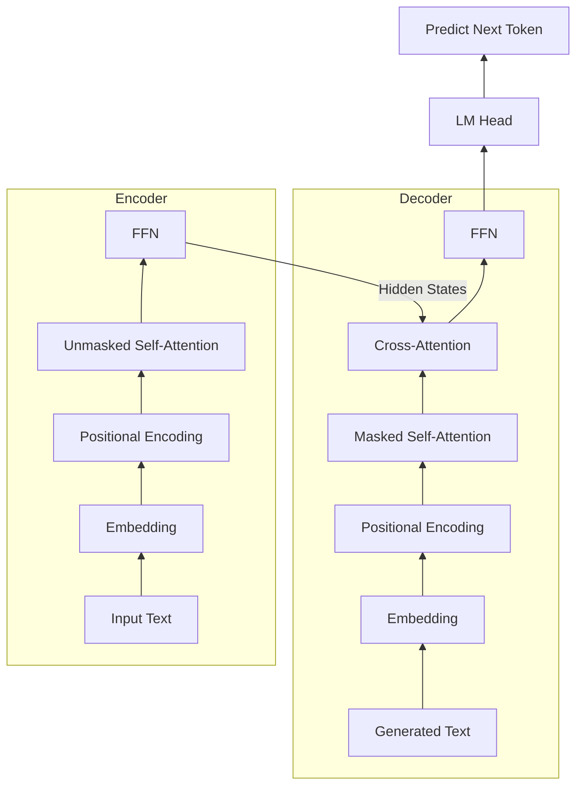
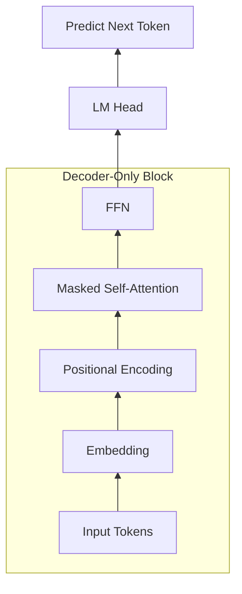
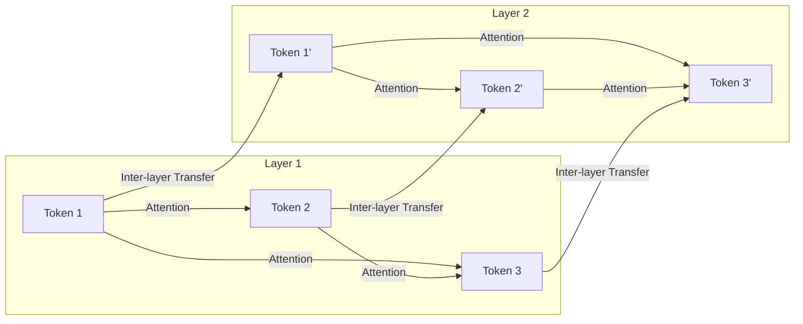

# Part 1: Principles — The Foundational Engine of Transformers and LLMs

## Table of Contents
- [Chapter 1: Demystifying the Transformer: The Magic of Q, K, and V](#chapter-1-demystifying-the-transformer-the-magic-of-q-k-and-v)
  - [Section 1: A Bird's-Eye View: Classic Transformer Architecture](#section-1-a-birds-eye-view-classic-transformer-architecture)
  - [Section 2: Evolution: Decoder-Only Architecture](#section-2-evolution-decoder-only-architecture)
  - [Section 3: The Library Analogy: Intuitive Meaning of QKV](#section-3-the-library-analogy-intuitive-meaning-of-qkv)
  - [Section 4: Mathematical Principles: Matrix Computation of QKV](#section-4-mathematical-principles-matrix-computation-of-qkv)
  - [Section 5: Feed-Forward Network: Knowledge Base](#section-5-feed-forward-network-knowledge-base)
  - [Section 6: The Extension of Self-Attention: Multi-Head Attention](#section-6-the-extension-of-self-attention-multi-head-attention)
  - [Section 7: The Extension of FFN: Mixture of Experts (MoE)](#section-7-the-extension-of-ffn-mixture-of-experts-moe)
- [Chapter 2: Building the Skyscraper: Stacking Layers and Data Flow](#chapter-2-building-the-skyscraper-stacking-layers-and-data-flow)
  - [Section 1: Entrance to the Skyscraper: Embeddings and Positional Encoding](#section-1-entrance-to-the-skyscraper-embeddings-and-positional-encoding)
  - [Section 2: The Wisdom of Stacking: Why Stacking Multiple Transformers?](#section-2-the-wisdom-of-stacking-why-stacking-multiple-transformers)
  - [Section 3: The Translator: LM Head](#section-3-the-translator-lm-head)
  - [Section 4: Logits and Softmax: Converting Raw Scores to Probabilities](#section-4-logits-and-softmax-converting-raw-scores-to-probabilities)
  - [Section 5: Pop Science: What Do We Mean by 8B/70B Parameters?](#section-5-pop-science-what-do-we-mean-by-8b70b-parameters)
  - [Section 6: Data Flow: End-to-End Pipeline](#section-6-data-flow-end-to-end-pipeline)
- [Chapter 3: The Art of Operation: Autoregressive Decoding and Text Generation](#chapter-3-the-art-of-operation-autoregressive-decoding-and-text-generation)
  - [Section 1: Prefill (Pre-fill): Process of Handling Inputs](#section-1-prefill-pre-fill-process-of-handling-inputs)
  - [Section 2: Decode (Decoding): Autoregressive Loop and Text Generation](#section-2-decode-decoding-autoregressive-loop-and-text-generation)

In the world of Large Language Models (LLMs), the origin of all magic traces back to an architecture named **Transformer**, and the core of Transformer is the **Self-Attention mechanism**. In this chapter, we will break down the three most renowned letters in Self-Attention: **Q (Query)**, **K (Key)**, and **V (Value)**. They serve as the soul of a model's capacity to understand context and capture complex relationships between words.

---

## Chapter 1: Demystifying the Transformer: The Magic of Q, K, and V

---

### Section 1: A Bird's-Eye View: Classic Transformer Architecture

Before diving into the micro-world of QKV, let’s leverage the diagram above to understand the macro workflow of a Transformer. **Please note that this diagram portrays the classic Encoder-Decoder architecture, representing the original design of the Transformer.**

We can compare this process to **simultaneous interpretation**:

1.  **Left Side: Encoder — "Hear, Understand, and Record"**
    *   **Input**: For example, the English sentence "The cat is black".
    *   **Process**: Data enters from the bottom and undergoes multi-layer processing.
    *   **Core Mechanism**: Each layer incorporates a "Self-Attention" mechanism. **Please note that self-attention here is "Unmasked"**. This is different from the Masked Self-Attention in models like GPT, which only inspect the preceding context. In an Encoder, all words within the sentence can **observe each other**, understanding the context without any blind spots. This is entirely logical in translation tasks because the source sentence is **known and complete**. We don't need to predict it; we only need to thoroughly extract its semantics and maximize contextual information.
    *   **Output**: The top outputs are **hidden state vectors** rich in context information. They represent that the Encoder has completely "understood" the sentence.

2.  **Right Side: Decoder — "Translate and Express"**
    *   **Input**: It receives two components of information: first, the "secret secret report understood" passed from the Encoder; second, **the words it translated at previous moments**.
    *   **Process**:
        *   **Masked Self-Attention**: This is the core mechanism of a Decoder. When predicting the next word, it can only look at the words already spoken in the preceding text, not "peek" into future words. **Why?** Because during inference, future words have not been born yet; and during training, if peeking into future words is permitted, the model will cheat by looking up the answers, failing to acquire real prediction ability.
        *   **Multi-Head Cross-Attention**: **This is the most critical step!** The Decoder utilizes its current intent (Query) to seek matching clues (Key and Value) in the secret report from the Encoder.
    *   **Output**: Passes through Softmax to predict the probability of the next word (e.g., "est") based on the previously translated "Le chat".

**Summary**: The Encoder is responsible for "understanding the input" (bi-directional observation), and the Decoder is responsible for "generating outputs based on understanding" (uni-directional generation).

---

### Section 2: Evolution: Decoder-Only Architecture

Following the classic Transformer, large language models experienced a major architectural evolution. Mainstream large models we know today like GPT, Llama, and DeepSeek do not adopt the native Encoder-Decoder dual-tower architecture, but shifted towards the extremely simplified **Decoder-Only** architecture — meaning they discarded the left-half Encoder and retained only the right-half Decoder.

Seeing this, readers might naturally produce a highly logical question: **Since the Encoder is so adept at understanding, why did modern models discard it, leaving everyone with a "single tower" Decoder-Only architecture?**

This involves an extremely elegant paradigm shift:
1.  **Transformer was originally born for "Translation"**: In translation tasks, "inputs" and "outputs" are naturally segregated language entities (such as English and Chinese). Thus, the Encoder first completely understands the English, and the Decoder translates it to Chinese.
2.  **Modern LLMs Play "Text Continuation"**: Scientists discovered that all natural language tasks (Q&A, code generation, reasoning, and even translation) can be unified into a **"given the previous text, predict the next word"** continuation game.
3.  **Decoder Manages Everything**: Since it is simply a continuous segment of text, we no longer require two physically segregated towers. We merge the Prompt and Response together and feed them entirely to the Decoder.

As seen in the architecture diagram above, the Decoder-Only architecture implements immense simplifications compared to classic architectures:
1.  **Encoder Eliminated**: No independent encoder tower exists on the left side.
2.  **Cross-Attention Eliminated**: Since there is no Encoder, cross-attention used for inter-tower interaction is naturally no longer needed.
3.  **Unified Input**: Prompt and Response are spliced into a continuous sequence, entering uniformly from the bottom.
4.  **Core Mechanism**: The entire model is completely comprised of stacked **Masked Self-Attention** blocks and **Feed-Forward Network (FFN)** blocks.

Under this architecture, how does the model operate?
*   **Prefill Phase**: Your input prompt is processed in one go. Though it utilizes Masked Self-Attention, because the prompt is known, the model can compute the relationships between prompt words in parallel (akin to the work of an Encoder).
*   **Decode Phase**: The model starts generating responses word by word. With each new word generated, it is appended to the end of the input sequence to predict the next word. At this moment, Masked Self-Attention ensures the generation can only inspect preceding prompts and words, securing causal relationships.

This simplistic architecture design optimizes pre-training on massive data and provides the unified physical foundation for production serving optimizations like **KV Cache**.

---

### Section 3: The Library Analogy: Intuitive Meaning of QKV

Before delving into complex mathematical formulas, let’s use a highly intuitive scenario to understand the logical meaning of Q, K, and V.

Imagine walking into a giant **Science Library** searching for material on "noise-canceling Bluetooth headphones". In this scene, Q, K, and V play distinct roles:
1.  **Q (Query)**: Represents **your current intent**. The search words you enter in the computer: "noise-canceling Bluetooth headphones". This represents what information characteristics you are currently seeking.
2.  **K (Key)**: Represents the **indices or tags of book contents**. Every book has a name, author, abstract, and classification tag. For instance:
    *   Book A's Key is: "Wired Gaming Headphones Review".
    *   Book B's Key is: "Sony Noise-Canceling Bluetooth Headphones Teardown and Chip Analysis".
3.  **V (Value)**: Represents the **actual knowledge within the books**. If you ultimately decide to read Book B, the detailed words you absorb about chipsets and acoustics are the Value.

**The overall logical flow of the Self-Attention mechanism** involves taking your **Query**, matching it against the **Keys** of all books to calculate a relevance score, and then allocating your reading attention to the **Values** of each book based on those scores.

Mapping this back to LLMs, let’s use "Apple" as a concrete example:

Suppose we have two sentences:
*   Sentence A: "At today’s **new product launch**, **Apple** introduced..."
*   Sentence B: "The box of **apples** I bought at the **supermarket** was very..."

When the model processes the word "Apple":
1.  **It generates its own Query (Q)**: Representing its "searching intent".
    > [!NOTE]
    > In reality, this Query is a complex high-dimensional continuous vector housing hundreds of abstract search dimensions formed during pre-training. We use humanized wording like "I am 'apple', I need 'tech' or 'fruit' clues" simply to facilitate human understanding.
2.  **It matches its Query against the Keys (K) of all preceding words**:
    *   In **Sentence A**, the **Q** of "Apple" scores a high match against the **K** of "**new product launch**" (since launches tie strongly to tech companies).
    *   In **Sentence B**, the **Q** of "apples" matches strongly with the **K** of "**supermarket**" (since supermarkets tie to food and fruit).
3.  **Extracts Values (V) based on weights**:
    *   In **Sentence A**, the model assigns heavy weights to the **V** of "new product launch", causing the final vector for "Apple" to skew toward **"Apple Inc."**.
    *   In **Sentence B**, the model assigns heavy weights to the **V** of "supermarket", skewing the final vector for "apples" toward **"fruit"**.

Through dynamic matching, identical words secure precise definitions across differing contexts.

---

### Section 4: Mathematical Principles: Matrix Computation of QKV

With the logical meaning understood, let’s examine how LLMs dynamically compute Q, K, and V through matrix multiplication.

#### 0. What is Word Embedding?
Before calculating, text must be transformed into computer-friendly numbers. Suppose the input is the word "Apple". The model first looks up a dictionary (Embedding table) and translates "Apple" into a continuous vector $X$ of say 4096 dimensions. This string of numbers represents the initial semantic coordinates of "Apple" in a multi-dimensional space.

#### 1. Linear Mapping (From Embeddings to Q, K, and V)
Suppose we hold the word vector $X$. In Transformer models, there are three core **weight matrices** learned through pre-training: $W_Q$, $W_K$, and $W_V$.

Input word vectors multiply against these three matrices to dynamically generate corresponding Q, K, and V vectors:

$$Q = X W_Q$$
$$K = X W_K$$
$$V = X W_V$$

> [!NOTE]
> **Static Weights vs. Dynamic Data**
> A critical boundary exists: $W_Q, W_K, W_V$ are **static model weights** fixed in VRAM after training, acting as shared "processing rules" for all Tokens. Q, K, and V are **dynamically generated data**, computed in real-time by multiplying the input vector $X$ against the static weight matrices. This is the reason why a single word secures different semantic meanings across various contexts.

#### 2. Computing Similarities and Attention Weights
To determine the attention the current word (Query) allocates to preceding words (Keys), the model computes the **dot product** of the current word's Q and preceding words' K. A higher dot product represents closer semantic proximity.

$$\text{Score} = Q \cdot K^T$$

To prevent numerical explosions and vanishing gradients, the model divides the score by a scaling factor $\sqrt{d_k}$ ($d_k$ represents the vector's dimension). Subsequently, a **Softmax** function maps these scores into a probability distribution where all weights add up to 1:

$$\text{Attention Weights} = \text{softmax}\left(\frac{Q K^T}{\sqrt{d_k}}\right)$$

#### 3. Extracting Information (Weighted Sum)
Lastly, the model uses the computed attention weights to perform a weighted sum against the **Values** of all words, completing context retrieval:

$$\text{Output} = \sum (\text{Attention Weights} \times V)$$

> [!NOTE]
> The key lies in **dynamic generation**. The initial word vector $X$ of the same word ("Apple") remains identical across different sentences via table lookup, but by performing attention computations against differing contexts, the final Output vector ends up entirely distinct. That is the absolute charm of the Self-Attention mechanism.

---

### Section 5: Feed-Forward Network: Knowledge Base

After self-attention completes word-to-word information exchanges, vectors enter the **Feed-Forward Network (FFN)**. While Attention focuses on "finding relationships," FFN handles the "internal reflection" of individual words.

#### 1. The Classic FFN Workflow
Vectors $H$ entering the FFN are not raw attention outputs. They are a **Residual Connection** summing the **Attention output** and the **original input vector $X$**.

This $H$ vector holds a blend of "who I am" (original meaning) and "what I've gone through" (global context). The FFN processes it in three stages:
1.  **Up-Projection**: The input vector $H$ multiplies against a weight matrix $W_1$. In most models, this expands dimensions from 4096 up to 16384, opening a wider space for complex feature extraction.
2.  **Activation**: The up-projected vector passes through a non-linear activation function $\sigma$ (e.g., ReLU, GeLU, or SwiGLU). This introduces non-linear expressivity while filtering and selecting information.
3.  **Down-Projection**: The activated vector multiplies against $W_2$, scaling dimensions from 16384 back to 4096 so it can sum residually with the initial input.

#### 2. Soft KV Memory: The Symmetry of FFN and Attention
While Attention relies on Q, K, and V, FFN only holds $W_1$ and $W_2$. A famous 2020 paper demonstrated profound mathematical symmetry: **FFN is essentially a Key-Value memory retrieval system!**

Let’s contrast formulas:
*   **Attention Formula**: $\text{Output}_{attn} = \text{Softmax}(Q \cdot K^T) \cdot V$
*   **FFN Formula**: $\text{Output}_{ffn} = \sigma(H \cdot W_1) \cdot W_2$

Under this view, FFN computation perfectly mirrors the Q, K, V logic:
1.  **The input vector $H$ is the Query (Q)!** It queries the FFN: "Here is my current status. Are there complementary facts in the memory?"
2.  **The Up-projection matrix $W_1$ acts as the Keys (K)**. We slice $W_1$ column-wise into 16384 vectors. Each represents a specific "pattern" learned by the model. Computing $H \cdot W_1$ yields the similarity between Query $H$ and knowledge Keys $W_1$.
3.  **The Down-projection matrix $W_2$ acts as the Values (V)**. We slice $W_2$ row-wise. Each represents specific knowledge tied to a pattern.

When $H$ enters the FFN, knowledge retrieval proceeds:
If processing **Sentence B** ("apples at the supermarket"):
1.  **Pattern Match**: $H$ matches strongly with "fruit/food" patterns in $W_1$.
2.  **Activation Filter**: $\sigma$ zeroes out unrelated scores (like "tech companies").
3.  **Knowledge Fetch**: Retrieves "crisp, juicy" from $W_2$.

Conversely, processing **Sentence A** ("Apple new product launch"):
1.  **Pattern Match**: $H$ matches strongly with "tech, digital, company" patterns.
2.  **Activation Filter**: Filters out the "fruit" pattern.
3.  **Knowledge Fetch**: Retrieves "iPhone, high tech" from $W_2$.

#### 3. Residual Integration
FFN knowledge sums residually with the original vector:
$$x_{new} = H + FFN(H)$$
Tokens carry a **"notepad"**:
*   $H$ states: I am an "apple" situated in an "eating" context.
*   $FFN(H)$ adds: Physical traits include "crisp and juicy".
*   **Summation**: The token understands both the context and the facts, advancing memory down the layers.

---

### Section 6: The Extension of Self-Attention: Multi-Head Attention

Early simplifications assumed a single set of $W_Q, W_K, W_V$. Forcing complex semantics into a single vector risks oversight. Modern LLMs stack dozens of these matrices in every layer—known as **Multi-Head Attention (MHA)**.

**Why multiple heads?**
Human language holds multi-faceted roles:
*   **Head 1 (Grammar)**: Identifies subject-verb-object relations.
*   **Head 2 (Emotion)**: Catches emotionally charged adjectives.
*   **Head 3 (Reference)**: Identifies what pronouns like "it" or "him" point to.

**The Fourth Matrix: $W_O$**
MHA doesn't just duplicate $W_Q$, $W_K$, and $W_V$. To compress fragmented outputs back into the original dimensions, models introduce an **Output Projection Matrix $W_O$**.

Let's deconstruct standard MHA calculation in **Llama 3 (405B)**:
1.  **Input Prep**: Sentence matrix shape is `[N, 16384]`.
2.  **Projection**: Using $W_Q, W_K, W_V$ (sized `[16384, 16384]`), returning $Q, K, V$ at `[N, 16384]`.
3.  **Head Slicing**: Hidden dimension is split logically into $H = 128$ heads, each holding $d_k = 128$. Tensor shape becomes `[N, 128, 128]`.
4.  **Score Compute**: Independence calculations across 128 heads. $Q$ (`[N, 128]`) multiplies $K^T$ (`[128, N]`), yielding score matrices `[N, N]`.
5.  **Value Binding**: Fuses scores with $V$ (`[N, 128]`), yielding head outputs shaped `[N, 128]`.
6.  **Concatenation**: Concatenates 128 outputs back to `[N, 16384]`.
7.  **Output Projection ($W_O$)**: Stacks $W_O$ (`[16384, 16384]`) to fuse heads, returning `[N, 16384]`.

---

### Section 7: The Extension of FFN: Mixture of Experts (MoE)

MoE is the **multi-replica upgrade of FFN**.

#### 1. Dense Model Pain Points
In traditional **Dense** models, each layer holds a single FFN. All tokens, regardless of domain, must traverse the identical FFN. Scaling knowledge requires scaling the FFN, driving up compute costs (FLOPs) and inference latency.

#### 2. MoE Solution: Division of Labor
MoE shards a monolithic FFN into multiple smaller FFNs—each called an **Expert**.
*   **Router**: When tokens enter, the Router measures their relevance against experts.
*   **Experts**: Every expert is a standard FFN trained to specialize in particular domains.

#### 3. Sparse Activation
1.  **Router Calculation**: Routes tokens to corresponding specialists.
2.  **Sparse Activation**: Activates Top-K relevant experts (e.g., Experts 3 and 5) and leaves others idle.
3.  **Knowledge Fusion**: Only activated experts process the tokens; outputs fuse according to weighted relevance.

MoE delivers **"high total parameters (massive knowledge) but low activated parameters (economical compute)"**. All experts must reside in VRAM, demanding strict memory capacities.

---

## Chapter 2: Building the Skyscraper: Stacking Layers and Data Flow

---

### Section 1: Entrance to the Skyscraper: Embeddings and Positional Encoding

Before data enters the multi-layer Transformer Blocks, it goes through the entrance lobby for formatting and injection of core insights.
1.  **Word Embedding**: Words map onto high-dimensional continuous coordinates (e.g., 4096 dimensions).
2.  **Positional Encoding**: Attention is natively order-blind. Modern SOTA models apply **RoPE (Rotary Position Embedding)**, rotating Q and K vectors complexly in geometric spaces during dot products. Words close in proximity sustain minimal rotational differences and yield high scores.

---

### Section 2: The Wisdom of Stacking: Why Stacking Multiple Transformers?

Armed with positional embeddings, tokens ascend the Transformer Block skyscraper (e.g., 80 layers in Llama 3 70B).

**Why so many layers?**
This is anchored on **Hierarchical Feature Extraction**:
1.  **Single-Layer Constraints**: One layer of self-attention only maps shallow, local associations. It cannot perform deep logical deductions or abstract comprehension.
2.  **Emergent Capabilities in Stacking**:
    *   **Lower Layers**: Extract grammar and local syntactic relationships.
    *   **Middle Layers**: Comprehend entities and commonsense facts from FFNs.
    *   **Upper Layers**: Handle abstract concepts and logical reasoning.

**Slanted Information Flow**: Parallel prompt processing means tokens do not move horizontally across a single layer; information moves **slantwise upwards**, letting GPUs compute in parallel while securing deep semantic integration.

---

### Section 3: The Translator: LM Head

When data exits the top layer, each token yields a final hidden state vector ($h_{last}$). The **LM Head** maps these abstract vectors onto a huge vocabulary matrix (shaped `[Vector Dimension, Vocab Size]`), returning raw **Logits**.

> [!NOTE]
> **Why no LM Head in intermediate layers?**
> Intermediate layers are kept abstract to prevent logical informational losses.
>
> **Engineering Feature: Weight Tying**
> Older models used **Weight Tying** (sharing Embedding and LM Head matrices physically) to save VRAM, whereas SOTA models decouple them.

---

### Section 4: Logits and Softmax: Converting Raw Scores to Probabilities

LM Head outputs raw integer scores (Logits). The **Softmax** function processes them into probability distributions between 0 and 1, ensuring all token probabilities sum to 1.

---

### Section 5: Pop Science: What Do We Mean by 8B/70B Parameters?

Parameters denote all trainable floating-point numbers in weight matrices. Let's analyze **Llama 3 (405B)**:
*   Vocab Size: $128,256$; Hidden Dimension $d$: $16384$; Layers $L$: $126$; FFN Intermediate Dimension: $53248$.
1.  **Word Embedding Layer**: $128,256 \times 16384 \approx \mathbf{2.1 \text{ Billion Parameters}}$.
2.  **Transformer Layers**: Every layer encompasses Attention and FFN matrices ($16384 \times 53248$), totaling 3.18B parameters per layer. Across 126 layers, parameters total $\approx \mathbf{401.6 \text{ Billion}}$. **FFN consumes ~82% of parameters**, housing the hard knowledge.
3.  **Output Layer (LM Head)**: $\approx \mathbf{2.1 \text{ Billion Parameters}}$.
*   **Final Bill**: $2.1 \text{B} + 401.6 \text{B} + 2.1 \text{B} \approx \mathbf{405.8 \text{ Billion Parameters}}$.

---

### Section 6: Data Flow: The End-to-End Pipeline

1.  **Input Phase**: Prompts map onto word embeddings as $X_0$.
2.  **Layer Transit Phase**:
    *   $X_0$ enters Layer 1’s Attention. RoPE injects position rotations.
    *   Tokens interact and Residual-sum with original vectors.
    *   Enters Layer 1’s FFN for knowledge retrieval.
    *   Residual-sums again to output $X_1$.
    *   $X_1$ ascends sequentially up to layer $L$, resulting in final $h_{last}$.
3.  **Output Phase**: $h_{last}$ passes through RMSNorm, is projected by the LM Head into Logits, and converts to probabilities via Softmax.

---

## Chapter 3: The Art of Operation: Autoregressive Decoding and Text Generation

---

### Section 1: Prefill (Pre-fill): Process of Handling Inputs

1.  **Tokenization**: The prompt shards into tokens.
2.  **One-Shot Feed**: Fed into the model concurrently.
3.  **Parallel Compute**: Attention weights and vectors are calculated simultaneously on GPUs to extract context comprehension.
    > [!TIP]
    > Parallelism operates across two fronts: generating Q, K, and V vectors simultaneously, and computing all attention weights concurrently.
4.  **First Probability**: Emits the probability distributions for the subsequent token.

---

### Section 2: Decode (Decoding): Autoregressive Loop and Text Generation

1.  **Emit First Token**: E.g., "AI".
2.  **Autoregression Loop**: The token appends to the prompt, fed back into Layer 1. The sequence travels up the skyscraper again to predict the next token. The loop iterates recursively.

Autoregression means to generate a 1,000-word text, the model must run the entire skyscraper 1,000 times.

---
