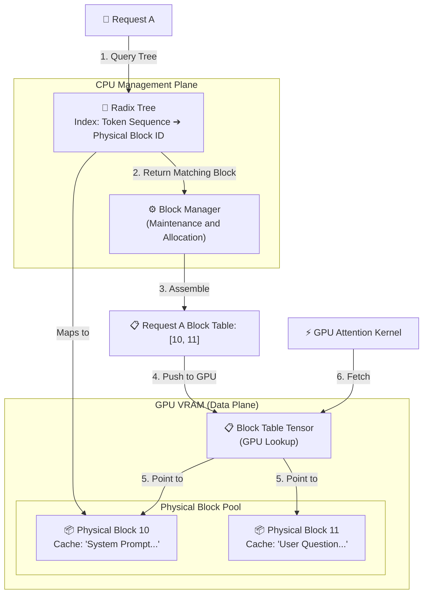

# Part 3: Single Node — High-Performance Engines Squeezing Every Inch of VRAM

## Table of Contents
- [Chapter 9: Model Architecture VRAM Slimming: GQA](#chapter-9-model-architecture-vram-slimming-gqa)
  - [Section 1: Evolution from MHA to GQA](#section-1-evolution-from-mha-to-gqa)
  - [Section 2: Deep Dive — Why Scaling Down Only K and V Works](#section-2-deep-dive--why-scaling-down-only-k-and-v-works)
  - [Section 3: Other Frontier Advances in KV Cache Compression](#section-3-other-frontier-advances-in-kv-cache-compression)
- [Chapter 10: Precision Scaling: KV Cache Quantization (FP8/INT8)](#chapter-10-precision-scaling-kv-cache-quantization-fp8int8)
  - [Section 1: A Wise Trade of Compute for Bandwidth](#section-1-a-wise-trade-of-compute-for-bandwidth)
  - [Section 2: Why This Is Economical](#section-2-why-this-is-economical)
  - [Section 3: INT8 vs. FP8: Two Distinct Quantization Paradigms](#section-3-int8-vs-fp8-two-distinct-quantization-paradigms)
  - [Section 4: Dynamic vs. Static: Comparison with Model Weight Quantization](#section-4-dynamic-vs-static-comparison-with-model-weight-quantization)
- [Chapter 11: Engine-Level VRAM Management: PagedAttention](#chapter-11-engine-level-vram-management-pagedattention)
  - [Section 1: The Fragmentation Crisis: Waste from Static Allocation](#section-1-the-fragmentation-crisis-waste-from-static-allocation)
  - [Section 2: OS Inspiration: Virtual Memory Paging](#section-2-os-inspiration-virtual-memory-paging)
  - [Section 3: Block Tables: Achieving Near-Zero Memory Waste](#section-3-block-tables-achieving-near-zero-memory-waste)
- [Chapter 12: Memory Time Machine: Prefix Caching (RadixAttention)](#chapter-12-memory-time-machine-prefix-caching-radixattention)
  - [Section 1: Dilemmas in RAG and Multi-Round Dialogues](#section-1-dilemmas-in-rag-and-multi-round-dialogues)
  - [Section 2: Radix Trees: Shared Physical Memory](#section-2-radix-trees-shared-physical-memory)
- [Chapter 13: The Never-Stopping Train: Continuous Batching and Chunked Prefill](#chapter-13-the-never-stopping-train-continuous-batching-and-chunked-prefill)
  - [Section 1: Continuous Batching: The Revolving Door Mechanism](#section-1-continuous-batching-the-revolving-door-mechanism)
  - [Section 2: Chunked Prefill: Perfect Complementarity](#section-2-chunked-prefill-perfect-complementarity)
- [Chapter 14: When VRAM Is Maxed Out: Preemption and Scheduling](#chapter-14-when-vram-is-maxed-out-preemption-and-scheduling)
  - [Section 1: The Scheduler's Dilemma](#section-1-the-schedulers-dilemma)
  - [Section 2: Evicting Inactive Caches and Tiered Offloading](#section-2-evicting-inactive-caches-and-tiered-offloading)
  - [Section 3: Preempting Active Requests: Swap vs. Recompute](#section-3-preempting-active-requests-swap-vs-recompute)
  - [Section 4: SGLang's Tree-Based Management: Unifying Preemption and Eviction](#section-4-sglangs-tree-based-management-unifying-preemption-and-eviction)
- [Chapter 15: Trading Spare Compute for Minimum Latency: Speculative Decoding](#chapter-15-trading-spare-compute-for-minimum-latency-speculative-decoding)
  - [Section 1: The Professor and the Assistant — Core Logic](#section-1-the-professor-and-the-assistant--core-logic)
  - [Section 2: The "Reverse Deal" of Compute Intensity](#section-2-the-reverse-deal-of-compute-intensity)
  - [Section 3: Evolution from Dual Models to External Heads](#section-3-evolution-from-dual-models-to-external-heads)
  - [Section 4: Tree Attention and Trade-offs in Production](#section-4-tree-attention-and-trade-offs-in-production)

In Part 2, we analyzed the physical and mathematical bottlenecks of LLM inference: the **VRAM tsunami triggered by KV Cache**, and the **core asymmetry between Prefill and Decode**. These bottlenecks directly stifle the concurrency capabilities and response speeds of large models in production environments.

To break this deadlock, system engineers and algorithms scientists have launched soft-hardware cooperative rescues. This part delves into how modern inference engines (e.g., vLLM and SGLang) and the model architectures themselves resolve these bottlenecks. We unfold the analysis across two core battlefronts:
1. **Shattering the VRAM Wall**: Escalating memory utilization multiple times via GQA (model architecture), PagedAttention (paging management), and RadixAttention (prefix caching).
2. **Conquering the Asymmetry**: Eliminating Padding waste via Continuous Batching and Chunked Prefill, ensuring that GPU compute and bandwidth remain perpetually saturated.

> [!IMPORTANT]
> While Continuous Batching and Chunked Prefill greatly elevate single-node efficiencies, they remain "tactical-level" local optimizations. They do not fundamentally resolve hardware mismatches or resource contention between Prefill and Decode. In Part 4, we will unveil a more thorough "strategic-level" evolution—**Disaggregated Serving**.

Now, let us enter the first battleground—slimming down VRAM from the model architecture perspective.

---

## Chapter 9: Model Architecture VRAM Slimming: GQA

### Section 1: Evolution from MHA to GQA

In the early designs of Transformers, **MHA (Multi-Head Attention)** was standard.
*   **MHA**: If there are $H$ Query heads, there must be $H$ corresponding Key heads and $H$ corresponding Value heads. As we discussed in [Chapter 6 Section 3](part2_bottlenecks.md#chapter-6-kv-cache-solving-the-compute-bottleneck), KV Cache space complexity is $O(L \cdot N \cdot d)$. While the hidden dimension $d$ shards into $H$ heads ($d = H \times d_k$), the total KV Cache size remains governed by the full dimension $d$. In ultra-large parameters models, $d$ is set immensely large (e.g., $d = 16384$ for Llama 3 405B). Spanning long context lengths $N$ scales up KV Cache footprints exponentially.

To compress KV Caches, researchers introduced **MQA (Multi-Query Attention)**:
*   **MQA**: All Query heads **share a single set** of Key and Value heads. KV Cache footprints drop down to merely $1/H$ of their original size. VRAM pressure plummets, but at the expense of partial model expressivity loss.

**GQA (Grouped Query Attention)** is the perfect compromise, widely adopted by open-source and proprietary large models alike (e.g., Llama 3 405B):
*   **GQA**: Query heads group together (e.g., groups of 8), and each group shares a single set of Key and Value heads.
*   **Benefits**: Slashes KV Cache VRAM occupancy, **improves system Throughput (accommodates higher concurrency)**, and since data movement in the Decode phase drops, **indirectly elevates individual request TPS**, with virtually no loss in expressivity.

**Practical Comparison: Calculating Llama 3 405B KV Cache**

To provide a clear view of these memory-slimming mechanisms, we examine the **Llama 3 405B** parameters ($L=126$, $d=16384$, $H=128$, $d_k=128$, FP16 format). We compute KV Cache footprints against a **1M token** context length:
*   **Standard MHA Mode** (Assumes every Query head holds a dedicated KV head):
    *   Size per Token per Layer: $2 \times 128 \times 128 \times 2 \text{ Bytes} = 64 \text{ KB}$
    *   Total Size: $64 \text{ KB} \times 126 \text{ Layers} \times 1,000,000 \approx \mathbf{8.06 \text{ TB}}$
*   **MQA Mode** (All Query heads share 1 set of KV heads):
    *   Size per Token per Layer: $2 \times 1 \times 128 \times 2 \text{ Bytes} = 0.5 \text{ KB}$
    *   Total Size: $0.5 \text{ KB} \times 126 \text{ Layers} \times 1,000,000 \approx \mathbf{63 \text{ GB}}$
*   **GQA Mode** (Llama 3 adopted scheme, 8 groups of KV heads):
    *   Size per Token per Layer: $2 \times 8 \times 128 \times 2 \text{ Bytes} = 4 \text{ KB}$
    *   Total Size: $4 \text{ KB} \times 126 \text{ Layers} \times 1,000,000 \approx \mathbf{504 \text{ GB}}$

Compressing from $8 \text{ TB}$ to $504 \text{ GB}$ gives a 16x memory compression, immediately making it feasible for single cards or small clusters to handle ultra-long contexts.

---

### Section 2: Deep Dive — Why Scaling Down Only K and V Works

This provokes a profound question: **Why can we scale down $K$ and $V$ without touching $Q$, and yet expressivity remains virtually uncompromised?**

To understand this, we dissect three layers: **role asymmetry of $Q$, $K$, and $V$**, **information redundancy**, and **how large models store knowledge**.

**1. Role Asymmetry: The Inquirer ($Q$) and the Indexed ($K, V$)**
$Q$, $K$, and $V$ serve entirely different roles in Attention mechanisms:
*   **Query ($Q$)**: Represents **"intent" or "question"** (What am I seeking now?). It is dynamic; as models generate each new token, intents fluctuate.
*   **Key ($K$)**: Represents **"indices" or "tags"** (What do I hold here?).
*   **Value ($V$)**: Represents **"content" or "substance"** (What is the real information I hold?).

**The underlying physical meaning is that a single objective fact ($K$ and $V$) can answer multiple different questions ($Q$).**

> [!NOTE]
> **Analogy: Researchers in a Library**
> Imagine 128 researchers (representing 128 $Q$ heads) in a library. Everyone studies a distinct topic and poses separate questions.
> *   **In standard MHA**: The system is extravagant. To serve the 128 researchers, the library not only employs all 128 researchers but also purchases an exclusive set of encyclopedias for each one (128 $K$ and $V$ heads). Even though these books cover identical historical facts with vast overlap, they are printed in 128 slightly different editions. Each researcher only references their personal desk copy, wasting immense space.
> *   **In GQA**: The system optimizes. 128 researchers remain, but the library buys only 8 sets of encyclopedias (8 $K$ and $V$ heads). Every 16 researchers share a single set of books.
> 
> Though researchers ask myriad questions ($Q$), the **historical background and objective facts ($K$ and $V$) they reference are identical**. A single set of books suffices. Therefore, $Q$ heads cannot be cut (securing thinking diversity), but $K$ and $V$ heads can (sharing knowledge bases).

**2. Information Redundancy in MHA**
Visual analyses show that in standard MHA, **multiple Key and Value heads acquire heavily duplicated features**. Some heads track "who the subject of the sentence is," while others track "who pronouns point to." GQA implements **hard deduplication**: Since your heads analyze similar data, share a single set of Key and Value heads. This deduplication forces parameters to train more efficiently, sharding down VRAM occupancy.

**3. Core "Knowledge" Resides in FFNs**
The ultimate foundation is that **the absolute majority of an LLM’s knowledge resides in FFNs (Feed-Forward Networks), not in Attention modules**.
*   **FFN**: Acts as a giant "knowledge hard drive," storing massive rules and facts. Accounts for ~82% of parameter counts in typical layers.
*   **Attention**: Functions as a "scheduler" and "router," moving information and establishing correlations across contexts.
*   Compressing KV Caches does not destroy the knowledge repository stored inside FFNs. The model still knows that "the capital of France is Paris"; it simply leverages fewer memory pointers (KVs) to pinpoint the fact during inference.

---

### Section 3: Other Frontier Advances in KV Cache Compression

Apart from GQA, academia and industry continue exploring exciting frontiers to battle "memory tsunamis":

1.  **MLA (Multi-head Latent Attention)**:
    *   **Mechanism**: Developed by the DeepSeek team for DeepSeek-V2. MLA utilizes Low-Rank Joint Compression, projecting Keys and Values into a low-dimensional Latent Space. During inference, engines only cache this tiny latent vector, achieving compression ratios that surpass GQA multiple times.
    *   **Reference**: [DeepSeek-V2 Paper](https://arxiv.org/abs/2405.04434)
2.  **Sliding Window Attention**:
    *   **Mechanism**: The model no longer inspects the entire sequence from beginning to end. It maintains a fixed-size sliding window (e.g., 4096 tokens). Expired KV Caches are discarded, reducing KV Cache space complexity from $O(N)$ to $O(1)$.
    *   **Reference**: [Mistral 7B Paper](https://arxiv.org/abs/2310.06825)
3.  **Interleaved Local/Global Attention**:
    *   **Mechanism**: Combines sliding windows with global attentions. Some layers deploy sliding windows to save VRAM, while others retain global attention to capture long-distance dependencies (e.g., Gemma 2).
    *   **Reference**: Refer to respective model technical reports.
4.  **Infini-Attention**:
    *   **Mechanism**: Proposed by Google. It incorporates "compressive memory" into standard dot-product attention, securing bounded memory footprints. By blending local masked attention with long-term linear attention, it supports theoretically infinite contexts without KV Cache explosions.
    *   **Reference**: [Leave No Context Behind Paper](https://arxiv.org/abs/2404.07143)

These advances reveal a clear trajectory: **Architectural optimizations to further trim K and V sizes remain a core front of LLM optimization.**

GQA and latent compressions represent **structural model improvements** requiring specialized training. Outside model architecture, we can also compress KV Caches from a **data precision** perspective without changing underlying architectures.

---

## Chapter 10: Precision Scaling: KV Cache Quantization (FP8/INT8)

While GQA operates on **spatial structures**, KV Cache Quantization hits the **data density**.

---

### Section 1: A Wise Trade of Compute for Bandwidth

In standard inference, K and V vectors are stored at 16-bit precision (FP16 or BF16), taking 2 bytes per element. **KV Cache Quantization** compresses them down to 8-bit (FP8 or INT8), demanding only 1 byte per element and slicing VRAM footprints by exactly half.

This introduces minor compute overheads:
1.  **Writing to Memory**: As Decode generates new tokens, K and V vectors undergo Scaling and Rounding from 16-bit down to 8-bit before persisting to VRAM.
2.  **Reading from Memory**: During Attention compute, GPUs fetch 8-bit vectors and "de-quantize" them back to 16-bit (or calculate low-precision arithmetic natively).

This trades additional compute for VRAM compression—a highly economical trade-off in the Decode phase.

---

### Section 2: Why This Is Economical

As we examined in Chapter 8, the Decode phase is strictly **Memory-Bound**. GPU compute cores spend the vast majority of their time sitting idle, waiting for data transfers from memory.
*   **Unquantized**: Voluminous data transfers cause slow movements, leaving GPUs starved.
*   **Quantized**: While adding quantization translations, **transferred data volumes are halved**. VRAM bandwidth pressure drops by 50%, feeding GPU cores data much faster.

On modern GPUs like NVIDIA H100, low-precision tensor computations are natively supported, rendering quantization overheads virtually negligible. Trading spare compute for halved VRAM footprint and doubled data transfer speed has become an industry standard. Compressing KV Cache to 8-bit (FP8/INT8) yields less than 0.5% expressivity loss while doubling concurrent user capacities.

---

### Section 3: INT8 vs. FP8: Two Distinct Quantization Paradigms

KV Cache 8-bit quantization follows two separate technical routes:
*   **INT8 (8-Bit Integer)**: A float-to-integer mapping. Continuous float points map into 256 discrete integer bins via Scaling and Rounding. It is mathematically lossy, but fine-grained quantization coefficients (e.g., per Token or per Channel) reduce precision losses to a minimum.
*   **FP8 (8-Bit Floating Point)**: Preserves sign bits, exponent bits, and mantissa bits. Compared to FP16, it is merely "shorter," reducing range and precision. On hardware supporting FP8 Tensor Cores (e.g., H100), FP8 computations require no explicit de-quantization and are becoming the server-side standard.

---

### Section 4: Dynamic vs. Static: Comparison with Model Weight Quantization

Model weights themselves also utilize quantization (e.g., GPTQ, AWQ). The effects and complexities between weight and KV Cache quantization remain distinct:
*   **Model Weight Quantization (Static)**: Model parameters are fixed after training. Engineers hold ample time to analyze distributions off-line and calibrate datasets. As a result, even sharding weights down to 4-bit preserves model intelligence.
*   **KV Cache Quantization (Dynamic)**: Generated dynamically based on user inputs. Outliers cannot be predicted. Sharding down to 4-bit collapses dynamic ranges, crushing output quality. Consequently, KV Caches rarely drop below 8-bit.

Production environments combine both:
*   **W4A16 (Weight-Only Quantization)**: Resolves "VRAM Capacity," allowing massive models to load onto smaller cards.
*   **W8A8 / FP8 (Full Quantization)**: Focuses on "Inference Speed," serving as the standard choice for high-concurrency cloud providers.

---

Even with GQA and quantization, context expansions eventually trigger severe memory fragmentation. We resolve this using **PagedAttention**.

---

## Chapter 11: Engine-Level VRAM Management: PagedAttention

---

### Section 1: The Fragmentation Crisis: Waste from Static Allocation

Static allocation strategies traditionally provision VRAM statically since engines cannot predict final sequence lengths. Systems must pre-allocate a contiguous memory block according to a model’s maximum context limit (e.g., 8000 tokens).

This causes immense waste:
*   **Internal Fragmentation and Reserved Waste**: Pre-allocating contiguous VRAM gives requests exclusive occupancy. Whether the resulting text is short or long, **unused spaces reserved for future tokens** cannot be shared with other requests until current sessions are released.
*   **External Fragmentation**: Total free VRAM might be sufficient, but if physically non-contiguous, engines cannot allocate it to new requests demanding large contiguous blocks.

Paper analysis from vLLM shows that under static allocation, genuine KV Caches take up less than 20% of memory—leaving 80% to be wasted as idle reserve.

---

### Section 2: OS Inspiration: Virtual Memory Paging

Facing this memory chasm, UC Berkeley researchers (the authors of vLLM) looked back to computer science solutions from decades ago.

Operating systems resolve physical RAM fragmentation using **Virtual Memory Paging**. Programs perceive memory as contiguous, but the OS fragments data into fixed-size Pages scattered across physical hardware.

vLLM migrates this **paging mechanism onto GPU VRAM management**:
1.  **Block Management**: Systems segment physical VRAM into fixed physical Blocks instead of provisioning monolithic contiguous spaces. For example, 1 block holds the K and V matrices for exactly 16 Tokens.
2.  **Non-Contiguous Physical Allocation**: Logically, a token sequence is continuous. Physically, token blocks scatter non-contiguously across the VRAM array.

---

### Section 3: Block Tables: Achieving Near-Zero Memory Waste

Since physical block locations scatter, how does the model locate historical words during attention compute?

PagedAttention introduces **Block Tables**—mapping logical blocks to physical blocks in a manner identical to an OS Page Table. During $Q \cdot K^T$ compute, the attention mechanism queries block tables, dynamically loading K and V vectors from discrete physical blocks.

**Understanding Mapping Mechanisms**:
To visualize how the `BlockTable` tracks `Request -> Token Block -> Memory Block`, consider its tensor dimensions:
`block_table` functions as a 2D tensor shaped `[max_num_reqs, max_num_blocks_per_req]`:
*   **Dimension 1 (Row)**: Corresponds to distinct **Requests**, indexed by `req_idx`.
*   **Dimension 2 (Column)**: Corresponds to a request’s **Token Block** (logical block), indexed by `logical_block_idx`.
*   **Stored Value**: The corresponding **Memory Block** (Physical VRAM Block ID).
*   Lookup Formula: `physical_block_id = block_table[req_idx][logical_block_idx]`.

**The Magic of PagedAttention**:
**Near-Zero Waste**: Allocations are made on-demand. Systems fill a 16-seat block before opening another. VRAM wastage is capped within the very last, partially filled Block (wasting at most 15 tokens). Overall fragmentation waste plunges from 80% down to under 4%.

However, PagedAttention primarily resolves **fragmentation and intra-request waste**. By default, **KV Caches across different requests remain segregated**. If identical prefixes enter the engine at separate times, PagedAttention cannot automatically identify and reuse previously computed physical blocks.

Cross-request dynamic caching brings us to the next chapter.

---

## Chapter 12: Memory Time Machine: Prefix Caching (RadixAttention)

Chapter 8 discussed multi-user shared system prompts. Real applications (e.g., multi-round dialogues and RAG) are far more complex. We achieve advanced caching reuse—**Prefix Caching**—via **Radix Trees**.

---

### Section 1: Dilemmas in RAG and Multi-Round Dialogues

Modern LLM applications feature large volumes of background text.

**Scenario 1: Multi-Round Dialogue**
*   Round 1: You ask "What is an apple?" (Model computes and generates).
*   Round 2: You ask "Does it taste good?". The prompt sent to the model is: [Round 1 Question + Round 1 AI Answer + Round 2 Question].

Note a fundamental engineering detail: **HTTP is stateless**.
From an engine perspective (e.g., vLLM), Round 2 acts as an **independent, entirely new Request** assigned a **brand-new Request ID**.

In traditional PagedAttention, Block Tables are bound to Request IDs. Even if prompts overlap, differing Request IDs force engines to re-compute the entire sequence from scratch! Long conversations trigger linear escalations in TTFT. This cross-request isolation dictates the necessity for **Prefix Caching**.

**Scenario 2: RAG (Knowledge Base Q&A)**
You upload a 100,000-word manual and ask consecutive questions. Every question embeds the manual as background text. Without optimization, re-computing the manual every time inflates **TTFT** past user tolerance thresholds.

**Scenario 3: Fixed System Prompts and Few-Shot Examples**
Enterprise deployments embed long, static System Prompts. Without optimizations, 1,000 concurrent requests generate 1,000 duplicated KV Caches, wasting massive compute and memory.

**Scenario 4: Parallel Sampling and Beam Searches**
When models generate multiple candidates or deploy Beam Searches, engines branch from identical prompts. Without optimizations, systems duplicate KV Cache calculations for each branch.

---

### Section 2: Radix Trees: Shared Physical Memory

To resolve this, frameworks like SGLang and vLLM introduced **RadixAttention**, managing KV Caches using **Radix Tree** structures.

Due to positional encodings and attention traits, as long as preceding token sequences are identical, the generated KV Caches remain identical.

Radix Trees operate as follows:
*   **Root**: The null sequence.
*   **Edge**: Represents contiguous Token sequences (e.g., a 16-token Block).
*   **Node**: Points to the physical blocks for these tokens.

When a new request arrives, the system starts from the root, executing **longest prefix matching** against the tree’s edges. Matching blocks are reused, bypassing matrix multiplications. The mismatching remainder allocates new physical blocks, branching into new leaves on the tree.

Radix Caches cut first-token pop latencies from seconds down to milliseconds.

> [!NOTE]
> **Indexing and Implementation Differences**
> 1.  **Integer Comparisons**: Radix Trees match **Token IDs** (integers) rather than text. Matching entails efficient integer sequence comparisons or Hash computations.
> 2.  **vLLM vs. SGLang**: **SGLang** implements **Token-level** RadixAttention, allowing edges to hold arbitrary token lengths. **vLLM**’s Automatic Prefix Caching inherits PagedAttention genetics, managing fixed **Block-level** sequences (e.g., 16 tokens).
> 3.  **Co-existence with Block Tables**: Radix trees do not replace Block Tables; both point to identical physical blocks across different dimensions:
>     *   **Block Table**: Serves as the `Request -> logical block -> physical block` mapping maintained by CPU schedulers, flat-mapped onto GPUs during inference.
>     *   **Radix Tree**: A global, CPU-based index for `prefix -> physical block`. Handles cross-request sharing and LRU evictions.
>     *   **Workflow**: CPU Block Managers query Radix trees for reusable blocks, bundle them with newly allocated blocks, and feed the assembled Block Table to the GPU.

**Visualizing the Workflow:**

---

## Chapter 13: The Never-Stopping Train: Continuous Batching and Chunked Prefill

Chapter 7 analyzed Static Batching limits: padding waste resulting from force-aligning short sentences to long ones. We explore **Continuous Batching** and **Chunked Prefill**.

---

### Section 1: Continuous Batching: The Revolving Door Mechanism

To crush the static batching "weakest link" effect, Orca introduced **Continuous Batching** (In-flight Batching), popularized by vLLM.

**Analogy: The Perpetual Bullet Train**
Imagine an ongoing bullet train. At each station (forward propagation step lasting milliseconds), people dynamic enter and leave.
*   **Dynamic entry/exit**: Schedulers don't wait for batches to complete. Between token generation intervals, schedulers monitor for End-of-Sequence (EOS) tags. Finished requests exit the batch, and queued requests board immediately.
*   **Destroying Padding**: Engines flatten input tokens into 1D continuous streams for GPUs. Boundaries are isolated using offset indices (`cu_seqlens`), **eliminating Padding entirely**.

**Matrix vs. Vector:**

**1. Static Batching — Flat Matrices**

| | Col 1 | Col 2 | Col 3 | Col 4 |
| :--- | :--- | :--- | :--- | :--- |
| **Row 1 (🔵)** | 🔵 T1 | 🔵 T2 | 🔵 T3 | ❌ PAD |
| **Row 2 (🟢)** | 🟢 T1 | 🟢 T2 | ❌ PAD | ❌ PAD |
| **Row 3 (🟡)** | 🟡 T1 | 🟡 T2 | 🟡 T3 | 🟡 T4 |

**2. Continuous Batching — 1D Vectors**

| | Col 1 | Col 2 | Col 3 | Col 4 | Col 5 | Col 6 | Col 7 | Col 8 | Col 9 |
| :--- | :--- | :--- | :--- | :--- | :--- | :--- | :--- | :--- | :--- |
| **Row 1** | 🔵 T1 | 🔵 T2 | 🔵 T3 | 🟢 T1 | 🟢 T2 | 🟡 T1 | 🟡 T2 | 🟡 T3 | 🟡 T4 |

> [!NOTE]
> `cu_seqlens = [0, 3, 5, 9]` (Isolates requests physically via offsets).

Continuous batching multiplies **Throughput** and stabilizes **TBT**, ensuring short-form prompts are not blocked by long-text workloads.

#### The Inner Engine: 3 Core Data Structures
To manage 1D continuous streams without dynamic lookups, engines track three structures:
1.  **`cu_seqlens` (Cumulative Sequence Length Array)**: Isolates token boundaries for distinct requests in the stream, ensuring Attention Kernels do not "cross-read" neighbor data.
2.  **`Block Table`**: Tracks historical KV access, mapped as a 2D array. GPUs lookup `BlockTable[request_index]` to instantly read physical block IDs.
3.  **`slot_mapping`**: Manages precise physical memory writes. It directs GPUs on where to write new K and V vectors directly using tensor indexing.

---

### Section 2: Chunked Prefill: Perfect Complementarity

Continuous Batching optimizes Decode, but Prefill (prompt processing) faces **Head-of-Line (HOL) Blocking**.

If a 1,000-token prompt arrives, processing it in a single step stalls all older, ongoing Decode requests.

**The Solution: Chunked Prefill**
*   Systems set an iteration token budget (e.g., 256).
*   A 1,000-token prompt shards into `[256, 256, 256, 232]`, processed sequentially across multiple iterations.

**Perfect Symbiosis**
Systems batch **1 chunked prefill block** alongside **ongoing decode requests**:
*   **Decode requests** fetch few tokens, occupying memory bandwidth but idling Tensor Cores.
*   **Prefill blocks** contain hundreds of tokens, saturating the idle compute capacity.

Co-batching ensures both bandwidth and compute reach peak utilization.

---

## Chapter 14: When VRAM Is Maxed Out: Preemption and Scheduling

Under high concurrency or ultra-long contexts, physical HBM will saturate. How do CPU schedulers triage requests?

---

### Section 1: The Scheduler's Dilemma

When 100% of HBM is utilized and new blocks cannot allocate, the system faces two memory types:
1.  **Inactive Data**: Prefix caches retained on Radix trees (reference counts equal 0).
2.  **Active Data**: In-flight requests requesting new blocks for subsequent tokens.
Left unmanaged, VRAM triggers OOM crashes.

---

### Section 2: Evicting Inactive Caches and Tiered Offloading

Systems first attempt to evict unused cache data using **LRU (Least Recently Used)** policies. Active nodes with reference counts $> 0$ are shielded.

**Tiered Offloading**
Rather than discarding calculated data, modern engines deploy **Tiered KV Cache Offloading**:
*   **Hot Tier (GPU HBM)**: Extreme bandwidth and lowest latency, housing active caches.
*   **Warm Tier (CPU RAM)**: Slower PCIe connection but inexpensive capacities. Least recently used blocks are **offloaded** here.
*   **Cold Tier (NVMe SSD)**: Infinite capacity but slow access. Used for ultra-long contexts and conversational histories.

---

### Section 3: Preempting Active Requests: Swap vs. Recompute

If evicting inactive caches yields insufficient memory, schedulers **preempt** active requests, pausing them to free VRAM.

**Preemption Triage**
Modern engines use **Reverse FCFS (First Come First Served)** policies to pick victims:
1.  **Minimize Wasted Work**: Old requests hold heavy prefill compute investments. Preempting new requests minimizes compute waste.
2.  **Prevent Starvation**: Long-context requests would never finish if repeatedly preempted.
3.  **Priority Levels**: Requests with lower priorities are preempted first.

**Dealing with Victim Caches:**
*   **Swapping**: Shunts victim KV Caches via PCIe to **CPU RAM**. Saves GPU compute but threatens to choke PCIe bandwidth under high concurrency.
*   **Recomputation**: Wipes the victim's KV Cache from VRAM. Upon resumption, engines re-run its prompt prefill. On top-tier GPUs (e.g., H100), recomputing prompt matrices is frequently faster than swapping gigabytes over PCIe.

---

### Section 4: SGLang's Tree-Based Management: Unifying Preemption and Eviction

SGLang unifies cache sharing, eviction, and active preemption within the Radix Tree:
1.  **Preemption via De-referencing**: Preempting a request merely sets its Radix Tree reference count to zero without media transfers or instant deletions.
2.  **Best-Effort Retention**: Null-referenced nodes linger. If VRAM pressure alleviates before LRU eviction strikes, requests resume instantly at zero cost.
3.  **Ultimate Simplicity**: If memory saturates, LRU sweeps the oldest nodes. When evicted requests resume, they default to Recompute.

> [!NOTE]
> **Evolution to Tiered Offloading**
> Modern SGLang has incorporated **HiCache**, allowing inactive Radix Tree nodes to offload to CPU RAM or SSD, combining tree management with memory hierarchies.

---

## Chapter 15: Trading Spare Compute for Minimum Latency: Speculative Decoding

PagedAttention solves fragmentation, and Continuous Batching crushes padding waste. However, the Decode phase remains **Memory-Bound**. To generate a single token, GPUs must drag hundreds of gigabytes of weights to their cores, leaving Tensor Cores starved. System engineers introduced **Speculative Decoding**.

---

### Section 1: The Professor and the Assistant — Core Logic

Speculative Decoding acts like a **"Professor and an Assistant"**:
*   **Target Model**: The Professor. Profound knowledge but slow writer. Evaluates drafts instantaneously.
*   **Draft Model**: The Assistant (small model or external head). Drafts text rapidly but prone to minor errors.

**Operational Workflow:**
1.  **Drafting**: The Assistant quickly generates $K$ draft tokens (e.g., 5 tokens).
2.  **Verification**: The Target Model ingests all 5 tokens simultaneously. It calculates parallel attention (like Prefill) across all 5 positions concurrently.
3.  **Triage**: If the Professor accepts the first 3 tokens but rejects the 4th, the 4th is corrected, and the 5th is purged (KV Cache rollback). The single forward pass yielded 4 high-quality tokens.

---

### Section 2: The "Reverse Deal" of Compute Intensity

While total **FLOPs** grow (drafting plus target verification), it remains an advantageous trade. In Decode phases, GPU arithmetic intensity is below the hardware inflection threshold. Verifying 5 tokens reads the exact same weight footprints (hundreds of GBs) as generating 1 token. Processing 5 workloads within a single memory fetch increases compute intensity, utilizing idle cores to slash latencies.

---

### Section 3: Evolution from Dual Models to External Heads

**1. Dual-Model Schema**
The archetype loaded two independent models in VRAM: a heavy Target (e.g., Llama 3 70B) and a lightweight Draft (e.g., Llama 3 8B). Managing two KV Caches proved heavy, and drafting accuracy drifted.

**2. Medusa: Parallel Guessing Heads**
Eliminates the Draft Model. It stacks lightweight non-autoregressive heads onto the Target Model's final hidden states. Head 1 guesses $t+1$, Head 2 guesses $t+2$, and Head 3 guesses $t+3$. Accuracy plummets across sequential steps.

**3. Eagle: Feature-Level Autoregression**
Introduces a lightweight, single-layer Transformer at the hidden state level. It blends $h_t$ with predicted tokens to autoregressively project $h'_{t+1}$. Preserves accuracy without heavy network overheads.

> [!NOTE]
> **Core Insights**
> 1.  **Plugin Customization**: Heads are trained for specific domains (e.g., legal text) where vocabulary distributions are predictable.
> 2.  **Structural Decoupling**: Base models focus on intellect, while inference frameworks customize speculative plugins.
> 3.  **Inference Framework Supremacy**: All schedulers, communication, and tree KV Cache rollbacks reside in the inference engines (e.g., vLLM).

---

### Section 4: Tree Attention and Trade-offs in Production

**1. Tree Attention**
Medusa and Eagle spread wide nets, branching out Top-K candidates and forming a **"Draft Tree"**. Targets evaluate the tree concurrently. KV Caches expand into tree topologies, correct pathways are identified, and unsuccessful branches are pruned.

**2. Dynamic Trade-offs in Production**
*   **Low Concurrency**: Activate Speculative Decoding. Excess compute cores are traded for rapid TBTs.
*   **High Concurrency**: Deactivate Speculative Decoding. Cores are saturated with incoming batches; speculating wastes bandwidth.

---

Part 3 explored tactical single-node optimizations: GQA, PagedAttention, Continuous Batching, and Speculative Decoding. When parameters reach trillions or contexts hit millions, physical single-node limits shatter. In **Part 4**, we zoom out onto cluster orchestration and distributed execution.

---
