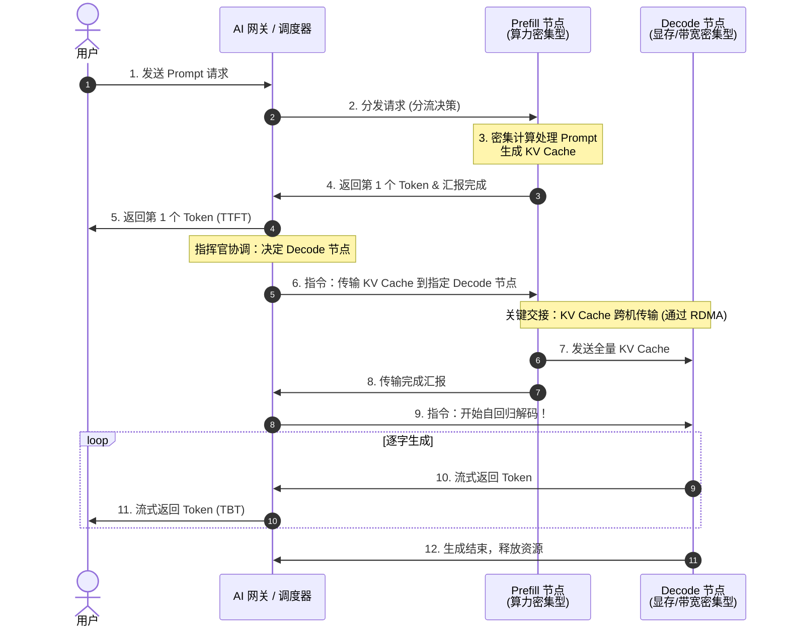

## 第四部分：集群篇 —— 分布式推理与未来趋势

最后一部分将视角放大到集群级架构，以及顶级科技公司如何服务数十亿次请求。

### 第十六章：切分巨人：张量、流水线与上下文并行

当模型的参数量从 7B（70亿）飙升到 400B（4000亿）甚至更大时，单张显卡乃至单台服务器的物理限制就会被彻底击碎。我们必须将这个“巨人”切碎，分发到多台机器上协同推理。本章将介绍分布式推理的核心技术。

#### 第一节：多机必要性：装不下的巨人

为什么我们必须进行分布式推理？最直接的原因就是**显存装不下**。

以一个 400B 参数的模型为例：
*   如果使用半精度（FP16）存储，仅仅是模型权重本身就需要占用 **800 GB** 的显存！
*   以经典的 **NVIDIA H100** 为例，其单卡显存通常为 80 GB。这意味着，你至少需要 10 张 H100 显卡，才能勉强把这个模型“装”进去（这还没有预留任何空间给 KV Cache）。

虽然随着硬件的飞速演进，目前 Blackwell 架构（如 B200，单卡显存达 192 GB）已经走向台前，未来还会有更强的 Rubin 架构，所需的卡数会相应减少。但“单卡装不下超大模型权重与海量 KV Cache”的物理极限依然存在。因此，多机多卡分布式推理不是一种选择，而是绝对的刚需。

---

#### 第二节：TP 与 PP：垂直切分与水平切分

为了让多张显卡协同工作，业界主要有两种经典的切分策略：

**1. 张量并行（Tensor Parallelism, TP）—— 垂直切分**
*   **做法**：把模型中的某一个巨大的矩阵乘法（张量）“竖着切一刀”或“横着切一刀”，分给不同的 GPU 去算。比如，GPU 1 算左半部分，GPU 2 算右半部分，最后通过高速互联（如 NVLink）进行结果汇总（AllReduce）。
*   **特点**：它发生在**每一层网络内部**。通信极其频繁，对带宽要求极高，因此通常被限制在**单机内部**的多张卡之间进行。

**2. 流水线并行（Pipeline Parallelism, PP）—— 水平切分**
*   **做法**：把模型的层（Layers）拆开。假设模型有 80 层，机器 A 负责 1~40 层，机器 B 负责 41~80 层。机器 A 算完前 40 层的隐藏状态，通过网络发给机器 B 继续算。
*   **特点**：它发生在**层与层之间**。通信频率相对较低，非常适合跨越不同物理主机（Multi-host）进行分布式部署。

通过 TP 和 PP 的结合（比如 8 卡 TP + 2 机 PP），我们可以优雅地把超大模型切分在 16 张甚至更多显卡上。

---

#### 第三节：自动分发：计算与内存的分布式解耦

当我们将大模型切分到多张显卡或多台机器上时，**计算（Compute）**和**内存（Memory）**的占用都会随之发生天然的分布式解耦。

我们可以从计算和内存两个维度来审视这种分发：

**1. 计算的分布式分发**
*   **张量并行（TP）**：将**单层内的计算**打散。一个巨大的矩阵乘法被切分成几块，分给不同的 GPU 并行计算。这意味着每张卡只承担了一部分算力负荷。
*   **流水线并行（PP）**：将**层与层之间的计算**打散。机器 A 算前几层，机器 B 算后几层，计算在时间上呈现出流水线式的接力。

**2. 内存的分布式分发（显存的真正构成）**
在分布式环境下，显存的占用主要由以下几部分构成，它们都会被自然隔离和分摊：

1.  **模型权重（Model Weights）**：在 TP 下，每张卡只存储自己负责切分的那部分矩阵权重；在 PP 下，每台机器只存储自己负责的那几十层网络的权重。这彻底解决了“单机装不下”的终极难题。
2.  **KV Cache（注意力缓存）**：在 TP 下，由于注意力头被切分，每个 GPU 只负责存储自己那部分头对应的 K 和 V 向量；在 PP 下，KV Cache 是与层强绑定的，只有负责处理特定层的机器，才会持有该层的 KV Cache。
3.  **激活值（Activations）与临时缓冲区**：在模型前向传播过程中产生的中间特征图等临时数据，也会随着计算的切分而散落在各自的 GPU 上。TP 组内需要频繁同步这些激活值，而 PP 组则需要将阶段边界的激活值跨机传递。

这种“各管各的、自然隔离”的分布式架构，避免了构建中心化巨型内存池的复杂性，但也对芯片间的高速互联（NVLink/RDMA）提出了极高的要求，以确保这些被打散的碎片能完美地拼凑出最终的智能。

---

#### 第四节：TP 与 PP 对核心指标（Metrics）的影响

在理解了 TP 和 PP 的基本原理后，我们来系统分析它们对我们在第四章定义的核心性能指标（TTFT、TBT、Throughput）的影响。为了更精准地分析，我们必须严格区分以下几个时间概念：
*   **排队时间（Queueing Time）**：请求在调度队列中等待 GPU 资源的时间。
*   **执行 TTFT（Execution TTFT）**：模型真正开始处理请求到吐出第一个 Token 的纯计算时间。
*   **用户感知的 TTFT（User-facing TTFT）**：从用户按下发送键到屏幕上看到第一个字的总时间（大致等于 排队时间 + 执行 TTFT + 网络传输延迟）。

**1. 张量并行（TP）的指标影响：大力飞砖与车道扩容**
*   **对执行 TTFT 的影响**：**显著降低**。Prefill 阶段是计算密集型的，TP 通过分摊矩阵乘法计算，直接缩短了模型运行的纯计算时间。
*   **对 TBT / TPS 的影响**：**有所降低（提升 TPS）**。在 Decode 阶段，TP 仍能加速每步计算。但由于计算量小，跨卡 All-Reduce 的通信开销占比会上升，加速比并非线性。
*   **对排队时间与吞吐量的影响**：**双重优化但有 Trade-off**。
    1.  **缩短服务时间**：因为 TP 算得快，老请求快速下车，后请求的排队时间自然变短。
    2.  **扩张并发容量**：TP 聚合了多卡显存，允许开启更大的 Batch Size，原本排队的请求可以直接被拉入 Batch 共同处理，排队时间降为 0。
    *   *权衡*：如果模型本能装进单卡，强行 TP 引入的通信开销会损耗总算力，反而降低吞吐量。

**2. 流水线并行（PP）的指标影响：多段接力与吞吐为王**
*   **对执行 TTFT 的影响**：**略微增加**。请求需按顺序流经不同机器层，跨机通信和流水线启动带来了固定延迟开销。
*   **对 TBT / TPS 的影响**：**几乎没有改善**。它仅是层与层之间的物理拆分，并没有加速单个 Token 的前向计算。
*   **对排队时间与吞吐量的影响**：**显著提升**。
    *   **流水线效应减少排队**：当请求 A 在第一台机器完成第一阶段 Prefill 并流向下一台机器时，第一台机器立刻被释放，排队中的请求 B 可以马上开始它的 Prefill。这种空间复用使得新请求能更早地进入系统。
    *   **吞吐为王**：通过流水线机制（不同机器同时处理不同 Batch 的不同层），极大提升了 GPU 利用率，是做大集群吞吐的利器。高吞吐有助于消化队列，从宏观上降低平均排队时间。

---

#### 第五节：打破序列墙：上下文并行 (Context Parallelism)

随着大模型上下文窗口（Context Window）从早期的几千飙升到现在的百万级别（如 Gemini 1.5），传统的张量并行（TP）和流水线并行（PP）在处理超长序列时开始显得力不从心。这就催生了第三种切分维度——**上下文并行（Context Parallelism, CP）**。

**1. 它要解决什么问题？**
在极长上下文场景下，核心瓶颈不再仅仅是模型权重，而是**随序列长度线性增长的 KV Cache** 以及**呈二次方增长的注意力计算量**。
*   即使你用 TP 把模型权重切分到了 8 张卡上，单张卡依然可能塞不下长达数十万甚至上百万 Token 的 KV Cache。
*   传统的 TP 关注的是隐藏层维度（Hidden Dimension）的切分，而无法有效分摊超长序列维度（Sequence Length）带来的显存与计算压力。
*   因此，CP 的核心目标是**粉碎“序列墙”**，让系统能够处理远超单卡显存容量的超长文本。

**2. 它是怎么做的？**
上下文并行的核心思想是**沿序列维度（Sequence Dimension）进行切分**：
1.  **序列切块**：将长达数万甚至数百万的 Token 序列切成 $N$ 个小块，分发给 $N$ 个 GPU。每个 GPU 只负责处理和存储自己那一段序列的 KV Cache。
2.  **环形注意力（Ring Attention）**：由于自注意力机制要求每个 Token 都要与前面所有的 Token 做计算，序列被切断后，GPU 之间必须进行通信。典型的做法是采用 **Ring Attention** 机制：各个 GPU 形成一个环形拓扑，一边计算本地数据的 Attention，一边像传手绢一样在环中传递 KV Cache 的分块。这样可以在不将所有 KV Cache 集中到单卡的前提下，完成全局注意力的计算。

> [!NOTE]
> **深入探讨：Ring Attention 的动态协调与负载均衡**
>
> 环形注意力（Ring Attention）的实现并非简单的“数据切块”，它在工程上面临着通信协调和计算负载均衡的巨大挑战。
>
> **1. 通信与计算的“击鼓传花”式协调**
> 假设我们将序列切分为 3 块，由 3 台机器协同计算。机器 1 持有 $Q_1, K_1, V_1$；机器 2 持有 $Q_2, K_2, V_2$；机器 3 持有 $Q_3, K_3, V_3$。在 Causal Attention（自回归）模式下，协调过程如下：
> *   **步骤 1**：所有机器同时启动，计算本地 $Q$ 与本地 $KV$ 的注意力。同时，启动异步通信，像传手绢一样在环中传递 $KV$ 块：机器 1 发送 $KV_1$ 给机器 2，机器 2 发送 $KV_2$ 给机器 3，以此类推。
> *   **步骤 2**：机器收到上游传来的 $KV$ 块后，计算本地 $Q$ 与新 $KV$ 的注意力。例如机器 2 收到 $KV_1$，计算 $Q_2$ 与 $KV_1$ 的注意力。此时机器 1 收到 $KV_3$，但因为是因果注意力，它不能看未来的信息，所以这次计算是无效的（或被 Mask 掉）。
> *   **步骤 3**：继续传递 $KV$ 块。机器 3 最终收到 $KV_1$，计算 $Q_3$ 与 $KV_1$ 的注意力。
>
> 通过这种方式，每台机器最终都与它所需要的所有历史 $KV$ 块完成了计算。由于通信是异步的，注意力计算的延迟被有效地掩盖了。**为了保持数学上的等价性**，各台机器需要结合 Online Softmax（类似 FlashAttention 的技巧），在接收到新的 KV 块后动态更新局部 Softmax 的最大值和累加和。
>
> **环形注意力协调流程图：**
> ```mermaid
> sequenceDiagram
>     participant M1 as 机器 1 (持有 Q1, KV1)
>     participant M2 as 机器 2 (持有 Q2, KV2)
>     participant M3 as 机器 3 (持有 Q3, KV3)
> 
>     Note over M1, M3: 步骤 1: 计算本地并传递 KV
>     par 异步通信
>         M1->>M2: 发送 KV1
>     and
>         M2->>M3: 发送 KV2
>     and
>         M3->>M1: 发送 KV3
>     end
>     Note over M1: 计算 Q1 * KV1
>     Note over M2: 计算 Q2 * KV2
>     Note over M3: 计算 Q3 * KV3
> 
>     Note over M1, M3: 步骤 2: 计算收到的 KV 并继续传递
>     par 异步通信
>         M1->>M2: 转发 KV3
>     and
>         M2->>M3: 转发 KV1
>     and
>         M3->>M1: 转发 KV2
>     end
>     Note over M1: 计算 Q1 * KV3 (Causal 模式下无效)
>     Note over M2: 计算 Q2 * KV1
>     Note over M3: 计算 Q3 * KV2
> 
>     Note over M1, M3: 步骤 3: 最后一轮计算
>     Note over M1: 计算 Q1 * KV2 (Causal 模式下无效)
>     Note over M2: 计算 Q2 * KV3 (Causal 模式下无效)
>     Note over M3: 计算 Q3 * KV1
> ```
>
> **2. 负载不均衡难题与 Zig-zag 优化**
> 从上述过程可以看出，在 Causal Attention 中，有效的注意力计算呈下三角形状：
> *   机器 1 只需要算 1 份有效计算（$Q_1$ 与 $KV_1$）。
> *   机器 2 需要算 2 份有效计算（$Q_2$ 与 $KV_1, KV_2$）。
> *   机器 3 需要算 3 份有效计算（$Q_3$ 与 $KV_1, KV_2, KV_3$）。
>
> 这会导致严重的负载不均衡，机器 1 和机器 2 会提前闲置。为了解决这个问题，业界主要有两种方案：
> *   **方案 A：暴力填充（Padding/Masking）**：所有机器都进行满负荷计算，即使是无效的未来块也照常计算，最后用掩码强行滤除。这虽然保持了代码的简单和对称，但浪费了接近 50% 的算力。
> *   **方案 B：交错切分（Zig-zag Partitioning / Striping）**：不再按连续区间切分序列，而是采用“发牌”或“两头凑”的方式分配。假设有 6 个块，机器 1 拿块 1 和 6（工作量 $1+6=7$），机器 2 拿块 2 和 5（工作量 $2+5=7$），机器 3 拿块 3 和 4（工作量 $3+4=7$）。通过这种巧妙的编排，每台机器的计算量被完美平衡，消灭了闲置时间。
>
> **负载均衡与 Zig-zag 示意图：**
> ```mermaid
> graph TD
>     subgraph "朴素连续切分 (Contiguous)"
>         N1["机器 1: 块 [1, 2]"]
>         N2["机器 2: 块 [3, 4]"]
>         N3["机器 3: 块 [5, 6]"]
>         N1 -->|"工作量: 1+2 = 3"| NW1["严重闲置"]
>         N2 -->|"工作量: 3+4 = 7"| NW2["中度负载"]
>         N3 -->|"工作量: 5+6 = 11"| NW3["重度负载"]
>     end
> 
>     subgraph "交错切分 (Zig-zag)"
>         Z1["机器 1: 块 [1, 6]"]
>         Z2["机器 2: 块 [2, 5]"]
>         Z3["机器 3: 块 [3, 4]"]
>         Z1 -->|"工作量: 1+6 = 7"| ZW1["完美平衡"]
>         Z2 -->|"工作量: 2+5 = 7"| ZW2["完美平衡"]
>         Z3 -->|"工作量: 3+4 = 7"| ZW3["完美平衡"]
>     end
> ```

**3. 它如何影响推理性能？**
1.  **对执行 TTFT 的影响**：**大幅优化超长文本的 TTFT**。在 Prefill 阶段，处理百万字 Prompt 的计算量极其恐怖。CP 通过将序列打散到多卡并行计算，显著缩减了超长文本的预填充时间。
2.  **对 TBT / TPS 的影响**：**影响较小**。在 Decode 阶段，每次只生成一个 Token，并不需要像 Prefill 那样处理全量长文本的矩阵乘法，因此 CP 对吐字间隔的改善有限。
3.  **对吞吐量与成本的影响**：**以高昂的通信换取“可行性”**。CP 引入了大量的环形通信开销。它在普通短文本推理中毫无优势，但在超长文本场景下，它是**让任务“能跑起来”的唯一解**。

### 第十七章：完美的劳动力分工：分离式推理 (Disaggregated Serving)

什么是**分离式推理（Disaggregated Serving）**？简单来说，它是一种将大模型推理的 **Prefill（预填充）** 阶段和 **Decode（解码）** 阶段，彻底剥离并运行在不同硬件配置的物理集群上的架构。

在第三部分中，我们介绍了**连续批处理**和**分块预填充**，它们在单机层面实现了 Prefill 和 Decode 的“完美拼车”，极大地压榨了单张显卡的性能。你可能会问：既然单机问题已经解决了，为什么还要大费周章搞分离式推理？

答案是：单机优化只是**“战术级”**的极限压榨。在单机内部试图完美平衡 Prefill 和 Decode，不仅受制于**硬件错配**的物理极限，更带来了**系统管理和调度的极高复杂度**。当服务规模达到工业级量级时，单机内的“完美”反而变成了宏观上的“负担”。本章将揭秘**分离式推理 (Disaggregated Serving)**，看它是如何同时解决硬件错配并极大简化资源管理的。

#### 第一节：难以调和的矛盾：硬件错配与管理困境

我们在第八章提到过，Prefill 和 Decode 对硬件的需求是完全相反的：
*   **Prefill**：处理海量输入，需要极高的**计算算力（FLOPs）**，但对显存容量要求相对较小。
*   **Decode**：逐字吐出 Token，计算量很小（算力闲置），但需要频繁从显存搬运庞大的 KV Cache，极度渴望**显存带宽**和**显存容量**。

如果使用传统的统一架构（混合部署），系统将面临双重打击：
1.  **硬件错配的浪费**：当你用昂贵的 H100 显卡去跑 Decode 阶段时，它那毁天灭地的 Tensor Core 算力绝大多数时间都在“睡大觉”等显存搬数据。这无异于用屠龙刀去砍柴，造成了极大的成本浪费。
2.  **管理与调度的“走钢丝”**：为了在单机上解决这个矛盾，工程师们发明了连续批处理、分块预填充等极其复杂的调度算法（如前几章所述）。这无异于在单张显卡上“走钢丝”——系统必须小心翼翼地平衡两者的资源占用，稍有不慎就会引发首字延迟（TTFT）或吐字间隔（TBT）的抖动。这种多维度（算力、显存、带宽）的混合优化，让集群的资源规划和容量管理变得异常复杂。

> [!NOTE]
> **为什么分块预填充（Chunked Prefill）救不了它？**
> 尽管我们可以把 Prefill 的计算切碎，塞进 Decode 的空闲时间里，但这依然要求我们为了照顾 Decode 的显存带宽，去购买昂贵的高带宽显卡。而在长文本生成（如写小说）或高并发场景下，GPU 依然会长时间处于“带宽受限”状态，昂贵的算力依然在被浪费。此外，两者在同一张卡上竞争资源，必然会导致首字延迟（TTFT）和吐字间隔（TBT）的抖动，并没有从根本上简化管理。

---

#### 第二节：物理分离：解耦硬件，简化管理

为了从根本上破局，顶级科技公司开始采用 **Disaggregated Serving（分离式推理）** 架构（如 Google 内部的各种系统和开源的 DistServe）。

核心思想是**物理隔离**：
1.  **Prefill 集群**：由算力极强但显存一般的机器组成，专门负责接收用户的长 Prompt，以最快的速度完成预填充，生成初始的 KV Cache。
2.  **Decode 集群**：由算力一般、但配备了海量 HBM 显存和超高显存带宽的机器组成，专门负责存储 KV Cache 并逐字吐出 Token。

这种分工带来了双重收益：

**1. 解决硬件错配，释放硬件潜力**
我们可以针对不同的集群进行独立的硬件采购，**在 Prefill 集群追求极致的 TTFT，在 Decode 集群追求极致的 TPS 和 TBT 稳定性**，将每一种硬件的特性压榨到极致，大幅降低了整体 TCO（总拥有成本）。

**2. 简化资源匹配与管理（降维打击）**
更重要的是，分离式推理**将复杂的混合调度问题，降维成了简单的容量规划问题**：
*   **告别“微操”**：Prefill 节点只管闷头算 Prompt，Decode 节点只管流畅吐字。系统不再需要在单机内做复杂的资源平衡，极大地提升了系统的稳定性和可维护性。
*   **业务驱动的极简扩缩容**：资源管理不再是黑盒的算法调优，而是直接与业务画像挂钩。
    *   **RAG（检索增强生成）与长文档问答**：用户通常会上传几万字的背景资料，但只要求模型回答几百字。这是一种**“重 Prefill、轻 Decode”**的场景。在分离架构下，我们只需定向扩容 Prefill 集群即可。
    *   **Agent（智能体）与思维链（CoT）推理**：用户可能只输入了一句简短的指令，但模型在背后需要进行复杂的工具调用或长达数万字的“内心独白”。这是一种**“轻 Prefill、重 Decode”**的场景。此时，我们只需定向扩容配备海量显存的 Decode 集群，避免了为 Prefill 算力买单的冤枉钱。

通过这种精细化的资源匹配，分离式推理不仅解决了屠龙刀砍柴的尴尬，更让整个集群的资源匹配和管理变得清爽、可控。

#### 第三节：分离式推理的典型工作流

理解了分离式推理的优势后，我们来看看一个请求在分离架构下是如何流转的。它就像接力赛跑，Prefill 节点跑第一棒，Decode 节点跑第二棒，而 **AI 网关（或全局调度器）** 则扮演着全场总指挥的角色：

1. **请求接入**：用户发送 Prompt 请求，首先到达集群的 **AI 网关**。
2. **Prefill 阶段（第一棒：算力冲刺）**：
   * **AI 网关** 根据负载情况，将请求分发给某个 **Prefill 节点**。
   * Prefill 节点全力开火，并行计算 Prompt，生成对应的 **KV Cache**。
   * 计算完成并吐出首个 Token 后，Prefill 节点将 Token 返回给 AI 网关（由网关转交用户，完成 TTFT），并向网关汇报：“我这部分的任务完成了”。
3. **KV Cache 跨机传输（交接棒与指挥协调）**：
   * **AI 网关** 作为指挥官，根据全局路由表和各节点负载，指定一个 **Decode 节点** 来接班。
   * 网关向 Prefill 节点发出指令，要求其将 KV Cache 传输给该 Decode 节点。
   * Prefill 节点通过 **RDMA** 高速网络，将庞大的 KV Cache 极速“零拷贝”传输给 Decode 节点，并向网关汇报传输完成。
4. **Decode 阶段（第二棒：持久耐力与触发）**：
   * **AI 网关** 确认数据传输完成后，向 **Decode 节点** 发出“开始干活”的指令。
   * Decode 节点接管后续的自回归生成工作，逐字吐出 Token。
   * 生成的 Token 通过 **AI 网关** 实时流式返回给用户，直到遇到结束符（EOS）。

为了让你更直观地看清这个由 AI 网关总协调的“接力”过程，我们可以用下面这张图来表示：



这种由中心化“指挥官”协调、数据面通过 RDMA 极速交接的机制，成功将单机内的资源竞争转化为了集群间的高效流水线作业。

---

### 第十八章：全知的交通警察：内容感知路由

在第十七章中，我们把集群拆分成了 Prefill 池和 Decode 池。那么，当海量的 HTTP 请求涌入时，谁来决定哪个请求去哪台机器？本章将介绍大模型集群中的“交通警察”——**内容感知路由**。

#### 第一节：AI 网关：懂业务的交通警察

传统的负载均衡器（如 Nginx 或 F5）只关心网络流量和服务器的 CPU 负载。它们看一个 HTTP 请求，只是一堆无意义的字节。

但在 LLM 推理集群中，这种“盲目”的路由会导致灾难。因为大模型推理的成本几乎完全由 **Prompt 的内容和长度** 决定。

于是，**AI 网关（AI Gateway）** 应运而生。它是懂业务的交通警察：
*   **请求检查**：在请求到达 GPU 之前，网关会先对其进行解析，看它包含多少个 Token，属于什么业务类型。
*   **分流决策**：如果是长文本 RAG 请求，就发给显存充裕的节点；如果是简短的对话，就发给算力更空闲的节点。

---

#### 第二节：缓存感知路由：直奔有记忆的节点

AI 网关最强悍的能力是**缓存感知路由（Cache-aware Routing）**。结合我们在第十一章学过的 **RadixAttention（前缀缓存）**：
*   系统会在全局维护一张路由表，记录哪台 Decode 节点上缓存了哪些公共前缀（比如某个特定的 System Prompt 或某份财报的 KV Cache）。
*   当一个带有相同前缀的新请求进来时，AI 网关会像雷达一样瞬间扫描到：“请求 A 的前缀，在节点 5 上已经有缓存了！”
*   于是，网关会**精准地**把这个请求发送给节点 5。

这种“直奔记忆节点”的策略，将全局的 Cache 命中率拉到了极致，节省了海量的重复计算。

---

#### 第三节：动态副本：解决惊群效应

如果某个前缀（比如一个全网爆火的系统提示词）成了超级热点，所有的请求都疯狂涌向持有该缓存的节点 5，该怎么办？这会导致节点 5 瞬间被打爆，产生“惊群效应”。

AI 网关的终极绝招是**动态副本（Dynamic Replication）**：
*   当网关发现某个前缀的请求量飙升时，它会向集群发出指令，让其他空闲节点也去复制一份该前缀的 KV Cache。
*   路由表动态更新，后续的请求会被均匀地分发到这些拥有“热点副本”的多个节点上。

通过内容感知和动态调度，AI 网关将散落的 GPU 节点凝聚成了一个高效运转的有机整体。

---

### 第十九章：打通经脉：大模型推理中的网络通信与高速互联

无论是在分布式推理中实现模型切分，还是在 Disaggregated Serving 中进行数据搬运，**计算在被切分的同时，通信开销也随之产生**网络通信都是决定系统成败的“生命线”。

本章将分析大模型推理中依赖的核心互联技术、带宽特性，以及它们与各种并行模式的适配关系。


#### 第一节：单机内的血脉：PCIe、NVLink 与 NVSwitch

在单台服务器内部，多张 GPU 之间的互联技术经历了巨大的演进：

1.  **PCIe (Peripheral Component Interconnect Express)**:
    *   **特点**：传统的通用总线，GPU 通过 PCIe 与 CPU 及其他设备通信。目前主流的 PCIe 5.0 x16 单向带宽约为 64 GB/s。
    *   **局限**：在张量并行（TP）这种需要极高频、海量数据同步的场景下，PCIe 带宽会成为严重瓶颈。
2.  **NVLink + NVSwitch（现代高速互联方案）**: NVLink 和 NVSwitch 是配合使用的两个层次，共同构成单机内的全互联高速网络。
    *   **NVLink（传输介质）**：NVIDIA 专为 GPU 互联开发的高速点对点链路，允许两张 GPU 之间直接读写对方显存（P2P），绕过 CPU。带宽极高，如 NVLink 4.0 在 H100 上可提供高达 900 GB/s 的双向总带宽。
    *   **NVSwitch（交换节点）**：NVLink 是点对点连接，若要让 8 张 GPU 两两全速互联，理论上需要 C(8,2)=28 条独立链路，GPU 的物理接口根本不够用。NVSwitch 解决了这个扩展性问题——每张 GPU 通过 NVLink 连到 NVSwitch 这颗专用交换芯片，由它在内部做路由，使任意两张 GPU 之间都能以完整的 NVLink 带宽通信。
    *   **整体效果**：8 张 GPU 各自只需连到 NVSwitch，就能获得等同于两两直连的全速全互联网络，是实现高效张量并行（TP）的物理基石。

#### 第二节：跨机桥梁：RDMA 及其实现

当分布式推理跨越物理节点（Multi-host）时，传统的以太网和 TCP/IP 协议栈无法满足需求。数据从 GPU 出发，要经过 GPU 显存 → CPU 内存 → 内核网络栈 → 网卡，路径极长，CPU 全程参与搬运，延迟高、消耗大。

**RDMA：从根本上解决问题**

RDMA（Remote Direct Memory Access，远程直接内存访问）允许网卡直接读写远端机器的 GPU 显存，**绕过 CPU 和内核**，实现零拷贝（Zero-copy）。收益是双重的：延迟从毫秒级降至微秒级，同时释放 CPU 算力专注于推理本身。

**两种实现：InfiniBand vs RoCE**

RDMA 是一种能力，可以跑在不同的物理网络上，目前主流有两种实现：

1.  **InfiniBand (IB)**：专为 HPC 设计的私有网络，软硬件一体，原生支持 RDMA。天然无损（基于信用的流控，不会丢包），提供极高带宽（400Gbps NDR、800Gbps XDR）和极低延迟（亚微秒级）。代价是成本高，需要专用 IB 网卡和交换机，无法复用现有以太网基础设施。
2.  **RoCE (RDMA over Converged Ethernet)**：将 RDMA 语义搬到以太网上运行，可复用现有基础设施，成本显著降低。代价是以太网本身会丢包，必须通过配置 PFC（优先级流控）和 ECN（显式拥塞通知）构建”无损以太网”，网络运维复杂度较高，一旦配置不当，拥塞丢包会导致性能急剧下降。

| | InfiniBand | RoCE |
|---|---|---|
| 典型带宽 | 400G～800Gbps | 200G～400Gbps |
| 延迟 | 亚微秒 | 微秒级（略高） |
| 无损性 | 原生支持 | 需配置 PFC/ECN |
| 成本 | 高（专用硬件） | 低（复用以太网） |
| 适用场景 | 对延迟极敏感的大规模集群 | 成本敏感或已有以太网基础设施 |

**NVLink Switch：跨机的 NVLink 延伸**

NVLink Switch（如 GB200 NVL72 系统中的 NVSwitch）通过光缆将多台机器的 GPU 连成一个超大 NVLink 域，突破单机 8 卡的限制，可将 72 张 GPU 组成全互联集群，跨机带宽和延迟接近单机 NVLink 水平。目前主要面向超大规模训练场景，整体成本极高；推理场景的跨机通信需求（PP、Disaggregated Serving）靠 InfiniBand 或 RoCE 已经足够，暂不作重点讨论。

#### 第三节：并行模式、数据量与指标影响

为了让你对不同模式下的网络通信有一个全局的量化认知，我们将分布式推理的各种并行模式以及分离式推理的跨机传输特性总结在下表中：

| 模式 (Mode) | 通信频率与范围 (Frequency & Scope) | 单次传输数据量 (Single Transfer Volume) | 触发时总数据量 (Total Volume per Event) | 影响的核心指标 (Metrics Affected) | 典型网络要求 (Required Network) |
| :--- | :--- | :--- | :--- | :--- | :--- |
| **张量并行 (TP)** | **步级·持续极高频**：$2 \times L$ 次 / 每步<br>(Prefill 和 Decode 每步均有) | $O(N \cdot d)$<br>(Decode 时极小；Prefill 时中等) | $O(L \cdot N \cdot d)$ | **TBT**, **TTFT**<br>(对延迟极度敏感) | 单机内 NVLink / NVSwitch |
| **流水线并行 (PP)** | **步级·持续低频**：$P - 1$ 次 / 每步<br>(Prefill 和 Decode 每步均有) | $O(N \cdot d)$<br>(中等数据量) | $O(P \cdot N \cdot d)$ | **Throughput**, **TTFT**<br>(慢了会拉长流水线) | 跨机 InfiniBand / RoCE |
| **上下文并行 (CP)** | **请求级·单次脉冲**：$(M-1) \times L$ 次 / 请求<br>(**仅在 Prefill 阶段**发生一次) | $O(\frac{N}{M} \cdot d)$<br>(**海量**：超长文本下可达数百 MB) | $O(L \cdot N \cdot d)$ | **TTFT** (超长文本)<br>(传输慢了直接卡死首字) | 单机内 NVLink / 跨机 InfiniBand / RoCE |
| **分离式推理 (Disaggregated)** | **请求级·单次脉冲**：$1$ 次 / 请求<br>(**仅在阶段交接时**发生一次) | $O(L \cdot N \cdot d)$<br>(**单次极大**：全量 KV Cache) | $O(L \cdot N \cdot d)$ | **User-facing TTFT**<br>(传输时间直接计入延迟) | 跨机 InfiniBand / RoCE |

> [!NOTE]
> **参数说明**：$L$ 为模型层数；$N$ 为序列长度；$d$ 为隐藏层维度；$P$ 为流水线阶段数（$P \le L$）；$M$ 为上下文并行的机器数（或 GPU 数）。**“每步”（Step）**指单次前向传播迭代。以 Llama 3 405B ($d=16384$) 为例，在 $B=1, N=1024$ 时，$O(N \cdot d)$ 的 FP16 激活值大小约为 $32$ MB。


**尺度差异（核心洞察）**：理解上表的关键在于区分**“时间尺度”**。TP 和 PP 是**常态化（步级）**的，绑定在单次前向传播的尺度上，因此 TP 的高频会极度压榨网络延迟；而 CP 和分离式推理是**事件化（请求级）**的，绑定在整个请求的生命周期上（仅在特定阶段触发），因此它们虽然单次数据量巨大，但不会像 TP 那样在持续吐字（Decode）时去卡 GPU 的脖子。

从表中可以看出，**张量并行（TP）** 是对网络带宽要求最苛刻的，必须锁死在单机 NVLink 内；而 **分离式推理** 虽然单次传输的数据量最大，但由于频率低（每个请求只传输一次），配合 400G/800G 的 RDMA 网络，其延迟完全可以被控制在毫秒级，从而使物理分离架构在生产中成为可能。

---

### 第二十章：云原生底座：Kubernetes 适配分布式推理的优化与演进

在前几章中，我们探讨了分布式推理的物理架构（分离式推理）和流量调度（内容感知路由）。那么，这套复杂的系统最终由谁来调度和管理？答案通常是 **Kubernetes (K8s)**。

> [!NOTE]
> **作者注：从 Kubernetes Maintainer 的视角看 AI 推理**
> 作为一名拥有 10 年经验的 OSS Kubernetes maintainer，并在 GKE (Google Kubernetes Engine) 和 Google Distributed Cloud 领域深耕多年的工程师，我写这本书的目的之一是了解 AI 推理 end-to-end 是如何工作的，但更核心的重点在于：**了解在 Kubernetes 以及集群 Level，到底存在哪些痛点，以及我们需要做些什么改进。** 这是本书的写作重点之一。

传统的 K8s 是为无状态、CPU 密集、低网络耦合的微服务设计的。而大模型分布式推理彻底颠覆了这些假设。本章我们将从第一性原理出发，审视整个工作负载和集群的生命周期，分析 K8s 已经解决了什么，以及未来还需要在哪些方面进行演进。

#### 第一节：第一性原理：审视分布式推理下的生命周期

为了看清 K8s 需要做什么，我们必须回归本质，从工作负载和集群的生命周期来审视分布式推理带来的特殊挑战。

**1. 工作负载生命周期（Workload Lifecycle）的异变**

*   **定义与打包 (Packaging)**：
    *   *现状与挑战*：传统方式将代码和模型权重打包进同一个 Docker 镜像，导致镜像体积达数百 GB，拉取极慢。
    *   *本质需求*：动静分离。软件运行环境是不可变的，而模型权重是海量数据。
*   **调度 (Scheduling)**：
    *   *现状与挑战*：传统 K8s 调度器是“Pod-by-Pod”的。而分布式推理（如 TP=8）少一个 Pod 都无法工作（All-or-Nothing），且 Pod 间的物理位置（NVLink 拓扑、网络跳数）极大影响性能。
    *   *本质需求*：组调度（Gang Scheduling）与拓扑感知（Topology Awareness）。
*   **初始化与启动 (Initialization)**：
    *   *现状与挑战*：模型加载需要几分钟，传统健康检查容易超时；首字延迟可能因为未预热而偏高。
    *   *本质需求*：分阶段就绪检查与自动化预热。
*   **运行与服务 (Runtime & Serving)**：
    *   *现状与挑战*：CPU/Mem 利用率对 LLM 失效，流量调度无法感知 Prompt 长度和 KV Cache 状态。
    *   *本质需求*：基于语义和并发的自定义指标扩缩容，以及 L7 内容感知路由。
*   **终结 (Termination)**：
    *   *现状与挑战*：直接 kill Pod 会中断流式输出，破坏用户体验。
    *   *本质需求*：优雅的流量 Drain 与请求保护。

**2. 集群生命周期（Cluster Lifecycle）的挑战**

*   **节点供应与弹性 (Provisioning)**：GPU 节点昂贵且启动慢，需要“温水池”（Warm Pool）或更激进的弹性策略。
*   **维护与升级 (Maintenance)**：驱逐（Drain）一个节点上的 Pod 可能会打破整个分布式推理组，需要“组感知”的维护策略。

**3. 分布式推理的独特属性**

*   **网络是第一等公民**：跨节点 TP/PP 需要 RDMA/RoCE 绕过内核，网络不再是外部 I/O，而是芯片间互联的延伸。
*   **“伪无状态”的沉重**：虽然推理服务不持久化数据，但内存中的 KV Cache 使得它在状态上极其沉重，难以在节点间自由迁移。

---

#### 第二节：现状分析：Kubernetes 已经做了什么？

基于上述生命周期的挑战，Kubernetes 社区和云厂商（如 GKE）已经付出了巨大的努力，目前在生产实践中已经落地了诸多优化：

1.  **在调度层面：打破单 Pod 假设**
    *   **Gang Scheduling**：通过 Volcano 或 K8s 调度器框架的 Coscheduling 插件，实现了“全有或全无”的调度，解决了分布式推理组的死锁问题。
    *   **JobSet**：K8s SIG-Scheduling 推出的项目，提供了比 StatefulSet 更适合 AI 场景的并发 Pod 组管理能力，完美契合 Ray Cluster 或推理引擎的多机部署。
    *   **Topology Manager**：配合节点标签，尽可能让 TP 组内的 Pod 靠近，最大化利用 NVLink。

2.  **在网络层面：引入高速直通**
    *   **Multus CNI**：允许 Pod 绑定多个网卡，将 K8s 管理流量与大模型通信的 RDMA/RoCE 流量物理隔离，实现了微秒级的跨机通信。

3.  **在资源管理层面：精细化共享**
    *   **NVIDIA MPS (Multi-Process Service)**：在 K8s 中原生支持 MPS，允许对 GPU 进行空间隔离和资源切分，提高了小模型或低频服务的资源利用率。
    *   **KubeRay**：为 Ray 提供了云原生底座，成为 vLLM、SGLang 等引擎多机部署的事实标准。

---

#### 第三节：未来展望：Kubernetes 还需要做什么？

尽管取得了长足的进步，但站在一个 10 年 K8s 维护者的角度来看，当前的解决方案很多仍然是“补丁式”的（例如依赖外部的 Ray 或复杂的 CNI 配置）。要真正成为 AI 时代的原生底座，Kubernetes 未来还需要在以下几个方面进行深水区演进：

1.  **原生支持分离式推理（Disaggregated Serving）的调度与路由**
    *   K8s 目前很难原生处理 Prefill 池和 Decode 池之间的动态协同。未来需要 K8s 能够感知这两种负载的差异，并在 Service/Ingress 层面提供原生的、基于 KV Cache 容量和 Prompt 长度的七层智能路由。

2.  **动态资源分配（DRA, Dynamic Resource Allocation）的全面落地**
    *   传统的 Device Plugin 机制太粗糙（按卡分配）。DRA 是 K8s 的未来，它允许更细粒度地按需声明 GPU VRAM、特定的互联拓扑和网络带宽，实现真正的资源解耦与动态绑定。

3.  **KV Cache 状态的云原生管理**
    *   目前 KV Cache 活在推理引擎的内存里，K8s 完全感知不到。如果发生节点故障或需要扩缩容， KV Cache 就会丢失或需要重算。
    *   *未来设想*：K8s 能否提供一种“跨 Pod 共享内存”或“分布式 Prefix Caching”的底座支持？让 KV Cache 成为类似 PVC 的一等公民资产，虽然它是易失的，但可以在集群级别被感知和复用。

4.  **更智能的故障隔离与级联失败处理**
    *   在分布式推理中，一个 Pod 掉卡会导致整个组僵死。目前的 K8s 重启策略太死板。
    *   *未来设想*：K8s 需要原生支持“组级别”的健康检查和恢复策略，一旦组内某个成员损坏，自动重置整个 Gang，并配合推理引擎进行快速的 KV Cache 恢复或重算。

---

#### 第一节：生产实践中的核心优化

1.  **调度与拓扑感知**
    *   **组调度 (Gang Scheduling)**：分布式推理（如张量并行 TP）要求一组 Pod 必须同时启动。如果只启动了一半，会造成死锁和资源浪费。生产中常用 **Volcano** 或 K8s 原生调度器框架的 **Coscheduling** 插件，确保“全有或全无”的调度。
    *   **拓扑感知调度**：GPU 之间的通信带宽（NVLink vs. 跨节点）差异巨大。通过 **Topology Manager** 和节点标签，调度器可以确保 TP 组的 Pod 尽量调度在同一个物理节点或同一个机架内，最大化利用 NVLink。

2.  **GPU 资源管理与共享**
    *   **NVIDIA MPS (Multi-Process Service)**：这是目前生产中最推荐的推理 GPU 共享方案。它允许空间隔离，为每个容器限制最大显存和计算资源百分比，极大地提高了小模型或低 QPS 服务的资源利用率。
    *   **Device Plugins**：配合 `node-feature-discovery`，自动为节点打上 GPU 型号等标签，供调度器精准匹配。

3.  **网络架构优化**
    *   **Multus CNI (多网卡支持)**：大模型推理跨节点通信对带宽要求极高。通过 Multus CNI，Pod 可以同时绑定普通 K8s 网络和直通的 **RDMA/RoCE** 高速网络，绕过 TCP/IP 协议栈，大幅降低通信延迟。

4.  **工作负载编排**
    *   **KubeRay**：目前分布式大模型推理的事实标准底座。vLLM、SGLang 等引擎多机部署时，底层大多依赖 Ray。KubeRay 提供了 CRD，方便在 K8s 上拉起 Ray Cluster。
    *   **JobSet**：K8s SIG-Scheduling 的新项目，适合管理具有特定拓扑关系的并发 Pod 组，比原生 Job 或 StatefulSet 更适合大模型推理单元的部署。

#### 第二节：未来的演进方向

这些技术代表了未来的趋势，在生产中还没有完全普及：
1.  **DRA (Dynamic Resource Allocation)**：未来将取代 Device Plugin，提供更细粒度的 GPU 和网络资源动态协调能力。
2.  **原生支持解耦服务 (Disaggregated Serving)**：未来需要 K8s 生态（或配合 Service Mesh）提供智能的七层路由，将 Prefill 和 Decode 请求精准路由到不同的 Pod 池，并实现独立扩缩容。
3.  **基于推理指标的自定义扩缩容**：利用 **KEDA**，结合从 vLLM 等引擎暴露的自定义指标（如 KV Cache 使用率、队列长度）进行精准的自动扩缩容。

---

