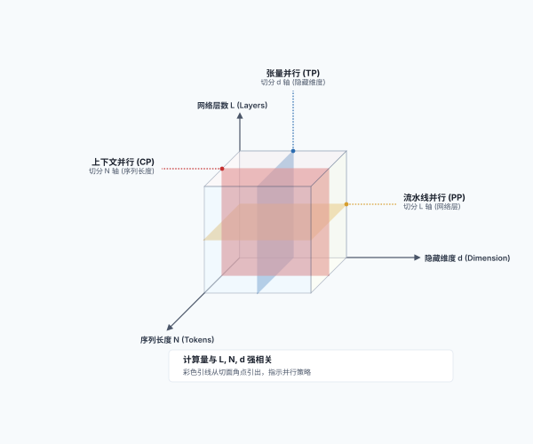
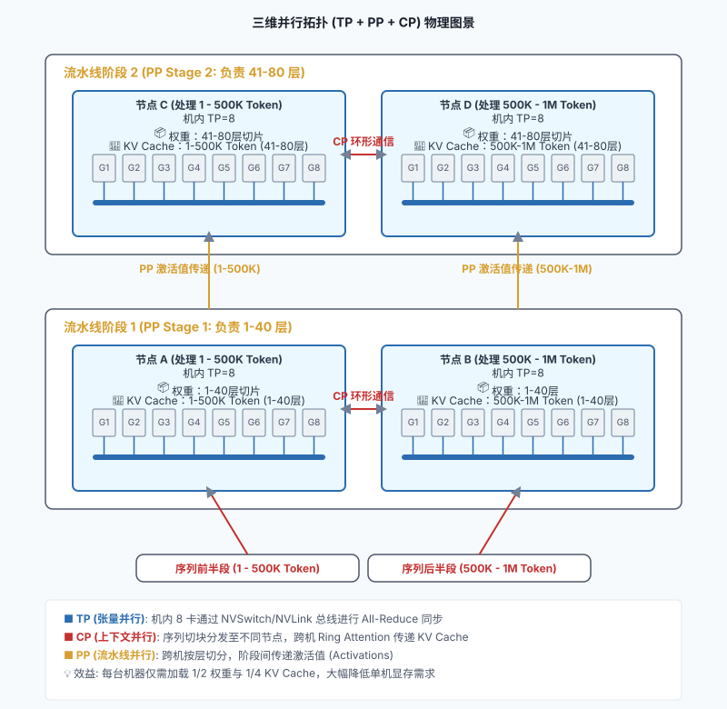
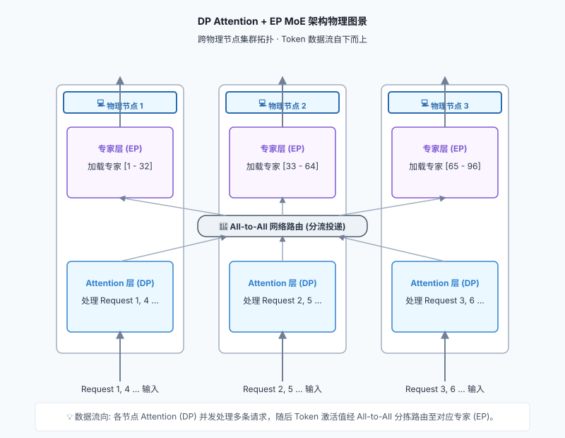
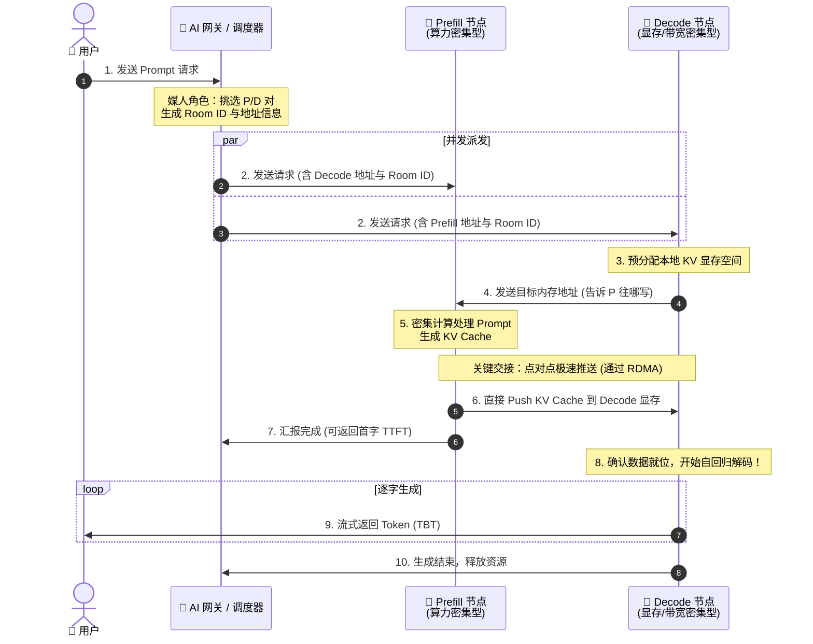

# 第四部分：分布式篇 —— 跨越单机的协奏：并行策略与高速互联

## 目录
- [第十六章：切分巨人：张量、流水线与上下文并行](#第十六章切分巨人张量流水线与上下文并行)
  - [第一节：多机必要性：装不下的巨人](#第一节多机必要性装不下的巨人)
  - [第二节：TP 与 PP：垂直切分与水平切分](#第二节tp-与-pp垂直切分与水平切分)
  - [第三节：自动分发：计算与内存的分布式解耦](#第三节自动分发计算与内存的分布式解耦)
  - [第四节：TP 与 PP 对核心指标（Metrics）的影响](#第四节tp-与-pp-对核心指标metrics的影响)
  - [第五节：打破序列墙：上下文并行 (Context Parallelism)](#第五节打破序列墙上下文并行-context-parallelism)
  - [第六节：混合并行：TP、PP 与 CP 的三维协奏](#第六节混合并行tppp-与-cp的三维协奏)
- [第十七章：从暴力美学到精打细算：专家并行 (Expert Parallelism)](#第十七章从暴力美学到精打细算专家并行-expert-parallelism)
  - [第一节：推演的穷途末路：当我们试图用 TP 和 PP 解决 MoE](#第一节推演的穷途末路当我们试图用-tp-和-pp-解决-moe)
  - [第二节：绝境中的抉择：跨机 TP 还是专家并行（EP）？](#第二节绝境中的抉择跨机-tp-还是专家并行ep)
  - [第三节：MoE 的黄金搭档：DP Attention + EP MoE](#第三节moe-的黄金搭档dp-attention--ep-moe)
- [第十八章：完美的劳动力分工：分离式推理 (Disaggregated Serving)](#第十八章完美的劳动力分工分离式推理-disaggregated-serving)
  - [第一节：难以调和的矛盾：硬件错配与管理困境](#第一节难以调和的矛盾硬件错配与管理困境)
  - [第二节：物理分离：解耦硬件，简化管理](#第二节物理分离解耦硬件简化管理)
  - [第三节：分离式推理的典型工作流](#第三节分离式推理的典型工作流)
- [第十九章：全知的交通警察：内容感知路由](#第十九章全知的交通警察内容感知路由)
  - [第一节：AI 网关：懂业务的交通警察](#第一节ai-网关懂业务的交通警察)
  - [第二节：缓存感知路由与动态副本](#第二节缓存感知路由与动态副本)
  - [第三节：SGLang 的系统级实现：网关近似树与共享 L3](#第三节sglang-的系统级实现网关近似树与共享-l3)
- [第二十章：打通经脉：大模型推理中的网络通信与高速互联](#第二十章打通经脉大模型推理中的网络通信与高速互联)
  - [第一节：单机内的血脉：PCIe、NVLink 与 NVSwitch](#第一节单机内的血脉pcienvlink-与-nvswitch)
  - [第二节：跨机桥梁：RDMA 及其实现](#第二节跨机桥梁rdma-及其实现)
  - [第三节：并行模式、数据量与指标影响](#第三节并行模式数据量与指标影响)

本部分将视角放大到集群级架构，以及顶级科技公司如何服务数十亿次请求。

## 第十六章：切分巨人：张量、流水线与上下文并行

当模型的参数量从 7B（70亿）飙升到 400B（4000亿）甚至更大时，单张显卡乃至单台服务器的物理限制就会被彻底击碎。我们必须将这个“巨人”切碎，分发到多台机器上协同推理。本章将介绍分布式推理的核心技术。

### 第一节：多机必要性：装不下的巨人

为什么我们必须进行分布式推理？最直接的原因就是**显存装不下**。

以一个 $400$B 参数的模型为例：
*   如果使用半精度（FP16）存储，仅模型权重本身就需要占用 **800 GB** 的显存！
*   以经典的 **NVIDIA H100** 为例，其单卡显存通常为 $80$ GB。这意味着，你至少需要 $10$ 张 H100 显卡，才能勉强把这个模型“装”进去（这还没有预留任何空间给 KV Cache）。
*   由于一台标准的 AI 服务器通常最多只能安装 $8$ 张显卡（整机显存 $640$ GB），这意味着即使只为了“装下”模型，你也必须跨越单机，使用至少 $2$ 台服务器。

虽然随着硬件的飞速演进，目前 Blackwell 架构（如 B200，单卡显存达 192 GB）已经走向台前，未来还会有更强的 Rubin 架构，所需的卡数会相应减少。但“单卡装不下超大模型权重与海量 KV Cache”的物理极限依然存在。这主要体现在以下三个核心驱动力：

1.  **模型规模持续膨胀**：大模型参数量在短短几年内呈指数级增长。从 2020 年 GPT-3 的 $1750$ 亿，到 2023 年 GPT-4 估算达 $1.8$ 万亿，再到 2025 年 Llama 4 等模型冲上 $2$ 万亿。根据供应链推算，顶尖下一代模型已指向 $3$ 万亿至 $5$ 万亿区间。单卡容量永远在和模型体积的膨胀速度赛跑。
2.  **上下文（Context）变长与海量 KV Cache**：随着 Agent、RAG 等应用的兴起，长上下文成为刚需。上下文窗口从早期的几千 Token 飙升到 128K 甚至 1M。超长上下文在 Decode 阶段会产生极其庞大的 KV Cache（在超长文本和高并发下，其显存占用甚至可能逼近或超过模型权重本身），这使得单卡显存更加捉襟见肘。
3.  **硬件资产生命周期与 ROI**：在生产环境中， **NVIDIA H100** 等 H 系列显卡目前仍被大量重度使用。企业在这些服务器上投入了巨额资金，不可能因为明年出了新卡就立刻淘汰。为了运行最新的大模型，企业必须将现有的多台服务器组合起来，通过高速网络进行多机分布式推理，以充分利用现有资产。

因此，多机多卡分布式推理不是一种选择，而是绝对的刚需。

---

### 第二节：TP 与 PP：垂直切分与水平切分

为了让多张显卡协同工作，业界主要有两种经典的切分策略：

**1. 张量并行（Tensor Parallelism, TP）—— 垂直切分**
*   **做法**：把模型中的某一个巨大的矩阵乘法（张量）“竖着切一刀”或“横着切一刀”，分给不同的 GPU 去算。比如，GPU 1 算左半部分，GPU 2 算右半部分，最后通过高速互联（如 NVLink）进行结果汇总（AllReduce）。
*   **特点**：它发生在**每一层网络内部**。通信极其频繁，对带宽要求极高，因此通常被限制在**单机内部**的多张卡之间进行。

**2. 流水线并行（Pipeline Parallelism, PP）—— 水平切分**
*   **做法**：把模型的层（Layers）拆开。假设模型有 80 层，机器 A 负责 1 到 40 层，机器 B 负责 41 到 80 层。机器 A 算完前 40 层的隐藏状态，通过网络发给机器 B 继续算。
*   **特点**：它发生在**层与层之间**。通信频率相对较低，非常适合跨越不同物理主机（Multi-host）进行分布式部署。

通过 TP 和 PP 的结合（比如 8 卡 TP + 2 机 PP），我们可以优雅地把超大模型切分在 16 张甚至更多显卡上。

---

### 第三节：自动分发：计算与内存的分布式解耦

当我们将大模型切分到多张显卡或多台机器上时， **计算（Compute）**和**内存（Memory）** 的占用都会随之发生天然的分布式解耦。

我们可以从计算和内存两个维度来审视这种分发：

**1. 计算的分布式分发**
*   **张量并行（TP）**：将**单层内的计算**打散。一个巨大的矩阵乘法被切分成几块，分给不同的 GPU 并行计算。这意味着每张卡只承担了一部分算力负荷。
*   **流水线并行（PP）**：将**层与层之间的计算**打散。机器 A 算前几层，机器 B 算后几层，计算在时间上呈现出流水线式的接力。

**2. 内存的分布式分发（显存的真正构成）**
在分布式环境下，显存的占用主要由以下几部分构成，它们都会被自然隔离和分摊：

1.  **模型权重（Model Weights）**：在 TP 下，每张卡只存储自己负责切分的那部分矩阵权重；在 PP 下，每台机器只存储自己负责的那几十层网络的权重。这彻底解决了“单机装不下”的终极难题。
2.  **KV Cache（注意力缓存）**：在 TP 下，由于注意力头被切分，每个 GPU 只负责存储自己那部分头对应的 K 和 V 向量；在 PP 下，KV Cache 是与层强绑定的，只有负责处理特定层的机器，才会持有该层的 KV Cache。
3.  **激活值（Activations）与临时缓冲区**：在模型前向传播过程中产生的中间特征图等临时数据，也会随着计算的切分而散落在各自的 GPU 上。TP 组内需要频繁同步这些激活值，而 PP 组则需要将阶段边界的激活值跨机传递。

这种“各管各的、自然隔离”的分布式架构，避免了构建中心化巨型内存池的复杂性，但也对芯片间的高速互联（NVLink/RDMA）提出了极高的要求，以确保这些被打散的碎片能完美地拼凑出最终的智能。

---

### 第四节：TP 与 PP 对核心指标（Metrics）的影响

在理解了 TP 和 PP 的基本原理后，我们来系统分析它们对我们在第四章定义的核心性能指标（TTFT、TBT、Throughput）的影响。为了更精准地分析，我们必须严格区分以下几个时间概念：
*   **排队时间（Queueing Time）**：请求在调度队列中等待 GPU 资源的时间。
*   **执行 TTFT（Execution TTFT）**：模型真正开始处理请求到吐出第一个 Token 的纯计算时间。
*   **用户感知的 TTFT（User-facing TTFT）**：从用户按下发送键到屏幕上看到第一个字的总时间（大致等于 排队时间 + 执行 TTFT + 网络传输延迟）。

**1. 张量并行（TP）的指标影响：大力飞砖与车道扩容**
*   **对执行 TTFT 的影响**：**显著降低**。Prefill 阶段是计算密集型的，TP 通过分摊矩阵乘法计算，直接缩短了模型运行的纯计算时间。（前提是 All-Reduce 通信带宽不是瓶颈，例如在 NVLink 等高速互联场景下）。
*   **对 TBT / TPS 的影响**：**有所降低（提升 TPS）**。在 Decode 阶段，TP 仍能加速每步计算。但由于计算量小，跨卡 All-Reduce 的通信开销占比会上升，加速比并非线性。
*   **对排队时间与吞吐量的影响**：**双重优化但有 Trade-off**。
    1.  **缩短服务时间**：因为 TP 算得快，老请求快速下车，后请求的排队时间自然变短。
    2.  **扩张并发容量**：TP 聚合了多卡显存，允许开启更大的 Batch Size，原本排队的请求可以直接被拉入 Batch 共同处理，排队时间降为 0。
    *   *权衡*：如果模型本能装进单卡，强行 TP 引入的通信开销会损耗总算力，反而降低吞吐量。

**2. 流水线并行（PP）的指标影响：多段接力与吞吐为王**
*   **对执行 TTFT 的影响**：**略微增加**。请求需按顺序流经不同机器层，跨机通信和流水线启动带来了固定延迟开销。
*   **对 TBT / TPS 的影响**：**几乎没有改善**。它仅是层与层之间的物理拆分，并没有加速单个 Token 的前向计算。
*   **对排队时间与吞吐量的影响**：**显著提升**。
    *   **流水线效应减少排队**：当请求 A 在第一台机器完成第一阶段 Prefill 并流向下一台机器时，第一台机器立刻被释放，排队中的请求 B 可以马上开始它的 Prefill。这种空间复用使得新请求能更早地进入系统。
    *   **吞吐为王**：通过流水线机制（不同机器同时处理不同 Batch 的不同层），极大提升了 GPU 利用率，是做大集群吞吐的利器。高吞吐有助于消化队列，从宏观上降低平均排队时间。

---

### 第五节：打破序列墙：上下文并行 (Context Parallelism)

随着大模型上下文窗口（Context Window）从早期的几千飙升到现在的百万级别，传统的张量并行（TP）和流水线并行（PP）在处理超长序列时开始显得力不从心。这就催生了第三种切分维度——**上下文并行（Context Parallelism, CP）**。

**1. 它要解决什么问题？**
在极长上下文场景下，核心瓶颈不仅是模型权重，更是**随序列长度线性增长的 KV Cache**，以及**呈二次方增长的注意力计算量**。
*   即使你用 TP 把模型权重切分到了 8 张卡上，单张卡依然可能塞不下长达数十万甚至上百万 Token 的 KV Cache。
*   传统的 TP 关注的是隐藏层维度（Hidden Dimension）的切分，而无法有效分摊超长序列维度（Sequence Length）带来的显存与计算压力。
*   因此，CP 的核心目标是 **粉碎“序列墙”**。它不仅让系统能够容纳远超单卡显存极限的超长文本，更通过沿序列维度的切分，让指数级增长的注意力计算量能被多张显卡并行分摊，极大缩短了处理长文本的时间。

**大模型并行的 3D 切分维度示意图 (L × N × d)：**



**2. 它是怎么做的？**
上下文并行的核心思想是**沿序列维度（Sequence Dimension）进行切分**：
1.  **序列切块**：将长达数万甚至数百万的 Token 序列切成 $N$ 个小块，分发给 $N$ 个 GPU。每个 GPU 只负责处理和存储自己那一段序列的 KV Cache。
2.  **环形注意力（Ring Attention）**：由于自注意力机制要求每个 Token 都要与前面所有的 Token 做计算，序列被切断后，GPU 之间必须进行通信。典型的做法是采用 **Ring Attention** 机制：各个 GPU 形成一个环形拓扑，一边计算本地数据的 Attention，一边像传手绢一样在环中传递 KV Cache 的分块。这样可以在不将所有 KV Cache 集中到单卡的前提下，完成全局注意力的计算。

> [!NOTE]
> **深入探讨：Ring Attention 的动态协调与负载均衡**
>
> 环形注意力（Ring Attention）的实现并非简单的“数据切块”，它在工程上面临着通信协调和计算负载均衡的巨大挑战。
>
> **1. 通信与计算的“击鼓传花”式协调**
> 假设我们将序列切分为 3 块，由 3 个 GPU 协同计算。GPU 1 持有 $Q_1, K_1, V_1$ ；GPU 2 持有 $Q_2, K_2, V_2$ ；GPU 3 持有 $Q_3, K_3, V_3$ 。在 Causal Attention（自回归）模式下，协调过程如下：
> *   **步骤 1**：所有 GPU 同时启动，计算本地 $Q$ 与本地 $KV$ 的注意力。同时，启动异步通信，像传手绢一样在环中传递 $KV$ 块：GPU 1 发送 $KV_1$ 给 GPU 2，GPU 2 发送 $KV_2$ 给 GPU 3，以此类推。
> *   **步骤 2**：GPU 收到上游传来的 $KV$ 块后，计算本地 $Q$ 与新 $KV$ 的注意力。例如 GPU 2 收到 $KV_1$ ，计算 $Q_2$ 与 $KV_1$ 的注意力。此时 GPU 1 收到 $KV_3$ ，但因为是因果注意力，它不能看未来的信息，所以这次计算是无效的（或被 Mask 掉）。
> *   **步骤 3**：继续传递 $KV$ 块。GPU 3 最终收到 $KV_1$ ，计算 $Q_3$ 与 $KV_1$ 的注意力。
>
> 通过这种方式，每个 GPU 最终都与它所需要的所有历史 $KV$ 块完成了计算。由于通信是异步的，注意力计算的延迟被有效地掩盖了。**为了保持数学上的等价性**，各个 GPU 需要结合 Online Softmax（类似 FlashAttention 的技巧），在接收到新的 KV 块后动态更新局部 Softmax 的最大值和累加和。
>
> **环形注意力协调流程图：**
> ```mermaid
> sequenceDiagram
>     participant M1 as "📟 GPU 1 (持有 Q1, KV1)"
>     participant M2 as "📟 GPU 2 (持有 Q2, KV2)"
>     participant M3 as "📟 GPU 3 (持有 Q3, KV3)"
> 
>     Note over M1, M3: 步骤 1: 计算本地并传递 KV
>     par 异步通信
>         M1->>M2: 发送 KV1
>     and
>         M2->>M3: 发送 KV2
>     and
>         M3->>M1: 发送 KV3
>     end
>     Note over M1: 计算 Q1 * KV1
>     Note over M2: 计算 Q2 * KV2
>     Note over M3: 计算 Q3 * KV3
> 
>     Note over M1, M3: 步骤 2: 计算收到的 KV 并继续传递
>     par 异步通信
>         M1->>M2: 转发 KV3
>     and
>         M2->>M3: 转发 KV1
>     and
>         M3->>M1: 转发 KV2
>     end
>     Note over M1: 计算 Q1 * KV3 (Causal 模式下无效)
>     Note over M2: 计算 Q2 * KV1
>     Note over M3: 计算 Q3 * KV2
> 
>     Note over M1, M3: 步骤 3: 最后一轮计算
>     Note over M1: 计算 Q1 * KV2 (Causal 模式下无效)
>     Note over M2: 计算 Q2 * KV3 (Causal 模式下无效)
>     Note over M3: 计算 Q3 * KV1
> ```
>
> **2. 负载不均衡难题与 Zig-zag 优化**
> 从上述过程可以看出，在 Causal Attention 中，有效的注意力计算呈下三角形状：
> *   GPU 1 只需要算 1 份有效计算（ $Q_1$ 与 $KV_1$ ）。
> *   GPU 2 需要算 2 份有效计算（ $Q_2$ 与 $KV_1, KV_2$ ）。
> *   GPU 3 需要算 3 份有效计算（ $Q_3$ 与 $KV_1, KV_2, KV_3$ ）。
>
> 这会导致严重的负载不均衡，GPU 1 和 GPU 2 会提前闲置。为了解决这个问题，业界主要有两种方案：
> *   **方案 A：暴力填充（Padding/Masking）**：所有 GPU 都进行满负荷计算，即使是无效的未来块也照常计算，最后用掩码强行滤除。这虽然保持了代码的简单和对称，但浪费了接近 50% 的算力。
> *   **方案 B：交错切分（Zig-zag Partitioning / Striping）**：不再按连续区间切分序列，而是采用“发牌”或“两头凑”的方式分配。假设有 6 个块，GPU 1 拿块 1 和 6（工作量 $1+6=7$ ），GPU 2 拿块 2 和 5（工作量 $2+5=7$ ），GPU 3 拿块 3 和 4（工作量 $3+4=7$ ）。通过这种巧妙的编排，每个 GPU 的计算量被完美平衡，消灭了闲置时间。
>
> **负载均衡与 Zig-zag 示意图：**
> ```mermaid
> graph TD
>     subgraph "朴素连续切分 (Contiguous)"
>         N1["📟 GPU 1: 块 [1, 2]"]
>         N2["📟 GPU 2: 块 [3, 4]"]
>         N3["📟 GPU 3: 块 [5, 6]"]
>         N1 -->|"工作量: 1+2 = 3"| NW1["严重闲置"]
>         N2 -->|"工作量: 3+4 = 7"| NW2["中度负载"]
>         N3 -->|"工作量: 5+6 = 11"| NW3["重度负载"]
>     end
> 
>     subgraph "交错切分 (Zig-zag)"
>         Z1["📟 GPU 1: 块 [1, 6]"]
>         Z2["📟 GPU 2: 块 [2, 5]"]
>         Z3["📟 GPU 3: 块 [3, 4]"]
>         Z1 -->|"工作量: 1+6 = 7"| ZW1["完美平衡"]
>         Z2 -->|"工作量: 2+5 = 7"| ZW2["完美平衡"]
>         Z3 -->|"工作量: 3+4 = 7"| ZW3["完美平衡"]
>     end
> ```

**3. 它如何影响推理性能？**
1.  **对执行 TTFT 的影响**：**大幅优化超长文本的 TTFT**。在 Prefill 阶段，处理百万字 Prompt 的计算量极其恐怖。CP 通过将序列打散到多 GPU 并行计算，显著缩减了超长文本的预填充时间。
2.  **对 TBT / TPS 的影响**：**影响较小**。在 Decode 阶段，每次只生成一个 Token，并不需要像 Prefill 那样处理全量长文本的矩阵乘法，因此 CP 对吐字间隔的改善有限。
3.  **对吞吐量与成本的影响**：**以高昂的通信换取“可行性”**。CP 引入了大量的环形通信开销。它在普通短文本推理中毫无优势，但在超长文本场景下，它是**让任务“能跑起来”的唯一解**。

> [!IMPORTANT]
> **跨机上下文并行的终极形态**
> 
> 虽然本节为了简化讨论，主要以单机内的 GPU 协同为例，但这并不意味着上下文并行只能在单机内进行。**当上下文长度进一步飙升（例如达到 1M 甚至更长），单机内所有 GPU 的显存总和也无法容纳全量 KV Cache 时，上下文并行完全可以跨越物理机器，在多机之间进行。**
> 只是此时 Ring Attention 的通信需要走跨机网络（如 InfiniBand 或 RoCE），其带宽和延迟比起机内的 NVLink 会差一个数量级，因此对计算与通信的重叠（Overlap）技术要求更高，是极致的长文本工程挑战。

---

### 第六节：混合并行：TP、PP 与 CP 的三维协奏

当面对极致的超大规模模型（如 $400\text{B}$ 级别）以及极致的超长上下文（如 $1\text{M}$ Token）时，单一的并行策略已经无法解决问题。我们必须将张量并行（TP）、流水线并行（PP）和上下文并行（CP）结合起来，形成硬核的“三维并行”拓扑。

参考业界前沿的实践，一个典型的三维并行（TP + PP + CP）架构通常呈现出以下优雅的物理分层：

*   **节点内（NVLink 域）打满 TP** ：在单台 $8$ 卡服务器内部，通常将张量并行度设为 $\text{TP}=8$ 。这 $8$ 张卡通过极高带宽的 NVLink/NVSwitch 互联，作为最基础的“物理原子”共同持有一层网络的切片，以极致的带宽扛住高频的 All-Reduce 矩阵通信。
*   **节点间纵向切分（跨机网络）做 PP** ：在机器节点之间，通过流水线并行（PP）将模型的层数纵向切分。**例如下图中，我们将一个 $80$ 层的模型切分为 $2$ 个 Stage，每个 Stage 负责 $40$ 层（Stage 1 负责 1-40 层，Stage 2 负责 41-80 层）。** 机器之间只传递很小的前向激活值（Activation），对跨机网络（如 InfiniBand 或 RoCE）的压力极小。
*   **节点间横向扩展（跨机网络）做 CP** ：在同一个 PP Stage 的多台机器之间，由于超长上下文产生的 KV Cache 单机依然装不下，我们需要进行上下文并行（CP）。**例如下图中，我们将长达 $1\text{M}$ 的超长上下文切分为 $2$ 个分块（每块 $500\text{K}$ Token），分别分发给两组机器（节点 A 和节点 B）。** 这些机器上复制着完全相同的层权重，利用 Ring Attention 算法，通过跨机网络在这些机器之间像齿轮一样循环传递 KV Cache 块，从而拼凑出百万级别的超长上下文。

**三维并行（TP + PP + CP）拓扑示意图：**



在这个架构中，**在每一个 Transformer Block 内部**，数据的流动和通信模式在 Attention 层和 FFN 层呈现出不同的特征：
*   **Attention 层**：由于注意力机制要求 Token 相互“看到”，因此必须进行跨机 CP 通信（如 Ring Attention）以交换 KV Cache。
*   **FFN 层**：由于 FFN 对每个 Token 的计算是完全独立的，各台机器只需要独立处理本地的 Token 即可，不需要跨序列的跨机通信（只需机内 TP 同步）。

这种 Attention 依赖 CP 而 FFN 保持独立的特征在 Dense 模型中非常清晰。但如果模型是混合专家模型（MoE），FFN 层将演变为多个专家，从而引出更复杂的**专家并行（Expert Parallelism, EP）**，这正是我们后续章节将要深入探讨的硬核话题。

---

## 第十七章：从暴力美学到精打细算：专家并行 (Expert Parallelism)

在第十六章中，我们讨论了如何将一个稠密（Dense）的大模型切分到多张显卡上。无论是 TP、PP 还是 CP，它们的共同点都是 **“所有人一起干所有的活”** ——每个 Token 都会激活模型中的所有参数。

然而，随着模型规模向万亿参数迈进，这种“暴力美学”撞上了物理极限。为了解决这个问题，[混合专家模型（MoE, Mixture of Experts）](./part1_principles.cn.md#第七节ffn-的拓展混合专家模型moe)应运而生。在 MoE 架构中，虽然总参数量极大，但每个 Token 只需要激活其中的一小部分专家（例如 256 个专家中激活 2 个）。这种 **稀疏激活（Sparse Activation）** 的特性，催生了一种全新的并行维度—— **专家并行 (Expert Parallelism, EP)** 。

### 第一节：推演的穷途末路：当我们试图用 TP 和 PP 解决 MoE

MoE 模型的核心思想是解耦“模型容量”与“计算成本”。你可以把模型做得很庞大，拥有海量的知识，但每次推理只激活极少部分的专家。

面对 MoE 模型那动辄数百 GB 甚至数 TB 的全量专家权重（例如 DeepSeek V3 拥有 $671\text{B}$ 参数），我们最自然的想法是使用手中现有的两把武器—— **张量并行（TP）** 和 **流水线并行（PP）** 去**分割权重**，以解决显存装不下的物理难题。

我们沿着这条直觉走下去，推演过程如下：
1.  **第一步：模型尚小时，单机 TP 扛下一切**
    如果这是一个小型 MoE 模型（例如 $47\text{B}$ 的 Mixtral 8x7B），它的全量专家加起来只有几十 GB。最简单高效的办法就是把它装进一台 8 卡机器中，用机内 **张量并行（TP=8）** 跑通。在 NVLink 高达 $900\text{GB/s}$ 的极速带宽下，所有 GPU 共同参与所有专家的计算，虽然牺牲了部分的稀疏性，但胜在简单且没有复杂的跨机通信。
2.  **第二步：模型膨胀后，叠加跨机 PP 切分层**
    当模型的总参数量扩大数倍，单机装不下全量层时，我们自然会引入 **流水线并行（PP）** ——按网络层（Layer）把模型切分为多个 Stage，分发到多台物理机器上。因为层与层之间的接力通信频率低、数据量小，这能完美避开跨机网络带宽较窄的弱点。
3.  **第三步：撞上流水线气泡，推演陷入死角**
    然而，流水线（PP）不能被无限切深。PP 会带来流水线气泡（Pipeline Bubble），尤其在逐字生成（Decode）阶段，气泡会直接把吐字间隔（TBT）拉长到用户无法忍受的程度。因此，在生产环境中，PP 的 Stage 深度通常被严格限制在 4 或 8 以内。

**这引出了一个致命的工程绝境**：
由于不敢把 PP 切得太深，分配到某一台物理机器上的“层组”里，MoE 的 FFN 层（全量专家）依然大到超出了这台机器的显存容量！我们必须对 **“同一层网络内的专家”** 进行 **跨机器** 的切分。

---

### 第二节：绝境中的抉择：跨机 TP 还是专家并行（EP）？

面对同一层网络跨机器切分的绝境，摆在工程师面前的有两种完全不同的设计哲学：

1.  **方案 A：跨机张量并行（Cross-host TP）**
    *   **做法**：延续 TP 的逻辑，把这一层内的所有专家横着或竖着“切碎”，均匀散布在不同的物理机器上。
    *   **物理比喻**：相当于 **“所有人一起砍同一棵树”** ——权重切碎，Token 激活值原地不动，算力分布式协作。
    *   **致命代价**：
        *   **计算效率暴跌**：由于矩阵被切得太碎，无法触发高效的大块矩阵乘法，GPU 会退化为极低效的矩阵向量乘法（GEMV），导致算力被严重浪费。
        *   **跨机网络瘫痪**：每一层都需要多次触发跨机器的全员通信。在带宽只有 50-100GB/s 的跨机网络（IB/RoCE）面前，网络流量会瞬间被引爆。
        *   **强同步阻塞**：跨机 All-Reduce 是一种强同步操作。后一步的计算必须等待全集群通信彻底结束才能继续，任何一台机器的网络微小抖动都会导致整个集群的 CUDA 核心挂起等待。
2.  **方案 B：专家并行（Expert Parallelism, EP）**
    *   **做法**： **权重原地不动，只转 Token** 。我们保持每个专家的物理完整性，将专家 A 完整地放在机器 1，专家 B 完整地放在机器 2。当 Token 准备运算时，通过网络（All-to-All）将 Token 激活值投递到对应的专家所在的 GPU 上，算完再投递回来。
    *   **物理比喻**：相当于 **“把不同的树分给不同的人去砍”** ——权重原地不动，依靠路由在网络中转移 Token 激活值。
    *   **带来的革命**：
        *   **对齐算法的稀疏路由**：保持了专家的物理完整性，让网络投递承担分拣角色，使硬件的分发逻辑与 MoE 算法的稀疏映射完全同构。
        *   **极高硬件效率（GEMM 优化）**：虽然在宏观高并发下所有 GPU 都在同时忙碌，但 EP 依靠网络分流把要去同一个专家的 Token 汇聚到一台特定的 GPU 上。这避免了 TP 切碎后导致 GPU 频繁读取不同专家权重、退化为低效 GEMV 的尴尬，触发完美的大块 GEMM 运算，榨干 Tensor Core。
        *   **通信与计算重叠（Compute-Comm Overlap）**：MoE 层的 All-to-All 通信是天然可异步的。当那些被路由到本地专家的 Token 在 GPU 上执行密集的本地矩阵乘法（GEMM）时，网卡正在后台将需要跨机的 Token 异步搬运到目标机器。这种 **极致的异步掩盖（Overlap）** ，使得跨机网络通信的延迟几乎被本地计算的时间完全隐藏。

这种设计哲学的差异，使得 EP 天然适合跨机器扩展，因为在大规模集群中，“让 Token 激活值找权重”的通信开销，往往远小于“把权重切碎再跨机缝合”的强同步开销。

**跨机 TP 与专家并行（EP）的核心差异对比：**

| 比较维度 | 跨机张量并行（Cross-host TP） | 专家并行（EP） |
| :--- | :--- | :--- |
| **核心设计哲学** | **“所有人一起砍一棵树”**（权重切碎，Token 激活值不动） | **“把不同的树分给不同的人去砍”**（权重不动，Token 激活值在网络中流转） |
| **矩阵乘法效率** | **极低**（矩阵被切碎，退化为低效的 GEMV） | **极高**（保持完整专家矩阵，汇聚大 Batch Token 执行高效的 GEMM） |
| **通信模式** | **All-Reduce**（强同步全员聚合） | **All-to-All**（异步乱序分拣投递） |
| **通信触发频率** | **极高**（激活多少个专家就触发多少次通信） | **极低**（每层网络固定 2 次） |
| **计算与通信重叠** | **几乎无法重叠**（CUDA 核心必须挂起等待同步） | **极致重叠**（计算本地 Token 时在后台异步搬运） |

> [!NOTE]
> **硬核定量：EP 与 TP 的通信量之争**
> 
> 很多工程师凭直觉会认为 EP 的乱序 All-to-All 通信量是灾难性的。但如果进行严格的数学定量推导，会得出一个反直觉的结论。
> 假设 $M$ 为并行机器数， $K$ 为每个 Token 激活的 Top-K 专家数。在未优化的理论模型下，EP 的跨机通信量仅为 TP 的 $1/M$ 。即使在实际工程中对 TP 进行了疯狂的算子融合（Operator Fusion）将通信量缩减了 $K$ 倍，EP 的总通信体积也依然只有 TP 的 $K/M$ 。

---

### 第三节：MoE 的黄金搭档：DP Attention + EP MoE

在真实的生产环境（如 DeepSeek V3/R1 的 Serving 架构）中，MoE 模型的推理通常采用一种极具艺术感的混合拓扑： **Attention 层用数据并行（DP），而 FFN（MoE）层用专家并行（EP）** 。

为什么要在同一层网络里切换两种并行角色？这源于 MoE 模型内部的 **异质性（Heterogeneity）** ：
1.  **Attention 层（小而稠密）**：在现代架构中（如在 [第九章：模型架构层面的显存瘦身：GQA](./part3_single_node.cn.md#第九章模型架构层面的显存瘦身gqa) 中学过的 GQA 或是 MLA 技术），Attention 层的权重被大幅压缩（通常占总参数量的不到 10%），小到每张卡都可以轻松复制一份完整副本。因此，Attention 环节非常适合用 **DP（数据并行）** —— 每张卡独立处理自己那部分 Request，互不通信，完美避免了 TP 的 All-Reduce 开销。
2.  **FFN 层（大而稀疏）**：到了 MoE 环节，全量专家权重巨大，必须用 EP 切分到不同机器上，通过网络路由 Token。

这种“双面间谍”式的切换（Attention 时横向数据并行，FFN 时纵向专家路由），将 MoE 模型的算法优势与分布式硬件的物理特性结合到了极致。

**DP Attention + EP MoE 架构拓扑示意图：**



> [!NOTE]
> **核心权衡：DP 与 CP 的切分维度与长短文本博弈**
> 
> 我们之所以将 DP（数据并行）与 CP（上下文并行）放在一起进行比较，是因为两者切分的都是 **“输入的请求与数据”** 本身，而非模型的权重维度。但它们切分的具体方向完全不同：
> *   **DP Attention**：切分的是 **批次（Batch / Request 维度）**。不同请求在各节点的 Attention 层内互不通信，追求极致的并发吞吐量。
> *   **CP Attention**：切分的是 **序列（Sequence Dimension 维度）**。同一个超长请求的 KV Cache 被物理切开，依赖 Ring Attention 在卡间频繁进行环形同步。
> 
> 在推理集群中，如何在这两者间做出抉择，是一场精妙的**长短文本工程博弈**：
> *   **短文本的代价**：如果对原本一两千 Token 的短文本“无脑”开启 CP，每张卡分到的计算量微乎其微，GPU 算力会被频繁的跨机环形通信开销彻底拖垮。
> *   **长文本的红线**：相反，面对数十万 Token 的长文本，如果不开 CP，庞大的 KV Cache 会瞬间撑爆单卡显存导致 OOM。
> 
> **工程落地的权衡考量**：
> 在面对实际生产交付时，工程师通常需要依据具体的 **业务特征（Profile）** 做出权衡。以下是两个折中考量的例子：
> *   **例子一：牺牲效率换取一致性**：在统一集群中开启微量的 CP（如 CP=2 或 4）。虽然短文本的推理效率会折损 10%-20%，但这能以极少的硬件投入，换来对长短文本的全面兼容以及运维层面的高稳定性。
> *   **例子二：物理隔离换取性能**：通过网关层（Gateway）依据长度做物理分流。高频短交互走纯 `DP Attention + EP MoE` 拓扑，Attention 环节零跨机通信，以压榨极限吞吐；长文本走专属的 `CP Attention + EP MoE` 拓扑，牺牲小文本效率，确保系统不会 OOM。

---

## 第十八章：完美的劳动力分工：分离式推理 (Disaggregated Serving)

什么是**分离式推理（Disaggregated Serving）**？简单来说，它是一种将大模型推理的 **Prefill（预填充）** 阶段和 **Decode（解码）** 阶段，彻底剥离并运行在不同硬件配置的物理集群上的架构。

在第三部分中，我们介绍了**连续批处理**和**分块预填充**，它们在单机层面实现了 Prefill 和 Decode 的“完美拼车”，极大地压榨了单张显卡的性能。你可能会问：既然单机问题已经解决了，为什么还要大费周章搞分离式推理？

答案是：单机优化只是 **“战术级”** 的极限压榨。在单机内部试图完美平衡 Prefill 和 Decode，不仅受制于**硬件错配**的物理极限，更带来了**系统管理和调度的极高复杂度**。当服务规模达到工业级量级时，单机内的“完美”反而变成了宏观上的“负担”。本章将揭秘**分离式推理 (Disaggregated Serving)**，看它是如何同时解决硬件错配并极大简化资源管理的。

### 第一节：难以调和的矛盾：硬件错配与管理困境

我们在 [第八章：核心不对称性：Prefill 与 Decode](../parts/part2_bottlenecks.cn.md#第八章核心不对称性prefill-与-decode) 提到过，Prefill 和 Decode 对硬件的需求是完全相反的：
*   **Prefill**：处理海量输入，需要极高的**计算算力（FLOPs）**，但对显存容量要求相对较小。
*   **Decode**：逐字吐出 Token，计算量很小（算力闲置），但需要频繁从显存搬运庞大的 KV Cache，极度渴望**显存带宽**和**显存容量**。

如果使用传统的统一架构（混合部署），系统将面临双重打击：
1.  **硬件错配的浪费**：当你用昂贵的 B200 显卡去跑 Decode 阶段时，它那毁天灭地的 Tensor Core 算力绝大多数时间都在“睡大觉”等显存搬数据。这无异于用屠龙刀去砍柴，造成了极大的成本浪费。
2.  **管理与调度的“走钢丝”**：为了在单机上解决这个矛盾，工程师们发明了连续批处理、分块预填充等极其复杂的调度算法（如前几章所述）。这无异于在单张显卡上“走钢丝”——系统必须小心翼翼地平衡两者的资源占用，稍有不慎就会引发首字延迟（TTFT）或吐字间隔（TBT）的抖动。这种多维度（算力、显存、带宽）的混合优化，让集群的资源规划和容量管理变得异常复杂。

---

### 第二节：物理分离：解耦硬件，简化管理

为了从根本上破局，顶级科技公司开始采用 **Disaggregated Serving（分离式推理）** 架构（如 Google 内部的各种系统和开源的 DistServe）。

核心思想是**物理隔离**：
1.  **Prefill 集群**：由算力极强但显存一般的机器组成，专门负责接收用户的长 Prompt，以最快的速度完成预填充，生成初始的 KV Cache。
2.  **Decode 集群**：由算力一般、但配备了海量 HBM 显存和超高显存带宽的机器组成，专门负责存储 KV Cache 并逐字吐出 Token。

这种分工带来了双重收益：

**1. 解决硬件错配，释放硬件潜力**
我们可以针对不同的集群进行独立的硬件采购，**在 Prefill 集群追求极致的 TTFT，在 Decode 集群追求极致的 TPS 和 TBT 稳定性**，将每一种硬件的特性压榨到极致，大幅降低了整体 TCO（总拥有成本）。

**2. 简化资源匹配与管理（降维打击）**
更重要的是，分离式推理**将复杂的混合调度问题，降维成了简单的容量规划问题**：
*   **告别“微操”**：Prefill 节点只管闷头算 Prompt，Decode 节点只管流畅吐字。系统不再需要在单机内做复杂的资源平衡，极大地提升了系统的稳定性和可维护性。
*   **业务驱动的极简扩缩容**：资源管理不再是黑盒的算法调优，而是直接与业务画像挂钩。
    *   **RAG（检索增强生成）与长文档问答**：用户通常会上传几万字的背景资料，但只要求模型回答几百字。这是一种 **“重 Prefill、轻 Decode”** 的场景。在分离架构下，我们只需定向扩容 Prefill 集群即可。
    *   **Agent（智能体）与思维链（CoT）推理**：用户可能只输入了一句简短的指令，但模型在背后需要进行复杂的工具调用或长达数万字的“内心独白”。这是一种 **“轻 Prefill、重 Decode”** 的场景。此时，我们只需定向扩容配备海量显存的 Decode 集群，避免了为 Prefill 算力买单的冤枉钱。

通过这种精细化的资源匹配，分离式推理不仅解决了屠龙刀砍柴的尴尬，更让整个集群的资源匹配和管理变得清爽、可控。

### 第三节：分离式推理的典型工作流

理解了分离式推理的优势后，我们来看看一个请求在分离架构下是如何流转的。它就像一场精心安排的接力赛，**AI 网关** 扮演“媒人（Matchmaker）”的角色，而 **Prefill 节点** 和 **Decode 节点** 则进行点对点的交接：

1. **请求接入与撮合**：用户发送 Prompt 请求到达 **AI 网关**。网关根据策略挑选出一组 **Prefill 节点** 和 **Decode 节点**，并为它们生成一个全局唯一的会话标识（如 Room ID）。
2. **并发派发**：AI 网关将带有连接信息（目标节点地址以及 Room ID）的请求，**并发地**同时发送给选定的 Prefill 节点和 Decode 节点。
3. **点对点握手与预分配**：
   * **Decode 节点** 收到请求后，首先在本地 KV 池中为该请求**预分配**好显存空间，并将这些目标内存地址通过控制流发送给 Prefill 节点（“往这儿写”）。
   * 此时，两节点完成了点对点的握手。
4. **Prefill 计算与直推**：
   * **Prefill 节点** 全力开火，计算 Prompt 并生成 KV Cache。
   * 计算完成后，Prefill 节点拿到 Decode 节点发过来的目标地址，通过 **RDMA** 高速网络（如 Mooncake 传输引擎），将全量 KV Cache **直接推送（Push）** 到 Decode 节点的显存中。
5. **Decode 解码生成**：
   * Decode 节点确认数据接收完成后，直接跳过 Prefill 阶段，接管后续的自回归生成工作，逐字吐出 Token。
   * 生成的 Token 实时流式返回给用户。

为了让你更直观地看清这个“网关撮合、节点直连”的过程，我们可以用下面这张图来表示：



这种“网关只控流、节点点对点直连”的去中心化数据交接机制，成功避免了网关成为海量 KV 数据传输的瓶颈，将单机内的资源竞争转化为了集群间的高效流水线作业。

---

## 第十九章：全知的交通警察：内容感知路由

在第十八章中，我们把集群拆分成了 Prefill 池和 Decode 池。那么，当海量的 HTTP 请求涌入时，谁来决定哪个请求去哪台机器？本章将介绍大模型集群中的“交通警察”——**内容感知路由**。

### 第一节：AI 网关：懂业务的交通警察

传统的负载均衡器（如 Nginx 或 F5）只关心网络流量、并发连接数以及服务器的 CPU/内存利用率等基础物理指标。它们看一个 HTTP 请求，只是一堆无意义的字节。

但在 LLM 推理集群中，这种“盲目”的路由会导致灾难。因为大模型推理的成本很大程度上由 **Prompt 的内容和长度** 决定。

于是，**AI 网关（AI Gateway）** 应运而生。它是懂业务的交通警察：
*   **请求检查**：在请求到达 GPU 之前，网关会先对其进行解析，看它包含多少个 Token，属于什么业务类型。
*   **智能分流决策**：由于大模型请求在 Prefill 和 Decode 阶段的资源消耗差异巨大，网关不能简单地按“轮询”分发，而是需要根据**请求画像（Prompt 长度与预期输出长度）**，对 Prefill 节点和 Decode 节点进行组合路由。

我们可以用下表来梳理 AI 网关在不同请求场景下的路由决策逻辑：

| 请求画像 | 特征 (输入/输出) | Prefill 节点路由策略 | Decode 节点路由策略 |
| :--- | :--- | :--- | :--- |
| **日常闲聊** | 短输入 / 短输出 | **贪心/极速**：分配给当前队列最短、负载最轻的节点，追求极致的 TTFT。 | **随机/轮询**：对显存容量和带宽要求极低，任意低负载节点均可。 |
| **知识库 (RAG)** | **长输入** / 短输出 | **算力优先**：必须派发给当前无重载、算力充裕的节点，否则庞大的 Prefill 会导致 TTFT 爆炸。 | **容量优先**：必须路由到**显存剩余容量大**的节点，以容纳海量的初始 KV Cache。 |
| **智能体/长文本生成** | 短输入 / **长输出** | **快速通过**：Prefill 耗时极短，分配给普通空闲节点即可。 | **带宽与稳定性优先**：Decode 持续时间长，需选择当前活跃 Batch 少、显存带宽充裕的节点（保 TBT）。 |
| **复杂分析/长对话** | **长输入** / **长输出** | **资源倾斜**：极度消耗算力，需选择最空闲的顶级算力节点，甚至触发上下文并行（CP）。 | **双重严苛**：既要**显存容量大**（装下初始大 KV），又要**显存带宽足**（支持长期持续吐字）。 |

> [!NOTE]
> **防死锁与防线头阻塞（HOL Blocking）**：当长短请求同时到达时，AI 网关会极力避免将短请求排在长请求后面。如果 Prefill 节点都在忙，网关甚至可能会将短请求插队（Priority Queue）或者分流到专门预留的“快车道”节点，以保证短请求的极致体验。

---

### 第二节：缓存感知路由与动态副本

在大模型集群中，**缓存感知路由（Cache-aware Routing）** 是 AI 网关最强悍的杀手锏。

**1. 为什么需要它？**
结合我们在 [第十二章：内存时光机：前缀缓存 (RadixAttention)](./part3_single_node.cn.md#第十二章内存时光机前缀缓存-radixattention) 中学过的 **RadixAttention（前缀缓存）** ，如果多个请求共享相同的 System Prompt、长文档背景或历史对话，节点本地会缓存这些前缀的 KV Cache。
如果网关只是盲目地轮询分发，带有相同前缀的请求会被散落到不同节点，导致每个节点都要重复计算一遍 Prefill。这不仅浪费了海量的 GPU 算力，还极大地拉长了 TTFT。
因此，我们需要网关能够感知请求的前缀内容，把请求精准路由到已经持有该缓存的节点。

**2. 它的工作流程**
*   **前缀匹配**：网关在全局维护一张“缓存索引表”，记录哪台节点上缓存了哪些文本前缀。新请求进来时，网关扫描其前缀，把它发送给命中率最高的节点，直接复用 KV Cache。
*   **动态副本（解决惊群效应）**：如果某个前缀（如全网爆火的系统提示词）成了超级热点，所有请求都疯狂涌向持有该缓存的节点，会导致该节点瞬间被打爆。此时网关必须具备 **动态副本（Dynamic Replication）** 的能力，检测到负载失衡后，将流量分流到空闲节点，并促使空闲节点也建立该缓存的副本，实现负载均衡。

---

### 第三节：SGLang 的系统级实现：网关近似树与共享 L3

理解了原理后，我们以目前前沿的推理引擎 **SGLang** 为例，看看它是如何以极低的系统开销落地这套机制的。SGLang 的设计非常巧妙，它并没有使用复杂的中心化“显式复制”指令，而是通过**网关的软路由**与**后端的层次化缓存**自然结合。

**1. 网关层的“近似前缀树”（解决匹配开销）**
在 SGLang 的 Rust 网关中，维护了一个全局的**近似前缀树（Approximate Radix Tree）**。
*   **无 Tokenizer 优化**：为了保证网关的超高吞吐，这个树**直接存储 Raw Text 字符串**，而不是 Token ID。这样网关就不需要加载庞大的词表进行分词，直接用字符串匹配就能快速定位缓存。
*   **双模切换**：当系统负载均衡时，网关按缓存匹配率路由（直奔记忆节点）；当检测到某个节点因为热点请求导致负载过高时，网关会 **强制切换为“最短队列（Shortest Queue）”** 策略，直接把新请求撇给空闲节点，瞬间化解惊群效应。

**2. 后端的“L3 共享缓存”（解决副本生成）**
被网关分流到空闲节点的请求，本地并没有 KV Cache，重新计算又太慢，怎么办？
SGLang 引入了 **HiCache** 机制，将缓存分为 GPU(L1)、CPU(L2) 和**分布式共享存储(L3)**（如 Mooncake 或 DeepSeek 3FS）。

*   当热点节点的缓存被触发写回 L3 后，空闲节点收到网关分流过来的请求，发现本地无缓存，就会 **直接从 L3 共享存储中拉取（Prefetch）** 这份 KV Cache。
*   Node B 处理完后，本地自然也拥有了该缓存。网关在收到反馈后，更新前缀树，Node B 就正式成为了该热点前缀的新“副本”。

这种“网关只做软路由分流，数据靠共享 L3 自动按需拉取”的机制，用最小的系统耦合，实现了极其优雅的缓存路由与动态副本。

> [!NOTE]
> **深入探讨：什么是 HiCache？它与单机分层卸载（Tiered Offloading）有何异同？**
>
> 读者可能会发现，HiCache 的分层思想与我们在第十四章讲过的“单机分层卸载（Tiered Offloading）”如出一辙。它们的底层物理逻辑是一致的，都是利用“GPU $\rightarrow$ CPU $\rightarrow$ 外部存储”的硬件金字塔来扩充 KV Cache 容量。
>
> 但 HiCache 是 Tiered Offloading 的 **“集群放大版”** 与 **“缓存复用版”** ：
> 1. **从单机防溢出到集群共享**：传统的 Tiered Offloading 侧重于单机显存不够时被动地将 KV Cache 换出到 CPU；而 HiCache 不仅支持本地 CPU（L2），还支持分布式存储（L3），目的是让整个集群的节点都能共享和复用这些缓存。
> 2. **与前缀树深度绑定**：传统 Offloading 管理的是独立的请求 KV，而 HiCache 管理的是 Radix Tree 上的结构化公共前缀，支持主动预取（Prefetch）以掩盖网络延迟。

---

## 第二十章：打通经脉：大模型推理中的网络通信与高速互联

无论是在分布式推理中实现模型切分，还是在 Disaggregated Serving 中进行数据搬运，**计算在被切分的同时，通信开销也随之产生**网络通信都是决定系统成败的“生命线”。

本章将分析大模型推理中依赖的核心互联技术、带宽特性，以及它们与各种并行模式的适配关系。

### 第一节：单机内的血脉：PCIe、NVLink 与 NVSwitch

在单台服务器内部，多张 GPU 之间的互联技术经历了巨大的演进：

1.  **PCIe (Peripheral Component Interconnect Express)**:
    *   **特点**：传统的通用总线，GPU 通过 PCIe 与 CPU 及其他设备通信。目前主流的 PCIe 5.0 x16 单向带宽约为 64 GB/s。
    *   **局限**：在张量并行（TP）这种需要极高频、海量数据同步的场景下，PCIe 带宽会成为严重瓶颈。
2.  **NVLink + NVSwitch（现代高速互联方案）**: NVLink 和 NVSwitch 是配合使用的两个层次，共同构成单机内的全互联高速网络。
    *   **NVLink（传输介质）**：NVIDIA 专为 GPU 互联开发的高速点对点链路，允许两张 GPU 之间直接读写对方显存（P2P），绕过 CPU。带宽极高，如 NVLink 4.0 在 H100 上可提供高达 900 GB/s 的双向总带宽。
    *   **NVSwitch（交换节点）**：NVLink 是点对点连接，若要让 8 张 GPU 两两全速互联，理论上需要 C(8,2)=28 条独立链路，GPU 的物理接口根本不够用。NVSwitch 解决了这个扩展性问题——每张 GPU 通过 NVLink 连到 NVSwitch 这颗专用交换芯片，由它在内部做路由，使任意两张 GPU 之间都能以完整的 NVLink 带宽通信。
    *   **整体效果**：8 张 GPU 各自只需连到 NVSwitch，就能获得等同于两两直连的全速全互联网络，是实现高效张量并行（TP）的物理基石。

### 第二节：跨机桥梁：RDMA 及其实现

当分布式推理跨越物理节点（Multi-host）时，传统的以太网和 TCP/IP 协议栈无法满足需求。数据从 GPU 出发，要经过 GPU 显存 → CPU 内存 → 内核网络栈 → 网卡，路径极长，CPU 全程参与搬运，延迟高、消耗大。

**RDMA：从根本上解决问题**

RDMA（Remote Direct Memory Access，远程直接内存访问）允许网卡直接读写远端机器的 GPU 显存，**绕过 CPU 和内核**，实现零拷贝（Zero-copy）。收益是双重的：延迟从毫秒级降至微秒级，同时释放 CPU 的调度与控制流算力。

**两种实现：InfiniBand vs RoCE**

RDMA 是一种能力，可以跑在不同的物理网络上，目前主流有两种实现：

1.  **InfiniBand (IB)**：专为 HPC 设计的私有网络，软硬件一体，原生支持 RDMA。天然无损（基于信用的流控，不会丢包），提供极高带宽（400Gbps NDR、800Gbps XDR）和极低延迟（亚微秒级）。代价是成本高，需要专用 IB 网卡和交换机，无法复用现有以太网基础设施。
2.  **RoCE (RDMA over Converged Ethernet)**：将 RDMA 语义搬到以太网上运行，可复用现有基础设施，成本显著降低。代价是以太网本身会丢包，必须通过配置 PFC（优先级流控）和 ECN（显式拥塞通知）构建”无损以太网”，网络运维复杂度较高，一旦配置不当，拥塞丢包会导致性能急剧下降。

| | InfiniBand | RoCE |
|---|---|---|
| 典型带宽 | 400G～800Gbps | 200G～400Gbps |
| 延迟 | 亚微秒 | 微秒级（略高） |
| 无损性 | 原生支持 | 需配置 PFC/ECN |
| 成本 | 高（专用硬件） | 低（复用以太网） |
| 适用场景 | 对延迟极敏感的大规模集群 | 成本敏感或已有以太网基础设施 |

**NVLink Switch：跨机的 NVLink 延伸**

NVLink Switch（如 GB200 NVL72 系统中的 NVSwitch）通过铜缆将多台物理机柜的 GPU 连成一个超大 NVLink 域，突破单机 8 卡的物理限制，可将 72 张 GPU 组成全互联集群，跨机带宽和延迟接近单机 NVLink 水平。它并没有改变并行的本质策略，但极高的带宽改变了许多工程权衡，例如允许更大规模的跨机 TP，这也使得原本为了应对显存不足而强行跨多机切分权重的流水线并行（PP）应用明显减少。

### 第三节：并行模式、数据量与指标影响

为了让你对不同模式下的网络通信有一个全局的量化认知，我们将分布式推理的各种并行模式以及分离式推理的跨机传输特性总结在下表中：

| 模式 (Mode) | 通信频率与范围 (Frequency & Scope) | 单次传输数据量 (Single Transfer Volume) | 触发时总数据量 (Total Volume per Event) | 影响的核心指标 (Metrics Affected) | 典型网络要求 (Required Network) |
| :--- | :--- | :--- | :--- | :--- | :--- |
| **张量并行 (TP)** | **步级·持续极高频**： $2 \times L$ 次 / 每步<br>(Prefill 和 Decode 每步均有) | $O(N \cdot d)$<br>(Decode 时极小；Prefill 时中等) | $O(L \cdot N \cdot d)$ | **TBT**, **TTFT**<br>(对延迟极度敏感) | 单机内 NVLink / NVSwitch |
| **流水线并行 (PP)** | **步级·持续低频**： $P - 1$ 次 / 每步<br>(Prefill 和 Decode 每步均有) | $O(N \cdot d)$<br>(中等数据量) | $O(P \cdot N \cdot d)$ | **Throughput**, **TTFT**<br>(慢了会拉长流水线) | 跨机 InfiniBand / RoCE |
| **上下文并行 (CP)** | **请求级·单次脉冲**： $(M-1) \times L$ 次 / 请求<br>(**仅在 Prefill 阶段**发生一次) | $O(\frac{N}{M} \cdot d)$<br>(**海量**：超长文本下可达数百 MB) | $O(L \cdot N \cdot d)$ | **TTFT** (超长文本)<br>(传输慢了直接卡死首字) | 单机内 NVLink / 跨机 InfiniBand / RoCE |
| **专家并行 (EP)** | **步级·持续极高频**： $2 \times L_{\text{MoE}}$ 次 / 每步<br>(Prefill 和 Decode 每步均有) | $O(\frac{K \cdot N}{M} \cdot d)$<br>(中等数据量) | $O(L_{\text{MoE}} \cdot K \cdot N \cdot d)$ | **TBT**, **Throughput**<br>(慢了会卡吞吐和吐字) | 跨机 InfiniBand / RoCE |
| **分离式推理 (Disaggregated)** | **请求级·单次脉冲**： $1$ 次 / 请求<br>(**仅在阶段交接时**发生一次) | $O(L \cdot N \cdot d)$<br>(**单次极大**：全量 KV Cache) | $O(L \cdot N \cdot d)$ | **User-facing TTFT**<br>(传输时间直接计入延迟) | 跨机 InfiniBand / RoCE |

> [!NOTE]
> **参数说明**： $L$ 为模型层数； $L_{\text{MoE}}$ 为 MoE 层数； $K$ 为每个 Token 激活的专家数； $N$ 为序列长度； $d$ 为隐藏层维度； $P$ 为流水线阶段数（ $P \le L$ ）； $M$ 为并行机器数（或 GPU 数）。 **“每步”（Step）** 指单次前向传播迭代。以 Llama 3 405B ($d=16384$) 为例，在 $B=1, N=1024$ 时， $O(N \cdot d)$ 的 FP16 激活值大小约为 $32$ MB。

**尺度差异（核心洞察）**：

*   **区分时间尺度**：TP、PP 和 EP 是 **常态化（步级）** 的，绑定在单次前向传播的尺度上，高频的通信会极度压榨网络延迟；而 CP 和分离式推理是 **事件化（请求级）** 的，仅在特定阶段触发一次，不会在持续吐字（Decode）时卡住 GPU。
*   **通信量的数学实质**：表中的 EP 与 TP 总数据量呈 $K : 1$ 的比例关系，这仅限于“单机内 NVLink TP”。若采用多机跨机 TP（Cross-host TP），跨机数据量会因全员 All-Reduce 的广播效应而被放大 $M$ 倍，此时 EP 与跨机 TP 的通信体积之比为 $K / M$。
*   **计算与通信的重叠能力（Overlap）**：**张量并行 (TP)** 是分布式推理中唯一完全无法实现“边算边传”的模式。它属于强同步屏障（Synchronous Barrier），下一步的矩阵计算必须死等前一步的同步结束；而 PP、CP、EP 以及分离式推理均能通过流水线、异步网络分拣或事件化单次直推，将通信时间完美掩盖在本地计算的耗时之中。