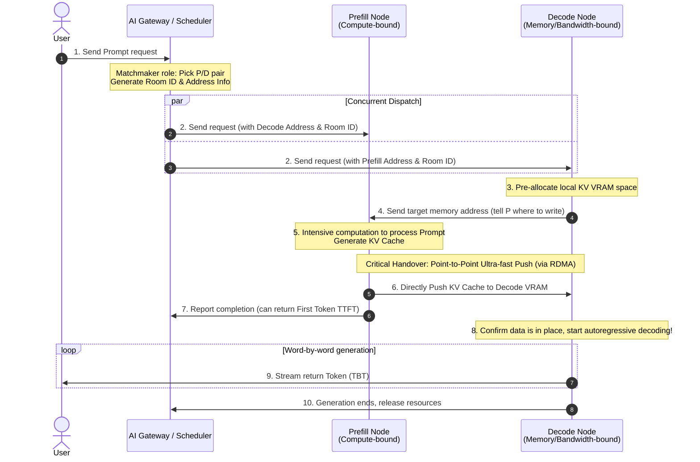

# Part Four: Distributed Chapter — The Concerto Across Single Nodes: Parallel Strategies and High-Speed Interconnects

The final part zooms out to cluster-level architecture and how top tech companies serve billions of requests.

## Chapter 16: Slicing the Giant: Tensor, Pipeline, and Context Parallelism

When the model's parameter count soars from 7B (7 billion) to 400B (400 billion) or even larger, the physical limits of a single graphics card and even a single server are completely shattered. We must slice this "giant" into pieces and distribute them across multiple machines for collaborative inference. This chapter will introduce the core technologies of distributed inference.

### Section 1: The Necessity of Multiple Machines: The Giant That Doesn't Fit

Why must we perform distributed inference? The most direct reason is that **it cannot fit into the VRAM (Video RAM)**.

Take a 400B parameter model as an example:
* If using half-precision (FP16) storage, the model weights alone would occupy **800 GB** of VRAM!
* Take the classic **NVIDIA H100** as an example, its single-card VRAM is usually 80 GB. This means you need at least 10 H100 graphics cards to barely "fit" this model (and this leaves absolutely no room for KV Cache).

Although with the rapid evolution of hardware, the Blackwell architecture (like B200, with single-card VRAM up to 192 GB) has come to the stage, and there will be an even stronger Rubin architecture in the future, meaning the required number of cards will correspondingly decrease. However, the physical limit of "single card cannot fit super large model weights and massive KV Cache" still exists. Therefore, multi-machine, multi-card distributed inference is not an option, but an absolute necessity.

---

### Section 2: TP and PP: Vertical and Horizontal Slicing

To make multiple graphics cards work together collaboratively, the industry mainly has two classic slicing strategies:

**1. Tensor Parallelism (TP) — Vertical Slicing**
* **Approach**: Take a huge matrix multiplication (tensor) in the model and slice it "vertically" or "horizontally", distributing it to different GPUs for computation. For example, GPU 1 computes the left half, GPU 2 computes the right half, and finally the results are aggregated through high-speed interconnects (like NVLink) via AllReduce.
* **Characteristics**: It occurs **inside each network layer**. The communication is extremely frequent and the bandwidth requirement is extremely high, so it is usually limited to **within a single machine** among multiple cards.

**2. Pipeline Parallelism (PP) — Horizontal Slicing**
* **Approach**: Break apart the layers of the model. Suppose a model has 80 layers, machine A is responsible for layers 1~40, and machine B is responsible for layers 41~80. After machine A finishes computing the hidden states of the first 40 layers, it sends them over the network to machine B to continue the computation.
* **Characteristics**: It occurs **between layers**. The communication frequency is relatively low, making it very suitable for distributed deployment across different physical hosts (Multi-host).

By combining TP and PP (for example, 8-card TP + 2-machine PP), we can elegantly slice a super large model across 16 or even more graphics cards.

---

### Section 3: Automatic Distribution: Distributed Decoupling of Compute and Memory

When we slice a large model onto multiple graphics cards or multiple machines, the occupation of **Compute** and **Memory** will naturally undergo a distributed decoupling.

We can examine this distribution from the two dimensions of compute and memory:

**1. Distributed Distribution of Compute**
* **Tensor Parallelism (TP)**: Breaks apart the **computation within a single layer**. A huge matrix multiplication is sliced into several blocks, distributed to different GPUs for parallel computation. This means each card only bears a part of the computational load.
* **Pipeline Parallelism (PP)**: Breaks apart the **computation between layers**. Machine A computes the first few layers, machine B computes the latter layers, and the computation presents a pipeline-style relay in time.

**2. Distributed Distribution of Memory (The True Composition of VRAM)**
In a distributed environment, the VRAM occupation is mainly composed of the following parts, and they will be naturally isolated and amortized:

1. **Model Weights**: Under TP, each card only stores the weights of the matrix slice it is responsible for; under PP, each machine only stores the weights of the dozens of network layers it is responsible for. This completely solves the ultimate problem of "not fitting in a single machine".
2. **KV Cache (Attention Cache)**: Under TP, because the attention heads are sliced, each GPU is only responsible for storing the K and V vectors corresponding to its share of heads; under PP, the KV Cache is strongly bound to the layers, and only the machine responsible for processing specific layers will hold the KV Cache of those layers.
3. **Activations and Temporary Buffers**: Temporary data such as intermediate feature maps generated during the model's forward propagation process will also be scattered on respective GPUs following the computation slicing. Within the TP group, these activations need to be synchronized frequently, while the PP group needs to pass the activations at the stage boundaries across machines.

This distributed architecture of "each managing its own, natural isolation" avoids the complexity of building a centralized giant memory pool, but it also imposes extremely high requirements on inter-chip high-speed interconnects (NVLink/RDMA) to ensure that these scattered fragments can be perfectly pieced together into the ultimate intelligence.

---

### Section 4: The Impact of TP and PP on Core Metrics

After understanding the basic principles of TP and PP, let's systematically analyze their impact on the core performance metrics we defined in Chapter 4 (TTFT, TBT, Throughput). For a more precise analysis, we must strictly distinguish the following time concepts:
* **Queueing Time**: The time a request waits in the scheduling queue for GPU resources.
* **Execution TTFT**: The pure computation time from when the model truly begins processing the request to spitting out the first Token.
* **User-facing TTFT**: The total time from when the user presses the send key to seeing the first word on the screen (roughly equal to Queueing Time + Execution TTFT + Network transmission delay).

**1. The Metric Impact of Tensor Parallelism (TP): Brute Force and Lane Expansion**
* **Impact on Execution TTFT**: **Significantly reduced**. The Prefill phase is compute-bound. TP directly shortens the pure computation time of the model run by amortizing the matrix multiplication computation.
* **Impact on TBT / TPS**: **Slightly reduced (improves TPS)**. In the Decode phase, TP can still accelerate the computation of each step. But because the computation amount is small, the communication overhead ratio of cross-card All-Reduce will rise, and the speedup ratio is not linear.
* **Impact on Queueing Time and Throughput**: **Dual optimization but with a Trade-off**.
    1. **Shorten service time**: Because TP computes faster, old requests disembark quickly, and the queueing time for subsequent requests naturally shortens.
    2. **Expand concurrency capacity**: TP aggregates multi-card VRAM, allowing a larger Batch Size to be enabled. Requests originally in the queue can be directly pulled into the Batch for joint processing, reducing the queueing time to 0.
    * *Trade-off*: If a model can originally fit into a single card, forcing TP will introduce communication overhead that consumes total compute, and actually reduces throughput.

**2. The Metric Impact of Pipeline Parallelism (PP): Multi-stage Relay and Throughput is King**
* **Impact on Execution TTFT**: **Slightly increased**. Requests must sequentially flow through the layers of different machines, and cross-machine communication and pipeline startup bring fixed latency overhead.
* **Impact on TBT / TPS**: **Almost no improvement**. It is only a physical split between layers and does not accelerate the forward computation of a single Token.
* **Impact on Queueing Time and Throughput**: **Significantly increased**.
    * **Pipeline effect reduces queueing**: When request A completes the first stage Prefill on the first machine and flows to the next machine, the first machine is immediately released, and request B in the queue can immediately begin its Prefill. This spatial multiplexing allows new requests to enter the system earlier.
    * **Throughput is king**: Through the pipeline mechanism (different machines simultaneously process different layers of different Batches), the GPU utilization is greatly improved. It is a sharp weapon for increasing the throughput of large clusters. High throughput helps digest the queue, macroscopically reducing the average queueing time.

---

### Section 5: Breaking the Sequence Wall: Context Parallelism

As the context window of large models soars from thousands in the early days to millions today (such as Gemini 1.5), traditional Tensor Parallelism (TP) and Pipeline Parallelism (PP) begin to appear inadequate when handling super-long sequences. This gave birth to a third slicing dimension — **Context Parallelism (CP)**.

**1. What problem does it solve?**
In extremely long context scenarios, the core bottleneck is no longer just model weights, but the **KV Cache growing linearly with sequence length** and the **attention computation volume growing quadratically**.
* Even if you use TP to slice the model weights onto 8 cards, a single card still might not be able to fit the KV Cache for a sequence of hundreds of thousands or even millions of Tokens.
* Traditional TP focuses on slicing the Hidden Dimension, but cannot effectively amortize the VRAM and compute pressure brought by the Sequence Length dimension.
* Therefore, the core goal of CP is to **smash the "sequence wall"**, allowing the system to process super-long texts far exceeding single-card VRAM capacity.

**2. How does it work?**
The core idea of Context Parallelism is to **slice along the Sequence Dimension**:
1. **Sequence chunking**: Cut a sequence of tens of thousands or even millions of Tokens into $N$ small chunks, and distribute them to $N$ GPUs. Each GPU is only responsible for processing and storing the KV Cache of its segment of the sequence.
2. **Ring Attention**: Because the self-attention mechanism requires each Token to compute with all preceding Tokens, after the sequence is cut, communication must occur between GPUs. A typical approach is to use the **Ring Attention** mechanism: each GPU forms a ring topology. While computing the Attention of local data, they pass the KV Cache chunks in the ring like passing a parcel. This allows the global attention computation to be completed without centralizing all KV Caches on a single card.

> [!NOTE]
> **Deep Dive: Dynamic Coordination and Load Balancing of Ring Attention**
>
> The implementation of Ring Attention is not simply "data chunking"; it faces enormous engineering challenges in communication coordination and computational load balancing.
>
> **1. "Pass the Parcel" Coordination of Communication and Computation**
> Suppose we slice the sequence into 3 chunks, collaboratively computed by 3 machines. Machine 1 holds $Q_1, K_1, V_1$; Machine 2 holds $Q_2, K_2, V_2$; Machine 3 holds $Q_3, K_3, V_3$. In Causal Attention (autoregressive) mode, the coordination process is as follows:
> * **Step 1**: All machines start simultaneously, computing the attention of local $Q$ with local $KV$. At the same time, asynchronous communication is initiated, passing $KV$ chunks in the ring like a parcel: Machine 1 sends $KV_1$ to Machine 2, Machine 2 sends $KV_2$ to Machine 3, and so on.
> * **Step 2**: After receiving the $KV$ chunk passed from upstream, the machine computes the attention of local $Q$ with the new $KV$. For example, Machine 2 receives $KV_1$ and computes the attention of $Q_2$ with $KV_1$. At this time, Machine 1 receives $KV_3$, but because it is causal attention, it cannot look at future information, so this computation is invalid (or masked out).
> * **Step 3**: Continue passing $KV$ chunks. Machine 3 eventually receives $KV_1$ and computes the attention of $Q_3$ with $KV_1$.
>
> In this way, each machine eventually completes the computation with all the historical $KV$ chunks it needs. Because communication is asynchronous, the latency of attention computation is effectively hidden. **To maintain mathematical equivalence**, each machine needs to combine Online Softmax (a trick similar to FlashAttention) to dynamically update the maximum value and accumulated sum of the local Softmax after receiving a new KV chunk.
>
> **Ring Attention Coordination Flowchart:**
> ```mermaid
> sequenceDiagram
>     participant M1 as Machine 1 (holds Q1, KV1)
>     participant M2 as Machine 2 (holds Q2, KV2)
>     participant M3 as Machine 3 (holds Q3, KV3)
> 
>     Note over M1, M3: Step 1: Compute locally and pass KV
>     par Asynchronous Communication
>         M1->>M2: Send KV1
>     and
>         M2->>M3: Send KV2
>     and
>         M3->>M1: Send KV3
>     end
>     Note over M1: Compute Q1 * KV1
>     Note over M2: Compute Q2 * KV2
>     Note over M3: Compute Q3 * KV3
> 
>     Note over M1, M3: Step 2: Compute received KV and continue passing
>     par Asynchronous Communication
>         M1->>M2: Forward KV3
>     and
>         M2->>M3: Forward KV1
>     and
>         M3->>M1: Forward KV2
>     end
>     Note over M1: Compute Q1 * KV3 (Invalid in Causal mode)
>     Note over M2: Compute Q2 * KV1
>     Note over M3: Compute Q3 * KV2
> 
>     Note over M1, M3: Step 3: Final round of computation
>     Note over M1: Compute Q1 * KV2 (Invalid in Causal mode)
>     Note over M2: Compute Q2 * KV3 (Invalid in Causal mode)
>     Note over M3: Compute Q3 * KV1
> ```
>
> **2. The Challenge of Load Imbalance and Zig-zag Optimization**
> As can be seen from the above process, in Causal Attention, valid attention computation presents a lower triangular shape:
> * Machine 1 only needs to compute 1 valid computation ($Q_1$ with $KV_1$).
> * Machine 2 needs to compute 2 valid computations ($Q_2$ with $KV_1, KV_2$).
> * Machine 3 needs to compute 3 valid computations ($Q_3$ with $KV_1, KV_2, KV_3$).
>
> This leads to severe load imbalance, and Machine 1 and Machine 2 will be idle early. To solve this problem, the industry mainly has two solutions:
> * **Solution A: Brute-force Padding/Masking**: All machines perform full-load computation; even invalid future chunks are computed normally, and finally forcibly filtered out with a mask. While this keeps the code simple and symmetric, it wastes nearly 50% of compute.
> * **Solution B: Zig-zag Partitioning / Striping**: Stop slicing the sequence into contiguous intervals, but use a "dealing cards" or "pairing from both ends" method to allocate. Suppose there are 6 chunks. Machine 1 takes chunk 1 and 6 (workload $1+6=7$), Machine 2 takes chunk 2 and 5 (workload $2+5=7$), Machine 3 takes chunk 3 and 4 (workload $3+4=7$). Through this clever orchestration, the computation load of each machine is perfectly balanced, eliminating idle time.
>
> **Load Balancing and Zig-zag Diagram:**
> ```mermaid
> graph TD
>     subgraph "Contiguous Partitioning"
>         N1["Machine 1: Chunks [1, 2]"]
>         N2["Machine 2: Chunks [3, 4]"]
>         N3["Machine 3: Chunks [5, 6]"]
>         N1 -->|"Workload: 1+2 = 3"| NW1["Severely Idle"]
>         N2 -->|"Workload: 3+4 = 7"| NW2["Moderate Load"]
>         N3 -->|"Workload: 5+6 = 11"| NW3["Heavy Load"]
>     end
> 
>     subgraph "Zig-zag Partitioning"
>         Z1["Machine 1: Chunks [1, 6]"]
>         Z2["Machine 2: Chunks [2, 5]"]
>         Z3["Machine 3: Chunks [3, 4]"]
>         Z1 -->|"Workload: 1+6 = 7"| ZW1["Perfectly Balanced"]
>         Z2 -->|"Workload: 2+5 = 7"| ZW2["Perfectly Balanced"]
>         Z3 -->|"Workload: 3+4 = 7"| ZW3["Perfectly Balanced"]
>     end
> ```

**3. How does it affect inference performance?**
1. **Impact on Execution TTFT**: **Dramatically optimizes TTFT for super-long texts**. In the Prefill phase, the computation amount to process a million-word Prompt is extremely terrifying. CP significantly reduces the prefilling time of super-long texts by breaking the sequence and computing in parallel across multiple cards.
2. **Impact on TBT / TPS**: **Minor impact**. In the Decode phase, only one Token is generated at a time, and it does not need to process the matrix multiplication of the full long text like Prefill, so CP has limited improvement on the inter-token time.
3. **Impact on Throughput and Cost**: **Trading high communication costs for "feasibility"**. CP introduces a massive amount of ring communication overhead. It has no advantage in ordinary short-text inference, but in super-long text scenarios, it is the **only solution to "make the task run"**.

### Chapter 17: The Perfect Division of Labor: Disaggregated Serving

What is **Disaggregated Serving**? Put simply, it is an architecture that completely strips the **Prefill** phase and **Decode** phase of large model inference and runs them on physical clusters with different hardware configurations.

In Part Three, we introduced **Continuous Batching** and **Chunked Prefill**. They achieved the "perfect carpooling" of Prefill and Decode at the single-machine level, greatly squeezing the performance of a single graphics card. You might ask: Since the single-machine problem has been solved, why go through the trouble of doing disaggregated serving?

The answer is: single-machine optimization is only a **"tactical-level"** limit squeeze. Attempting to perfectly balance Prefill and Decode within a single machine is not only constrained by the physical limits of **hardware mismatch**, but also brings **extremely high complexity in system management and scheduling**. When the service scale reaches an industrial magnitude, the "perfection" within a single machine becomes a macroscopic "burden". This chapter will unveil **Disaggregated Serving** and see how it simultaneously solves hardware mismatch and greatly simplifies resource management.

#### Section 1: Irreconcilable Contradiction: Hardware Mismatch and Management Dilemma

We mentioned in Chapter 8 that Prefill and Decode have completely opposite hardware requirements:
* **Prefill**: Processes massive inputs, requiring extremely high **Compute (FLOPs)**, but relatively small VRAM capacity requirements.
* **Decode**: Spits out Tokens word by word, with very little computation (compute is idle), but needs to frequently move massive KV Caches from VRAM, extremely craving **Memory Bandwidth** and **Memory Capacity**.

If using a traditional unified architecture (mixed deployment), the system will face a double blow:
1. **Waste from Hardware Mismatch**: When you use an expensive H100 graphics card to run the Decode phase, its world-destroying Tensor Core compute is "sleeping" and waiting for memory to move data most of the time. This is tantamount to using a dragon-slaying sword to chop wood, causing a huge waste of cost.
2. **The "Tightrope Walking" of Management and Scheduling**: To solve this contradiction on a single machine, engineers invented extremely complex scheduling algorithms like Continuous Batching and Chunked Prefill (as described in previous chapters). This is tantamount to "walking a tightrope" on a single graphics card — the system must carefully balance the resource occupation of both; any carelessness will trigger jitter in Time to First Token (TTFT) or Time Between Tokens (TBT). This multi-dimensional (compute, memory capacity, bandwidth) mixed optimization makes the resource planning and capacity management of the cluster exceptionally complex.

> [!NOTE]
> **Why can't Chunked Prefill save it?**
> Although we can chop the Prefill computation into pieces and stuff them into the idle time of Decode, this still requires us to purchase expensive high-bandwidth graphics cards to accommodate the memory bandwidth of Decode. And in long-text generation (like writing novels) or high-concurrency scenarios, the GPU will still be in a "bandwidth-bound" state for a long time, and expensive compute is still being wasted. Furthermore, the two competing for resources on the same card will inevitably lead to jitter in Time to First Token (TTFT) and Time Between Tokens (TBT), and does not fundamentally simplify management.

---

#### Section 2: Physical Separation: Decoupling Hardware, Simplifying Management

To fundamentally break the deadlock, top tech companies have begun to adopt the **Disaggregated Serving** architecture (such as various internal systems at Google and the open-source DistServe).

The core idea is **Physical Isolation**:
1. **Prefill Cluster**: Composed of machines with extremely strong compute but average memory, dedicated to receiving users' long Prompts, completing prefilling at the fastest speed, and generating the initial KV Cache.
2. **Decode Cluster**: Composed of machines with average compute, but equipped with massive HBM memory and ultra-high memory bandwidth, dedicated to storing KV Cache and spitting out Tokens word by word.

This division of labor brings dual benefits:

**1. Solves Hardware Mismatch, Unleashes Hardware Potential**
We can make independent hardware purchases for different clusters, **pursuing extreme TTFT in the Prefill cluster, and pursuing extreme TPS and TBT stability in the Decode cluster**, squeezing the characteristics of each hardware to the extreme, and significantly reducing the overall TCO (Total Cost of Ownership).

**2. Simplifies Resource Matching and Management (Dimensionality Reduction Strike)**
More importantly, disaggregated serving **reduces the complex mixed scheduling problem into a simple capacity planning problem**:
* **Farewell to "Micromanagement"**: Prefill nodes just focus on computing the Prompt; Decode nodes just focus on smoothly spitting out text. The system no longer needs to do complex resource balancing within a single machine, greatly improving system stability and maintainability.
* **Business-Driven Minimalist Scaling**: Resource management is no longer black-box algorithm tuning, but directly linked to business profiles.
    * **RAG (Retrieval-Augmented Generation) and Long Document Q&A**: Users usually upload tens of thousands of words of background material, but only ask the model to answer a few hundred words. This is a **"heavy Prefill, light Decode"** scenario. Under the separated architecture, we only need to directionally scale the Prefill cluster.
    * **Agent and Chain of Thought (CoT) Inference**: The user might only input a short instruction, but the model behind the scenes needs to perform complex tool calls or an "inner monologue" of tens of thousands of words. This is a **"light Prefill, heavy Decode"** scenario. At this time, we only need to directionally scale the Decode cluster equipped with massive VRAM, avoiding paying unjust money for Prefill compute.

Through this refined resource matching, disaggregated serving not only solves the awkwardness of chopping wood with a dragon-slaying sword but also makes the resource matching and management of the entire cluster clean and controllable.

#### Section 3: Typical Workflow of Disaggregated Serving

After understanding the advantages of disaggregated serving, let's see how a request flows under the separated architecture. It is like a carefully arranged relay race. The **AI Gateway** plays the role of a "Matchmaker", while the **Prefill Node** and **Decode Node** perform point-to-point handovers:

1. **Request Access and Matchmaking**: The user sends a Prompt request that arrives at the **AI Gateway**. The gateway selects a set of **Prefill Node** and **Decode Node** based on policy and generates a globally unique session identifier (like Room ID) for them.
2. **Concurrent Dispatching**: The AI Gateway **concurrently** sends the request with connection information (target node address and Room ID) simultaneously to the selected Prefill Node and Decode Node.
3. **Point-to-Point Handshake and Pre-allocation**:
   * After the **Decode Node** receives the request, it first **pre-allocates** VRAM space in the local KV pool for the request, and sends these target memory addresses via the control flow to the Prefill Node ("write here").
   * At this time, the two nodes complete the point-to-point handshake.
4. **Prefill Computation and Direct Push**:
   * The **Prefill Node** goes full fire, computing the Prompt and generating the KV Cache.
   * After the computation is completed, the Prefill Node takes the target address sent by the Decode Node, and via a high-speed **RDMA** network (such as the Mooncake transport engine), **directly pushes** the full KV Cache into the VRAM of the Decode Node.
5. **Decode Generation**:
   * After the Decode Node confirms data reception is complete, it directly skips the Prefill phase, takes over the subsequent autoregressive generation work, and spits out Tokens word by word.
   * The generated Tokens are streamed back to the user in real-time.

To let you see this process of "gateway matchmaking, node direct connection" more intuitively, we can use the following diagram to represent it:



This decentralized data handover mechanism where "the gateway only controls flow, nodes connect point-to-point" successfully prevents the gateway from becoming the bottleneck of massive KV data transmission, transforming resource competition within a single machine into efficient pipeline work between clusters.

---

### Chapter 18: The Omniscient Traffic Police: Content-Aware Routing

In Chapter 17, we split the cluster into a Prefill pool and a Decode pool. So, when massive HTTP requests pour in, who decides which request goes to which machine? This chapter will introduce the "traffic police" in the large model cluster — **Content-Aware Routing**.

#### Section 1: AI Gateway: The Traffic Police That Knows the Business

Traditional load balancers (like Nginx or F5) only care about basic physical metrics such as network traffic, concurrent connections, and server CPU/memory utilization. To them, an HTTP request is just a bunch of meaningless bytes.

But in an LLM inference cluster, this "blind" routing leads to disaster. Because the cost of large model inference is almost entirely determined by the **content and length of the Prompt**.

Thus, the **AI Gateway** emerged. It is a traffic police that knows the business:
* **Request Inspection**: Before a request reaches the GPU, the gateway first parses it to see how many Tokens it contains and what business type it belongs to.
* **Intelligent Routing Decision**: Because the resource consumption difference of large model requests in the Prefill and Decode phases is huge, the gateway cannot simply distribute by "round-robin", but needs to perform combined routing to Prefill nodes and Decode nodes based on the **request profile (Prompt length and expected output length)**.

We can use the following table to sort out the routing decision logic of the AI Gateway under different request scenarios:

| Request Profile | Features (Input/Output) | Prefill Node Routing Policy | Decode Node Routing Policy |
| :--- | :--- | :--- | :--- |
| **Daily Chat** | Short Input / Short Output | **Greedy/Ultra-fast**: Assign to the node with the shortest current queue and lightest load, pursuing extreme TTFT. | **Random/Round-robin**: Extremely low requirements for VRAM capacity and bandwidth, any low-load node will do. |
| **Knowledge Base (RAG)** | **Long Input** / Short Output | **Compute First**: Must dispatch to a currently non-heavy-load, compute-abundant node, otherwise the massive Prefill will cause TTFT explosion. | **Capacity First**: Must route to a node with **large remaining VRAM capacity** to accommodate the massive initial KV Cache. |
| **Agent/Long Text Gen** | Short Input / **Long Output** | **Fast Pass**: Prefill time is extremely short, assigning to a normal idle node is fine. | **Bandwidth & Stability First**: Decode lasts long, must select a node with few currently active Batches and abundant memory bandwidth (to guarantee TBT). |
| **Complex Analysis/Long Conversation** | **Long Input** / **Long Output** | **Resource Tilt**: Extremely consumes compute, needs to select the most idle top-compute node, even triggering Context Parallelism (CP). | **Double Strict**: Needs both **large VRAM capacity** (to fit the large initial KV) and **sufficient VRAM bandwidth** (to support long-term continuous text generation). |

> [!NOTE]
> **Anti-Deadlock and Anti-Head-of-Line (HOL) Blocking**: When long and short requests arrive at the same time, the AI Gateway will try its best to avoid putting short requests behind long requests. If Prefill nodes are all busy, the gateway might even let short requests cut in line (Priority Queue) or divert them to specially reserved "fast lane" nodes to ensure the ultimate experience for short requests.

---

#### Section 2: Cache-Aware Routing and Dynamic Replication

In large model clusters, **Cache-aware Routing** is the most powerful killer feature of the AI Gateway.

**1. Why is it needed?**
Combined with the **RadixAttention (Prefix Caching)** we learned in Chapter 11, if multiple requests share the same System Prompt, long document background, or historical conversation, the node will locally cache the KV Cache of these prefixes.
If the gateway just blindly routes round-robin, requests with the same prefix will be scattered to different nodes, causing each node to repeat the Prefill computation. This not only wastes massive GPU compute but also greatly lengthens TTFT.
Therefore, we need the gateway to be aware of the prefix content of the request, and accurately route the request to the node that already holds the cache.

**2. Its Workflow**
* **Prefix Matching**: The gateway maintains a global "cache index table", recording which text prefixes are cached on which node. When a new request comes in, the gateway scans its prefix, sends it to the node with the highest hit rate, and directly reuses the KV Cache.
* **Dynamic Replication (Solving the Thundering Herd Problem)**: If a prefix (like an internet-viral system prompt) becomes a super hotspot, all requests will madly surge to the node holding the cache, which will cause that node to be instantly overwhelmed. At this time, the gateway must have the capability of **Dynamic Replication**. After detecting a load imbalance, it diverts traffic to idle nodes, and prompts idle nodes to also establish a replica of that cache, achieving load balancing.

---

#### Section 3: SGLang's System-Level Implementation: Gateway Approximate Tree and Shared L3

After understanding the principle, let's take **SGLang**, a cutting-edge inference engine, as an example to see how it implements this mechanism with extremely low system overhead. SGLang's design is very clever. It doesn't use complex centralized "explicit replication" instructions, but naturally combines the **gateway's soft routing** with the **backend's hierarchical caching**.

**1. The Gateway's "Approximate Prefix Tree" (Solving Matching Overhead)**
In SGLang's Rust gateway, a global **Approximate Radix Tree** is maintained.
* **Tokenizer-free Optimization**: To ensure the ultra-high throughput of the gateway, this tree **directly stores Raw Text strings** instead of Token IDs. Thus, the gateway doesn't need to load a massive vocabulary for tokenization, and can quickly locate the cache simply via string matching.
* **Dual-Mode Switching**: When system load is balanced, the gateway routes by cache match rate (heading straight for the memory node); when it detects that a node has a too-high load due to hotspot requests, the gateway will **forcibly switch to the "Shortest Queue"** policy, throwing new requests directly to idle nodes, instantly resolving the thundering herd problem.

**2. The Backend's "L3 Shared Cache" (Solving Replica Generation)**
For requests diverted by the gateway to an idle node, there is no KV Cache locally, and recomputing is too slow. What to do?
SGLang introduces the **HiCache** mechanism, classifying cache into GPU (L1), CPU (L2), and **Distributed Shared Storage (L3)** (like Mooncake or DeepSeek 3FS).

* When the cache of a hotspot node is triggered to write back to L3, and an idle node receives a request diverted from the gateway and finds no local cache, it will **directly Prefetch** this KV Cache from the L3 shared storage.
* After Node B finishes processing, it naturally possesses that cache locally as well. After receiving the feedback, the gateway updates the prefix tree, and Node B officially becomes a new "replica" of that hotspot prefix.

This mechanism where "the gateway only does soft routing diversion, and data relies on shared L3 for automatic on-demand fetching" uses minimal system coupling to achieve extremely elegant cache routing and dynamic replication.

> [!NOTE]
> **Deep Dive: What is HiCache? How does it differ from Single-Machine Tiered Offloading?**
>
> Readers may notice that the hierarchical idea of HiCache is exactly the same as the "Tiered Offloading" we discussed in Chapter 14. Their underlying physical logic is consistent, both utilizing the hardware pyramid of "GPU $\rightarrow$ CPU $\rightarrow$ External Storage" to expand KV Cache capacity.
>
> But HiCache is the **"Cluster Scaled-up Version"** and **"Cache Reuse Version"** of Tiered Offloading:
> 1. **From Single-Machine Anti-Spill to Cluster Sharing**: Traditional Tiered Offloading focuses on passively swapping KV Cache out to CPU when single-machine VRAM is insufficient; while HiCache not only supports local CPU (L2) but also supports distributed storage (L3), with the goal of letting all nodes in the cluster share and reuse these caches.
> 2. **Deeply Bound to the Prefix Tree**: Traditional Offloading manages the independent KV of requests, while HiCache manages the structured common prefixes on the Radix Tree, supporting active Prefetch to hide network latency.

---

### Chapter 19: Opening the Meridians: Network Communication and High-Speed Interconnects in Large Model Inference

Whether implementing model slicing in distributed inference or performing data movement in Disaggregated Serving, **as computation is sliced, communication overhead is also generated**. Network communication is the "lifeline" that determines the success or failure of the system.

This chapter will analyze the core interconnect technologies and bandwidth characteristics relied upon in large model inference, and their adaptation relationships with various parallel modes.


#### Section 1: The Bloodline within a Single Machine: PCIe, NVLink, and NVSwitch

Inside a single server, the interconnect technology between multiple GPUs has undergone tremendous evolution:

1. **PCIe (Peripheral Component Interconnect Express)**:
    * **Characteristics**: Traditional universal bus. GPUs communicate with the CPU and other devices via PCIe. Currently, the mainstream PCIe 5.0 x16 unidirectional bandwidth is about 64 GB/s.
    * **Limitations**: In scenarios like Tensor Parallelism (TP) that require extremely high-frequency, massive data synchronization, PCIe bandwidth will become a severe bottleneck.
2. **NVLink + NVSwitch (Modern High-Speed Interconnect Solution)**: NVLink and NVSwitch are two layers used in combination, jointly forming a fully interconnected high-speed network within a single machine.
    * **NVLink (Transmission Medium)**: A high-speed point-to-point link developed by NVIDIA specifically for GPU interconnection, allowing two GPUs to directly read and write each other's VRAM (P2P), bypassing the CPU. The bandwidth is extremely high, such as NVLink 4.0 on H100, which can provide a bidirectional total bandwidth of up to 900 GB/s.
    * **NVSwitch (Switching Node)**: NVLink is a point-to-point connection. If 8 GPUs are to be fully interconnected at full speed, theoretically C(8,2)=28 independent links are needed, and the GPU's physical interfaces are simply not enough. NVSwitch solves this scalability problem — each GPU connects via NVLink to this dedicated switch chip, NVSwitch, which does internal routing, allowing any two GPUs to communicate with full NVLink bandwidth.
    * **Overall Effect**: 8 GPUs only need to individually connect to NVSwitch to obtain a full-speed, fully interconnected network equivalent to pairwise direct connections, which is the physical cornerstone for realizing efficient Tensor Parallelism (TP).

#### Section 2: The Cross-Machine Bridge: RDMA and Its Implementations

When distributed inference spans physical nodes (Multi-host), traditional Ethernet and TCP/IP protocol stacks cannot meet the requirements. Data departing from the GPU must go through GPU VRAM → CPU Memory → Kernel Network Stack → NIC. The path is extremely long, the CPU is involved in the movement the whole time, the latency is high, and the consumption is large.

**RDMA: Solving the Problem from the Root**

RDMA (Remote Direct Memory Access) allows the network card to directly read and write the GPU VRAM of a remote machine, **bypassing the CPU and kernel**, to achieve Zero-copy. The benefit is dual: latency drops from milliseconds to microseconds, while freeing up CPU compute to focus on inference itself.

**Two Implementations: InfiniBand vs. RoCE**

RDMA is a capability that can run on different physical networks. Currently, there are two mainstream implementations:

1. **InfiniBand (IB)**: A private network designed specifically for HPC, integrating software and hardware, and natively supporting RDMA. Naturally lossless (credit-based flow control, no packet loss), providing extremely high bandwidth (400Gbps NDR, 800Gbps XDR) and extremely low latency (sub-microsecond level). The cost is high, requiring dedicated IB NICs and switches, and it cannot reuse existing Ethernet infrastructure.
2. **RoCE (RDMA over Converged Ethernet)**: Moves RDMA semantics to run over Ethernet, can reuse existing infrastructure, and significantly reduces costs. The trade-off is that Ethernet itself drops packets. A "lossless Ethernet" must be constructed by configuring PFC (Priority-based Flow Control) and ECN (Explicit Congestion Notification). Network operations and maintenance complexity is high, and if configured improperly, congestion packet loss will cause performance to plummet.

| | InfiniBand | RoCE |
|---|---|---|
| Typical Bandwidth | 400G～800Gbps | 200G～400Gbps |
| Latency | Sub-microsecond | Microsecond level (slightly higher) |
| Losslessness | Natively supported | Needs PFC/ECN configuration |
| Cost | High (Dedicated Hardware) | Low (Reuses Ethernet) |
| Suitable Scenario | Extreme latency-sensitive large clusters | Cost-sensitive or existing Ethernet infrastructure |

**NVLink Switch: Cross-Machine NVLink Extension**

NVLink Switch (like NVSwitch in the GB200 NVL72 system) connects GPUs across multiple machines via optical cables into a super-large NVLink domain, breaking the 8-card limit of a single machine, allowing 72 GPUs to form a fully interconnected cluster, with cross-machine bandwidth and latency approaching single-machine NVLink levels. Currently, it is mainly targeted at ultra-large-scale training scenarios, and the overall cost is extremely high; the cross-machine communication needs of inference scenarios (PP, Disaggregated Serving) are sufficiently met by InfiniBand or RoCE, so it is not a focus here.

#### Section 3: Parallel Modes, Data Volumes, and Metric Impacts

To give you a global, quantitative understanding of network communication under different modes, we summarize the various parallel modes of distributed inference and the cross-machine transmission characteristics of disaggregated serving in the table below:

| Mode | Frequency & Scope | Single Transfer Volume | Total Volume per Event | Metrics Affected | Required Network |
| :--- | :--- | :--- | :--- | :--- | :--- |
| **Tensor Parallelism (TP)** | **Step-level · Continuous Ultra-high Frequency**: $2 \times L$ times / step<br>(Both Prefill and Decode per step) | $O(N \cdot d)$<br>(Extremely small in Decode; Medium in Prefill) | $O(L \cdot N \cdot d)$ | **TBT**, **TTFT**<br>(Extremely sensitive to latency) | Intra-machine NVLink / NVSwitch |
| **Pipeline Parallelism (PP)** | **Step-level · Continuous Low Frequency**: $P - 1$ times / step<br>(Both Prefill and Decode per step) | $O(N \cdot d)$<br>(Medium volume) | $O(P \cdot N \cdot d)$ | **Throughput**, **TTFT**<br>(Slow transfer lengthens pipeline) | Cross-machine InfiniBand / RoCE |
| **Context Parallelism (CP)** | **Request-level · Single Pulse**: $(M-1) \times L$ times / request<br>(Occurs **only in the Prefill phase** once) | $O(\frac{N}{M} \cdot d)$<br>(**Massive**: Can reach hundreds of MBs under super-long text) | $O(L \cdot N \cdot d)$ | **TTFT** (Super-long text)<br>(Slow transfer directly blocks First Token) | Intra-machine NVLink / Cross-machine InfiniBand / RoCE |
| **Disaggregated Serving** | **Request-level · Single Pulse**: $1$ time / request<br>(Occurs **only at phase handover** once) | $O(L \cdot N \cdot d)$<br>(**Single Huge**: Full KV Cache) | $O(L \cdot N \cdot d)$ | **User-facing TTFT**<br>(Transfer time directly counts towards latency) | Cross-machine InfiniBand / RoCE |

> [!NOTE]
> **Parameter Description**: $L$ is the number of model layers; $N$ is sequence length; $d$ is the hidden layer dimension; $P$ is the number of pipeline stages ($P \le L$); $M$ is the number of machines (or GPUs) for Context Parallelism. **"Step"** refers to a single forward propagation iteration. Taking Llama 3 405B ($d=16384$) as an example, at $B=1, N=1024$, the size of $O(N \cdot d)$ FP16 activations is about $32$ MB.


**Dimensional Difference (Core Insight)**: The key to understanding the above table is to distinguish the **"Time Scale"**. TP and PP are **normalized (step-level)**, bound to the scale of a single forward propagation, so the high frequency of TP will extremely squeeze network latency; while CP and Disaggregated Serving are **eventized (request-level)**, bound to the lifecycle of the entire request (triggered only at a specific phase), so although their single data volume is huge, they will not choke the GPU during continuous text generation (Decode) like TP does.

As can be seen from the table, **Tensor Parallelism (TP)** has the harshest requirements on network bandwidth and must be locked into intra-machine NVLink; while **Disaggregated Serving**, although having the largest single transfer data volume, due to its low frequency (each request only transfers once), combined with a 400G/800G RDMA network, its latency can be completely controlled at the millisecond level, making the physical separation architecture feasible in production.
