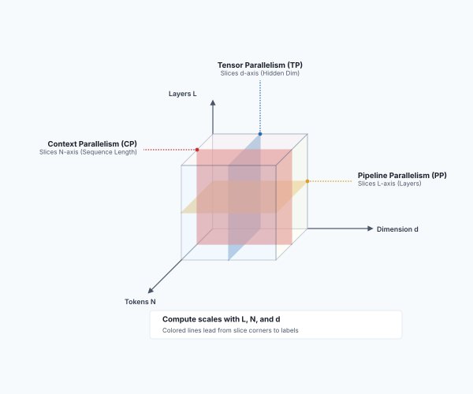
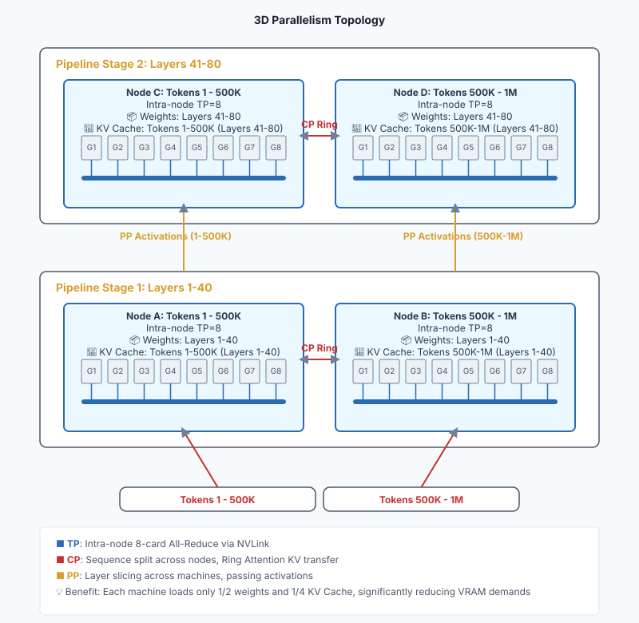
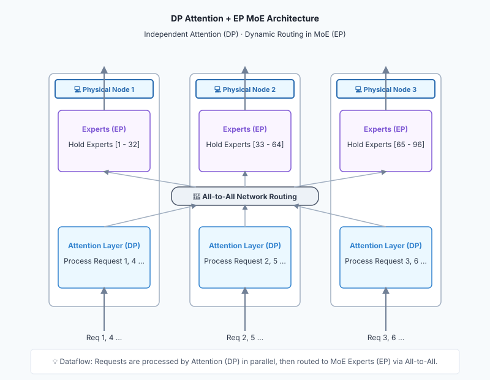
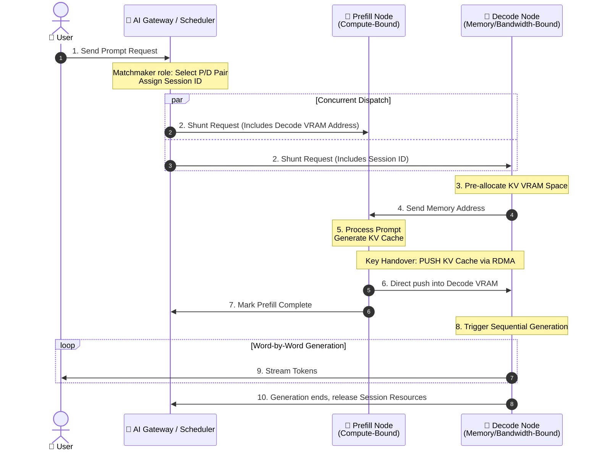

# Part 4: Distributed — Concerto Across Single Nodes: Parallel Strategies and High-Speed Interconnects


This part zooms out to cluster-level architecture and explores how top technology companies serve billions of requests.

---

## Chapter 16: Slicing the Giant: Tensor, Pipeline, and Context Parallelism

When model parameters soar from 7B to 400B or larger, the physical limitations of a single GPU or even a single server are completely shattered. We must shard this "giant" and distribute it across multiple nodes for collaborative inference. This chapter introduces the core technologies of distributed inference.

---

### Section 1: The Necessity of Multiple Machines: The Giant That Doesn't Fit

Why must we deploy distributed inference? The most direct reason is that **VRAM simply cannot fit the model**.

Take a 400B parameter model as an example:

*   If storing the model in half-precision (FP16), model weights alone consume **800 GB** of VRAM!
*   Using a classic **NVIDIA H100** as a baseline, single-card VRAM typically stands at $80$ GB. You would need at least $10$ H100 cards just to load the model—leaving zero capacity for KV Caches.
*   Since a standard AI server holds at most $8$ cards ($640$ GB VRAM), you are physically forced to cross single-machine boundaries and utilize at least $2$ physical servers.

Even though hardware evolves rapidly—with the Blackwell architecture (e.g., B200 with 192 GB VRAM) reducing required GPU counts—the physical limit of single-card capacity persists. It is driven by three factors:

1.  **Continuous Model Expansion**: Model parameters are growing exponentially. From GPT-3’s 175B in 2020 to Llama 4’s projected 2T. Supply chain forecasts indicate next-generation flagship models are targeting 3T to 5T. Single-node capacity is perpetually racing against parameter growth.
2.  **Long Contexts and Massive KV Caches**: In the era of Agents and RAG, long context windows are a strict requirement. Contexts are soaring from thousands of tokens to 128K or even 1M. In the Decode phase, these contexts generate massive KV Caches. Under high concurrency, KV Caches can approach or surpass the weight footprint itself, straining single-node VRAM.
3.  **Hardware Lifecycles and ROI**: In production, hardware like **NVIDIA H100** remains heavily deployed. While upgrading hardware every year is economically unfeasible, teams still need access to state-of-the-art (SOTA) large models. Clustering existing nodes via high-speed networks is the standard solution to maximize ROI.

Consequently, multi-machine, multi-GPU distributed inference is an absolute necessity, not an optional choice.

---

### Section 2: TP and PP: Vertical and Horizontal Slicing

To facilitate collaborative work across multiple GPUs, the industry relies on two classic slicing strategies:

**1. Tensor Parallelism (TP) — Vertical Slicing**

*   **Method**: Shard a large matrix multiplication (tensor) within the model "vertically" or "horizontally" across different GPUs. For example, GPU 1 calculates the left half, GPU 2 calculates the right half, and results are aggregated via high-speed interconnects (e.g., NVLink) using All-Reduce.
*   **Characteristics**: Occurs **within a single network layer**. Communication is frequent and bandwidth demands are extremely high, confining it to **intra-node** deployment.

**2. Pipeline Parallelism (PP) — Horizontal Slicing**

*   **Method**: Split the model by layers. If a model has 80 layers, Machine A manages layers 1 to 40, and Machine B manages layers 41 to 80. After Machine A computes hidden states for the first 40 layers, it transmits them over the network to Machine B.
*   **Characteristics**: Occurs **between network layers**. Communication frequency is relatively low, making it ideal for distributed deployment across distinct physical hosts.

By pairing TP and PP (e.g., 8-card TP + 2-node PP), we can elegantly shard ultra-large models across 16 or more GPUs.

---

### Section 3: Automatic Distribution: Distributed Decoupling of Compute and Memory

When sharding large models across GPUs or physical nodes, both **Compute** and **Memory** allocations naturally undergo distributed decoupling.

We examine this from two distinct dimensions:

**1. Distributed Allocation of Compute**

*   **Tensor Parallelism (TP)**: Shards **computation inside single layers**. A large matrix multiplication gets sliced into smaller blocks, distributing workloads across distinct GPUs.
*   **Pipeline Parallelism (PP)**: Shards **computation between layers**. Machine A calculates earlier layers and Machine B calculates later layers, establishing a pipeline-style temporal relay.

**2. Distributed Allocation of Memory (VRAM Breakdown)**
Under distributed environments, VRAM footprints are partitioned across isolated components:

1.  **Model Weights**: TP stores sharded matrix weights across individual GPUs, while PP allocates the layers across distinct physical machines.
2.  **KV Cache**: Under TP, sliced attention heads cause each GPU to store only the K and V vectors assigned to its heads. Under PP, KV Caches tie to specific layers, residing only on the node handling those layers.
3.  **Activations and Temporary Buffers**: Feature maps generated during forward propagation are distributed across local GPUs. TP frequently syncs these activations, while PP shunts activations across node boundaries.

This decentralized architecture removes the need for centralized memory pools, but demands ultra-high-speed inter-chip interconnects (NVLink or RDMA) to seamlessly sync scattered data.

---

### Section 4: The Impact of TP and PP on Core Metrics

Having understood the basic principles of TP and PP, we analyze their systematic impacts on core metrics defined in Chapter 4 (TTFT, TBT, Throughput). To ensure precise analysis, we divide the time into three distinct phases:

*   **Queueing Time**: Time spent waiting in scheduling queues for GPU resources.
*   **Execution TTFT**: Pure compute time elapsed from when the model initiates processing to the generation of the first Token.
*   **User-facing TTFT**: Total perceived latency by users (approx. Queueing Time + Execution TTFT + Network Latency).

**1. Tensor Parallelism (TP): Brute Force and Lane Expansion**

*   **Impact on Execution TTFT**: **Significantly Reduced**. The Prefill phase is compute-bound; TP shunts matrix calculations to slash raw computation time (assuming All-Reduce bandwidth isn't a bottleneck, e.g., with NVLink).
*   **Impact on TBT / TPS**: **Slightly Reduced (TPS Improved)**. In the Decode phase, TP accelerates individual steps. Since computation volume is small, cross-GPU All-Reduce communication overhead increases, yielding non-linear speedups.
*   **Impact on Queueing Time and Throughput**: **Dual Optimization with Trade-offs**.
    1.  **Faster Serving**: Fast calculations let older requests disembark quickly, naturally cutting wait times for subsequent requests.
    2.  **Expanded Concurrency**: Bundled multi-GPU VRAM supports larger Batch Sizes, directly onboarding queued requests.
    *   *Trade-off*: Applying TP to models that natively fit on a single GPU introduces redundant communication overheads, penalizing total throughput.

**2. Pipeline Parallelism (PP): Multi-Stage Relay and Throughput**

*   **Impact on Execution TTFT**: **Slightly Increased**. Requests sequentially pass through distinct physical nodes, introducing cross-node latency and pipeline warm-up costs.
*   **Impact on TBT / TPS**: **Minimal Improvement**. Horizontal slicing does not accelerate the compute cycle of individual tokens.
*   **Impact on Queueing Time and Throughput**: **Significantly Increased**.
    *   **Pipeline Wait Reductions**: When Request A finishes stage 1 on Node 1 and moves on to Node 2, Node 1 instantly releases, allowing Request B to begin its prefill.
    *   **Throughput is King**: Parallel execution optimizes cluster-wide GPU utilization, serving as a sharp weapon for increasing cluster throughput and cutting average queuing times.

---

### Section 5: Breaking the Sequence Wall: Context Parallelism

As the context windows of large models soar from thousands of tokens to millions, traditional Tensor (TP) and Pipeline (PP) parallelisms become inadequate against ultra-long sequences. This gave birth to the third slicing dimension — **Context Parallelism (CP)**.

**1. What Problem Does It Solve?**
Against ultra-long contexts, core bottlenecks are not only model weights, but also the **KV Cache growing linearly with sequence length** and **attention computation growing quadratically**.

*   Even with weights sharded across 8 GPUs via TP, a single GPU cannot fit KV Caches generated by hundreds of thousands or millions of tokens.
*   Traditional TP focuses on slicing the Hidden Dimension, failing to mitigate sequence length expansion.
*   Therefore, the core goal of CP is to **smash the sequence wall**. It enables systems to accommodate contexts far exceeding single-GPU VRAM limits and divides exponentially growing attention compute across multiple GPUs in parallel, dramatically shortening long-context processing time.

**Schematic of the 3D Slicing Dimensions in LLM Parallelism (L × N × d):**



**2. How Does It Work?**
The core idea of Context Parallelism is to **slice along the Sequence Dimension**:

1.  **Sequence Chunking**: A sequence of millions of tokens splits into $N$ chunks across $N$ GPUs. Each GPU stores and processes only its segment of the KV Cache.
2.  **Ring Attention**: Causal attention requires tokens to calculate against all preceding tokens. GPUs arrange into a ring topology, calculating local attention while passing KV Cache chunks sequentially in a ring. This fulfills global attention compute without aggregating data centrally.

> [!NOTE]
> **Deep Dive: Ring Attention Coordination and Load Balancing**
>
> The implementation of Ring Attention goes beyond data chunking, confronting significant communication and load balancing challenges.
>
> **1. Asynchronous Relay Coordination**
> Suppose 3 GPUs collaboratively compute a sequence. GPU 1 holds $Q_1, K_1, V_1$; GPU 2 holds $Q_2, K_2, V_2$; GPU 3 holds $Q_3, K_3, V_3$. In Causal Attention mode, the process unfolds as follows:
> *   **Step 1**: All GPUs calculate Attention for local data while initiating asynchronous KV chunk transfers (GPU 1 to 2, 2 to 3, 3 to 1).
> *   **Step 2**: Upon receiving upstream KV chunks, GPUs calculate Attention for the new data. In Causal mode, invalid computations (e.g., GPU 1 examining future data $KV_3$) are masked out.
> *   **Step 3**: Continuing the relay ensures all GPUs calculate against required historical contexts. GPUs integrate Online Softmax to dynamically update Softmax maximums and accumulated sums.
>
> **Ring Attention Coordination:**
> ```mermaid
> sequenceDiagram
>     participant M1 as "📟 GPU 1 (Holds Q1, KV1)"
>     participant M2 as "📟 GPU 2 (Holds Q2, KV2)"
>     participant M3 as "📟 GPU 3 (Holds Q3, KV3)"
> 
>     Note over M1, M3: Step 1: Local Compute & Transfer
>     par Asynchronous Communication
>         M1->>M2: Send KV1
>     and
>         M2->>M3: Send KV2
>     and
>         M3->>M1: Send KV3
>     end
>     Note over M1: Compute Q1 * KV1
>     Note over M2: Compute Q2 * KV2
>     Note over M3: Compute Q3 * KV3
> 
>     Note over M1, M3: Step 2: Remote Compute & Next Relay
>     par Asynchronous Communication
>         M1->>M2: Forward KV3
>     and
>         M2->>M3: Forward KV1
>     and
>         M3->>M1: Forward KV2
>     end
>     Note over M1: Compute Q1 * KV3 (Masked)
>     Note over M2: Compute Q2 * KV1
>     Note over M3: Compute Q3 * KV2
> 
>     Note over M1, M3: Step 3: Final Compute
>     Note over M1: Compute Q1 * KV2 (Masked)
>     Note over M2: Compute Q2 * KV3 (Masked)
>     Note over M3: Compute Q3 * KV1
> ```
>
> **2. Load Imbalance and Zig-zag Optimization**
> In Causal Attention, effective workload calculations present a lower triangular shape:
> *   GPU 1 calculates 1 unit of effective workload ($Q_1$ and $KV_1$).
> *   GPU 2 calculates 2 units of effective workload ($Q_2$ with $KV_1, KV_2$).
> *   GPU 3 calculates 3 units of effective workload ($Q_3$ with $KV_1, KV_2, KV_3$).
>
> This structural imbalance forces earlier GPUs to sit idle or waste compute. There are two standard fixes:
> *   **Option A (Brute Force)**: Process the full sequence and mask future tokens, wasting ~50% of total compute.
> *   **Option B (Zig-zag / Striping)**: Deal chunks non-contiguously (e.g., GPU 1 gets blocks 1 and 6, GPU 2 gets 2 and 5, GPU 3 gets 3 and 4). All nodes process equal workloads, neutralizing idle wait times.
>
> **Zig-zag Load Balancing:**
> ```mermaid
> graph TD
>     subgraph "Contiguous Slicing"
>         N1["📟 GPU 1: Chunks [1, 2]"]
>         N2["📟 GPU 2: Chunks [3, 4]"]
>         N3["📟 GPU 3: Chunks [5, 6]"]
>         N1 -->|"Workload: 1+2 = 3"| NW1["Severely Idle"]
>         N2 -->|"Workload: 3+4 = 7"| NW2["Moderate Load"]
>         N3 -->|"Workload: 5+6 = 11"| NW3["Heavy Load"]
>     end
> 
>     subgraph "Zig-zag Slicing"
>         Z1["📟 GPU 1: Chunks [1, 6]"]
>         Z2["📟 GPU 2: Chunks [2, 5]"]
>         Z3["📟 GPU 3: Chunks [3, 4]"]
>         Z1 -->|"Workload: 1+6 = 7"| ZW1["Perfectly Balanced"]
>         Z2 -->|"Workload: 2+5 = 7"| ZW2["Perfectly Balanced"]
>         Z3 -->|"Workload: 3+4 = 7"| ZW3["Perfectly Balanced"]
>     end
> ```

**3. Impact on Performance**

1.  **Impact on Execution TTFT**: **Dramatically optimizes long-context TTFT**. CP shards sequence compute across multiple GPUs, significantly shortening the Prefill time for massive prompts.
2.  **Impact on TBT / TPS**: **Minor Impact**. Decoders process a single Token at a time without scaling against the entire prompt, resulting in negligible inter-token latency improvements.
3.  **Impact on Throughput and Cost**: **Trading network overhead for feasibility**. CP introduces high ring communication costs. While yielding no advantages in short-text workloads, it stands as the **only viable solution for ultra-long context generation**.

> [!IMPORTANT]
> **Cross-Node Context Parallelism**
> While this section focuses on intra-node GPU collaboration for simplicity, Context Parallelism can span physical machines. **When context length reaches 1M or more and exceeds the total VRAM of a single machine, CP must cross machine boundaries.**
> In this case, Ring Attention communication uses cross-machine networks (InfiniBand or RoCE). Since their bandwidth and latency are an order of magnitude worse than NVLink, this requires advanced compute-communication overlap techniques, representing the ultimate long-context engineering challenge.

---

### Section 6: Hybrid Parallelism: The 3D Concerto of TP, PP, and CP

When confronted with ultra-large-scale models (e.g., $400\text{B}$) paired with extreme context lengths (e.g., $1\text{M}$ tokens), single parallel strategies fall short. We combine Tensor Parallelism (TP), Pipeline Parallelism (PP), and Context Parallelism (CP) into a rugged 3D parallel topology.

A typical 3D parallel (TP + PP + CP) architecture yields the following physical layering:

*   **Intra-Node (NVLink Domain): Maxed-Out TP**: Inside a single 8-GPU server, TP is set to $\text{TP}=8$. These 8 GPUs connect via high-bandwidth NVLink/NVSwitch, serving as a cohesive "physical atom" holding a weight slice and sustaining high-frequency All-Reduce matrix communication.
*   **Inter-Node Vertical Slicing (Cross-Host Network) for PP**: Physical nodes partition the model's layers vertically via Pipeline Parallelism (PP). **For instance, an 80-layer model splits into 2 stages of 40 layers each (Stage 1 covering layers 1–40, Stage 2 covering layers 41–80).** Nodes pass only lightweight forward activations, imposing minimal stress on cross-machine networks (e.g., InfiniBand or RoCE).
*   **Inter-Node Horizontal Expansion (Cross-Host Network) for CP**: In the same PP stage, Context Parallelism (CP) tackles KV Cache volumes that exceed single-node capacities. **For instance, a $1\text{M}$-token context splits into 2 chunks of $500\text{K}$ tokens each, distributed across two node sets (Node A and Node B).** Nodes duplicate identical layer weights and utilize Ring Attention algorithms to relay KV Cache chunks sequentially across Physical Nodes.

**3D Parallelism Topology (TP + PP + CP):**



**Transformer Block Data Flow**:

*   **Attention Layers**: Require inter-node CP communication (e.g., Ring Attention) to exchange KV Caches, as tokens must "see" one another.
*   **FFN Layers**: Act independently. Host nodes calculate local tokens autonomously without sequence-wide cross-host communication (only intra-node TP synchronization).

While Dense models isolate Attention (CP-dependent) from independent FFN layers, MoE architectures shard FFN layers into multiple experts. This demands a new strategy: **Expert Parallelism (EP)**.

---

## Chapter 17: Expert Parallelism (EP): Precision over Brute Force

Distributing dense models via TP, PP, and CP shares a common trait: every token activates all parameters. 

As models reach trillions of parameters, this brute-force approach hits physical limits. [Mixture of Experts (MoE)](./part1_principles.md#section-7-mixture-of-experts-sparse-activation) solves this by activating only a fraction of parameters per token (e.g., 2 out of 256 experts). This sparse activation property unlocks a new strategy: **Expert Parallelism (EP)**.

---

### Section 1: The Dead End: Attempting to Shard MoE via TP and PP

MoE models decouple model capacity from compute costs. They allow parameter sizes to reach the trillions without causing a linear explosion in compute workloads.

When tackling MoE models with massive parameter footprints (e.g., DeepSeek V3’s $671\text{B}$), the most intuitive approach is relying on **Tensor Parallelism (TP)** and **Pipeline Parallelism (PP)** to shard weights.

**The Deduction Process:**

1.  **Step 1: Intra-node TP for Small Models**: If a model is small (e.g., Mixtral 8x7B at $47\text{B}$), all experts add up to mere gigabytes. Loading the model into an 8-GPU server with **intra-node Tensor Parallelism ($\text{TP}=8$)** is the simplest approach. All GPUs process all experts under NVLink's $900\text{GB/s}$ bandwidth without cross-machine latencies.
2.  **Step 2: Cross-host PP for Larger Models**: When parameter counts grow and a single machine can no longer fit the layers, we introduce **Pipeline Parallelism (PP)**—sharding the model horizontally by network layers into multiple stages across physical hosts. Stage relay communications remain infrequent and lightweight, bypassing limited network bandwidth bottlenecks.
3.  **Step 3: Dead Ends via Pipeline Bubbles**: Pipeline Parallelism cannot be sliced infinitely. PP introduces rigid pipeline bubbles. During word-by-word Decode phases, these bubbles stretch Time Between Tokens (TBT) beyond acceptable user thresholds, confining real-world PP depth to 4 or 8 stages.

**The Dead End:**
Since we cannot slice PP too deeply, the layer groups assigned to a physical machine still hold MoE FFN layers whose experts exceed VRAM capacities. We are physically forced to shard **experts within identical network layers** across distinct nodes.

---

### Section 2: The Dilemma: Cross-Host TP vs. Expert Parallelism (EP)

Engineers face two divergent architectural paradigms when slicing single layers across host boundaries:

1.  **Option A: Cross-Host Tensor Parallelism (Cross-Host TP)**
    *   **Approach**: Extend the TP logic by sharding all experts within a layer vertically or horizontally across different physical nodes.
    *   **Metaphor**: **"Everyone cuts the same tree"** — sharded weights, stationary token activations.
    *   **Fatal Trade-offs**:
        *   **Compute Degradation**: Slicing matrices too finely eliminates large matrix GEMM computations. GPUs degrade into inefficient GEMV operations, severely wasting compute capacity.
        *   **Network Overload**: Every layer triggers multiple cross-machine global All-Reduce events, choking 50-100GB/s inter-host (IB/RoCE) networks.
        *   **Synchronous Blockage**: Cross-host All-Reduce is a rigid synchronous operation. Node calculations must wait for cluster-wide communication to conclude; minor network jitters stall the entire cluster's CUDA cores.
2.  **Option B: Expert Parallelism (EP)**
    *   **Approach**: **Stationary weights, moving tokens**. We preserve the physical integrity of individual experts, anchoring Expert A on Node 1 and Expert B on Node 2. When tokens are calculated, they route over the network (via All-to-All) to the GPU hosting the target expert, compute locally, and route back.
    *   **Metaphor**: **"Divide trees among people"** — stationary weights, moving token activations.
    *   **Core Advantages**:
        *   **Algorithmic Isomorphism**: Maintains physical expert integrity, allowing network routing to fulfill the sorter role in alignment with sparse mapping algorithms.
        *   **High Hardware Efficiency**: Under high-concurrency, EP aggregates tokens destined for the same expert onto a specific GPU. This triggers full GEMM operations, saturates Tensor Cores, and avoids GEMV degradation.
        *   **Compute-Comm Overlap**: All-to-All communication remains asynchronous. While GPUs compute local tokens, the NIC shunts cross-node tokens in the background, hiding communication latency behind computation time.

**Comparing Cross-Host TP and Expert Parallelism (EP):**

| Dimension | Cross-Host Tensor Parallelism (TP) | Expert Parallelism (EP) |
| :--- | :--- | :--- |
| **Philosophy** | Stationary Tokens, Sharded Weights | Stationary Weights, Routed Tokens |
| **Matrix Compute** | Inefficient GEMV | Highly efficient GEMM |
| **Comm Pattern** | All-Reduce (Synchronous) | All-to-All (Asynchronous) |
| **Comm Frequency** | Scaled by active experts | Fixed at 2 events per layer |
| **Overlap** | Blocking Sync | Background Asynchronous Shunting |

> [!NOTE]
> **Quantifying EP vs. TP Communication Volume**
> Intuitively, EP's All-to-All volume seems immense. However, mathematical analysis proves otherwise. Assuming $M$ nodes and $K$ active experts per token, unoptimized theoretical EP yields merely $1/M$ of TP's cross-node traffic. Even when Operator Fusion scales down TP volume by $K$, EP communication traffic remains just $K/M$ of TP.

---

### Section 3: The Golden Duo: DP Attention + EP MoE

Production serving (e.g., DeepSeek V3/R1) deploys a hybrid topology: **DP (Data Parallelism) for Attention layers, and EP (Expert Parallelism) for FFN (MoE) layers**.

This division leverages architectural **heterogeneity**:

1.  **Attention Layers (Dense & Lightweight)**: Modern mechanisms like GQA or MLA compress attention weights enough (typically under 10% of total parameters) to replicate across all GPUs. Attention layers apply **DP**—nodes process local requests without communication, avoiding All-Reduce overhead.
2.  **FFN Layers (Sparse & Heavy)**: Massive expert weights shard across nodes via **EP**, routing tokens over the network.

**DP Attention + EP MoE Architecture:**



> [!NOTE]
> **Trade-offs between DP and CP for Context Volumes**
> DP and CP both shard **input data** rather than weights, but target different dimensions:
> *   **DP Attention**: Slices the **Batch / Request dimension**, targeting maximum throughput.
> *   **CP Attention**: Slices the **Sequence dimension** for a single request, relying on Ring Attention syncs.
>
> Production deployments profile these trade-offs based on text lengths:
> *   **Short Text Limits**: Naive CP on short sequences shards compute too finely, choking GPUs on frequent cross-node ring syncs.
> *   **Long Text Limits**: Conversely, heavy contexts will OOM individual cards unless CP is engaged.
>
> **Engineering Practices:**
> *   **Example 1: Compromise Efficiency for Consistency**: Deploy subtle CP (e.g., $\text{CP}=2$ or 4). Short context throughput drops by 10–20%, but guarantees universal compatibility.
> *   **Example 2: Physical Isolation for Performance**: Implement a routing gateway to shunt traffic at the boundary. High-frequency short context traffic routes to a pure `DP Attention + EP MoE` topology, keeping Attention zero-communication to secure maximum throughput, while heavy long context traffic enters a dedicated `CP Attention + EP MoE` cluster.

---

## Chapter 18: The Perfect Division of Labor: Disaggregated Serving

What is **Disaggregated Serving**? Put simply, it is an architecture that completely isolates the **Prefill** phase and **Decode** phase of large model inference, running them on physical clusters with different hardware configurations.

In Part 3, we introduced **Continuous Batching** and **Chunked Prefill**. These strategies achieve "perfect carpooling" of Prefill and Decode at the single-machine level, squeezing maximum performance out of a single graphics card. You might ask: since single-machine problems have been resolved, why go through the trouble of deploying Disaggregated Serving?

The answer is that single-machine optimizations are mere **"tactical-level"** squeezes. Attempting to balance Prefill and Decode within a single GPU not only runs into the physical limits of **hardware mismatches**, but also introduces **extreme complexity in scheduling and system management**. When serving scales to industrial magnitudes, single-node "perfection" becomes a macroscopic burden. This chapter unveils **Disaggregated Serving**, exploring how it simultaneously resolves hardware mismatches and simplifies resource management.

---

### Section 1: The Mismatch: Hardware Asymmetry and Management Overheads

As mentioned in [Chapter 8: Core Asymmetry: Prefill vs. Decode](../parts/part2_bottlenecks.md#chapter-8-core-asymmetry-prefill-vs-decode), Prefill and Decode have completely opposite hardware requirements:

*   **Prefill**: Processes massive inputs, craving immense **Compute Power (FLOPs)** while carrying relatively small VRAM requirements.
*   **Decode**: Spits out tokens sequentially, consuming minimal compute power (yielding idle compute) while requiring frequent movements of massive KV Caches from memory. It thrives on **Memory Bandwidth** and **Memory Capacity**.

Running a unified deployment architecture (mixed deployment) strikes the system with a double blow:

1.  **Wasted Hardware Mismatch**: When teams deploy expensive B200 graphics cards to handle Decode phases, their high Tensor Core compute spends most of the time "sleeping" while waiting for memory data transfers. This amounts to cutting firewood with a dragon-slaving sword, causing immense cost waste.
2.  **The "Tightrope Walking" of Scheduling**: To manage this conflict on a single GPU, engineers developed complex scheduling algorithms like Continuous Batching and Chunked Prefill. System managers must walk a tightrope, balancing the resource occupations of both phases. Minor slip-ups immediately trigger jitters in Time to First Token (TTFT) or Time Between Tokens (TBT), turning resource planning and capacity management into complex affairs.

---

### Section 2: Physical Separation: Decoupling Hardware, Simplifying Management

To fundamentally break the deadlock, top technology companies deploy the **Disaggregated Serving** architecture (such as various internal systems at Google and open-source DistServe).

The core philosophy centers on **Physical Isolation**:

1.  **Prefill Cluster**: Composed of compute-rich nodes with average memory capacities, dedicated exclusively to receiving users' long Prompts, completing prefilling at maximum speed, and generating initial KV Caches.
2.  **Decode Cluster**: Houses memory-bandwidth nodes equipped with massive HBM memory and ultra-high memory bandwidth, dedicated to hosting KV Caches and streaming tokens sequentially.

This division of labor yields dual benefits:

**1. Resolving Hardware Mismatches and Unleashing Potential**
Teams can purchase independent hardware for different clusters—**targeting extreme TTFT in the Prefill cluster, and extreme TPS and TBT stability in the Decode cluster**—squeezing the absolute best out of both hardware types while significantly reducing total TCO.

**2. Simplifying Resource Management (Dimensionality Reduction)**
More importantly, Disaggregated Serving **transforms complex mixed scheduling problems into straightforward capacity planning questions**:

*   **Farewell to "Micromanagement"**: Prefill nodes focus purely on processing Prompts; Decode nodes focus purely on streaming text. The system no longer requires complex resource balancings within a single GPU, improving system stability and maintainability.
*   **Business-Driven Minimalist Scaling**: Resource management directly links to business workload profiles instead of black-box algorithm tunings.
    *   **RAG and Long Document Q&A**: High input text followed by short answers. This is a **"heavy Prefill, light Decode"** scenario. Under disaggregated serving, engineers directionally scale up only the Prefill cluster.
    *   **Agent and Chain of Thought (CoT) Inference**: A short instruction followed by extensive internal monologue. This is a **"light Prefill, heavy Decode"** scenario. Teams directionally scale up only the Decode cluster, avoiding unnecessary spending on raw compute capacity.

By applying refined resource matching, Disaggregated Serving resolves the dragon-slaying sword dilemma and makes cluster management clean and controllable.

---

### Section 3: Typical Workflow of Disaggregated Serving

Disaggregated serving operates as a carefully choreographed relay race. The **AI Gateway** plays the role of a **"Matchmaker"**, while the **Prefill Node** and **Decode Node** execute point-to-point handovers:

1. **Request Access and Matchmaking**: Users send Prompts to the **AI Gateway**. Acting as a matchmaker, the gateway selects an optimal pair of Prefill and Decode nodes and generates a unique session identifier (Room ID) for them.
2. **Concurrent Dispatching**: The gateway simultaneously shunts the request along with connection details to both selected nodes.
3. **Point-to-Point Handshake and Pre-allocation**: Upon receiving the request, the Decode node pre-allocates memory within its local KV pool and sends the designated memory addresses back to the Prefill node.
4. **Prefill Computation and Direct Push**: The Prefill node processes the prompt and generates the KV Cache. It then leverages high-speed **RDMA** protocols (e.g., the Mooncake engine) to push the full KV Cache directly into the Decode node’s VRAM.
5. **Decode Generation**: The Decode node verifies cache delivery, instantly bypasses the Prefill phase, and takes over self-regression to stream generated tokens back to the user.



This decentralized data handover mechanism—where the gateway only controls flow and nodes connect point-to-point—successfully prevents the gateway from becoming the bottleneck for massive KV data transfers, transforming resource competition within a single machine into efficient pipeline work between clusters.

---

## Chapter 19: Content-Aware Routing: The Traffic Police

Once Disaggregated Serving partitions the cluster into Prefill and Decode pools, the question becomes: when massive HTTP requests pour in, who decides which request routes to which machine? This chapter introduces the "traffic police" of large model clusters—**Content-Aware Routing**.

---

### Section 1: AI Gateways: Business-Aware Traffic Control

Traditional load balancers (e.g., NGINX or F5) only inspect basic physical metrics like network traffic, concurrent connections, and server CPU or memory utilizations. To them, an incoming HTTP request is a stream of generic bytes.

In an LLM inference cluster, such blind routing triggers disasters, as inference costs are heavily determined by **Prompt content and length**.

Consequently, **AI Gateways** act as business-aware traffic police:

*   **Request Inspection**: Before a request reaches the GPU, the gateway parses it to determine how many tokens it holds and what business type it falls under.
*   **Intelligent Routing Decisions**: Since resource consumption differences across Prefill and Decode phases are immense, the gateway routes intelligently based on **request profiles** (input length versus expected output length) rather than employing blind round-robin scheduling.

**AI Gateway Routing Policies:**

| Request Profile | Features (Input/Output) | Prefill Node Routing Policy | Decode Node Routing Policy |
| :--- | :--- | :--- | :--- |
| **Daily Chat** | Short Input / Short Output | **Greedy/Ultra-Fast**: Route to the shortest queue and lowest load for rapid TTFT. | **Random/Round-Robin**: Low demands on VRAM and bandwidth; any idle node will suffice. |
| **Knowledge Base (RAG)** | **Long Input** / Short Output | **Compute-First**: Must dispatch to a currently non-overloaded, compute-rich node; otherwise massive prefills will blow up TTFT. | **Capacity-First**: Must route to nodes with **large remaining VRAM capacity** to accommodate massive initial KV Caches. |
| **Agent/Long Text Gen** | Short Input / **Long Output** | **Fast-Pass**: Prefill duration is extremely short; standard idle nodes are sufficient. | **Bandwidth and Stability First**: Decode phase is long; must select nodes with few active batches and high VRAM bandwidth to secure TBT. |
| **Complex Dialog** | **Long Input** / **Long Output** | **Resource Tilt**: Extremely compute-heavy; select the freest top-tier nodes, or even trigger Context Parallelism (CP). | **Double Strictness**: Requires both **large VRAM capacity** (for initial KV) and **sufficient VRAM bandwidth** (for long-term continuous streaming). |

> [!NOTE]
> **Preventing HOL (Head-of-Line) Blocking**
> When long and short requests arrive simultaneously, AI Gateways actively prevent short requests from waiting behind long ones. If Prefill nodes are saturated, the gateway shunts short requests via priority queues or dedicated "fast lane" nodes to protect optimal user experiences.

---

### Section 2: Cache-Aware Routing and Dynamic Replication

**Cache-Aware Routing** stands as the AI Gateway's most powerful optimization capability.

**1. Why Do We Need It?**
Building on **RadixAttention** (Prefix Caching), if multiple requests share the same System Prompt, long document background, or dialogue history, memory nodes cache their prefix KV Caches locally. If the gateway blindly routes requests via round-robin, requests with identical prefixes scatter across different nodes, forcing nodes to repeatedly calculate the same prefill. This wastes massive compute and elongates TTFT. Consequently, gateways must track prefix content and route requests to nodes already housing those caches.

**2. Operational Flow**

*   **Prefix Matching**: The gateway tracks an internal "cache index table," identifying which text prefixes reside on which memory nodes. When requests come in, the gateway routes them to nodes yielding the highest cache hit rate to reuse KV Caches.
*   **Dynamic Replication**: If a prefix becomes an internet-wide hotspot, requests can overwhelm the memory node. The gateway monitors imbalances, shunts traffic to idle nodes, and prompts idle nodes to pull replicas of that cache, achieving load balancing.

---

### Section 3: System Implementation via SGLang

Currently, cutting-edge inference engines like **SGLang** pair soft gateway routing with hierarchical backend caching to implement these mechanisms at minimal system cost.

**1. The Gateway's "Approximate Prefix Tree" (Solving Matching Overhead)**
SGLang’s Rust-based gateway maintains a global **Approximate Radix Tree**:

*   **Tokenizer-Free Optimization**: To sustain high gateway throughputs, the tree stores **raw text strings** instead of Token IDs. Gateways don't load massive vocabularies for tokenization; they match strings directly to locate caches.
*   **Dual-Mode Switching**: When system load is balanced, the gateway routes by cache match rate. If hotspot requests overload memory nodes, gateways switch dynamically to "Shortest Queue" routing, shunting incoming requests to idle nodes.

**2. The Backend's "L3 Shared Cache" (Solving Replica Generation)**
Idle nodes inheriting split traffic don't hold local KV Caches. To bypass expensive recomputing, SGLang introduces **HiCache**, partitioning caches into GPU (L1), CPU (L2), and **Distributed Shared Storage (L3)** (such as DeepSeek 3FS).

*   Once hotspot nodes flush caches to L3, idle nodes receive redirected requests and **prefetch** KV Caches directly from shared L3.
*   Once the new node finishes processing, it houses the cache locally. The gateway updates its Radix tree, marking the idle node as a new replica for the hotspot prefix.

> [!NOTE]
> **HiCache vs. Single-Node Offloading**
> Both utilize the "GPU $\rightarrow$ CPU $\rightarrow$ External Storage" hardware pyramid. However, HiCache expands single-node offloading into **cluster-wide sharing** and structurally couples with prefix trees to actively prefetch data.

---

## Chapter 20: Opening the Meridians: Network Communication and High-Speed Interconnects in Large Model Inference

Whether partitioning models in distributed inference or shunting data in Disaggregated Serving, partitioning compute generates corresponding communication overheads. Network communication is the lifeline of inference systems.

This chapter analyzes core interconnect technologies, bandwidth traits, and their adaptations across parallel modes.

---

### Section 1: Intra-Node Fabrics: PCIe, NVLink, and NVSwitch

Interconnect technologies between host GPUs have evolved significantly:

1.  **PCIe (Peripheral Component Interconnect Express)**:
    *   **Characteristics**: The traditional universal bus (unidirectional PCIe 5.0 x16 delivers ~64 GB/s). In scenarios like Tensor Parallelism (TP) that demand high-frequency All-Reduce synchronizations, PCIe bandwidth becomes a severe bottleneck.
2.  **NVLink + NVSwitch**: Used in combination to establish a high-speed full-mesh network within a single machine.
    *   **NVLink**: A point-to-point fabric developed by NVIDIA specifically for GPU interconnection, enabling direct VRAM reads/writes (P2P) while bypassing the CPU. Delivers up to 900 GB/s bidirectional bandwidth on H100 GPUs.
    *   **NVSwitch**: Resolves link capacity bottlenecks by routing all GPUs into an internal switch chip, allowing any GPU pair to communicate at full NVLink bandwidth.
    *   **Overall Result**: 8 GPUs connect individually to NVSwitch to achieve a full-mesh interconnected network, serving as the physical cornerstone for efficient Tensor Parallelism (TP).

---

### Section 2: Cross-Machine Bridge: RDMA and Its Implementations

When distributed inference spans physical hosts, traditional Ethernet and TCP/IP stacks fall short. Departing data must traverse from GPU VRAM to CPU Memory, into the kernel network stack, and out to the NIC—creating long pathways, heavy CPU overheads, and high latencies.

**1. RDMA: Eliminating the Bottleneck**
RDMA (Remote Direct Memory Access) enables NICs to read and write remote GPU VRAM directly, **bypassing the CPU and kernel** for zero-copy transfers. It drops latency from milliseconds to microseconds and frees up CPU compute for scheduling and control flow.

**2. InfiniBand vs. RoCE**

*   **InfiniBand (IB)**: A dedicated HPC network combining hardware and software. Inherently lossless (credit-based flow control), delivering 400–800Gbps bandwidth at sub-microsecond latencies. Demands specialized NICs and switches.
*   **RoCE**: Runs RDMA over standard Ethernet. Saves on hardware costs but requires complex PFC and ECN configurations to construct a "lossless Ethernet".

| | InfiniBand | RoCE |
|---|---|---|
| **Typical Bandwidth** | 400G～800Gbps | 200G～400Gbps |
| **Latency** | Sub-microsecond | Microsecond level (slightly higher) |
| **Losslessness** | Natively supported | Needs PFC/ECN configuration |
| **Cost** | High (Dedicated Hardware) | Low (Reuses Ethernet) |
| **Suitable Scenario** | Extreme latency-sensitive large clusters | Cost-sensitive or existing Ethernet infrastructure |

**3. NVLink Switch**
NVLink Switch (e.g., NVSwitch in GB200 NVL72) connects GPUs across racks via copper cables, establishing a 72-GPU full-mesh cluster with inter-machine bandwidth and latency close to intra-machine NVLink levels. It doesn't fundamentally alter the existing parallel strategies, but its ultra-high bandwidth shifts many engineering trade-offs—for example, allowing larger cross-machine TP configurations, which significantly reduces the reliance on Pipeline Parallelism (PP) typically used to forcefully slice weights across nodes due to VRAM constraints.

---

### Section 3: Parallel Modes, Data Volumes, and Metric Impacts

**Quantitative Distributed Inference Metrics:**

| Mode | Frequency & Scope | Single Transfer | Total Event Volume | Metrics Impacted | Required Network |
| :--- | :--- | :--- | :--- | :--- | :--- |
| **Tensor Parallelism (TP)** | **Step-Level (High Frequency)**: $2 \times L$ events / step | $O(N \cdot d)$ | $O(L \cdot N \cdot d)$ | **TBT, TTFT** | Intra-Node NVLink |
| **Pipeline Parallelism (PP)** | **Step-Level (Low Frequency)**: $P - 1$ events / step | $O(N \cdot d)$ | $O(P \cdot N \cdot d)$ | **Throughput, TTFT** | Cross-Node IB / RoCE |
| **Context Parallelism (CP)** | **Request-Level (Single Pulse)**: $(M-1) \times L$ events / req | $O(\frac{N}{M} \cdot d)$ | $O(L \cdot N \cdot d)$ | **TTFT** | Intra-Node NVLink / Cross-Node |
| **Expert Parallelism (EP)** | **Step-Level (High Frequency)**: $2 \times L_{\text{MoE}}$ events / step | $O(\frac{K \cdot N}{M} \cdot d)$ | $O(L_{\text{MoE}} \cdot K \cdot N \cdot d)$ | **TBT, Throughput** | Cross-Node IB / RoCE |
| **Disaggregated Serving** | **Request-Level (Single Pulse)**: 1 event / req | $O(L \cdot N \cdot d)$ | $O(L \cdot N \cdot d)$ | **User-Facing TTFT** | Cross-Node IB / RoCE |

> [!NOTE]
> **Parameters**: $L$: Total layers; $L_{\text{MoE}}$: MoE layers; $K$: Active experts per token; $N$: Sequence length; $d$: Hidden dimension; $P$: Pipeline stages ($P \le L$); $M$: Parallel machine count.

**Dimensional Difference (Core Insight):**

*   **Distinguish Time Scale**: TP, PP, and EP are **normalized (step-level)**, bound to forward propagation cycles. Conversely, CP and Disaggregated Serving are **eventized (request-level)**, shielding continuous token generation from network bottlenecks.
*   **Mathematical Reality of Communication Volume**: The $K : 1$ ratio between EP and TP data volumes applies exclusively to "Intra-Node NVLink TP". Slicing via Cross-Host TP amplifies All-Reduce volumes $M$ times, exposing EP's $K / M$ advantage.
*   **Compute-Communication Overlap Capability**: **Tensor Parallelism (TP)** is the only pattern that halts computation for synchronous communication. PP, CP, EP, and Disaggregated Serving hide communication latencies within compute times via pipelining, asynchronous shunting, or event-driven direct pushes.
