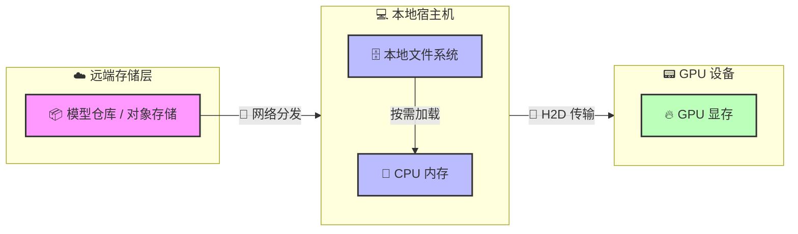
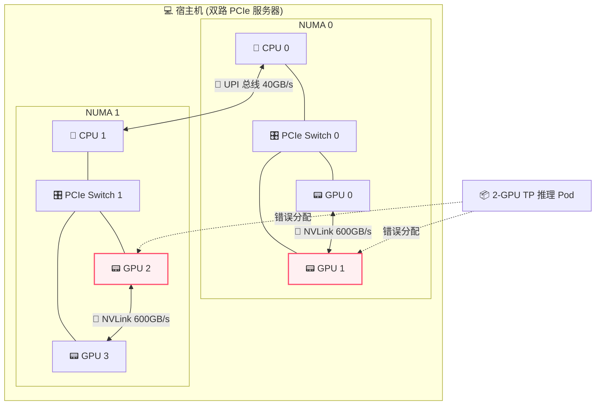
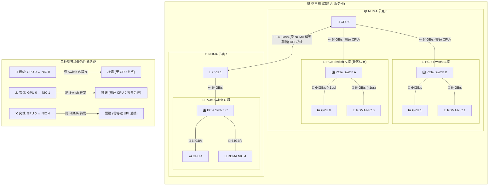
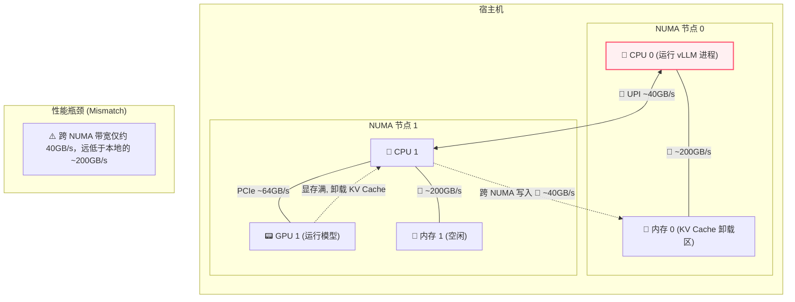
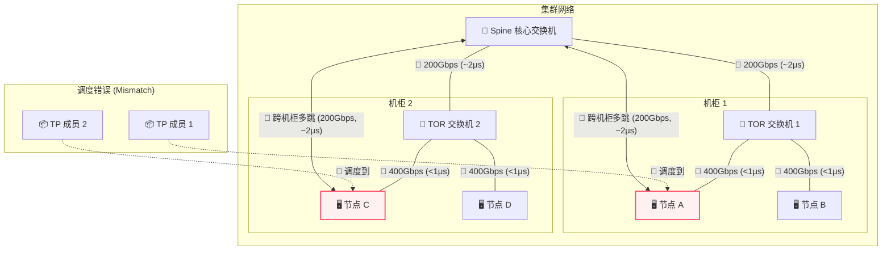

# 第五部分：编排篇 —— 驯服超级计算机：用 Kubernetes 驾驭 AI 算力

## 目录
- [第二十一章：当“松耦合”遇上“紧耦合”：K8s 与 LLM 的生命周期碰撞](#第二十一章当松耦合遇上紧耦合k8s-与-llm-的生命周期碰撞)
  - [第一节：第一性原理：审视分布式推理下的生命周期矛盾](#第一节第一性原理审视分布式推理下的生命周期矛盾)
  - [第二节：工作负载生命周期：贯穿始终的核心冲突](#第二节工作负载生命周期贯穿始终的核心冲突)
  - [第三节：集群生命周期：异构硬件引导与昂贵的优雅终止](#第三节集群生命周期异构硬件引导与昂贵的优雅终止)
- [第二十二章：与时间赛跑：模型分发与冷启动优化](#第二十二章与时间赛跑模型分发与冷启动优化)
  - [第一节：镜像与权重分离：模型格式的选择](#第一节镜像与权重分离模型格式的选择)
  - [第二节：海量数据分发：打包协议与 Pod 挂载的博弈](#第二节海量数据分发打包协议与-pod-挂载的博弈)
  - [第三节：显存加载优化：三种流派的数据通路与权衡](#第三节显存加载优化三种流派的数据通路与权衡)
- [第二十三章：伸进主板的触角：DRA 与硬件拓扑感知调度](#第二十三章伸进主板的触角dra-与硬件拓扑感知调度)
  - [第一节：拓扑黑洞：为什么标量计数在分布式推理中失效？](#第一节拓扑黑洞为什么标量计数在分布式推理中失效)
  - [第二节：进化之路：DRA（动态资源分配）与资源管理范式革命](#第二节进化之路dra动态资源分配与资源管理范式革命)
  - [第三节：单机战场：直面硬件局部性（Hardware Locality）](#第三节单机战场直面硬件局部性hardware-locality)
  - [第四节：跨越单机：集群级网络拓扑与多机协同](#第四节跨越单机集群级网络拓扑与多机协同)
- [第二十四章：打破孤岛：LeaderWorkerSet 与大模型分布式编排](#第二十四章打破孤岛leaderworkerset-与大模型分布式编排)
  - [第一节：传统控制器的局限：为什么微服务范式不再适用？](#第一节传统控制器的局限为什么微服务范式不再适用)
  - [第二节：NCCL：分布式推理的脆弱生命线](#第二节nccl分布式推理的脆弱生命线)
  - [第三节：LeaderWorkerSet 的诞生：专为 AI 打造的编排基元](#第三节leaderworkerset-的诞生专为-ai-打造的编排基元)
  - [第四节：实战演练：用 LWS 部署分布式 vLLM 服务](#第四节实战演练用-lws-部署分布式-vllm-服务)
- [第二十五章：全有或全无：Gang Scheduling 与资源死锁](#第二十五章全有或全无gang-scheduling-与资源死锁)
  - [第一节：从松耦合到紧耦合：K8s 原生调度的局限性](#第一节从松耦合到紧耦合k8s-原生调度的局限性)
  - [第二节：经典策略的回归：Gang Scheduling 的破局之道](#第二节经典策略的回归gang-scheduling-的破局之道)
  - [第三节：Gang Scheduling 在 Kubernetes 中的实现](#第三节gang-scheduling-在-kubernetes-中的实现)
  - [第四节：Kueue：作业排队与配额管理的艺术](#第四节kueue作业排队与配额管理的艺术)
- [第二十六章：动态伸缩：Pod 与 Node 的 Autoscaling 艺术](#第二十六章动态伸缩pod-与-node-的-autoscaling-艺术)
  - [第一节：Pod Autoscaling：从指标到事件的进化](#第一节pod-autoscaling从指标到事件进化)
  - [第二节：节点扩容的暗礁：滞后性与原子性](#第二节节点扩容的暗礁滞后性与原子性)
- [第二十七章：运维与升级：业务连续性与重资产的博弈](#第二十七章运维与升级业务连续性与重资产的博弈)
  - [第一节：传统 K8s 升级范式在 LLM 场景的“水土不服”](#第一节传统-k8s-升级范式在-llm-场景的水土不服)
  - [第二节：实现无感知的优雅升级](#第二节实现无感知的优雅升级)
  - [第三节：深水区挑战：Upgrade 场景的“冷启动”与状态保持](#第三节深水区挑战upgrade-场景的冷启动与状态保持)
- [本部分总结：LLM 在 K8s 中的两大核心矛盾与破局之道](#本部分总结llm-在-k8s-中的两大核心矛盾与破局之道)


## 第二十一章：当“松耦合”遇上“紧耦合”：K8s 与 LLM 的生命周期碰撞

### 第一节：第一性原理：审视分布式推理下的生命周期矛盾

从第一性原理（First Principles）出发，Kubernetes (K8s) 的核心本质是：一个基于声明式状态（Declarative State）的最终一致性（Eventual Consistency）控制面，其目的是将异构的基础设施抽象为统一的资源池，并实现计算与状态的解耦。K8s 的设计初衷是为了处理松耦合、无状态、可独立启停的微服务。

相比之下，大规模分布式大语言模型（LLM）推理的核心本质是：在极其严格的时延和显存（KV Cache）限制下，进行高度确定性、拓扑强依赖（Topology-aware）、且需要进程间极高速通信（如 NVLink, InfiniBand）的大规模矩阵乘法运算。在大规模 LLM 推理（如张量并行 TP、流水线并行 PP）中，任务在本质上是紧耦合、伪状态（权重和显存状态）、且遵循全有或全无（Gang/All-or-Nothing）原则的高性能计算（HPC）任务，**实际上等同于在管理一台分布式的“超级计算机”**。

这两者的根本矛盾构成了在 K8s 上编排 LLM 推理的核心挑战。

### 第二节：工作负载生命周期：贯穿始终的核心冲突

工作负载生命周期涵盖了从镜像拉取、调度、运行、弹性扩缩容到终止的全过程。在分布式 LLM 推理场景下，大模型的特殊性给这根生命周期的链条带来了前所未有的挑战，这些冲突也是本篇后续章节将要深度解析的核心命题：

1.  **提交与分发：镜像与权重的分离**
    *   **挑战**：LLM 推理引擎镜像本身不大，但模型权重极度庞大（数十 GB 到上百 GB）。直接打包权重会导致拉取超时，且违背了计算与数据解耦的原则。
    *   **演进方向**：业界主流已走向“镜像与权重分离”。权重可以存储为 OCI Artifacts，但并不作为普通的容器镜像拉取。OSS Kubernetes 引入了类似 Image Volumes（OCI Volume）的特性，正是为了能像挂载卷一样直接挂载 OCI 形式的权重。同时，由于数据量巨大，镜像和权重的分发需要通过 P2P、流式加载等手段进行极致优化（详见第二十一章）。

2.  **调度：拓扑感知与全有或全无**
    *   **挑战**：K8s 原生调度器基于标量计数（如 CPU 核数、GPU 个数），无法理解底层复杂的 PCIe 拓扑、NUMA 架构、NVLink 互联关系以及集群维度的 RDMA 网络拓扑。同时，分布式推理依赖 NCCL 通信环，少一张卡整个组都无法工作。
    *   **演进方向**：调度必须走向“拓扑感知”以避免性能雪崩（详见第二十二章），并且必须支持“全有或全无（Gang Scheduling）”的批调度以防资源死锁（详见第二十四章）。

3.  **运行与扩容：算力池的呼吸**
    *   **挑战**：传统的基于 CPU/内存利用率的 HPA 在这里完全失效（显存往往被提前圈占，而算力呈突发性）。同时，Pod 的扩容受制于物理机（Node）的冷启动速度。
    *   **演进方向**：扩容指标必须转向引擎内部的业务指标（如队列长度）。同时，需要解决 Pod 扩容与 Node 扩容的联动，利用占位符（Pause Pods）等机制来隐藏冷启动时间（详见第二十五章）。

4.  **生命周期管理：贯穿始终的“全有或全无”**
    *   **挑战**：在大模型分布式推理中，从启动建环、健康检查、滚动更新到故障恢复，**整个工作负载生命周期都要求“全有或全无”**。杀掉任何一个 Pod，整个组就沦为僵尸；更新一个 Pod，新旧版本错配就会导致建环死锁。
    *   **演进方向**：必须打破 K8s 独立管理 Pod 的传统范式，引入能管理“组生命周期”的编排基元（如 LeaderWorkerSet），确保整个生命周期的原子性（详见第二十三章）。

### 第三节：集群生命周期：异构硬件引导与昂贵的优雅终止

集群生命周期包括基础设施的调配、节点引导（Bootstrapping）、组件升级和运维。

1.  **基础设施调配与引导 (Provisioning & Bootstrapping)**
    *   **挑战**：K8s 节点初始化的复杂性呈指数级上升。极度依赖异构硬件的底层驱动栈（NVIDIA Driver, CUDA, OFED 等），兼容性矩阵极易破碎。网络层面需要 SR-IOV 或直接挂载 RDMA 网卡。
    *   **改进方向**：使用 IaC（如 NVIDIA GPU Operator）将驱动和插件安装容器化、自动化；配置双网络架构（Multus CNI），控制流走标准以太网，数据流走高速网卡。

2.  **运维与升级 (Operations & Upgrading)**
    *   **挑战**：K8s 默认的优雅终止时间通常不够处理超长上下文的推理任务，驱逐长连接和高显存占用的推理 Pod 代价昂贵。
    *   **改进方向**：结合服务网格或智能网关，在升级节点前停止分配新请求，等待存量请求“自然流干”；未来前沿方向包括 KV Cache 状态的热迁移。

---

## 第二十二章：与时间赛跑：模型分发与冷启动优化

在进入具体的优化细节之前，我们先用一张全景图来俯瞰大模型权重从远端云仓直达 GPU 显存的完整生命周期，以及其中涉及的物理边界与总线传输：



---

### 第一节：镜像与权重分离：模型格式的选择

在大模型（LLM）推理场景下，“将模型权重打包进 Docker 镜像”已经被公认为绝对的反模式（Anti-pattern）。因为镜像拉取机制根本无法承受数百 GB 的并发 I/O，会导致 K8s 节点因为拉取超时或磁盘爆满而陷入不可用状态。

业界的主流做法已经收敛为 **“镜像与权重分离”**。容器镜像只包含推理引擎（如 vLLM）和基础运行环境，而模型权重则作为独立的静态数据进行管理。

#### 格式争霸：为什么 Safetensors 成为了最流行的格式？
当我们把视角拉回到大规模集群推理的残酷现实中，我们对模型格式的核心诉求便瞬间收拢为两点：**如何榨干网络与磁盘的 I/O 吞吐，以及如何将节点的冷启动时间压缩到极致**。在经历了一番混战后，Hugging Face 强力推行的 **`Safetensors`** 已经成为了数据中心推理场景下绝对的事实标准。

##### 1. 前世：Pickle 的安全噩梦与性能瓶颈
在 Safetensors 诞生之前，PyTorch 默认的 `.pt` 或 `.bin` 格式统治着世界。这些格式基于 Python 的 `pickle` 库进行序列化。
*   **安全隐患**：Pickle 在反序列化时可以执行任意 Python 代码。这意味着你从网上下载的一个模型权重，可能会在你加载它的瞬间窃取你的密钥或格式化你的硬盘。这种“反序列化炸弹”让企业级生产环境人人自危。
*   **性能泥潭**：Pickle 格式没有清晰的元数据与数据分离结构。加载时，CPU 必须老老实实地解析整个文件，进行复杂的对象重构。这不仅耗费大量 CPU 算力，还导致无法使用操作系统的 `mmap`（内存映射）技术来实现零拷贝加载。每次启动都要把百 GB 的数据在内存里复制来复制去，冷启动时间动辄数分钟。

##### 2. 今生：Safetensors 的设计精髓与优势
为了解决上述痛点，Hugging Face 推出了 Safetensors，其设计极具针对性：
*   **绝对安全**：它只存储纯粹的 Tensor 数据和极轻量的 JSON 元数据，杜绝了任何代码执行的可能性。
*   **Header 与 Data 强分离**：文件的头部是一个描述所有 Tensor 拓扑（名称、形状、数据类型）和文件内偏移量的 JSON 字符串。推理引擎在启动时，只需读取区区几个 KB 的 Header，就能瞬间在内存中建立起整个模型的虚拟地址映射。
*   **mmap 零拷贝的绝配**：因为 Data 部分是连续且未压缩的二进制原始数据，操作系统可以通过 `mmap` 完美地将其映射到物理内存。当推理引擎访问某个权重时，才会触发缺页中断将数据从磁盘（或分布式缓存）读入。这彻底消灭了 CPU 的二次拷贝开销，将加载时间压缩到了极致。

##### 3. 分片（Sharding）与按需加载
超大模型通常会被拆分为多个分片文件（例如 `model-00001-of-00004.safetensors`），并配有一个 `index.json` 索引文件来记录每个 Tensor 所在的物理文件。例如，在 Hugging Face 的 [google/gemma-4-31B](https://huggingface.co/google/gemma-4-31B/tree/main) 仓库中，模型就是按照这种规范进行分片存储的。
这种分片机制在分布式推理中带来了真正的优化：
*   在 **流水线并行（PP）** 中，每个 GPU 只需要下载并读取包含其所需图层（Layers）的分片文件，跳过其余文件，极大地节省了带宽和存储。
*   在 **张量并行（TP）** 中，虽然所有卡都需要读取所有文件，但配合 `mmap`，无需在启动时预热全部数据——推理引擎访问哪个权重才触发缺页中断加载哪个权重，实现了时间维度上的”按需加载”，从而缩短冷启动等待。这在 vLLM 等引擎中被广泛使用。

##### 其它模型格式
除了 Safetensors，业界还有一些针对不同场景的常见模型权重格式：
*   **`.pt` / `.bin` (PyTorch 传统格式)**：基于 Python 的 `pickle` 序列化，曾是主流格式。但因存在代码执行的安全风险，且加载时需要耗费大量 CPU 进行反序列化，无法有效利用 `mmap`，在生产环境中正被加速替代。
*   **`GGUF`**：在端侧（Edge）和本地（Local）推理中非常流行。其核心设计是为了 CPU/GPU 混合执行以及单机量化部署，但缺乏对大规模分布式推理（如张量并行 TP、流水线并行 PP）的原生高效支持。
*   **`.tensors` (CoreWeave Tensorizer)**：由 AI 算力云厂商 CoreWeave 开源的极致优化格式。它支持直接从 S3/HTTP 读取数据并反序列化到 GPU 显存，完全绕过 CPU 内存。虽然冷启动性能惊人，但生态相对封闭，通用性较差。

Safetensors 完美地解决了“文件在本地如何高效读取”的问题，但它本身并不负责解决“如何将数百 GB 的大文件在集群中快速分发”的难题。在云原生环境下，当数百个 Pod 弹性扩容并同时发起拉取请求时，任何中心化的存储都会瞬间崩溃。为了化解这种“惊群效应”，并以最快的速度将数据送达每一个推理容器，我们需要更高级的打包与分发编排手段——这正是我们下一节要深入探讨的命题。

### 第二节：海量数据分发：打包协议与 Pod 挂载的博弈

当权重与镜像分离后，战火引向了海量数据的分布式存储与编排。我们不仅要为数百 GB 的数据寻找安身之所，更要设计出一条高速通路，将其精准送达每一个推理容器。

#### 1. 打包协议的博弈：Git LFS 与 OCI Artifact 的各擅胜场

在探讨海量数据如何精准送达之前，我们必须先解决它们的“包装”问题。在 AI 与云原生的交汇点上，正上演着一场关于打包协议的博弈。

**背景知识：**
*   **Git LFS (Large File Storage)**：Git 最初是为纯文本代码设计的，直接存入百 GB 的二进制文件会导致仓库崩溃。Git LFS 解决了这一痛点，它在 Git 仓库里只留下一个文本指针文件，而把真正的超大文件存放在专门的 LFS 服务器上（后端通常是对象存储）。**得益于 Hugging Face 社区的繁荣，Git LFS 成为了 AI 资产管理的事实标准。**
*   **OCI Artifact**：由 Linux 基金会旗下的 **OCI（Open Container Initiative）** 主导制定。OCI 规范原本只用于容器镜像，但 OCI Artifact 扩展了这一能力，允许我们将任何类型的文件（如模型权重、Helm Charts）严丝合缝地打包为类似 Docker 镜像的规范，并存储在标准的 **OCI Registry** 中。**它是云原生基础设施的新晋身份，代表着未来的演进方向。**

为了方便对照，我们可以通过下表来看看这两大阵营的各擅胜场：

| 维度 | Git LFS | OCI Artifact |
| :--- | :--- | :--- |
| **背景与生态** | 解决 Git 存大文件问题，**Hugging Face 生态基石** | **CNCF 云原生标准**，将模型视为镜像管理 |
| **存储机制** | Git 仓库留文本指针，大文件存入对象存储 | 打包为 OCI 规范的 Layer，存入 OCI Registry |
| **分发方式** | 标准 HTTP(S) 下载，缺乏原生 P2P 和层缓存 | 复用成熟的镜像分发网络（P2P、流式拉取） |
| **核心优势** | 对开发者极其友好，天然支持版本分支和回滚 | 完美融入云原生基础设施，支持安全签名 (Cosign) |
| **核心劣势** | 并非为高并发大文件分发设计，集群拉取易成瓶颈 | 目前生态尚未完全打通，需要从 HF 格式转换 |
| **流行地位** | **绝对霸主** (AI 领域的事实标准) | **新晋红人** (云原生 AI 编排的未来) |

**生产现状**：目前业界正走向混合模式。开发者在 Hugging Face 上使用 Git LFS 进行模型资产的管理与版本迭代；而在进入生产环境 (Kubernetes) 时，则通过自动化流水线将模型转换为 OCI Artifact，利用现有的镜像分发网络进行高效部署。

#### 2. 决战冷启动：模型究竟是如何进入 Pod 的？
当权重文件被妥善“包装”并存放在远端后，冷启动的最后一公里便是如何将其精准、快速地送达每一个推理容器。业界在长期的工程实践中，演化出了四种截然不同的流派，它们代表了不同的技术哲学与权衡：

*   **流派一：分布式文件系统 (CSI + PVC，如 JuiceFS / Alluxio)**
    *   **原理**：通过 CSI 驱动将分布式缓存系统挂载为 Pod 的 PVC。当推理引擎读取文件时，数据流式地从远端或本地缓存中拉取。
    *   **权衡**：
        *   **优势**：支持流式按需加载，Pod 可以秒级启动，且对应用完全透明；
        *   **劣势**：维护一套高可用的分布式缓存集群，对运维团队的内功要求极高。
*   **流派二：资产镜像化 (OCI Artifact + Image Volume)**
    *   **原理**：将模型彻底镜像化。K8s 1.33 升至 Beta 的原生 Image Volume 允许直接由容器运行时 (CRI) 将 OCI 模型镜像解压并挂载为卷。
    *   **权衡**：
        *   **优势**：完美融入云原生的分发生态，复用镜像仓库的并发拉取与分层缓存；
        *   **劣势**：目前生态尚未完全普及。
*   **流派三：Pod 级胶水 (Init Container / Sidecar)**
    *   **原理**：利用辅助容器来处理数据。Init Container 负责在主容器启动前从 S3 全量下载模型；而 Sidecar Container 则在后台持续运行，维持 FUSE 挂载或处理流式拉取、动态解密等复杂逻辑。
    *   **权衡**：
        *   **优势**：高度灵活，能处理各种定制化的“胶水逻辑”；
        *   **劣势**：Init Container 的全量下载会导致灾难性的冷启动时间 (数分钟)，而 Sidecar 则增加了 Pod 的资源消耗和编排复杂度。
*   **流派四：宿主机预下载 (HostPath 挂载的“暴力美学”)**
    *   **原理**：通过外部运维手段 (如 Ansible 或 DaemonSet) 提前将模型权重下载到每个 GPU 节点的本地 NVMe 硬盘上，Pod 启动时直接通过 `hostPath` 挂载使用。
    *   **权衡**：
        *   **优势**：拥有物理极限的 I/O 性能，零冷启动开销，完全不依赖网络，确定性极高；
        *   **劣势**：彻底违背了“不可变基础设施”的云原生原则，节点沦为“有状态的宠物”，且会导致严重的调度受限与资源浪费。

#### 3. P2P 与流式拉取：极致加速权重分发与冷启动
在大规模集群中，如何快速将数百 GB 的模型权重分发到成百上千个节点，并尽量缩短 Pod 的冷启动时间，是云原生 AI 平台的核心挑战。业界目前最主流的极致优化方案是结合 **P2P (点对点) 分发** 与 **流式拉取 (Streaming/Lazy Loading)** 技术。

*   **Dragonfly：基于 P2P 的海量分发加速**
    *   **原理**：Dragonfly 是一个开源的基于 P2P 的文件分发系统。传统的拉取方式是所有节点同时向中心化存储 (如 Object Storage 或 Registry) 发起请求，这会导致中心节点带宽耗尽成为瓶颈。Dragonfly 采用 P2P 架构，将大文件切分成多个 Chunk，节点在下载的同时也作为 Seed 向其他节点提供数据。
    *   **在 AI 场景的优势**：对于动辄数十 GB 的模型权重，Dragonfly 可以将中心存储的压力化解为集群节点间的互助，随着节点数量的增加，整体分发带宽会显著提升，极大加快了大规模扩容时权重的分发速度。

*   **Nydus：按需加载的流式文件系统**
    *   **原理**：Nydus 是一个开源的容器镜像服务，它实现了”按需拉取 (Lazy Loading)”。传统的镜像/文件必须全量下载并解压后才能使用，而 Nydus 将文件元数据与数据分离，支持流式加载。
    *   **在 AI 场景的优势**：配合 FUSE (用户态文件系统) 或 EROFS (只读文件系统)，Pod 在启动时只需要拉取极小的元数据 (Metadata)，即可瞬间“假装”文件已经存在并启动容器。当推理引擎真正读取某个权重分片 (Chunk) 时，Nydus 才会去远端拉取对应的数据。这彻底消灭了启动时的全量下载等待，将冷启动时间从分钟级压缩到秒级。

**双剑合璧：Dragonfly + Nydus**
单纯的 Nydus 流式拉取虽然能让 Pod 秒级启动，但如果大量 Pod 在同一瞬间启动并访问同一批初始数据块 (比如模型的第一层权重)，依然会对后端存储造成集中的读取压力。因此，业界最顶级的实践通常是将两者结合：**用 Nydus 实现按需流式读取，而 Nydus 在底层拉取 Chunk 时，则通过 Dragonfly 的 P2P 网络进行分发**。这样既实现了秒级冷启动，又避免了中心存储过载。

### 第三节：显存加载优化：三种流派的数据通路与权衡

当海量的权重终于通过分发手段送达节点的本地文件系统 (无论是本地 SSD 还是挂载的分布式文件系统)，我们来到了冷启动战场的最后一公里：**如何将这几百 GB 的数据，以最快的速度塞进 GPU 寸土寸金的显存 (VRAM) 中**。

为了在这一步榨干硬件性能，业界演化出了三种主流的显存加载方案。我们假设模型文件已经可被操作系统访问，来对比它们的数据通路与优劣。

#### 1. 方案一：`mmap` + 传统拷贝 (单线程页触发)

这是目前绝大多数推理引擎 (如 vLLM 默认) 的标配方案。

*   **Data Path (数据通路)**：
    存储介质 -> [DMA] -> 内核页缓存(Pageable) -> [CPU 拷贝] -> CUDA 内部锁页缓冲 -> [DMA] -> GPU 显存
*   **原理**：
    推理引擎通过 `mmap` 建立虚拟内存地址与文件的映射。当引擎读取文件时，触发操作系统的缺页中断，数据按需从存储读入内核页缓存。由于 `mmap` 实现了内核态与用户态的内存共享，消灭了传统 `read` 方式下从内核到用户空间的 CPU 拷贝。**但需要注意的是，当调用 `cudaMemcpy` 将数据从 `mmap` 内存送入 GPU 时，由于 `mmap` 内存是可分页的 (Pageable)，CUDA 会在后台先用 CPU 将数据拷贝到一块隐藏的锁页缓冲 (Staging Buffer)，然后再通过 DMA 搬运到 GPU。**
*   **优劣势**：
    *   **优势**：对硬件和驱动完全无依赖，任何 Linux 系统和存储介质都能用，通用性极强。
    *   **劣势**：存在隐式的 CPU 内存拷贝；页中断开销大；单线程读取无法吃满带宽。

#### 2. 方案二：多线程 `pread` + 锁页内存 (如 Run:ai Streamer)

这是在高性能场景下，利用 CPU 多核能力的进阶方案。

*   **Data Path (数据通路)**：
    存储介质 -> [DMA] -> 内核页缓存 -> [CPU 拷贝] -> 用户态锁页内存 (Pinned Memory) -> [DMA] -> GPU 显存
*   **原理**：
    放弃 `mmap` 和缺页中断机制。应用层主动申请大块的 **Pinned Memory (锁页内存)**。使用线程安全的 **`pread`** 系统调用，由多个 CPU 线程并发地从文件的不同偏移量读取数据，内核将其从页缓存拷贝至锁页内存，再通过 DMA 甩给 GPU。
*   **优劣势**：
    *   **优势**：**多线程并发**与**流水线 (Pipelining)** 化。一边并发读文件，一边并发送 GPU，完美重叠 I/O 和 H2D 传输，速度远快于 `mmap`。
    *   **劣势**：仍有一次 CPU 参与的内存拷贝 (从页缓存到锁页内存)，对 CPU 有一定消耗。

#### 3. 方案三：GPUDirect Storage (GDS) (终极硬件直通)

这是为了追求物理极限性能而生的“重装甲”方案，常见于高端 HPC 或专有 AI 集群。
*   **Data Path (数据通路)**：
    存储介质 (本地 NVMe 或 远端 RDMA 存储) -> [硬件直连 DMA] -> GPU 显存
*   **原理**：
    文件必须以 `O_DIRECT` 模式打开（绕过内核页缓存）。利用 NVIDIA 的 GDS 技术，数据直接从存储控制器 (或网卡) 通过 PCIe 总线以 DMA 方式写入 GPU 显存。**CPU 全程只负责发号施令，不触碰任何数据。**
*   优劣势：
    *   优势：**彻底消灭了 CPU 内存中转和 CPU 算力消耗**，拥有物理极限 of I/O 吞吐量。
    *   劣势：门槛极高。需要本地 NVMe 或支持 RDMA 的高端分布式存储 (如 Weka/VAST)，需要安装专用驱动 (`nvidia-fs`)，在通用公有云 VM 或标准 K8s 节点上极难部署。

---

## 第二十三章：伸进主板的触角：DRA 与硬件拓扑感知调度

在传统的云原生应用中，Kubernetes 将底层硬件抽象为扁平的“资源池”（CPU、内存、磁盘）。调度器只需要进行简单的“加减法”：如果节点剩余 4 个 CPU，而 Pod 申请 2 个，就调度过去。这种模式在微服务时代运转良好，但在大模型（LLM）分布式推理的时代，这种对底层硬件拓扑的漠视，正在成为扼杀性能的头号杀手。

### 第一节：拓扑黑洞：为什么标量计数在分布式推理中失效？

过去，Kubernetes 的 Device Plugin 只能把 GPU 抽象为一个一维的**标量整数**（例如：`nvidia.com/gpu: 8`）。调度器只知道“这里有 8 个 GPU”，但它不知道这 8 个 GPU 的显存是多少、架构是 Hopper 还是 Ampere、它们之间是否有 NVLink 互联、甚至不知道它们分别插在哪个 NUMA 节点上。

在大规模分布式 LLM 推理中，任务在本质上是 **拓扑强依赖（Topology-aware）** 的。

在分布式 LLM 推理场景下，由于对拓扑的漠视，标量计数调度会引发以下几个维度的严重问题：

##### 1. 单机内 GPU 互联拓扑的“盲区”（Intra-node GPU Topology）
在张量并行（TP）中，模型层被切分到多张 GPU 上，每前向传播一层就需要进行一次高频的 `All-Reduce`。
*   **问题**：如果 K8s 随机分配了 4 张卡，而它们分属于不同的 PCIe Switch 或跨越了 NUMA 节点（在没有 NVSwitch 的 PCIe 服务器上），跨卡通信将无法走高速的 NVLink，而是被迫回退到极慢的跨 CPU 内存总线，导致推理性能雪崩。



##### 2. GPU 与 RDMA 网卡的“异地恋”（GPU-NIC Alignment）
大规模推理（如跨机 TP、PP 或分离式推理）极度依赖 RDMA 网络。
*   **问题**：**GPUDirect RDMA** 追求极致性能，最理想的情况是 GPU 和 RDMA 网卡挂载在 **同一个 PCIe Switch（交换机）** 下。
    *   **灾难情况（跨 NUMA）**：如果调度器分配了 NUMA 0 的 GPU 和 NUMA 1 的 NIC，数据流必须穿过 CPU 之间的互联总线（如 UPI）。由于 UPI 的有效带宽（通常约 40GB/s）小于 400G 网卡所需的 50GB/s（400Gbps ÷ 8），总线瞬间成为瓶颈，400Gbps 的 RDMA 优势荡然无存。
    *   **次优情况（同 NUMA 跨 Switch）**：即使在同一个 NUMA 节点内，如果分配了不同 PCIe Switch 下的 GPU 和 NIC（例如 GPU 0 和 NIC 3），数据虽不跨越 CPU，但仍需上行到 CPU 的 PCIe 根复合体（Root Complex）去“拐个弯”，无法享受在同一个 Switch 内部直接转发的极致性能（PCIe Gen5 x16 单向提供 64GB/s，能完美喂饱 400G 网卡的 50GB/s 需求）。



##### 3. CPU 与 GPU 的“跨区投喂”（CPU-GPU Alignment）
虽然推理主要在 GPU 上，但 CPU 绝非无所事事，以下场景中 CPU-GPU 的亲和性至关重要：
*   **冷启动与权重加载**：大模型加载时，数据从磁盘/内存搬运到显存，跨 NUMA 会显著拉长冷启动时间（TTFT 变差）。
*   **KV Cache Offloading（显存卸载）**：在推理引擎（如 vLLM）中，当高并发或长上下文导致显存爆满时，系统通常会使用 Swapping（交换）机制将部分 KV Cache 临时卸载到 CPU 内存中以避免 OOM。如果 CPU 和 GPU 跨越了 NUMA 节点，卸载和重新加载的带宽会严重受限，导致推理请求发生停滞（Stall）。
*   **控制面开销**：推理引擎（如 vLLM）的调度进程运行在 CPU 上，频繁下发 CUDA Kernel。如果 CPU 与 GPU 跨区，CUDA Launch 的延迟会增加，影响极端低延迟场景。



##### 4. 集群级网络拓扑的“随机碰撞”（Cluster-Level Network Topology）
分布式推理不仅看单机，还要看集群网络（RDMA Block）。
*   **问题**：在多机推理（Multi-host TP/PP）或 **分离式推理（Disaggregated Serving）** （量化对比详见[第四部分第二十章第三节](part4_distributed.cn.md#第三节并行模式数据量与指标影响)）中，跨机通信频次极高。如果 K8s 调度器缺乏网络拓扑意识，把参与同一个模型的 Pods 随机分配到了不同的机柜（跨 Spine Switch），多跳带来的长尾延迟会让整个 NCCL 通信环被最慢的一跳拖垮。



> [!NOTE]
> **关于网络架构与收敛比的说明**：
> *   **什么是收敛比（Oversubscription Ratio）**：它指交换机**下行总带宽**与**上行总带宽**的比值。它源于数据中心建设的成本权衡——在传统微服务中，并非所有机器都会同时跨机柜满载通信，因此工程师会减少上行链路数量以节省昂贵的光模块和核心交换机成本。但在 AI 分布式计算中，高并发的 Collective 通信要求极高，收敛比会直接导致网络拥塞和性能劣化。
> *   **架构 A（无损非阻塞网络）**：顶级 AI 集群（如 InfiniBand Fat-Tree）通常采用 1:1 无收敛设计，机柜间带宽与机柜内一致（皆为 400Gbps），核心瓶颈在于跨交换机带来的额外跳数和微秒级延迟。
> *   **架构 B（有收敛比网络）**：本图为了直观展示“错配”的劣化，假设了 **1:2 的收敛比**（即上行带宽为下行的一半）。此时跨机柜通信不仅要承受更高的延迟（从 <1μs 增至 ~2μs），还会面临带宽砍半（从 400Gbps 降至 200Gbps）的瓶颈。

这种“只数数，不看位置”的调度方式，我们称之为**拓扑黑洞**。

### 第二节：进化之路：DRA（动态资源分配）与资源管理范式革命

为了彻底打破标量计数的桎梏，Kubernetes 在 1.26 引入了 **DRA（Dynamic Resource Allocation，动态资源分配）**。这是 K8s 资源管理范式的一次颠覆性革命。

#### 1. 什么是 DRA？
DRA 摒弃了传统的基于“Device Plugin”的资源管理方式。Device Plugin 最初是为简单的硬件发现和静态分配设计的（如“这台机器有 8 张 GPU”）。而 DRA 引入了类似于存储中 PVC 的机制，通过一组解耦的 API 对象来精细化描述和管理资源。

DRA 的核心数据模型由以下几个关键对象组成：
*   **ResourceClass**：类比于存储中的 `StorageClass`。它是集群级别的资源，定义了资源的“类”（如“NVIDIA GPU”），并指定了负责处理该类资源的底层 **Resource Driver**（资源驱动），以及相关的控制参数。
*   **ResourceClaim**：类比于存储中的 `PVC`。它是命名空间级别的资源，代表了 Pod 对资源的具体“声明”或“请求”。Pod 不再直接请求 `gpu: 4`，而是引用一个 `ResourceClaim`。Claim 中可以描述对资源的精细诉求（如“4 张卡”、“必须有 NVLink 互联”、“同一 NUMA 节点”等）。
*   **ResourceClaimTemplate**：类比于 `PersistentVolumeClaimTemplate`。它定义了创建 `ResourceClaim` 的模板。当使用控制器（如 StatefulSet）管理多个 Pod 时，可以通过模板为每个 Pod 动态生成独立的 `ResourceClaim`。
*   **Pod 规范的扩展**：
    *   在 `Pod.spec` 中，新增了 `resourceClaims` 字段，用于引用上述的 `ResourceClaim` 或 `ResourceClaimTemplate`。
    *   在 `Pod.spec.containers[].resources` 中，新增了 `claims` 字段，用于指定该容器具体消费 `Pod.spec` 中定义的哪个 Claim。
*   **Resource Driver**：由硬件厂商（如 NVIDIA）提供的第三方驱动，负责在底层真正感知硬件拓扑，并在 `ResourceClaim` 与物理硬件之间执行绑定和分配。

#### 2. DRA 的多重动机与解决的痛点
DRA 的引入绝不仅仅是为了表达“拓扑”，它有着更广泛的动机，旨在解决 AI 时代硬件管理的诸多痛点：

*   **动机一：超越“数数”的拓扑表达力**
    传统的 Device Plugin 只能表达数量。DRA 允许工作负载声明复杂的拓扑约束，例如“我需要 4 张 GPU，它们必须在同一个 NUMA 节点内，且它们之间必须有 NVLink 互联。”

*   **动机二：参数化的动态硬件配置 (Dynamic Configuration)**
    传统的资源分配往往是静态的（如直接分配一张固定的物理卡）。DRA 允许在 Claim 中传递参数，由 Driver 在运行时进行动态的硬件配置，而无需重启节点或重置驱动。
    *   **例子 1：GPU 动态切分 (Dynamic MIG)**：传统的 GPU 切分（如 NVIDIA MIG）强依赖于管理员的静态配置。DRA 支持动态配置：Pod 可以提交一个要求 “15GB 显存” 的 Claim，DRA Driver 会在调度时动态重构物理卡的 MIG 配置，实时切出实例，并在 Pod 结束时自动回收。这极大地提高了昂贵硬件在小模型推理和多租户场景下的利用率。
    *   **例子 2：网络动态配置 (Dynamic Network Attachment)**：在多机分布式推理中，Pod 可能需要特定的 RDMA 网络隔离或带宽保障。通过 DRA，Pod 可以声明对网络资源的特殊诉求（如“需要一个专属的 RDMA VF”），网络 DRA Driver 可以在底层动态配置网卡（如 SR-IOV VF）并将其与 Pod 绑定，实现网络资源的动态调配与强隔离。

*   **动机三：多维资源的联合分配 (Co-allocation)**
    在分布式推理中，不仅 GPU 之间要亲和，GPU 与 RDMA 网卡之间更要亲和。DRA 允许工作负载同时声明 GPU 和网络资源，并要求它们在物理拓扑上对齐（共享同一个 PCIe Root Complex），以实现完美的 **GPUDirect RDMA**。

*   **动机四：资源声明的解耦与复用**
    类似于 PVC 可以独立于 Pod 存在，DRA 的 Resource Claim 也可以独立存在。这意味着资源可以跨 Pod 重启而保留，避免了每次 Pod 重启都要重新执行复杂的硬件初始化（如动态 MIG 切分）的时间开销。

### 第三节：单机战场：直面硬件局部性（Hardware Locality）

在理解了 DRA 的上层抽象后，我们依然需要深入单机内部，直面主板上的物理真相。我们在本章第一节中提到的三大痛点（GPU 互联拓扑、GPU-NIC 对齐、CPU-GPU 对齐），在本质上都是**硬件局部性（Hardware Locality）**的问题。

硬件局部性决定了数据在不同组件间流动的速度和成本，直接影响分布式推理的性能：
*   **GPU 互联拓扑（对应问题 1）**：决定了 GPU 之间能否走极速的 NVLink，还是被迫回退到极慢的跨 CPU 总线。
*   **GPU 与 RDMA 网卡对齐（对应问题 2）**：决定了 **GPUDirect RDMA** 能否在同一个 PCIe Switch 内完成，还是需要跨越 CPU 甚至跨 NUMA 节点，导致带宽被 UPI 等总线卡脖子。
*   **CPU 与 GPU 对齐（对应问题 3）**：涉及狭义的 **NUMA（非一致性内存访问）** 架构。如果 CPU 上的推理主进程与它控制的 GPU 跨越了 NUMA 节点，KV Cache 卸载和 CUDA Launch 的控制面开销都会承受严重的性能惩罚（如 TTFT 抖动和吞吐下降）。在没有 DRA 的时代，K8s 依靠 Kubelet 的 **Topology Manager** 来强行拦截跨区分配，但它过于消极，且无法处理复杂的多维度对齐。

#### 1. 终极方案：用 DRA 优雅解决三大拓扑痛点
回顾这三大痛点，DRA 通过参数化的解耦设计，为这些深水区问题提供了终极的声明式解决方案。

以下我们结合 Kubernetes DRA（v1beta1）的真实设计，展示如何解决这三个问题。

##### 解决痛点 1：单机内 GPU 互联拓扑（要求 NVLink 子群）
在没有 NVSwitch 的服务器中（如早期的双岛拓扑），8 张卡被分为两个 NVLink 子群，跨子群带宽极低。DRA 支持在 `constraints` 中使用 `matchAttribute`，要求分配的设备在某个属性上保持一致。NVIDIA 驱动会在 `ResourceSlice` 中暴露 `gpu.nvidia.com/nvlink-clique-id` 属性。

```yaml
apiVersion: resource.k8s.io/v1beta1
kind: ResourceClaim
metadata:
  name: nvlink-gpu-claim
spec:
  devices:
    requests:
    - name: gpus
      deviceClassName: gpu.nvidia.com
      count: 4
    constraints:
    - requests: ["gpus"]
      matchAttribute: "gpu.nvidia.com/nvlink-clique-id" # 核心：要求分配的 4 张卡具有相同的子群 ID
```

> [!NOTE]
> **关于 NVSwitch 的说明**：上述 NVLink 子群（Clique）的限制仅存在于没有 NVSwitch 的老旧或特定成本敏感型架构中（如双岛拓扑）。在现代顶级的 **HGX A100/H100/H200** 等服务器中，由于引入了 **NVSwitch** 交换矩阵，8 张 GPU 之间实现了全互联，任意两张卡之间的 NVLink 带宽都是对等的，因此不再需要考虑子群限制。不过，GPU 到 CPU 以及网卡的通信依然受制于 NUMA，这在后面会进一步讨论。
>

##### 解决痛点 2：GPU 与 RDMA 网卡对齐
为了实现物理极限的 **GPUDirect RDMA**，GPU 和 RDMA 网卡必须在拓扑上对齐。

在**全互联的旗舰服务器**（如 HGX H100/H200）中，通常**每个 NUMA 节点下只挂载一个主 PCIe Switch**。在这种情况下，GPU 和 NIC 只要实现了 **NUMA 节点对齐**，就自然处于同一个 PCIe Switch 下，能够享受极速的本地转发。

但是在**某些纯 PCIe 互联的推理服务器**中（例如搭载 **NVIDIA L40S** 或 **A10** 的机器，由于没有 NVLink，完全依赖 PCIe 总线进行通信），**单个 NUMA 节点下往往会挂载多个 PCIe Switch**。此时，如果 GPU 和 NIC 被分配到了同一个 NUMA 节点下的不同 PCIe Switch 上，数据流虽然不跨 NUMA，但仍需上行到 CPU 的 PCIe 根复合体（Root Complex）进行“拐弯”中转，增加延迟并消耗 CPU 带宽。在这种场景下，分配必须精确到 **PCIe Switch 级别**。

为了解决这种多维度的拓扑对齐，社区开源了 **[DraNet](https://github.com/kubernetes-sigs/dranet)**。它将网络接口的 NUMA、PCIe Switch 等属性上报为 `ResourceSlice`。

以下是针对这两种场景的 DRA（v1beta1）声明示例：

###### 场景 A：粗粒度的 NUMA 对齐（适用于标准 HGX）
只需约束 GPU 和 RDMA 网卡处于同一个 NUMA 节点。

```yaml
apiVersion: resource.k8s.io/v1beta1
kind: ResourceClaim
metadata:
  name: numa-aligned-claim
spec:
  devices:
    requests:
    - name: gpus
      deviceClassName: gpu.nvidia.com
      count: 1
    - name: nics
      deviceClassName: dranet.kubernetes-sigs.io
      count: 1
      selectors:
      - cel:
          expression: 'device.attributes["dra.net"].rdma == true'
    constraints:
    - requests: ["gpus", "nics"]
      matchAttribute: "gpu.nvidia.com/numa-node-id" # 核心：要求在同一个 NUMA 节点下
```

###### 场景 B：精细的 PCIe Switch 对齐（适用于复杂拓扑机器）
必须约束 GPU 和 RDMA 网卡处于同一个 PCIe Switch 下。

```yaml
apiVersion: resource.k8s.io/v1beta1
kind: ResourceClaim
metadata:
  name: switch-aligned-claim
spec:
  devices:
    requests:
    - name: gpus
      deviceClassName: gpu.nvidia.com
      count: 1
    - name: nics
      deviceClassName: dranet.kubernetes-sigs.io
      count: 1
      selectors:
      - cel:
          expression: 'device.attributes["dra.net"].rdma == true'
    constraints:
    - requests: ["gpus", "nics"]
      matchAttribute: "kubernetes.io/pcie-switch-id" # 核心：要求在同一个 PCIe Switch 下
```

##### 解决痛点 3：CPU 与 GPU 对齐（NUMA 亲和）
在分布式推理中，CPU 进程（如 vLLM 主进程）与它控制的 GPU 如果跨越了 NUMA 节点，会导致严重的性能惩罚。

DRA 通过在 `ResourceSlice` 中暴露硬件的拓扑属性（如 `"gpu.nvidia.com/numa-node-id"`），让调度器能够感知并进行对齐。但是，**这还需要 Kubelet 端和 Pod 规范的紧密配合**，才能真正完成物理核心的绑定：

1.  **Kubelet 配置**：Kubelet 必须启用 **CPU Manager** 并设置为静态策略（`--cpu-manager-policy=static`），同时启用 **Topology Manager**（如 `--topology-manager-policy=single-numa-node`）。
2.  **Pod 必须是 Guaranteed QoS 类**：为了让 CPU Manager 真正为 Pod 分配独占的物理核心（并进行 NUMA 绑定），Pod 的 CPU 和内存的 `requests` 必须等于 `limits`，且 CPU 请求必须是整数。

以下是消费我们在“场景 A”中创建的 `numa-aligned-claim` 的 Pod 真实声明示例（注意其 QoS 属性）：

```yaml
apiVersion: v1
kind: Pod
metadata:
  name: vllm-pod
spec:
  containers:
  - name: vllm-worker
    image: vllm/vllm-openai:latest
    resources:
      requests:
        cpu: "16"
        memory: "64Gi"
      limits:
        cpu: "16"      # 必须与 requests 相等，且为整数
        memory: "64Gi"   # 必须与 requests 相等
      claims:
      - name: gpus  # 容器消费这个 Claim
  resourceClaims:
  - name: gpus
    resourceClaimName: numa-aligned-claim  # 引用上面场景 A 中创建的 Claim
```

### 第四节：跨越单机：集群级网络拓扑与多机协同

然而，在目前的绝大多数数据中心里，超大模型推理（如千亿参数模型的 TP/PP 混合并行）或 **分离式推理（Disaggregated Serving）** （详见第四部分[第二十章：打通经脉：大模型推理中的网络通信与高速互联](part4_distributed.cn.md)）依然需要跨越多个物理节点。当推理任务跨越节点时，单机内部的拓扑对齐仅仅是万里长征的第一步，集群级的网络拓扑成为了决定生死的新因素。

#### 1. 痛点重述：集群级网络拓扑的“随机碰撞”（对应问题 4）
我们在本章第一节中提到，大规模分布式推理极度依赖节点间的 RDMA 网络通信。如果 K8s 调度器缺乏网络拓扑意识，随机分配节点，会导致以下致命问题：
*   **网络跳数的代价**：在多机张量并行（TP）中，节点间需要高频同步张量。如果节点被随机分配到不同机柜，数据流必须跨越核心交换机（Spine Switch），长尾延迟会让 NCCL 通信环瞬间变成“堵车现场”。
*   **KV Cache 搬运难题**：在分离式推理中，Prefill 节点需要将庞大的 KV Cache 瞬间转移给 Decode 节点。如果两类节点在网络拓扑上相隔太远，跨节点的网络瓶颈会显著增加首字延迟（TTFT），大幅削弱“分离”的优势。

#### 2. 解决之道：K8s 原生的拓扑感知调度
为了解决跨节点的网络瓶颈，Kubernetes 提供了原生的**亲和性与反亲和性（Affinity/Anti-Affinity）**机制，配合标签（Labels）和拓扑键（Topology Keys），让调度器具备“位置感”。

在实际部署中，管理员通常会根据物理网络拓扑，为节点打上代表其所在机柜（Rack）或交换机（Switch）的标签，例如 `topology.kubernetes.io/rack=rack-1`。

调度器在处理分布式推理的 Pod 组时，可以通过以下方式实现拓扑对齐：
*   **Pod 亲和性（Pod Affinity）**：通过声明“参与同一个推理任务的 Pod 必须调度到同一个 `topologyKey`（如 `rack`）的节点上”，确保它们之间的通信局限在同一个高带宽、低延迟的物理域内。

#### 3. 配置示例：用 Pod 亲和性实现机柜级对齐
以下是一个声明了 Pod 亲和性的示例。

```yaml
apiVersion: apps/v1
kind: Deployment
metadata:
  name: vllm-distributed-worker
spec:
  replicas: 4
  template:
    metadata:
      labels:
        app: vllm-distributed
    spec:
      # 大白话语义：我（当前 Pod）在选节点时，必须（Required）和已经存在的、带有 app=vllm-distributed 标签的 Pod 待在同一个机柜（Rack）里。如果找不到满足条件的机柜，我就一直处于 Pending 状态。
      affinity:
        podAffinity:
          requiredDuringSchedulingIgnoredDuringExecution:
          - labelSelector:
              matchExpressions:
              - key: app
                operator: In
                values:
                - vllm-distributed
            topologyKey: topology.kubernetes.io/rack
      containers:
      - name: vllm-worker
        image: vllm/vllm-openai:latest
        # ... 资源请求等
```

> [!NOTE]
> **第一个 Pod 的“自亲和”机制**
> 
> 读者可能会产生一个疑问：如果所有 Pod 都要求“必须和同组的 Pod 在一起”，那么当第一个 Pod 启动时，集群里还没有任何同组 Pod，它该和谁亲和？
> 
> Kubernetes 调度器对此有精细的处理：它会检查当前正在调度的 Pod 自身的标签是否能匹配亲和性条件（自亲和）。如果是自亲和，且集群中尚无其他匹配的 Pod，调度器会允许该 Pod 调度（作为首个锚点）。
> 
> 请注意，如果亲和条件指向的是**其他**不存在的组件（非自亲和），调度器**不会**忽略该约束，Pod 会保持 Pending 状态。

通过这种方式，K8s 原生调度器就能避免将分布式推理的节点“随机碰撞”在不同的机柜间，从而保护了高频通信的性能。

## 第二十四章：打破孤岛：LeaderWorkerSet 与大模型分布式编排

在大规模分布式 LLM 推理中，我们通常需要将一个模型部署在多个 GPU 甚至多个节点上（如张量并行 TP 或流水线并行 PP）。这种场景对 Kubernetes 的传统工作负载控制器（如 Deployment 或 StatefulSet）带来了全新的挑战。

### 第一节：传统控制器的局限：为什么微服务范式不再适用？

在传统的微服务架构中，Pod 是无状态且独立的。Deployment 负责维持 Pod 的副本数，任何一个 Pod 挂掉，Deployment 都会在原地或新节点上拉起一个新的 Pod。Pod 之间是松耦合的，彼此没有强依赖。

然而，在分布式 LLM 推理中，情况发生了根本性的变化：
1.  **全有或全无（All-or-Nothing）**：一个由 4 个 Pod 组成的 TP 组，必须同时存在且成功建立 NCCL 通信环才能工作。如果只启动了 3 个，整个组毫无价值。
2.  **拓扑强依赖**：Leader Pod 需要暴露统一的服务端点，并协调 Worker Pods。Worker Pods 之间需要极高速的互联（如 NVLink 或 RDMA）。
3.  **生命周期联动**：如果组内某个 Worker Pod 崩溃，剩余的 Pod 会因为通信超时而卡死。此时，重启单个 Pod 往往无法解决问题，因为新 Pod 无法加入旧的通信域。最稳妥的做法是重启整个组。

传统的 Deployment 无法表达这种“组”的概念，而 StatefulSet 虽然提供了稳定的网络标识，但在处理 Pod 故障联动和拓扑亲和方面依然力不从心。

### 第二节：NCCL：分布式推理的脆弱生命线

#### 1. NCCL 是干什么的，为什么重要？

NCCL 是 NVIDIA 专门为多 GPU 集合通信（Collective Communications）打造的加速库。
在大模型分布式推理中，特别是在张量并行（TP）场景下，一个模型的每一层计算都需要在不同的 GPU 之间进行数据同步（例如 `All-Reduce` 操作）。如果使用传统的 CPU 内存进行中转，带宽极低且延迟极大。

NCCL 的作用就是**将主板上的 NVLink、PCIe Switch 以及集群中的 InfiniBand/RoCE 网卡等复杂硬件拓扑抽象出来**，为上层推理引擎（如 vLLM）提供一套统一且极致优化的通信原语。它是连接多卡、多机推理的“神经网络”，其通信效率直接决定了推理的整体吞吐量。

#### 2. 为什么 NCCL 极易损坏？

与传统的 HTTP 接口或微服务不同，NCCL 是一个**极度紧耦合**的系统。它在启动时需要所有参与计算的 GPU 进行握手并建立一个闭环的通信环（Ring）或树（Tree）。

这种架构极其脆弱：
*   **全有或全无**：NCCL 要求所有参与的节点必须在**同一时间**在线并进入相同的状态。
*   **单点故障**：如果 8 张卡组成的通信环中，有 1 张卡因为显存溢出（OOM）、硬件故障或网络瞬间丢包而崩溃，整个 NCCL 环就会瞬间断裂。
*   **死锁与挂起**：当环断裂后，剩余的 7 张卡并不会自动退出，而是会傻傻地停留在 `cudaMemcpy` 或 NCCL 通信调用中，陷入无限等待（Deadlock），直到触发几十分钟甚至几小时后的超时阈值。

#### 3. NCCL 坏掉之后需要怎么办？

在传统的微服务范式下，K8s 的默认策略是“原地重启”或“异地拉起”那个挂掉的 Pod。

但对于 NCCL 来说，这种局部的自愈是**完全无效**的：
*   崩溃的 Pod 重启后是一个全新的进程，拥有全新的网络句柄，它无法“加入”或“接管”之前已经断裂的 NCCL 环。
*   剩余的 Pod 已经处于僵死状态，无法与新加入的 Pod 重新握手。

因此，当 NCCL 环断裂时，唯一的正确解法是 **“全有或全无（All-or-Nothing）”的组级重启**：
1.  **识别故障**：监控或 Operator 必须迅速感知到 NCCL 通信超时或部分 Pod 异常。
2.  **整体绞杀**：立刻杀死该推理组内的**所有** Pod，彻底清理残留的僵死进程。
3.  **重新建环**：由控制器重新分配一组干净的资源，让所有 Pod 重新启动，从零开始重新建立 NCCL 通信环。

这种残酷的“株连”式重启需求，正是推动 Kubernetes 编排范式从 StatefulSet 走向 LeaderWorkerSet 的核心驱动力。

### 第三节：LeaderWorkerSet 的诞生：专为 AI 打造的编排基元

为了填补这一空白，Kubernetes 社区推出了 [LeaderWorkerSet (LWS)](https://github.com/kubernetes-sigs/leaderworkerset)。它是一个专门为紧耦合的 AI/HPC 工作负载设计的自定义控制器。

LWS 的核心思想是引入了 **“组（Group）”** 的概念。它将一个 Leader Pod 和一组 Worker Pods 绑定为一个不可分割的执行单元。

为了更直观地理解，我们可以通过下图（引用自 [LWS 官方文档](https://lws.sigs.k8s.io/docs/overview/)）看看 LWS 的整体架构与 Pod 组成：


#### 1. 核心策略：驯服紧耦合的生命周期

为了应对分布式推理中残酷的生命周期挑战，LWS 提供了几个关键的策略（Policy），这些策略是其超越传统控制器的核心所在：

##### ① `restartPolicy`：解决 NCCL 环断裂的终极武器
在传统的 K8s 中，Pod 挂了就是独立重启。但在 LWS 中，你可以配置 `restartPolicy: RecreateGroupOnPodRestart`。
*   **机制**：一旦组内（Group）任何一个 Worker Pod 发生故障（如 OOM 或硬件悬挂），LWS 不会尝试单独重启它，而是**行雷霆手段，直接将该组内的所有 Pod 全部杀死并重建**。
*   **价值**：这确保了 NCCL 通信域能够从零开始干净地重建，彻底消灭了“僵尸 Pod”和死锁等待，是保证分布式推理高可用性的基石。

##### ② `startupPolicy`：优雅的启动编排
在分布式推理中，Leader 和 Workers 的启动顺序往往有讲究。
*   **机制**：LWS 支持 `LeaderCreated`（Leader 一创建，Workers 立即创建）和 `LeaderReady`（等待 Leader Pod 彻底 Ready 后，再拉起 Workers）。
*   **价值**：在复杂的推理引擎中，Leader 可能需要先加载元数据或建立控制面。使用 `LeaderReady` 可以避免 Workers 盲目启动并处于空转等待状态，节省宝贵的 GPU 算力。

#### 2. 升级策略（Upgrade Policy）与行为

除了上述运行时的生命周期策略，LWS 还提供了 `rolloutStrategy`（滚动更新策略）。
*   **行为**：它支持类似 StatefulSet 的分区（Partition）更新机制。在大模型升级时，你可以控制每次只更新一部分推理组（Groups），确保集群中始终有存量的组在提供服务。
*   **注意**：在大模型场景下，更新一个组意味着要重新加载几百 GB 的权重，过程极其缓慢且昂贵。关于如何在更新时优雅地切流、排空请求（Drain），我们将在后续的“集群更新”章节中作为专题重点探讨，这里暂且按下不表。

#### 3. 可预测的命名策略与网络标识（Predictable Naming）

在大模型分布式推理（如 NCCL 建环）中，各个 Pod 需要知道彼此的身份（Rank）和网络地址。LWS 采用了一套极其规整且可预测的命名策略，完美解决了这一痛点。

LWS 的命名规则如下：
*   **Leader Pod**：名称格式为 `[LWS名称]-[组索引]`。例如，如果 LWS 名为 `vllm-model`，那么第 0 组的 Leader Pod 名字就是 `vllm-model-0`。
*   **Worker Pod**：名称格式为 `[LeaderPod名称]-[Worker索引]`。**特别的是，Worker 的索引从 1 开始**。例如，`vllm-model-0` 组内的 Workers 会被命名为 `vllm-model-0-1`、`vllm-model-0-2` 等。

此外，LWS 还会通过 Webhook 自动为 Pod 注入以下标签，方便推理引擎（如 vLLM）直接读取环境变量来确定自己的分布式角色：
*   `leaderworkerset.sigs.k8s.io/group-index`：代表当前 Pod 属于第几个推理组。
*   `leaderworkerset.sigs.k8s.io/worker-index`：代表组内的索引（Leader 始终为 `0`，Workers 为 `1, 2, 3...`）。

这种“确定性”的命名和标签机制，让分布式推理引擎在上层可以非常轻松地计算出每个 Pod 的 Rank，极大地简化了初始化建环的逻辑。此外，Leader Pod 还拥有稳定的 DNS 名称，方便外部客户端或网关（如 GKE Inference Gateway）进行路由，而无需关心后端 Workers 的变动。

#### 4. 独占拓扑调度：多组并发时的“对号入座”

在实际生产中，我们通常会部署多个多机（Multi-host）推理组副本（Replicas）来扛高并发。此时的核心挑战是：**如何确保每一个推理组都能够精准地独占一个独立的拓扑域（如独立的机架），互不干扰**。

如果使用传统的 Pod 亲和性或反亲和性规则，在多副本场景下会变得极其复杂且容易导致调度死锁。而 LWS 通过 `leaderworkerset.sigs.k8s.io/exclusive-topology` 注解，以极简的方式解决了这个问题。

##### LWS 是如何“定规矩”的？（底层机制）
当你配置了 LWS 的 `exclusive-topology: rack` 时，LWS 控制器并不会使用什么魔法，而是像一个精明的翻译官，在 Pod 真正提交给 Kubernetes 之前，**自动在后台重写这些 Pod 的 YAML**，生成复杂的亲和性规则：
*   **注入身份**：它给第 0 组的 Pod 全部打上标签 `group-index: 0`，第 1 组打上 `group-index: 1`，以此类推。
*   **注入亲和性（组内聚集）**：它自动生成一条规则：“带有 `group-index: 0` 的 Pod，必须待在同一个 `rack` 里”。
*   **注入反亲和性（组间排他）**：它再生成一条规则：“带有 `group-index: 0` 的 Pod，所在的 `rack` 里绝对不能出现其他 `group-index` 的 Pod”。

**举个例子**：
假设我们有一个 LWS，设置了 `replicas: 3`（部署 3 个独立的推理组），并且设置了 `leaderworkerset.sigs.k8s.io/exclusive-topology: rack`。
LWS 生成的上述规则能向 Kubernetes 调度器保证：
*   **推理组 0**（Replica 0）的所有 Pod 会被强制调度到 **机架 A** 上。
*   **推理组 1**（Replica 1）的所有 Pod 会被强制调度到 **机架 B** 上。
*   **推理组 2**（Replica 2）的所有 Pod 会被强制调度到 **机架 C** 上。

每个推理组都“对号入座”到了自己专属的机架中，既保证了组内极高的网络通信带宽，又避免了不同副本之间争抢机架内带宽的资源冲突。

### 第四节：实战演练：用 LWS 部署分布式 vLLM 服务

为了更直观地理解 LWS 的威力，我们来看一个使用 LWS 部署 2 机 16 卡（每机 8 卡）vLLM 张量并行服务的示例（注：这里仅为简化示例，完整的生产级配置请参考 [vLLM 官方 LWS 部署文档](https://docs.vllm.ai/en/stable/deployment/frameworks/lws/)）。

```yaml
apiVersion: leaderworkerset.x-k8s.io/v1
kind: LeaderWorkerSet
metadata:
  name: vllm-llama3-400b
  annotations:
    leaderworkerset.sigs.k8s.io/exclusive-topology: rack # 确保每个推理组独占一个独立的机架
spec:
  replicas: 2 # 部署 2 个独立的推理组（每个组提供完整的服务）
  leaderWorkerTemplate:
    size: 2 # 每个组包含 1 个 Leader 和 1 个 Worker (共 2 个 Pod)
    leaderTemplate:
      metadata:
        labels:
          role: leader
      spec:
        containers:
        - name: vllm-leader
          image: vllm/vllm-openai:v0.8.5
          # Leader 负责暴露端口并处理流量
          ports:
          - containerPort: 8000
          env:
          - name: TP_SIZE
            value: "16" # 总 TP 大小为 16
    workerTemplate:
      metadata:
        labels:
          role: worker
      spec:
        containers:
        - name: vllm-worker
          image: vllm/vllm-openai:v0.8.5
          # Worker 只负责计算
```

## 第二十五章：全有或全无：Gang Scheduling 与资源死锁

在大规模分布式 LLM 推理（如张量并行 TP、流水线并行 PP）中，任务的紧耦合特性带来了一个独特的调度难题：**全有或全无（All-or-Nothing）**。如果一个由多个 Pod 组成的推理组无法同时获得所需的全部资源，那么部分调度的 Pod 不仅无法工作，还会沦为圈占资源的“僵尸”，导致集群陷入死锁。本章将深入探讨 Gang Scheduling 的原理、演进以及在云原生 AI 生态中的实现。

### 第一节：从松耦合到紧耦合：K8s 原生调度的局限性

在分布式推理场景下，如果集群使用的是**静态专用资源**（例如任务长期独占，极少变动），且任务形态高度规整，那么即使没有特殊的调度机制，也许尚能维持正常运转。

但是，一旦集群环境走向**动态化**和**共享化**，问题就会接踵而至。具体来说，在大模型分布式推理中，以下三个典型场景会彻底暴露原生调度的短板：

1.  **动态扩容与自动恢复**：当节点发生硬件故障（如 GPU 掉卡）触发自动恢复，或者业务流量激增触发弹性扩容时，Pod 会被动态地创建。如果没有“全有或全无”的保障，新拉起的 Pod 组极易因为只抢到部分资源而陷入死锁，导致扩容失败或故障无法自愈。
2.  **多租户共享集群**：在多个团队共享集群、并发竞争资源且存在高优先级抢占的场景下，资源的分配是高度动态的。缺乏全局原子视角的调度器很容易让不同租户的任务互相卡死，或者让被抢占后的零碎资源无法被有效利用。
3.  **混合任务产生碎片化资源**：当集群中同时跑着推理、微调、数据预处理等混合任务时，资源需求极度碎片化（有的要 1 张卡，有的要 4 张，有的要 2 张）。经过长期的运行和释放，集群中会产生大量散碎的空闲卡。此时，死锁和队列抖动（Thrashing）将成为血淋淋的现实。

K8s 原生调度器（kube-scheduler）的微服务视角（“能塞一个是一个”的贪婪算法）在这些场景下会引发以下三大灾难：

1.  **资源死锁（Resource Deadlock）**：
    这是最致命也是最常见的问题。
    *   **场景重现**：假设集群中总共有 4 张空闲 GPU。用户同时提交了任务 A（需要 4 张 GPU）和任务 B（需要 4 张 GPU）。
    *   **默认调度的后果**：调度器可能先给任务 A 分配了 2 张，给任务 B 分配了 2 张。此时，任务 A 还在等剩下的 2 张，任务 B 也在等剩下的 2 张。双方都占有了部分资源且拒绝释放，导致双重卡死，最终谁也无法启动。
2.  **昂贵的资源闲置与浪费（Resource Fragmentation & Waste）**：
    即使没有发生死锁，部分分配也会带来巨大的资源浪费。
    *   **现象**：一个需要 100 个 CPU 的大数据任务，当前集群只凑齐了 90 个 CPU 的额度。默认调度器会将这 90 个任务先调度到节点上。
    *   **后果**：这 90 个任务处于 Running 或 Init 状态，占用了计算资源和内存，但因为缺少最后 10 个任务，它们无法产生任何业务产出（即名存实亡的“僵尸”状态）。这种“占着茅坑不拉屎”的状态在 GPU 这种昂贵资源上是不可接受的。
3.  **大型任务被“饿死”（Job Starvation / Head-of-Line Blocking）**：
    在没有全局视角的调度器中，大型任务很难抢到资源。
    *   **现象**：一个需要 64 张 GPU 的大任务在排队。此时集群陆续释放出 1~2 张零散的 GPU。
    *   **后果**：队列后面的小任务（比如只需要 1 张 GPU 的推理任务或微服务）会像“食腐动物”一样，立刻把这些刚释放的零散资源吃掉。导致这 64 张 GPU 永远无法在同一时刻被同时空出来，大任务被无限期“饿死”。

### 第二节：经典策略的回归：Gang Scheduling 的破局之道

为了解决上述 K8s 原生调度的局限性，**Gang Scheduling**（也称为 Coscheduling，全有或全无调度）这一经典策略在 AI 时代重新回到了舞台中心。

它的核心语义非常朴素：**当一个作业（Job）由多个协同工作的任务（Pods）组成时，调度器必须确保要么所有的任务都同时获得资源并被调度，要么一个都不调度。** 这就像是组团打副本，必须凑齐坦克、治疗和输出才能开团；如果只进去了坦克和治疗，输出在门外被卡住了，这团就打不成，而在里面的队友只能干等，白白浪费时间。

为了实现这一语义，Gang Scheduling 的核心解法是**引入以“一组 Pod”作为调度的原子单位**。不再以单个 Pod 为单位，而是以“组”为单位进行原子化评估：

*   **资源凑齐，整组绑定**：如果集群当前的空闲资源满足该组的**最小运行副本数（MinAvailable）**，则一次性将组内的所有 Pod 绑定到节点上。
*   **资源不足，全组排队**：如果凑不齐，则整个组都在全局队列中排队等待（Pending），**绝不预先圈占任何零散资源**，从而避免了死锁。
*   **高优抢占，整组腾挪**：在支持抢占的系统中，高优先级的组如果发现资源不足，会**原子性地抢占**低优先级作业的整组资源，而不是零星地抢占单个 Pod，这同样避免了产生新的资源碎片和死锁。

通过将调度单元从“单个 Pod”提升为“Pod 组”，Gang Scheduling 从根本上消灭了“部分分配”导致的死锁，实现了算力的高效流转。

### 第三节：Gang Scheduling 在 Kubernetes 中的实现

在云原生 AI 生态中，实现 Gang Scheduling 主要有以下三种具体的做法：

#### 1. 独立的调度器（Standalone Schedulers）
*   **原理**：完全跳出 Kubernetes 原生的 `kube-scheduler`，使用一套全新的调度引擎来处理复杂的 Batch 和 AI 任务。
*   **优势**：原生支持极度严格的 Gang Scheduling、优先级抢占、队列公平共享（Fair-share）。
*   **劣势**：作为独立的调度器，它与 K8s 原生 `kube-scheduler` 存在生态割裂，无法享受原生调度器不断演进的拓扑感知、DRA 等新特性。
*   **典型实现**：
    *   **Volcano**：[Volcano](https://volcano.sh/) 是 CNCF 的首个云原生批处理系统，专门用于解决 AI/HPC 的复杂调度问题。
    *   **KAI Scheduler**：[KAI Scheduler](https://github.com/kai-scheduler/KAI-Scheduler) 是 CNCF 的 Sandbox 项目，由 NVIDIA 团队维护，特色在于将 Gang Scheduling 与硬件拓扑感知（TAS）深度结合。

#### 2. Coscheduling 插件（基于 Scheduler Framework）
*   **原理**：Kubernetes 官方引入了调度器框架（Scheduler Framework），允许开发者通过插件扩展原生的 `kube-scheduler`。社区在 `kubernetes-sigs/scheduler-plugins` 中提供了一个 [coscheduling 插件](https://github.com/kubernetes-sigs/scheduler-plugins/tree/master/pkg/coscheduling)。
*   **机制**：插件在调度的 `Permit`（准许）阶段拦截 Pod。当一个组的 Pod 陆续到达时，它们会在这里“暂停”等待，直到凑齐了 `minAvailable` 个 Pod，调度器才会触发真正的跨节点绑定。
*   **优势**：侵入性小，作为插件扩展能与拓扑感知等其他插件无缝结合。
*   **劣势**：部署与维护成本高，需要采用双调度器架构；抢占逻辑支持不足，逐个 Pod 抢占易导致互相踩踏；API 生态碎片化，使用特有的 CRD 缺乏统一标准。

#### 3. Kubernetes 原生 Gang Scheduling（原生支持，演进中）
*   **原理**：为了彻底解决批处理任务在云原生环境下的调度痛点，Kubernetes 社区在 **v1.35/v1.36** 中引入了原生的 Gang Scheduling 支持（基于 [KEP-4671](https://github.com/kubernetes/enhancements/issues/4671)），将“全有或全无”的逻辑直接拉回了核心 `kube-scheduler`。它**将多个 Pod 作为一个整体进行资源准入和调度评估**，摒弃了“能塞一个是一个”的贪婪策略，通过核心调度器的全局快照视角，确保整组任务的资源诉求能够被原子性地满足。
*   **机制**：基于 **Barrier（屏障）** 同步等待机制。调度器对集群状态进行快照评估，只有当满足 `PodGroup` 中定义的最小数量（`minCount`）时，所有 Pod 才会越过 Barrier 进行原子绑定；否则全组 Pending 退避，不预先圈占任何零散资源。
*   **API 定义与工作流**：
    *   **API 定义**：引入了 `Workload`（长生命周期的策略声明，定义调度意图）和 `PodGroup`（运行时调度状态，追踪具体运行）两个核心 API。
    *   **组件交互（以 LWS 为例）**：
        1.  **LWS 控制器**：当用户提交 LWS 任务时，控制器会在后台自动创建一个 `Workload`（声明 Gang 策略，如 `minCount: 5`）和对应的 `PodGroup` 实例，并**创建引用该 PodGroup 的 StatefulSet**。这整个过程对用户是完全透明的。
        2.  **核心调度器（kube-scheduler）**：调度器看到这批 Pod 后，会顺藤摸瓜找到对应的 `PodGroup` 和 `Workload`。在 Barrier 前评估集群资源，只有当凑齐 `minCount` 个 Pod 时才一起放行绑定，否则全组排队，绝不占用零散资源。
*   **阶段与后续计划**：
    *   **当前阶段**：目前在 Kubernetes **v1.35/v1.36** 中处于 **Alpha** 阶段。
    *   **后续计划**：社区（WG Batch）正在推动 **Workload-Aware Preemption（工作负载感知的抢占，[KEP-5710](https://github.com/kubernetes/enhancements/issues/5710)）**，实现以组为单位的原子抢占；同时将与 Autoscaler 深度集成，实现精准的集群扩缩容，最终提供标准接口让 Spark、Ray 等框架不再需要自定义调度器。

### 第四节：Kueue：作业排队与配额管理的艺术

在探讨了底层的 Gang Scheduling 之后，我们必须引入云原生 AI 调度的另一个核心组件——**Kueue**。初学者常会混淆 Kueue 与 Gang Scheduling 的关系。从第一性原理来看，它们分别属于**控制面策略**与**调度执行层**，在生产中通常需要配合使用。

#### 1. Kueue 解决什么问题？
在多租户共享的大型 AI 集群中，传统的 K8s 资源管理面临以下痛点：
* **缺乏作业（Job）视角的排队**：K8s 原生调度器以 Pod 为最小单元。当一个包含 100 个 Pod 的 Job 提交时，K8s 会逐个处理 Pod。若资源不足，会导致“部分 Pod 启动、部分挂起”的僵局，造成资源空转与浪费。
* **静态配额（ResourceQuota）的局限性**：原生的 ResourceQuota 是刚性的硬限额，无法实现跨命名空间的**资源借用（Borrowing）**、**动态回收**以及**基于优先级的公平共享（Fair-share）**。

#### 2. 它与 Gang Scheduling 的关系
* **Kueue 负责“准入控制（Admission Control）”**：它是集群的“守门人”。Kueue 不直接控制 Pod 绑定到节点，而是控制 **Workload 的状态**。它决定了作业何时被允许实例化。只有当配额满足整个作业的需求时，Kueue 才会放行该作业（通过 Suspend 机制）。
* **Gang Scheduling 负责“原子调度”**：当 Kueue 放行作业后，底层的调度器负责微观的**原子调度**。Kueue 虽能实现作业级的排队，但无法处理调度瞬间的资源碎片竞争。因此，**Kueue 负责宏观的配额准入，而 Gang Scheduling 负责微观的执行同步**。

#### 3. Kueue 的典型应用场景
* **多租户与弹性配额**：多个团队共享昂贵的 GPU 资源池，需要实现“空闲借用、忙时归还”的弹性共享机制。
* **大规模分布式作业管理**：对大批量（Bulk）作业进行全局排队管理，防止海量 Pod 涌入调度器导致系统过载（Thrashing/Churn）。
* **异构资源拓扑管理**：配合计算拓扑（如 ClusterQueue 定义），更优雅地管理不同类型加速硬件的配额。

## 第二十六章：动态伸缩：Pod 与 Node 的 Autoscaling 艺术

在大规模分布式 LLM 推理场景下，流量往往呈现出剧烈的突发性（Bursty Traffic）。为了在保证用户体验（低延迟）的同时控制昂贵的算力成本，自动伸缩（Autoscaling）成为了不可或缺的能力。

LLM 推理的自动伸缩可以分为两个层面：**Pod 水平伸缩（Pod Autoscaling）** 和 **节点水平伸缩（Node Autoscaling）**。

### 第一节：Pod Autoscaling：从指标到事件的进化

#### 1. 原生 HPA 的死穴：为什么 CPU/Mem 指标在 LLM 场景下失效？

Kubernetes 原生的水平 Pod 伸缩器（HPA）默认基于 CPU 或内存利用率进行扩缩容。这在传统的微服务场景下工作良好，但在 LLM 推理场景下却完全偏离了核心瓶颈：
*   **瓶颈错位**：LLM 推理的瓶颈通常不在 CPU，而在 **GPU 显存带宽（Memory Bandwidth）** 和 **KV Cache 的显存占用**。当并发请求增加时，CPU 利用率可能变化不大，但 GPU 显存可能已经爆满，或者队列已经积压。
*   **响应式滞后**：原生 HPA 是“响应式”的。当它发现指标飙升时，用户的请求早就因为超时而失败了。对于冷启动动辄数分钟的 LLM Pod 来说，这种滞后是致命的。

#### 2. Custom Metrics 与 KEDA

为了真实反映业务的拥塞程度，业界转向了基于推理引擎内部业务指标的扩缩容（Custom Metrics Autoscaling）。

目前的主流做法是引入 **KEDA（Kubernetes Event-driven Autoscaling）**。KEDA 并没有取代原生 HPA，而是作为 HPA 的“外挂引擎”。虽然 Kubernetes 原生 HPA 本身就支持 Custom/External Metrics，但为不同的事件源编写和配置适配器（Adapter）非常繁琐。KEDA 屏蔽了这些底层复杂性，提供了插拔式的架构。

KEDA 相比传统 Custom Metrics HPA 的核心优势在于：
*   **丰富的 Scaler**：内置了 Prometheus 等 60 多种 Scaler，可以轻松拉取 vLLM 暴露的真实业务指标（如等待队列长度 `vllm:num_requests_waiting`、KV Cache 使用率 `vllm:gpu_cache_usage_perc` 等）。
*   **事件驱动与 0 ↔ 1 的飞跃**：原生 HPA 无法将实例从 0 扩容到 1。KEDA 采用“双脑架构”，其 Operator 直接监听事件源（如 Redis 队列或 Prometheus），在发现有待处理请求时（Event > 0），直接微操将实例从 0 拉起到 1。随后再交由 HPA 进行 1 到 N 的平滑扩容。这种“基于积压事件”的哲学更贴近 AI 场景。

#### 3. 强强联合：LWS + HPA 的组级伸缩

在分布式推理（如多机 TP）中，我们不能按单个 Pod 进行扩缩容，否则会破坏 NCCL 通信环。

正如我们在前文所讨论的，**LeaderWorkerSet（LWS）** 将多机抽象成了一个原子化的生命周期。当我们将 HPA（由 KEDA 驱动）与 LWS 结合时：
*   HPA 作用的对象不再是 Deployment，而是 **LeaderWorkerSet**。
*   当触发扩容时，HPA 会增加 LWS 的 `replicas` 数量。
*   LWS 控制器会以“组”为单位，原子化地拉起一个新的 Leader 和一组 Workers，确保它们同生共死，完美解决了分布式推理的扩缩容难题。

### 第二节：节点扩容的暗礁：滞后性与原子性

当 Pod 扩容发现集群物理资源不足时，就必须触发底层的节点自动伸缩（Node Autoscaling）。

#### 1. 节点扩缩容的两种流派：Cluster Autoscaler 与 Karpenter

在节点伸缩领域，主要存在着两种不同的实现方式：
*   **Cluster Autoscaler（CA）**：基于“节点组（Node Group / Auto Scaling Group）”的分配方式。当有 Pod 处于 Pending 状态时，CA 会增加节点组的期望大小，由云厂商拉起标准规格的机器。这就像是“买固定套餐”，缺乏灵活性，且容易产生资源碎片。
*   **Karpenter（及 GKE 的 NAP，Node Auto-Provisioning）**：开创了“无组化（Group-less）”的按需装配方式。它直接读取 Pending Pod 的 Spec（如需要 8 张 GPU、特定可用区），像精算师一样在云厂商的数百种实例中计算出最便宜、最契合的型号，然后直接调用云 API “按需装配”拉起机器。这就像是“去菜市场精准采购食材”，极大地提升了资源利用率和装箱率（Bin-packing）。

#### 2. 节点扩容的暗礁：滞后性与原子性

无论是 Cluster Autoscaler 还是 Karpenter，在大模型推理场景下都面临着两个致命的死穴：**滞后性（Latency）**与**原子性（Atomicity）缺失**。

##### ① 滞后性：被动的响应式扩容
这种滞后性在本质上是因为**它们都是基于“Pending Pod”触发的被动响应式扩容**——只有当集群资源耗尽、Pod 陷入 Pending 状态时，它们才会开始拉起节点，而随后的节点启动、权重拉取和引擎初始化又极其耗时。

当流量洪峰到来，系统决定扩容时，需要经历以下漫长的过程：
1.  **HPA 指标感应**：HPA 周期性轮询指标（默认每 15 秒），从流量飙升到 HPA 决定扩容并创建出 Pending Pod，本身就存在几十秒的滞后。
2.  云厂商调用 API 创建虚拟机（几十秒到数分钟）。
3.  节点引导、安装驱动、挂载 GPU（数分钟）。
4.  拉取动辄数百 GB 的模型权重文件（数分钟，即使有 P2P/流式加载也需要时间）。
5.  推理引擎启动，建立 NCCL 通信环（几十秒）。

整个冷启动时间可能长达数分钟甚至十分钟。在瞬息万变的在线推理场景下，等新节点 Ready，用户的请求早就全部超时了。

##### ② 原子性缺失：部分就绪导致的资源空转与重试
在 LWS（LeaderWorkerSet）部署的分布式推理中，一个副本由 1 个 Leader 和 N 个 Worker 组成，这组 Pod **必须全部就绪才能提供服务**。这在本质上就是我们在上一章讨论的 **“全有或全无”（All-or-Nothing）** 的原子调度问题。
然而，Kubernetes 默认的调度器和 Autoscaler 通常是**逐个 Pod 处理**的，无法理解这种强依赖关系。当资源不足触发扩容时，会带来严重的效率问题：
*   **GPU 空转成本**：如果 Autoscaler 只能成功拉起部分节点（例如 Leader 调度成功并占住了 GPU，但 Worker 的节点因为云厂商库存不足而 Pending），已就绪的 GPU 依然只能开着空转，造成昂贵的成本浪费。
*   **重试延迟与空转恶化（Retry Latency & Compounded Waste）**：虽然系统最终能通过超时驱逐和重试收敛到正确状态（例如 Kueue 的 `waitForPodsReady` 超时机制），但这种“超时 -> 驱逐 -> 退避重试”的循环会显著拉长 cold start 的时间。更糟糕的是，在等待重试的数分钟内，那些已经就绪的节点上的 GPU 依然在持续空转，进一步成倍放大了成本。

因此，原子性在节点扩容中**不是正确性问题，而是效率和成本问题**。

#### 3. 虽不完美但务实的解法

目前对于上述“物理冷启动”和“原子性”难题，业界并没有完美的终极方案，主要依靠以下几种务实（甚至有些 Hack）的手段来缓解。我们分别针对滞后性和原子性来讨论这些解法。

##### ① 滞后性的解决方案：与时间赛跑

解决滞后性主要有两个方向：要么“打提前量”，要么“加速启动”。

*   **方向一：打提前量（Proactive Scaling）**
    *   **HPA 本身的早指标**：虽然 HPA 默认是响应式的，但如果我们将指标从滞后的 CPU/内存替换为更敏感的业务指标（如 vLLM 的等待队列长度或 KV Cache 使用率），就能在资源刚开始紧张时就触发扩容，为节点启动争取时间。
    *   **容量缓冲（Capacity Buffer）**：这是最经典的做法。**Balloon Pods**（在集群中部署一些低优先级的“狗腿子 Pod”，里面只跑 sleep，强行占住一部分 GPU 节点）是实现容量缓冲的一种常见方式。当真实的推理任务（高优先级）来临时，Scheduler 会瞬间踢死狗腿子，让真实任务“秒级接管”。随后，Autoscaler 会在后台慢慢拉起新的节点来补充狗腿子。为了避免手写狗腿子引发的抖动，目前正走向正规化，例如 GKE 推出了声明式的 **[`CapacityBuffer` API](https://docs.cloud.google.com/kubernetes-engine/docs/concepts/capacity-buffer)**。此外，GKE 还支持通过 **Standby Buffer**（利用 Suspended VM）来降低容量缓冲的成本，但这主要面向 CPU 机器（如 Agent 等场景），目前 GPU 和 TPU 等机型尚不支持。
    *   **预测性与定时扩容（Predictive & Cadence Scaling）**：对于有规律的流量（如早高峰），可以使用定时任务提前扩容（例如 **KEDA 提供了原生的 Cron Scaler**）；或者引入机器学习模型预测流量趋势（Predictive Scaling），在流量洪峰到达前就将机器准备好。
*   **方向二：加速节点启动（Accelerate Startup）**
    *   **现状**：尽可能压缩节点拉取、驱动安装和镜像下载的时间。目前并没有特别完美的“一锤定音”的办法，业界在各显神通：使用预装了驱动和基础镜像的自定义 AMI/OS 镜像；利用 Dragonfly + Nydus 进行 P2P 和流式按需加载模型（详见前文）；甚至探索利用 `gVisor` 等技术对已经加载了权重的 GPU 内存进行“快照切片”瞬时恢复。但这些手段都存在较高的技术门槛或局限性，无法完全消灭物理开销。

##### ② 原子性的解决方案：追求“全有或全无”

解决原子性缺失问题，核心是让 Autoscaler 和调度器具备“组”的视角。

*   **方案一：LWS + Kueue + CA + ProvisioningRequest（端到端原子性）**
    *   这是目前最完整的原子性方案。在支持的云厂商（如 GKE 配合 Cluster Autoscaler）上，Kueue 可以作为入口控制 Workload。当需要扩容时，Kueue 不会直接创建 Pod，而是先向 CA 发起一个 **`ProvisioningRequest`**。CA 负责去云厂商那里“凑齐”整组任务所需的物理资源。只有当整组节点都物理 Ready 后，CA 才会通知 Kueue，Kueue 这时才放行 Pod 进行调度。这实现了从物理机扩容到 Pod 调度的端到端原子性。
*   **方案二：大差不差的原子性（Best-effort Atomicity）**
    *   如果不使用复杂的 ProvisioningRequest，像 **Karpenter** 这样的现代 Autoscaler 提供了 **Batching Window** 机制。它会在短时间（如几秒钟）内收集一批 Pending Pod，然后尝试一次性 provision 节点。这是一种“尽力而为”的原子性保证，在大多数情况下可用，但在云厂商资源极度紧张、库存不足时，仍有部分失败（导致部分就绪）的风险。
*   **方案三：预留资源（跟滞后性一样）**
    *   通过前面提到的 **Balloon Pods** 或 **Capacity Buffer** 预留足够的资源，自然也就解决了原子性问题。因为资源已经在那儿了，且数量足够，Pod 组可以瞬间全部调度成功。

##### ③ 权衡：要不要预留资源？

无论是解决滞后性还是原子性，**预留资源（Capacity Buffer）** 都是最简单粗暴且有效的手段。但它引入了经典的核心权衡：**成本 vs 体验**。

*   **预留资源（以空间换时间）**：
    *   **优势**：彻底消灭冷启动等待，完美保证原子性，用户体验极佳。
    *   **劣势**：极其昂贵。GPU 节点即使跑 sleep 也在持续计费，如果流量预测不准，会导致巨大的资金浪费。
*   **不预留资源（纯动态弹性）**：
    *   **优势**：成本最优，按需付费，没有闲置浪费。
    *   **劣势**：必须承受分钟级的冷启动延迟，且在资源紧张时面临原子性缺失导致的启动失败和重试。

因此，在实际的工程落地中，通常是 **“容量缓冲兜底实时突发（保证核心体验），加速启动缩短缓冲补充时间，动态弹性应对长尾流量”** 的组合拳。

## 第二十七章：运维与升级：业务连续性与重资产的博弈

在大规模分布式 LLM 推理集群中，集群的升级与运维（如 OS 补丁、驱动更新、Kubernetes 版本升级）面临着与传统微服务截然不同的挑战。传统的“粗暴”驱逐和重启会导致严重的业务中断和成本浪费。

### 第一节：传统 K8s 升级范式在 LLM 场景的“水土不服”

Kubernetes 原生的升级和维护通常依赖于 **滚动升级（Rolling Update）** 和 **节点驱逐（Cordon & Drain）**。然而，在 LLM 推理场景下，这种原生范式面临以下痛点：

#### 1. 优雅终止时间（`terminationGracePeriodSeconds`）与长连接的冲突
*   **痛点**：K8s 默认的优雅终止时间通常是 30 秒。在微服务场景下，这足够让存量请求处理完毕并关闭连接。但在 LLM 推理中，业务大量使用 WebSocket 或 Server-Sent Events（SSE）进行流式输出，连接时间极长。同时，一个超长上下文的 Decode 过程或一个巨大的 Batch 处理也可能需要数分钟甚至更久。简单的负载均衡器切断流量无法阻止存量长连接的维持，若强行切断则用户感知明显。
*   **后果**：如果强行杀死 Pod，用户正在进行的流式输出（Streaming）会突然中断，极大地破坏用户体验；同时，正在处理的 Batch 被强行终止，相当于浪费了之前的 GPU 算力。

#### 2. “All-or-Nothing” 视角的驱逐与版本风险
在大模型分布式推理（如多机 TP）中，Pod 之间以及它们绑定的 Node 之间都存在极强的耦合性（Gang）。传统的逐个驱逐和升级策略在两个层面上都面临失效：
*   **Pod 级别的“全有或全无”**：杀死一个 Worker Pod 就会导致整个 NCCL 环断裂，整个推理组（Leader + Workers）都会陷入不可用状态。如果 K8s 按照默认的微服务逻辑，逐个节点、逐个 Pod 地去 Drain，会导致这个推理组被反复中断和重启，造成极大的资源浪费。而原生的 PodDisruptionBudget（PDB）是基于 Pod 维度的，无法原生定义一个“要求至少有 N 组推理实例可用”的 PDB。
*   **Node 级别的重复中断与版本风险**：
    *   **驱动与软件栈的版本风险**：虽然 CUDA 和驱动具备一定的向下兼容性，但在追求极致性能的分布式推理中，节点间驱动（NVIDIA 驱动、OFED）的版本不一致可能引发隐蔽的性能抖动，或导致 GPUDirect RDMA 等高级特性失效。在升级窗口期内，维持版本一致性是规避未知风险的最佳实践。
    *   **重复中断与并发雪崩（Disruption & Avalanche）**：一个跨多节点的分布式推理组，如果采用传统的**逐个节点升级**策略，每升级一个节点都会导致部分 Pod 被驱逐，进而触发 LWS 重建整个推理组。对于一个跨 4 台机器的作业，这会导致该组业务被**强行中断并冷启动 4 次**。反之，如果为了追求速度而**随机并发升级多个节点**，由于缺乏 Gang 视角，可能会同时击中属于不同推理组的节点，导致大量推理实例同时不可用，引发集群服务容量的雪崩。

#### 3. 物理冷启动拉长升级周期与资源冗余成本
*   **痛点**：正如我们在扩容章节讨论的，LLM Pod 的冷启动（加载数百 GB 权重、建立 NCCL 环、KV Cache 的分配与创建）极其耗时。
*   **后果**：这会导致滚动升级的周期被拉得极长，增加了运维的风险窗口；若采用蓝绿部署，则会迫使新旧两套昂贵的 GPU 集群同时存活更久，显著推高了升级过程中的资源成本。

### 第二节：实现无感知的优雅升级

为了在不影响业务连续性的前提下完成节点升级，业界通常采用“连接流干（Connection Draining）”、“优雅终止”以及“组级升级”的组合拳。

#### 1. 连接流干（Connection Draining）与超长优雅终止
为了实现真正的无感知升级，必须在流量切换和进程终止上做精细化控制：
*   **停止新请求（网关切流）**：在准备升级节点时，首先将其标记为不可调度（Cordon）。此时需要配合 Endpoint 控制器的异步同步，依靠在 `preStop` Hook 中引入的原生 **[`sleep` 动作](https://kubernetes.io/docs/concepts/containers/container-lifecycle-hooks/#container-hooks)**，让容器在收到 `SIGTERM` 信号前原生暂停一段时间。这确保了该 Pod 的网络端点有足够时间从上层网关或负载均衡器（LB）中被摘除，从而实现自然断流，而无需像以前那样在 `preStop` 中编写丑陋的 `sleep` shell 脚本。
*   **消化老请求（处理 vLLM 的 `SIGTERM`）**：
    *   **引擎行为**：当 vLLM 等推理引擎收到 `SIGTERM` 信号时，默认会停止接收新请求，但会继续处理当前队列中已有的存量请求。
    *   **算力与体验的止损**：如果不给足时间而强行打断，不仅会破坏流式输出（Streaming）的用户体验，更会白白浪费之前已经消耗的昂贵 GPU 算力。
    *   **更长的 Graceful Period**：因此，集群必须支持**更长的优雅终止时间**。我们需要将 Pod 的 `terminationGracePeriodSeconds` 从默认的 30 秒大幅延长（通常需要以分钟为单位，具体取决于业务允许的最长上下文推理时间）。
    *   **对运维规划的挑战**：这种更长的时间开销意味着，SRE 团队在规划集群升级时，必须考虑到 **总升级耗时的增加**。这要求运维团队进行相应的规划，例如合理安排 **维护窗口（Maintenance Window）**，或者采用 **分批、暂停与恢复（Pause & Resume）** 等更灵活的升级策略。

#### 2. 针对“All-or-Nothing”：组级升级与蓝绿翻转
针对上述 PDB 和逐个驱逐的困境，目前的工程实践分为 Pod 层和 Node 层：
*   **Pod 级别的解法**：
    *   **LWS 原生的组级滚动更新**：这是 LWS 的基础能力。LWS 提供了类似于 Deployment 和 StatefulSet 的滚动更新机制，但它**以“组”为单位**进行。通过配置 `rolloutStrategy.type: RollingUpdate`，LWS 会对整组 Pod 进行统一的 Readiness 检查，并支持类似 `maxUnavailable` 的参数来控制同时不可用的组的数量，确保每次更新都以完整的推理组为单元进行，避免了散装 Pod 滚动导致的死锁。
*   **Node 级别的解法（打破“单节点”升级惯性）**：
    为了避免重复中断和容量雪崩，在 Node 级别必须保证升级是 Gang-aware 的。
    1.  **蓝绿节点池升级（Blue-Green Node Pool Upgrade）**：这是最彻底的办法。直接拉起一个全新的、规格一致的 Node Pool（Green），并在上面完整拉起一套全新的推理组（如 LeaderWorkerSet），待整组就绪后，将流量平滑切换到新节点池，最后整体销毁旧节点（Blue）及其承载的旧推理组。这完全避免了就地升级带来的中断风险，但 **需要准备额外的冗余资源（额外资源的体量取决于每次同时升级的推理组数量）**。
    2.  **基于升级域与委托就绪的多机推理集群高可用升级**：针对 PDB 无法感知“组”的困境，笔者提出了一种利用升级域（Upgrade Domain）拓扑打散、委托就绪探针聚合与标准 PDB 联动的通用高可用升级方案。该方案通过三层契约在仅利用 Kubernetes 原生机制的前提下，实现了多机推理工作负载的安全滚动升级。详情参见独立设计文档 [idea_multi_host_inference_ha_upgrade.cn.md](./ideas/idea_multi_host_inference_ha_upgrade.cn.md)。

### 第三节：深水区挑战：Upgrade 场景的“冷启动”与状态保持

在前面第二十一章中，我们深入讨论了模型分发与冷启动优化（如 P2P、流式拉取）。但那里的背景主要是**扩容（Scale-out）**或全新的部署。当我们将视角切换到**服务升级（Upgrade）**场景时，冷启动问题展现出了截然不同的特征。

在升级场景下，我们不仅要考虑如何快速让新 Pod Ready，更要思考如何利用“已有的状态”来规避冷启动的惩罚。这里有两个核心维度的不同：

#### 1. 模型权重：本地缓存的复用可能
在扩容场景下，新 Pod 必须调度到新的节点上，面临的是绝对的冷启动（必须从远端或 P2P 网络拉取权重）。但在 **Pod 升级**（例如升级推理引擎 vLLM 的版本，而不改变模型本身）时，情况有所不同：
*   **是否需要重新下载？**：这取决于存储架构和调度策略。
*   **本地缓存的红利**：如果集群使用了 `hostPath` 挂载、本地持久化卷（Local PV），或者节点上存在高效的 Blob 缓存（如 Dragonfly 的本地缓存），且新 Pod **被调度到了原节点上**（或者说是在原地进行 In-place Update），那么模型权重其实已经存在于节点的磁盘甚至 OS Page Cache 中。此时，新 Pod 启动只需进行显存加载（mmap），完全免去了昂贵的网络下载开销。
*   **挑战**：K8s 默认的滚动更新（RollingUpdate）倾向于“先建后删”，这通常会导致新 Pod 被调度到其他有空闲资源的节点上，从而失去了复用本地缓存的机会。为了抓住这个红利，需要配合更精细的调度策略（如 Node Affinity 锁定原节点）或支持 In-place Update 的机制。

#### 2. KV Cache：从“无中生有”到“状态继承”
在真正的冷启动（如从零扩容）中，显存里是一片空白，没有任何可用的 KV Cache。但在 **Upgrade 场景**下，系统实际上是存在大量宝贵的 KV 状态的：
*   **显存状态的“蒸发”痛点**：当一个旧节点被驱逐重建时，即使流量已经优雅切走，该节点显存中缓存的海量 KV Cache（可能包含大量的系统 Prompt 前缀、RAG 文档上下文）也会随着进程的消亡而彻底“蒸发”。当这部分流量迁移到新 Pod 时，新 Pod 必须重新进行 Prefill 计算，导致首字延迟（TTFT）飙升。
*   **不同于冷启动的潜力**：因为这是升级而非全新启动，学术界和头部大厂正在探索如何让新 Pod “继承”这些状态，而非像冷启动那样从零开始：
    *   **KV Cache 的“热迁移”（Live Migration）**：在节点必须强制重启前，通过高速 RDMA 网络，将该节点 GPU 显存中的 KV Cache 状态，直接复制到另一台备用节点的 GPU 显存中。
    *   **分离式 KV 缓存**：如果系统采用了分离式架构（Disaggregated KV Cache），KV Cache 独立存储在远端内存池中，那么新 Pod 启动后可以直接从池中拉取现成的 KV 状态，完美避开 Prefill 阶段。
*   **现状**：这些技术（尤其是 Live Migration）需要底层的推理框架（如 vLLM 的分布式 KV Cache 架构）与 K8s 的 Operator 进行深度联动，目前仍处于前沿探索和早期原型阶段。

---

## 本部分总结：LLM 在 K8s 中的两大核心矛盾与破局之道

在结束第五部分关于 Kubernetes 与大模型推理编排的讨论时，我们不妨跳出这些具体的组件与工程细节，从第一性原理的视角来重新审视我们所面对的混乱与挑战。

纵观第二十一章到第二十六章，我们在云原生 AI 落地过程中遇到的核心痛点，本质上都可以收拢为**两大核心矛盾**。我们在这一部分所讨论的前沿技术和务实解法（LWS、DRA、Gang Scheduling、KEDA、Nydus 等），都是在不同维度上为了调和这两大矛盾而做出的努力。

### 矛盾一：沉重的“软状态”（Heavy Soft-State）—— 启动与重建的饱和轰炸

传统的 Kubernetes 是为 **无状态（Stateless）** 微服务设计的，Pod 可以被随意杀死、漂移和重建。而在 LLM 推理中，我们面对的是极度沉重的“软状态”：
*   **什么是软状态**：数百 GB 的**模型权重**，以及随请求动态生成的、消耗海量显存的 **KV Cache**。它们丢了不会导致数据损坏，但重建它们需要消耗恐怖的**网络带宽**或 **GPU 算力**。
*   **痛点的映射**：
    *   **冷启动的最后一公里（第二十一章）**：为了加速权重的初始建立，我们不得不引入 P2P 分发（Dragonfly）和流式按需拉取（Nydus）。
    *   **被动的弹性扩容（第二十五章）**：因为状态建立太慢，我们不得不为 HPA 引入业务提前指标为 Pod 启动争取时间，并在节点层使用容量缓冲（Capacity Buffer）来消除物理冷启动的等待。
    *   **运维与升级的阵痛（第二十六章）**：在滚动更新时，为了不让存量的 KV Cache 状态随进程消亡而“蒸发”，我们甚至在探索极度复杂的“KV Cache 热迁移”和分离式架构。

### 矛盾二：严苛的“计算拓扑”（Rigid Compute-Topology）—— 紧耦合与松耦合的生死碰撞

传统的 Kubernetes 秉承 **松耦合（Loose Coupling）** 哲学，资源分配是标量计数的（“能塞一个是一个”）。而大模型分布式推理是典型的 **拓扑强依赖（Topology-aware）** 与 **紧耦合（Tightly Coupled）** 系统：
*   **什么是严苛拓扑**：单机内 GPU 必须走 NVLink，GPU 与网卡必须在同一个 PCIe Switch 下（GPUDirect RDMA），跨机必须独占机架，且组内所有 Pod 必须同生共死。
*   **痛点的映射**：
    *   **打破标量计数的桎梏（第二十二章）**：为了让调度器看清主板上的物理真相，K8s 彻底颠覆了 Device Plugin 范式，引入了 DRA（动态资源分配）。
    *   **重塑编排基元（第二十三章）**：为了驯服 NCCL 环断裂后的死锁，LWS 应运而生，将多机抽象为不可分割的“组”。
    *   **全有或全无的原子调度（第二十四章）**：为了解决多租户与动态环境下的资源死锁，Gang Scheduling 这一经典策略被迫回归。
    *   **扩容与升级的原子性缺失（第二十五章、第二十六章）**：无论是自动扩容还是节点升级，我们都在拼命让 Autoscaler 和 PDB 具备“组（Gang）”的视角，避免因为“部分就绪”而导致昂贵的 GPU 资源空转浪费。

---

**结语**：
Kubernetes 正在经历其诞生以来最剧烈的一次范式转变。从“独立服务”走向“协同计算组”，从“松耦合”走向“紧耦合”，从“无状态”走向“重软状态”。看清了这两大核心矛盾，你就掌握了在云原生时代驾驭大模型推理的底层钥匙。
