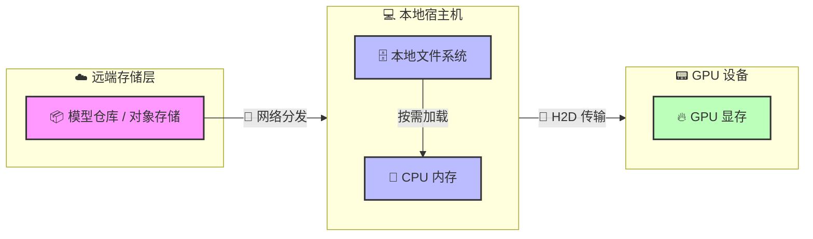
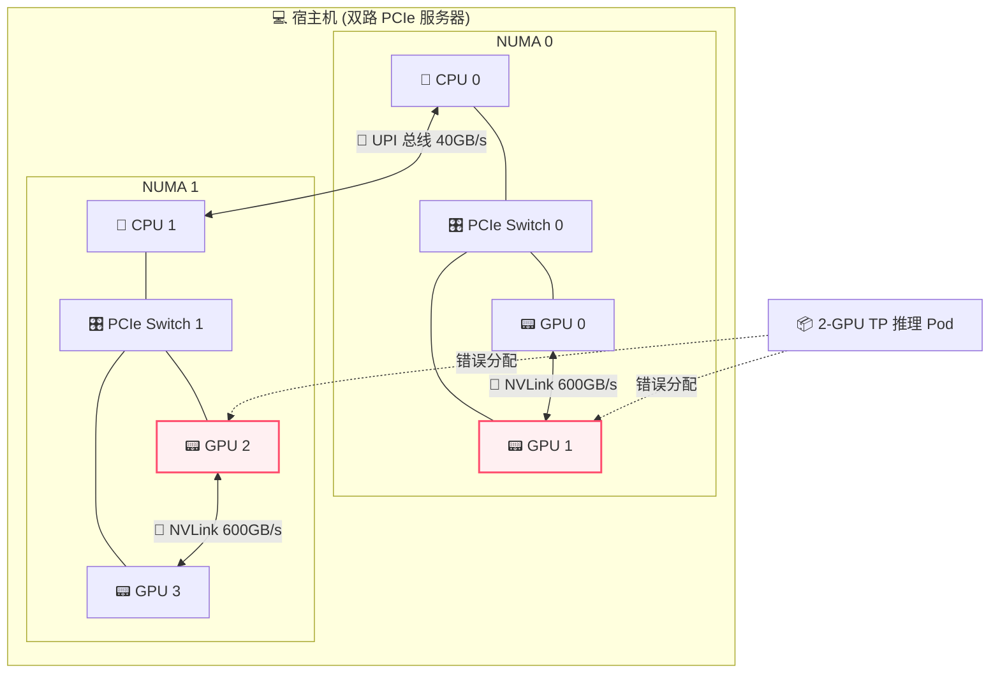
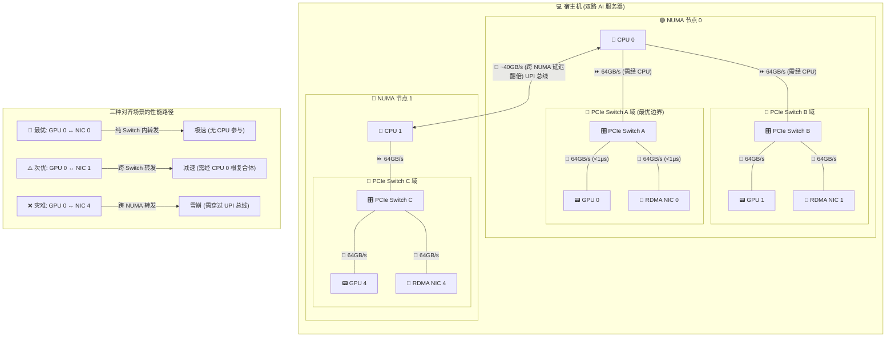
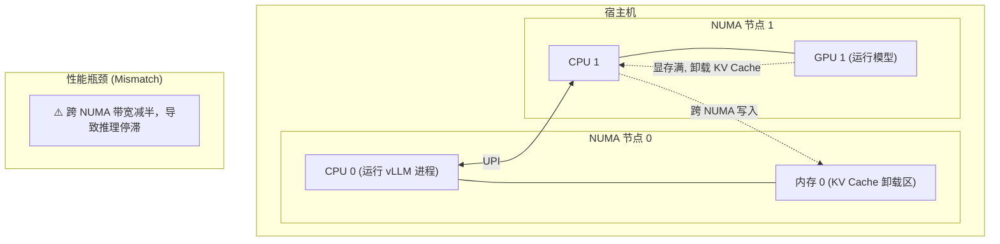
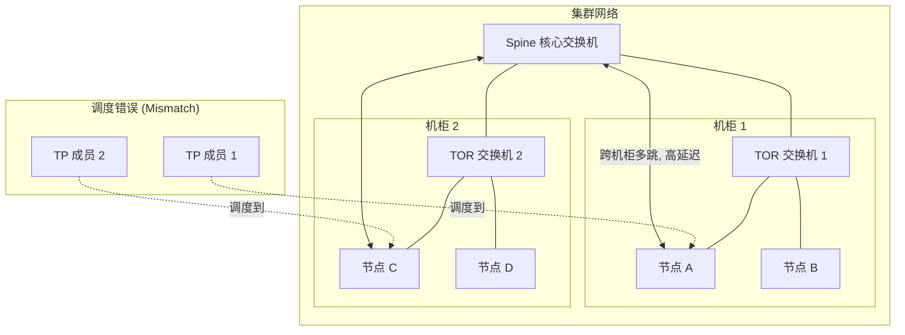
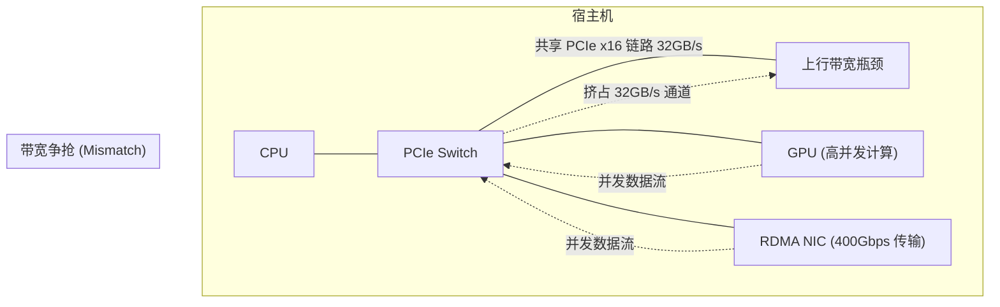

# 第五部分：编排篇 —— 驯服超级计算机：用 Kubernetes 驾驭 AI 算力

## 第二十章：当“松耦合”遇上“紧耦合”：K8s 与 LLM 的生命周期碰撞

### 第一节：第一性原理：审视分布式推理下的生命周期矛盾

从第一性原理（First Principles）出发，Kubernetes (K8s) 的核心本质是：一个基于声明式状态（Declarative State）的最终一致性（Eventual Consistency）控制面，其目的是将异构的基础设施抽象为统一的资源池，并实现计算与状态的解耦。K8s 的设计初衷是为了处理松耦合、无状态、可独立启停的微服务。

相比之下，大规模分布式大语言模型（LLM）推理的核心本质是：在极其严格的时延和显存（KV Cache）限制下，进行高度确定性、拓扑强依赖（Topology-aware）、且需要进程间极高速通信（如 NVLink, InfiniBand）的大规模矩阵乘法运算。在大规模 LLM 推理（如张量并行 TP、流水线并行 PP）中，任务在本质上是紧耦合、伪状态（权重和显存状态）、且遵循全有或全无（Gang/All-or-Nothing）原则的高性能计算（HPC）任务，**实际上等同于在管理一台分布式的“超级计算机”**。

这两者的根本矛盾构成了在 K8s 上编排 LLM 推理的核心挑战。

### 第二节：工作负载生命周期：贯穿始终的核心冲突

工作负载生命周期涵盖了从镜像拉取、调度、运行、弹性扩缩容到终止的全过程。在分布式 LLM 推理场景下，大模型的特殊性给这根生命周期的链条带来了前所未有的挑战，这些冲突也是本篇后续章节将要深度解析的核心命题：

1.  **提交与分发：镜像与权重的分离**
    *   **挑战**：LLM 推理引擎镜像本身不大，但模型权重极度庞大（数十 GB 到上百 GB）。直接打包权重会导致拉取超时，且违背了计算与数据解耦的原则。
    *   **演进方向**：业界主流已走向“镜像与权重分离”。权重可以存储为 OCI Artifacts，但并不作为普通的容器镜像拉取。OSS Kubernetes 引入了类似 Image Volumes（OCI Volume）的特性，正是为了能像挂载卷一样直接挂载 OCI 形式的权重。同时，由于数据量巨大，镜像和权重的分发需要通过 P2P、流式加载等手段进行极致优化（详见第二十一章）。

2.  **调度：拓扑感知与全有或全无**
    *   **挑战**：K8s 原生调度器基于标量计数（如 CPU 核数、GPU 个数），无法理解底层复杂的 PCIe 拓扑、NUMA 架构、NVLink 互联关系以及集群维度的 RDMA 网络拓扑。同时，分布式推理依赖 NCCL 通信环，少一张卡整个组都无法工作。
    *   **演进方向**：调度必须走向“拓扑感知”以避免性能雪崩（详见第二十二章），并且必须支持“全有或全无（Gang Scheduling）”的批调度以防资源死锁（详见第二十三章）。

3.  **运行与扩容：算力池的呼吸**
    *   **挑战**：传统的基于 CPU/内存利用率的 HPA 在这里完全失效（显存往往被提前圈占，而算力呈突发性）。同时，Pod 的扩容受制于物理机（Node）的冷启动速度。
    *   **演进方向**：扩容指标必须转向引擎内部的业务指标（如队列长度）。同时，需要解决 Pod 扩容与 Node 扩容的联动，利用占位符（Pause Pods）等机制来隐藏冷启动时间（详见第二十五章）。

4.  **生命周期管理：贯穿始终的“全有或全无”**
    *   **挑战**：在大模型分布式推理中，从启动建环、健康检查、滚动更新到故障恢复，**整个工作负载生命周期都要求“全有或全无”**。杀掉任何一个 Pod，整个组就沦为僵尸；更新一个 Pod，新旧版本错配就会导致建环死锁。
    *   **演进方向**：必须打破 K8s 独立管理 Pod 的传统范式，引入能管理“组生命周期”的编排基元（如 LeaderWorkerSet），确保整个生命周期的原子性（详见第二十四章）。

### 第三节：集群生命周期：异构硬件引导与昂贵的优雅终止

集群生命周期包括基础设施的调配、节点引导（Bootstrapping）、组件升级和运维。

1.  **基础设施调配与引导 (Provisioning & Bootstrapping)**
    *   **挑战**：K8s 节点初始化的复杂性呈指数级上升。极度依赖异构硬件的底层驱动栈（NVIDIA Driver, CUDA, OFED 等），兼容性矩阵极易破碎。网络层面需要 SR-IOV 或直接挂载 RDMA 网卡。
    *   **改进方向**：使用 IaC（如 NVIDIA GPU Operator）将驱动和插件安装容器化、自动化；配置双网络架构（Multus CNI），控制流走标准以太网，数据流走高速网卡。

2.  **运维与升级 (Operations & Upgrading)**
    *   **挑战**：K8s 默认的优雅终止时间通常不够处理超长上下文的推理任务，驱逐长连接和高显存占用的推理 Pod 代价昂贵。
    *   **改进方向**：结合服务网格或智能网关，在升级节点前停止分配新请求，等待存量请求“自然流干”；未来前沿方向包括 KV Cache 状态的热迁移。

---

## 第二十一章：与时间赛跑：模型分发与冷启动优化

在进入具体的优化细节之前，我们先用一张全景图来俯瞰大模型权重从远端云仓直达 GPU 显存的完整生命周期，以及其中涉及的物理边界与总线传输：

---

### 第一节：镜像与权重分离：模型格式的选择

在大模型（LLM）推理场景下，“将模型权重打包进 Docker 镜像”已经被公认为绝对的反模式（Anti-pattern）。因为镜像拉取机制根本无法承受数百 GB 的并发 I/O，会导致 K8s 节点因为拉取超时或磁盘爆满而陷入不可用状态。

业界的主流做法已经收敛为**“镜像与权重分离”**。容器镜像只包含推理引擎（如 vLLM）和基础运行环境，而模型权重则作为独立的静态数据进行管理。

#### 格式争霸：为什么 Safetensors 成为了最流行的格式？
当我们把视角拉回到大规模集群推理的残酷现实中，我们对模型格式的核心诉求便瞬间收拢为两点：**如何榨干网络与磁盘的 I/O 吞吐，以及如何将节点的冷启动时间压缩到极致**。在经历了一番混战后，Hugging Face 强力推行的 **`Safetensors`** 已经成为了数据中心推理场景下绝对的事实标准。

##### 1. 前世：Pickle 的安全噩梦与性能瓶颈
在 Safetensors 诞生之前，PyTorch 默认的 `.pt` 或 `.bin` 格式统治着世界。这些格式基于 Python 的 `pickle` 库进行序列化。
*   **安全隐患**：Pickle 在反序列化时可以执行任意 Python 代码。这意味着你从网上下载的一个模型权重，可能会在你加载它的瞬间窃取你的密钥或格式化你的硬盘。这种“反序列化炸弹”让企业级生产环境人人自危。
*   **性能泥潭**：Pickle 格式没有清晰的元数据与数据分离结构。加载时，CPU 必须老老实实地解析整个文件，进行复杂的对象重构。这不仅耗费大量 CPU 算力，还导致无法使用操作系统的 `mmap`（内存映射）技术来实现零拷贝加载。每次启动都要把百 GB 的数据在内存里复制来复制去，冷启动时间动辄数分钟。

##### 2. 今生：Safetensors 的设计精髓与优势
为了解决上述痛点，Hugging Face 推出了 Safetensors，其设计极具针对性：
*   **绝对安全**：它只存储纯粹的 Tensor 数据和极轻量的 JSON 元数据，杜绝了任何代码执行的可能性。
*   **Header 与 Data 强分离**：文件的头部是一个描述所有 Tensor 拓扑（名称、形状、数据类型）和文件内偏移量的 JSON 字符串。推理引擎在启动时，只需读取区区几个 KB 的 Header，就能瞬间在内存中建立起整个模型的虚拟地址映射。
*   **mmap 零拷贝的绝配**：因为 Data 部分是连续且未压缩的二进制原始数据，操作系统可以通过 `mmap` 完美地将其映射到物理内存。当推理引擎访问某个权重时，才会触发缺页中断将数据从磁盘（或分布式缓存）读入。这彻底消灭了 CPU 的二次拷贝开销，将加载时间压缩到了极致。

##### 3. 分片（Sharding）与按需加载
超大模型通常会被拆分为多个分片文件（例如 `model-00001-of-00004.safetensors`），并配有一个 `index.json` 索引文件来记录每个 Tensor 所在的物理文件。例如，在 Hugging Face 的 [google/gemma-4-31B](https://huggingface.co/google/gemma-4-31B/tree/main) 仓库中，模型就是按照这种规范进行分片存储的。
这种分片机制在分布式推理中带来了真正的优化：
*   在 **流水线并行（PP）** 中，每个 GPU 只需要下载并读取包含其所需图层（Layers）的分片文件，跳过其余文件，极大地节省了带宽和存储。
*   在 **张量并行（TP）** 中，虽然所有卡都需要读取所有文件，但配合 `mmap`，无需在启动时预热全部数据——推理引擎访问哪个权重才触发缺页中断加载哪个权重，实现了时间维度上的”按需加载”，从而缩短冷启动等待。这在 vLLM 等引擎中被广泛使用。

##### 其它模型格式
除了 Safetensors，业界还有一些针对不同场景的常见模型权重格式：
*   **`.pt` / `.bin` (PyTorch 传统格式)**：基于 Python 的 `pickle` 序列化，曾是主流格式。但因存在代码执行的安全风险，且加载时需要耗费大量 CPU 进行反序列化，无法有效利用 `mmap`，在生产环境中正被加速替代。
*   **`GGUF`**：在端侧（Edge）和本地（Local）推理中非常流行。其核心设计是为了 CPU/GPU 混合执行以及单机量化部署，但缺乏对大规模分布式推理（如张量并行 TP、流水线并行 PP）的原生高效支持。
*   **`.tensors` (CoreWeave Tensorizer)**：由 AI 算力云厂商 CoreWeave 开源的极致优化格式。它支持直接从 S3/HTTP 读取数据并反序列化到 GPU 显存，完全绕过 CPU 内存。虽然冷启动性能惊人，但生态相对封闭，通用性较差。

Safetensors 完美地解决了“文件在本地如何高效读取”的问题，但它本身并不负责解决“如何将数百 GB 的大文件在集群中快速分发”的难题。在云原生环境下，当数百个 Pod 弹性扩容并同时发起拉取请求时，任何中心化的存储都会瞬间崩溃。为了化解这种“惊群效应”，并以最快的速度将数据送达每一个推理容器，我们需要更高级的打包与分发编排手段——这正是我们下一节要深入探讨的命题。

### 第二节：海量数据分发：打包协议与 Pod 挂载的博弈

当权重与镜像分离后，战火引向了海量数据的分布式存储与编排。我们不仅要为数百 GB 的数据寻找安身之所，更要设计出一条高速通路，将其精准送达每一个推理容器。

#### 1. 打包协议的博弈：Git LFS 与 OCI Artifact 的各擅胜场

在探讨海量数据如何精准送达之前，我们必须先解决它们的“包装”问题。在 AI 与云原生的交汇点上，正上演着一场关于打包协议的博弈。

**背景知识：**
*   **Git LFS (Large File Storage)**：Git 最初是为纯文本代码设计的，直接存入百 GB 的二进制文件会导致仓库崩溃。Git LFS 解决了这一痛点，它在 Git 仓库里只留下一个文本指针文件，而把真正的超大文件存放在专门的 LFS 服务器上（后端通常是对象存储）。**得益于 Hugging Face 社区的繁荣，Git LFS 成为了 AI 资产管理的事实标准。**
*   **OCI Artifact**：由 Linux 基金会旗下的 **OCI（Open Container Initiative）** 主导制定。OCI 规范原本只用于容器镜像，但 OCI Artifact 扩展了这一能力，允许我们将任何类型的文件（如模型权重、Helm Charts）严丝合缝地打包为类似 Docker 镜像的规范，并存储在标准的 **OCI Registry** 中。**它是云原生基础设施的新晋身份，代表着未来的演进方向。**

为了方便对照，我们可以通过下表来看看这两大阵营的各擅胜场：

| 维度 | Git LFS | OCI Artifact |
| :--- | :--- | :--- |
| **背景与生态** | 解决 Git 存大文件问题，**Hugging Face 生态基石** | **CNCF 云原生标准**，将模型视为镜像管理 |
| **存储机制** | Git 仓库留文本指针，大文件存入对象存储 | 打包为 OCI 规范的 Layer，存入 OCI Registry |
| **分发方式** | 标准 HTTP(S) 下载，缺乏原生 P2P 和层缓存 | 复用成熟的镜像分发网络（P2P、流式拉取） |
| **核心优势** | 对开发者极其友好，天然支持版本分支 and 回滚 | 完美融入云原生基础设施，支持安全签名 (Cosign) |
| **核心劣势** | 并非为高并发大文件分发设计，集群拉取易成瓶颈 | 目前生态尚未完全打通，需要从 HF 格式转换 |
| **流行地位** | **绝对霸主** (AI 领域的事实标准) | **新晋红人** (云原生 AI 编排的未来) |

**生产现状**：目前业界正走向混合模式。开发者在 Hugging Face 上使用 Git LFS 进行模型资产的管理与版本迭代；而在进入生产环境 (Kubernetes) 时，则通过自动化流水线将模型转换为 OCI Artifact，利用现有的镜像分发网络进行高效部署。

#### 2. 决战冷启动：模型究竟是如何进入 Pod 的？
当权重文件被妥善“包装”并存放在远端后，冷启动的最后一公里便是如何将其精准、快速地送达每一个推理容器。业界在长期的工程实践中，演化出了四种截然不同的流派，它们代表了不同的技术哲学与权衡：

*   **流派一：分布式文件系统 (CSI + PVC，如 JuiceFS / Alluxio)**
    *   **原理**：通过 CSI 驱动将分布式缓存系统挂载为 Pod 的 PVC。当推理引擎读取文件时，数据流式地从远端或本地缓存中拉取。
    *   **权衡**：
        *   **优势**：支持流式按需加载，Pod 可以秒级启动，且对应用完全透明；
        *   **劣势**：维护一套高可用的分布式缓存集群，对运维团队的内功要求极高。
*   **流派二：资产镜像化 (OCI Artifact + Image Volume)**
    *   **原理**：将模型彻底镜像化。K8s 1.33 升至 Beta 的原生 Image Volume 允许直接由容器运行时 (CRI) 将 OCI 模型镜像解压并挂载为卷。
    *   **权衡**：
        *   **优势**：完美融入云原生的分发生态，复用镜像仓库的并发拉取与分层缓存；
        *   **劣势**：目前生态尚未完全普及。
*   **流派三：Pod 级胶水 (Init Container / Sidecar)**
    *   **原理**：利用辅助容器来处理数据。Init Container 负责在主容器启动前从 S3 全量下载模型；而 Sidecar Container 则在后台持续运行，维持 FUSE 挂载或处理流式拉取、动态解密等复杂逻辑。
    *   **权衡**：
        *   **优势**：高度灵活，能处理各种定制化的“胶水逻辑”；
        *   **劣势**：Init Container 的全量下载会导致灾难性的冷启动时间 (数分钟)，而 Sidecar 则增加了 Pod 的资源消耗和编排复杂度。
*   **流派四：宿主机预下载 (HostPath 挂载的“暴力美学”)**
    *   **原理**：通过外部运维手段 (如 Ansible 或 DaemonSet) 提前将模型权重下载 to 每个 GPU 节点的本地 NVMe 硬盘上，Pod 启动时直接通过 `hostPath` 挂载使用。
    *   **权衡**：
        *   **优势**：拥有物理极限的 I/O 性能，零冷启动开销，完全不依赖网络，确定性极高；
        *   **劣势**：彻底违背了“不可变基础设施”的云原生原则，节点沦为“有状态的宠物”，且会导致严重的调度受限与资源浪费。

#### 3. P2P 与流式拉取：极致加速权重分发与冷启动
在大规模集群中，如何快速将数百 GB 的模型权重分发到成百上千个节点，并尽量缩短 Pod 的冷启动时间，是云原生 AI 平台的核心挑战。业界目前最主流的极致优化方案是结合 **P2P (点对点) 分发** 与 **流式拉取 (Streaming/Lazy Loading)** 技术。

*   **Dragonfly：基于 P2P 的海量分发加速**
    *   **原理**：Dragonfly 是一个开源的基于 P2P 的文件分发系统。传统的拉取方式是所有节点同时向中心化存储 (如 Object Storage 或 Registry) 发起请求，这会导致中心节点带宽耗尽成为瓶颈。Dragonfly 采用 P2P 架构，将大文件切分成多个 Chunk，节点在下载的同时也作为 Seed 向其他节点提供数据。
    *   **在 AI 场景的优势**：对于动辄数十 GB 的模型权重，Dragonfly 可以将中心存储的压力化解为集群节点间的互助，随着节点数量的增加，整体分发带宽会显著提升，极大加快了大规模扩容时权重的分发速度。

*   **Nydus：按需加载的流式文件系统**
    *   **原理**：Nydus 是一个开源的容器镜像服务，它实现了”按需拉取 (Lazy Loading)”。传统的镜像/文件必须全量下载并解压后才能使用，而 Nydus 将文件元数据与数据分离，支持流式加载。
    *   **在 AI 场景的优势**：配合 FUSE (用户态文件系统) 或 EROFS (只读文件系统)，Pod 在启动时只需要拉取极小的元数据 (Metadata)，即可瞬间“假装”文件已经存在并启动容器。当推理引擎真正读取某个权重分片 (Chunk) 时，Nydus 才会去远端拉取对应的数据。这彻底消灭了启动时的全量下载等待，将冷启动时间从分钟级压缩到秒级。

**双剑合璧：Dragonfly + Nydus**
单纯的 Nydus 流式拉取虽然能让 Pod 秒级启动，但如果大量 Pod 在同一瞬间启动并访问同一批初始数据块 (比如模型的第一层权重)，依然会对后端存储造成集中的读取压力。因此，业界最顶级的实践通常是将两者结合：**用 Nydus 实现按需流式读取，而 Nydus 在底层拉取 Chunk 时，则通过 Dragonfly 的 P2P 网络进行分发**。这样既实现了秒级冷启动，又避免了中心存储过载。

### 第三节：显存加载优化：三种流派的数据通路与权衡

当海量的权重终于通过分发手段送达节点的本地文件系统 (无论是本地 SSD 还是挂载的分布式文件系统)，我们来到了冷启动战场的最后一公里：**如何将这几百 GB 的数据，以最快的速度塞进 GPU 寸土寸金的显存 (VRAM) 中**。

为了在这一步榨干硬件性能，业界演化出了三种主流的显存加载方案。我们假设模型文件已经可被操作系统访问，来对比它们的数据通路与优劣。

#### 1. 方案一：`mmap` + 传统拷贝 (单线程页触发)

这是目前绝大多数推理引擎 (如 vLLM 默认) 的标配方案。

*   **Data Path (数据通路)**：
    存储介质 -> [DMA] -> 内核页缓存(Pageable) -> [CPU 拷贝] -> CUDA 内部锁页缓冲 -> [DMA] -> GPU 显存
*   **原理**：
    推理引擎通过 `mmap` 建立虚拟内存地址与文件的映射。当引擎读取文件时，触发操作系统的缺页中断，数据按需从存储读入内核页缓存。由于 `mmap` 实现了内核态与用户态的内存共享，消灭了传统 `read` 方式下从内核到用户空间的 CPU 拷贝。**但需要注意的是，当调用 `cudaMemcpy` 将数据从 `mmap` 内存送入 GPU 时，由于 `mmap` 内存是可分页的 (Pageable)，CUDA 会在后台先用 CPU 将数据拷贝到一块隐藏的锁页缓冲 (Staging Buffer)，然后再通过 DMA 搬运到 GPU。**
*   **优劣势**：
    *   **优势**：对硬件 and 驱动完全无依赖，任何 Linux 系统和存储介质都能用，通用性极强。
    *   **劣势**：存在隐式的 CPU 内存拷贝；页中断开销大；单线程读取无法吃满带宽。

#### 2. 方案二：多线程 `pread` + 锁页内存 (如 Run:ai Streamer)

这是在高性能场景下，利用 CPU 多核能力的进阶方案。

*   **Data Path (数据通路)**：
    存储介质 -> [DMA] -> 内核页缓存 -> [CPU 拷贝] -> 用户态锁页内存 (Pinned Memory) -> [DMA] -> GPU 显存
*   **原理**：
    放弃 `mmap` 和缺页中断机制。应用层主动申请大块的 **Pinned Memory (锁页内存)**。使用线程安全的 **`pread`** 系统调用，由多个 CPU 线程并发地从文件的不同偏移量读取数据，内核将其从页缓存拷贝至锁页内存，再通过 DMA 甩给 GPU。
*   **优劣势**：
    *   **优势**：**多线程并发**与**流水线 (Pipelining)** 化。一边并发读文件，一边并发送 GPU，完美重叠 I/O 和 H2D 传输，速度远快于 `mmap`。
    *   **劣势**：仍有一次 CPU 参与的内存拷贝 (从页缓存到锁页内存)，对 CPU 有一定消耗。

#### 3. 方案三：GPUDirect Storage (GDS) (终极硬件直通)

这是为了追求物理极限性能而生的“重装甲”方案，常见于高端 HPC 或专有 AI 集群。
*   **Data Path (数据通路)**：
    存储介质 (本地 NVMe 或 远端 RDMA 存储) -> [硬件直连 DMA] -> GPU 显存
*   **原理**：
    文件必须以 `O_DIRECT` 模式打开（绕过内核页缓存）。利用 NVIDIA 的 GDS 技术，数据直接从存储控制器 (或网卡) 通过 PCIe 总线以 DMA 方式写入 GPU 显存。**CPU 全程只负责发号施令，不触碰任何数据。**
*   优劣势：
    *   优势：**彻底消灭了 CPU 内存中转和 CPU 算力消耗**，拥有物理极限 of I/O 吞吐量。
    *   劣势：门槛极高。需要本地 NVMe 或支持 RDMA 的高端分布式存储 (如 Weka/VAST)，需要安装专用驱动 (`nvidia-fs`)，在通用公有云 VM 或标准 K8s 节点上极难部署。

---

## 第二十二章：伸进主板的触角：DRA 与硬件拓扑感知调度

在传统的云原生应用中，Kubernetes 将底层硬件抽象为扁平的“资源池”（CPU、内存、磁盘）。调度器只需要进行简单的“加减法”：如果节点剩余 4 个 CPU，而 Pod 申请 2 个，就调度过去。这种模式在微服务时代运转良好，但在大模型（LLM）分布式推理的时代，这种对底层硬件拓扑的漠视，正在成为扼杀性能的头号杀手。

### 第一节：拓扑黑洞：为什么标量计数在分布式推理中失效？

过去，Kubernetes 的 Device Plugin 只能把 GPU 抽象为一个一维的**标量整数**（例如：`nvidia.com/gpu: 8`）。调度器只知道“这里有 8 个 GPU”，但它不知道这 8 个 GPU 的显存是多少、架构是 Hopper 还是 Ampere、它们之间是否有 NVLink 互联、甚至不知道它们分别插在哪个 NUMA 节点上。

在大规模分布式 LLM 推理中，任务在本质上是**拓扑强依赖（Topology-aware）**的。

在分布式 LLM 推理场景下，由于对拓扑的漠视，标量计数调度会引发以下几个维度的严重问题：

##### 1. 单机内 GPU 互联拓扑的“盲区”（Intra-node GPU Topology）
在张量并行（TP）中，模型层被切分 to 多张 GPU 上，每前向传播一层就需要进行一次高频的 `All-Reduce`。
*   **问题**：如果 K8s 随机分配了 4 张卡，而它们分属于不同的 PCIe Switch 或跨越了 NUMA 节点（在没有 NVSwitch 的 PCIe 服务器上），跨卡通信将无法走高速的 NVLink，而是被迫回退到极慢的跨 CPU 内存总线，导致推理性能雪崩。

##### 2. GPU 与 RDMA 网卡的“异地恋”（GPU-NIC Alignment）
大规模推理（如跨机 TP、PP 或分离式推理）极度依赖 RDMA 网络。
*   **问题**：**GPUDirect RDMA** 追求极致性能，最理想的情况是 GPU 和 RDMA 网卡挂载在**同一个 PCIe Switch（交换机）**下。
    *   **灾难情况（跨 NUMA）**：如果调度器分配了 NUMA 0 的 GPU 和 NUMA 1 的 NIC，数据流必须穿过 CPU 之间的互联总线（如 UPI）。由于 UPI 的有效带宽（通常约 40GB/s）小于 400G 网卡所需的 50GB/s（400Gbps ÷ 8），总线瞬间成为瓶颈，400Gbps 的 RDMA 优势荡然无存。
    *   **次优情况（同 NUMA 跨 Switch）**：即使在同一个 NUMA 节点内，如果分配了不同 PCIe Switch 下 a GPU 和 NIC（例如 GPU 0 和 NIC 3），数据虽不跨越 CPU，但仍需上行到 CPU 的 PCIe 根复合体（Root Complex）去“拐个弯”，无法享受在同一个 Switch 内部直接转发的极致性能（PCIe Gen5 x16 单向提供 64GB/s，能完美喂饱 400G 网卡的 50GB/s 需求）。

##### 3. CPU 与 GPU 的“跨区投喂”（CPU-GPU Alignment）
虽然推理主要在 GPU 上，但 CPU 绝非无所事事，以下场景中 CPU-GPU 的亲和性至关重要：
*   **冷启动与权重加载**：大模型加载时，数据从磁盘/内存搬运到显存，跨 NUMA 会显著拉长冷启动时间（TTFT 变差）。
*   **KV Cache Offloading（显存卸载）**：在 Continuous Batching 中，当显存爆满时，系统会将部分 KV Cache 临时卸载到 CPU 内存中。如果跨 NUMA，卸载和重新加载的带宽会严重受限，导致请求停滞。
*   **控制面开销**：推理引擎（如 vLLM）的调度进程运行在 CPU 上，频繁下发 CUDA Kernel。如果 CPU 与 GPU 跨区，CUDA Launch 的延迟会增加，影响极端低延迟场景。

##### 4. 集群级网络拓扑的“随机碰撞”（Cluster-Level Network Topology）
分布式推理不仅看单机，还要看集群网络（RDMA Block）。
*   **问题**：在多机推理（Multi-host TP/PP）或**分离式推理（Disaggregated Serving）**中，跨机通信频次极高。如果 K8s 调度器缺乏网络拓扑意识，把参与同一个模型的 Pods 随机分配到了不同的机柜（跨 Spine Switch），多跳带来的长尾延迟会让整个 NCCL 通信环被最慢的一跳拖垮。

##### 5. PCIe 链路的“共享带宽争抢”（PCIe Contention）
*   **问题**：当多个 GPU 或 GPU 与网卡共享同一个 PCIe Switch 的上行链路时，会发生带宽争抢。调度器如果不知道物理链路的共享情况，可能会把高并发的 I/O 任务堆积到同一条链路上，引发局部拥堵。

这种“只数数，不看位置”的调度方式，我们称之为**拓扑黑洞**。

### 第二节：进化之路：DRA（动态资源分配）与资源管理范式革命

为了彻底打破标量计数的桎梏，Kubernetes 在 1.26 引入了 **DRA（Dynamic Resource Allocation，动态资源分配）**。这是 K8s 资源管理范式的一次颠覆性革命。

#### 1. 什么是 DRA？
DRA 摒弃了传统的基于“Device Plugin”的资源管理方式。Device Plugin 最初是为简单的硬件发现和静态分配设计的（如“这台机器有 8 张 GPU”）。而 DRA 引入了类似于存储中 PVC 的机制——**Resource Claim**（资源声明）和 **Resource Driver**（资源驱动）。
*   **Resource Claim**：Pod 不再直接请求 `gpu: 4`，而是提交一个 Claim，描述它对资源的精细诉求。
*   **Resource Driver**：由硬件厂商（如 NVIDIA）提供的第三方驱动，负责在底层真正感知硬件拓扑并执行分配。

#### 2. DRA 的多重动机与解决的痛点
DRA 的引入绝不仅仅是为了表达“拓扑”，它有着更广泛的动机，旨在解决 AI 时代硬件管理的诸多痛点：

*   **动机一：超越“数数”的拓扑表达力**
    传统的 Device Plugin 只能表达数量。DRA 允许工作负载声明复杂的拓扑约束，例如“我需要 4 张 GPU，它们必须在同一个 NUMA 节点内，且它们之间必须有 NVLink 互联。”

*   **动机二：细粒度、无重启的动态硬件切分 (Dynamic MIG)**
    传统的 GPU 切分（如 NVIDIA MIG）强依赖于管理员的静态配置。如果需要调整切分大小，通常需要驱逐节点、重启并重新配置。DRA 支持动态配置：Pod 可以提交一个要求 “15GB 显存” 的 Claim，DRA Driver 会在调度时动态重构物理卡的 MIG 配置，实时切出实例，并在 Pod 结束时自动回收。这极大地提高了昂贵硬件在小模型推理和多租户场景下的利用率。

*   **动机三：多维资源的联合分配 (Co-allocation)**
    在分布式推理中，不仅 GPU 之间要亲和，GPU 与 RDMA 网卡之间更要亲和。DRA 允许工作负载同时声明 GPU 和网络资源，并要求它们在物理拓扑上对齐（共享同一个 PCIe Root Complex），以实现完美的 **GPUDirect RDMA**。

*   **动机四：资源声明的解耦与复用**
    类似于 PVC 可以独立于 Pod 存在，DRA 的 Resource Claim 也可以独立存在。这意味着资源可以跨 Pod 重启而保留，避免了每次 Pod 重启都要重新执行复杂的硬件初始化（如动态 MIG 切分）的时间开销。

### 第三节：单机战场：NUMA 架构与硬件局部性的抉择

在理解了 DRA 的上层抽象后，我们依然需要深入单机内部，直面主板上的物理真相——**NUMA（Non-Uniform Memory Access，非一致性内存访问）**架构与硬件局部性（Locality）。

#### 1. 势力范围：什么是 NUMA？
在现代多路服务器中，物理资源被划分为多个“势力范围”，即 NUMA 节点。
*   **NUMA Node 0**：包括 CPU 0、其本地内存、以及直接连到 CPU 0 PCIe 控制器上的 PCIe 插槽（如 GPU 0-3）。
*   **NUMA Node 1**：包括 CPU 1、它的专属内存、以及连接到 CPU 1 的 PCIe 插槽（如 GPU 4-7）。

#### 2. 灾难现场：跨 NUMA 的惩罚 (Cross-NUMA Penalty)
如果调度不当，推理主进程跑在 CPU 0 上，但被分配了 GPU 4（在 CPU 1 的地盘）。跨 NUMA 通信会导致致命后果：
*   **TTFT（首字延迟）抖动极大**：数据搬运需要跨越 CPU 之间的互联总线，延迟显著增加。
*   **吞吐量下降**：在 Continuous Batching 中频繁的 KV Cache Offloading 会因为跨 NUMA 的带宽瓶颈而停滞。

#### 3. 传统救命稻草：Topology Manager
在没有 DRA 的时代，K8s 依靠 Kubelet 的 **Topology Manager** 配合 `--topology-manager-policy=single-numa-node` 来强行拦截跨区凑活的 Pod。但它过于消极，且无法处理需要跨越多个 NUMA 节点的大型 Pod。

#### 4. 超级怪兽：HGX H200 的特例与应用层补救
对于 HGX H200（8 卡全互联）这样的怪兽：
*   **NVSwitch 乌托邦**：只要数据在 8 张 GPU 显存之间流动，完全不需要经过 CPU，因此无视 NUMA。
*   **现实的引力**：但 GPU 到 CPU 和网卡依然受制于 NUMA。一个 8 卡 Pod 必须跨越两个 NUMA 节点。
*   此时 K8s 的粗粒度拓扑对齐会失效，必须依赖推理引擎（如 vLLM）在应用层读取 PCI 拓扑，并通过 `numactl` 或 `sched_setaffinity` 强行将 Worker 进程绑定到对口的 CPU 核心上。

### 第四节：跨越单机：集群级网络拓扑与多机协同

在大模型推理（如千亿参数模型的 TP/PP 混合并行）或**分离式推理（Disaggregated Serving）**的场景下，单机内部的拓扑对齐仅仅是万里长征的第一步。当推理任务跨越多个节点时，集群级的网络拓扑成为了新的决定性因素。

#### 1. 网络跳数的代价：跨机架的性能雪崩
在多机张量并行（TP）中，节点之间需要通过高速 RDMA 网络频繁同步张量。
*   **同机柜直连**：如果参与推理的机器位于同一个机柜，连接在同一个 TOR（Top-of-Rack）交换机下，RDMA 通信延迟极低。
*   **跨机架通信**：如果 K8s 调度器缺乏网络拓扑意识，把节点随机分配到了不同的机柜，数据流就必须跨越核心交换机（Spine Switch）。多跳带来的长尾延迟，会让 NCCL 通信环瞬间变成“堵车现场”。

#### 2. 分离式推理的“KV Cache 搬运”难题
在分离式推理中，Prefill 节点算完 Prompt 后，需要将庞大的 KV Cache 瞬间转移给 Decode 节点。
如果 Prefill 节点和 Decode 节点在网络拓扑上相隔太远，即使单机内部实现了 GPUDirect RDMA，跨节点的网络瓶颈依然会让“分离”的优势荡然无存。
为了化解这一瓶颈，业界引入了如 **NIXL**（vLLM 中使用的 NixlConnector）等高性能 KV 传输框架，利用 UCX 和 RDMA 实现极速的异步搬运。但要让 NIXL 达到物理极限性能，必须配合极致的**硬件拓扑对齐**（如 **NUMA alignment** 与 **GPU-NIC alignment**）。如果 Prefill/Decode 进程与网卡跨越了 NUMA 边界，或者 GPU 与 RDMA 网卡没有处于同一个 PCIe Root Complex 下，GPUDirect RDMA 就会退化，导致延迟剧增。因此，K8s 调度器不仅要在集群维度拉近节点距离，还要在单机维度实现精细的拓扑亲和。

#### 3. 解决之道：拓扑感知调度与协同
应对跨节点拓扑，业界目前主要依靠以下组合拳：
*   **Topology Keys 与亲和性**：在 Pod 调度声明中，利用 `topologyKey`（如 `rack` 或 `switch`）配合亲和性策略，强行要求参与同一个大模型实例的一组 Pod 必须落在同一个机柜或同一个高带宽网络域内。
*   **原子调度（Gang Scheduling）的配合**：结合 Kueue 或 LeaderWorkerSet 等机制，确保这一组 Pod 不仅拓扑相近，而且能够“同生共死”，防止资源死锁。
