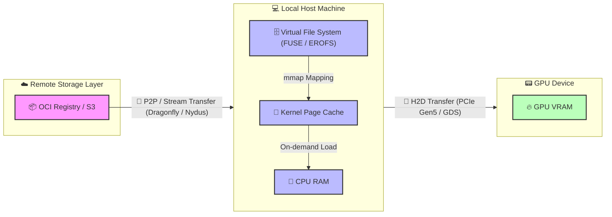

# Part Five: Orchestration —— Taming the Supercomputer: Leveraging Kubernetes for AI Compute

## Chapter 20: When "Loose Coupling" Meets "Tight Coupling": The Collision of K8s and LLM Lifecycles

### Section 1: First Principles: Examining Lifecycle Contradictions under Distributed Inference

From first principles, Kubernetes (K8s) is a control plane based on declarative state and eventual consistency. It abstracts heterogeneous infrastructure into a unified resource pool and decouples compute from state. K8s was designed for loosely coupled, stateless microservices.

In contrast, large-scale distributed LLM inference performs massive matrix multiplications under strict latency and memory (KV Cache) constraints. It is highly deterministic, topology-dependent, and requires high-speed inter-process communication (e.g., NVLink, InfiniBand). Tasks in Tensor Parallelism (TP) and Pipeline Parallelism (PP) are tightly coupled, pseudo-stateful (weights and cache), and follow the 'All-or-Nothing' (Gang) principle. Managing them is effectively managing a distributed supercomputer.

This fundamental contradiction constitutes the core challenge of orchestrating LLM inference on K8s.

### Section 2: Workload Lifecycle: Core Contradictions Throughout

The workload lifecycle spans image pulling, scheduling, execution, scaling, and termination. Distributed LLM inference brings unique challenges to this chain. This part analyzes these conflicts in detail:

1.  **Submission & Distribution: Separation of Image and Weights**
    *   **Challenge**: Model weights are huge (tens to hundreds of GBs). Packaging them in images causes pull timeouts and violates compute-data decoupling.
    *   **Direction**: The industry separates images from weights. Weights are stored as OCI Artifacts, not regular images. Kubernetes introduced Image Volumes to mount OCI weights directly. P2P and stream loading optimize distribution (see Chapter 21).

2.  **Scheduling: Topology Awareness and All-or-Nothing**
    *   **Challenge**: Native K8s schedulers use scalar counting and ignore complex PCIe, NUMA, and NVLink topologies. Distributed inference relies on NCCL rings; missing one card halts the group.
    *   **Direction**: Scheduling must be topology-aware to avoid performance drops (see Chapter 22) and support Gang Scheduling to prevent deadlocks (see Chapter 23).

3.  **Execution & Scaling: Breathing of the Compute Pool**
    *   **Challenge**: HPA based on CPU/memory fails because VRAM is pre-allocated and compute is bursty. Pod scaling is limited by node cold start speed.
    *   **Direction**: Scaling metrics must shift to engine internal metrics (e.g., queue length). Placeholders (Pause Pods) can hide cold start times (see Chapter 25).

4.  **Lifecycle Management: "All-or-Nothing" Throughout**
    *   **Challenge**: Startup, health checks, updates, and recovery all require atomicity. Killing one Pod creates zombies; updating one Pod causes version mismatches and deadlocks.
    *   **Direction**: K8s must move beyond independent Pod management. Primitives like LeaderWorkerSet manage group lifecycles to ensure atomicity (see Chapter 24).

### Section 3: Cluster Lifecycle: Heterogeneous Hardware Bootstrapping and Expensive Graceful Termination

The cluster lifecycle includes infrastructure provisioning, node bootstrapping, component upgrading, and maintenance.

1.  **Provisioning & Bootstrapping**
    *   **Challenge**: Node initialization is complex. It depends on complex driver stacks (NVIDIA Driver, CUDA, OFED) with fragile compatibility matrices. Networking requires SR-IOV or direct RDMA card mounting.
    *   **Direction**: Use IaC (like NVIDIA GPU Operator) to containerize driver installation. Configure dual networks (Multus CNI): standard Ethernet for control flow and high-speed cards for data flow.

2.  **Operations & Upgrading**
    *   **Challenge**: K8s default graceful termination is too short for long-context tasks. Evicting Pods with long connections and high memory usage is expensive.
    *   **Direction**: Use service meshes or smart gateways to stop routing new requests to nodes before upgrades, letting existing requests drain. Future directions include hot migration of KV Cache state.

---

## Chapter 21: Racing Against Time: Model Distribution and Cold Start Optimization

Before diving into optimization details, let's use a birds-eye view diagram to understand the complete lifecycle of model weights from remote cloud storage straight to GPU VRAM, including physical boundaries and bus transfers:

---

### Section 1: Separation of Image and Weights: Choice of Model Formats

In LLM inference, packaging weights into Docker images is an anti-pattern. The image pull mechanism cannot handle concurrent I/O of hundreds of gigabytes, causing K8s nodes to time out or run out of disk space.

The industry has converged on **separating images from weights**. Container images only contain the inference engine (like vLLM) and the runtime environment. Model weights are managed as independent static data.

#### Format War: Why Safetensors Became the Most Popular Format

To maximize I/O throughput and minimize cold starts, the industry has adopted Hugging Face's **`Safetensors`** as the de facto standard.

##### 1. The Past: Pickle's Security Nightmare and Performance Bottleneck
Before Safetensors, PyTorch's default `.pt` or `.bin` formats dominated. These formats rely on Python's `pickle` library for serialization.
*   **Security Risks**: Pickle can execute arbitrary Python code during deserialization. A downloaded model could execute malicious code upon loading. This created significant security concerns for production environments.
*   **Performance Issues**: Pickle lacks a clear separation between metadata and data. The CPU must parse the entire file and reconstruct complex objects, consuming massive CPU cycles. This prevents using `mmap` for zero-copy loading, leading to slow memory copies and long cold starts.

##### 2. The Present: Design Essence and Advantages of Safetensors
Hugging Face designed Safetensors to solve these pain points:
*   **Absolute Safety**: It stores pure tensor data and a light JSON header, preventing code execution.
*   **Header and Data Separation**: The file begins with a JSON string describing tensor topologies (names, shapes, data types) and file offsets. Engines only need to read a few kilobytes of the header to map the model in virtual memory instantly.
*   **Perfect for mmap**: The data section contains continuous, uncompressed raw binary data. The OS reads data from disk only when accessed, eliminating CPU copy overhead and minimizing loading times.

##### 3. Sharding and On-Demand Loading
Large models are usually split into shards (e.g., `model-00001-of-00004.safetensors`) with an `index.json` file mapping tensors to shards. For example, in the Hugging Face repository for [google/gemma-4-31B](https://huggingface.co/google/gemma-4-31B/tree/main), the model is stored in shards following this convention.
This sharding enables real optimizations in distributed inference:
*   In **Pipeline Parallelism**, GPUs only download and read shards containing the layers they need, skipping the rest to save bandwidth.
*   In **Tensor Parallelism**, all cards read all files, but `mmap` eliminates eager preloading — weights are faulted in on access, spreading load across inference rather than front-loading it at startup. This is widely used in engines like vLLM.

##### Other Model Formats
Besides Safetensors, the industry uses other formats for different scenarios:
*   **`.pt` / `.bin` (Legacy PyTorch)**: Based on Python's `pickle`. Phased out due to code execution risks and high CPU deserialization costs preventing effective `mmap` usage.
*   **`GGUF`**: Popular for edge and local inference. Designed for CPU/GPU hybrid execution and single-machine quantization, but lacks efficient support for large-scale distributed inference (TP and PP).
*   **`.tensors` (CoreWeave Tensorizer)**: An extremely optimized format from CoreWeave. It loads data directly from S3/HTTP to GPU VRAM, bypassing CPU memory. While offering impressive cold start performance, its ecosystem is closed and lacks general support.

Safetensors solves local reading but not rapid cluster distribution. For massive model weights in cloud-native environments, we must address packaging protocols, Pod mounting methods, and P2P/streaming pull to eliminate bottlenecks and minimize cold starts. The next section explores these topics.

---

### Section 2: Mass Data Distribution: Packaging Protocols and Pod Mounting

Separating weights from images turns distribution into a distributed storage and data orchestration problem. We must safely and quickly deliver data to containers.

#### 1. Packaging Protocols: Git LFS vs OCI Artifact

Before data reaches containers, we must package it. A battle of packaging protocols is playing out at the intersection of AI and cloud-native.

**Background:**
*   **Git LFS (Large File Storage)**: Git was designed for text code. Storing hundreds of gigabytes of binary files directly would crash repositories. Git LFS solves this by leaving small text pointer files in the Git repo and storing the actual large files on dedicated LFS servers (usually backed by object storage). **Thanks to Hugging Face, Git LFS is the de facto standard for AI asset management.**
*   **OCI Artifact**: Driven by the **OCI (Open Container Initiative)** under the Linux Foundation. Originally for container images, OCI specifications now extend to any file type (like model weights or Helm Charts). OCI Artifact packages files into specifications similar to Docker images, stored in standard **OCI Registries**. **As a newcomer in cloud-native infrastructure, it represents the future.**

The table below compares the two approaches:

| Dimension | Git LFS | OCI Artifact |
| :--- | :--- | :--- |
| **Background & Ecosystem** | Solves Git large file storage; **Hugging Face foundation** | **CNCF cloud-native standard**; treats models as images |
| **Storage Mechanism** | Text pointers in Git; large files in object storage | Packaged as OCI layers; stored in OCI Registry |
| **Distribution** | Standard HTTP(S) downloads; lacks native P2P and layer caching | Leverages mature image networks (P2P, streaming) |
| **Key Advantages** | Developer-friendly; native version branching and rollbacks | Fits cloud-native infrastructure; supports security signing (Cosign) |
| **Key Disadvantages** | Not designed for high-concurrency distribution; creates bottlenecks | Ecosystem not fully connected; requires conversion from HF |
| **Popularity** | **Dominant** (de facto AI standard) | **Rising Star** (future of cloud-native AI orchestration) |

**Reality**: A hybrid model is emerging. Developers use Git LFS on Hugging Face for management. For production (Kubernetes), automated pipelines convert models to OCI Artifacts to leverage image distribution networks.

#### 2. How Models Enter Pods
Delivering weights to containers quickly involves four approaches, each with trade-offs:

*   **Route 1: Distributed Filesystems (CSI + PVC, e.g., JuiceFS / Alluxio)**
    *   **Principle**: Mount distributed cache systems as PVCs via CSI drivers. Data streams from remote or local cache when the engine reads files.
    *   **Trade-offs**:
        *   **Advantages**: Support for stream loading, second-level Pod starts, and transparency to applications.
        *   **Disadvantages**: High operational costs to maintain high-availability cache clusters.
*   **Route 2: Asset Image-ization (OCI Artifact + Image Volume)**
    *   **Principle**: Treat models as images. Native Image Volumes (Beta in K8s 1.33) allow CRIs to unpack and mount OCI model images directly as volumes.
    *   **Trade-offs**:
        *   **Advantages**: Perfect integration with cloud-native distribution networks, reusing concurrent pulls and layer caching.
        *   **Disadvantages**: Incomplete ecosystem adoption.
*   **Route 3: Pod-Level Glue (Init Container / Sidecar)**
    *   **Trade-offs**:
        *   **Advantages**: High flexibility for custom "glue logic."
        *   **Disadvantages**: Disastrous cold starts (minutes) for full downloads via Init Containers, and increased resource overhead and orchestration complexity for Sidecars.
*   **Route 4: Node Pre-downloading (HostPath Mounting)**
    *   **Principle**: Pre-download weights to local NVMe disks of GPU nodes via external automation (Ansible or DaemonSets). Pods use them directly via `hostPath`.
    *   **Trade-offs**:
        *   **Advantages**: Physical limit I/O performance, zero cold start overhead, no network dependency, and high determinism.
        *   **Disadvantages**: Violating "immutable infrastructure" principles, making nodes stateful pets, and causing scheduling constraints and resource waste.

#### 3. P2P and Streaming: Accelerating Weight Distribution and Cold Starts
Distributing hundreds of gigabytes of model weights to thousands of nodes and minimizing Pod cold starts is a core challenge for cloud-native AI platforms. The industry combines **P2P (peer-to-peer) distribution** and **streaming pull (lazy loading)** for extreme optimization.

*   **Dragonfly: P2P-Based Massive Distribution Acceleration**
    *   **Principle**: Dragonfly is an open-source P2P file distribution system. Traditional pulls hit centralized storage (Object Storage or Registry) simultaneously, bottlenecking the center node's bandwidth. Dragonfly uses a P2P architecture, splitting large files into chunks. Nodes download chunks while acting as seeds to share data with other nodes.
    *   **Advantages in AI**: For massive model weights, Dragonfly shifts central storage pressure to node-to-node assistance. As node count increases, total distribution bandwidth grows significantly, drastically speeding up weight distribution during massive scale-outs.

*   **Nydus: On-Demand Loading Streaming Filesystem**
    *   **Principle**: Nydus is an open-source container image service that implements "lazy loading." Traditional images/files require full download and decompression before use. Nydus separates file metadata from data, supporting stream loading.
    *   **Advantages in AI**: Paired with FUSE (User-space Filesystem) or EROFS (Read-only Filesystem), a Pod only pulls tiny metadata to instantly start the container. Nydus fetches remote data only when the inference engine actually reads a specific weight chunk. This eliminates waiting for full downloads, compressing cold start times from minutes to seconds.

**The Ultimate Combo: Dragonfly + Nydus**
Nydus alone enables second-level Pod starts. However, if massive Pods start simultaneously and access the same initial data blocks (e.g., the first model layer), they still overload the backend storage. The best practice combines both: **Nydus handles on-demand stream reading, while Nydus fetches chunks via Dragonfly's P2P network**. This achieves second-level cold starts without overloading central storage.

---

### Section 3: VRAM Loading Optimization: Three Schools of Data Paths and Trade-offs

Loading weights from the local filesystem to GPU VRAM involves three solutions:

#### 1. Route 1: `mmap` + Traditional Copy (Single-Threaded Page Triggered)

The default for most engines like vLLM.

*   **Data Path**:
    Storage Medium -> [DMA] -> Kernel Page Cache (Pageable) -> [CPU Copy] -> CUDA Internal Pinned Buffer -> [DMA] -> GPU VRAM
*   **Principle**:
    Engines use `mmap` to map files to virtual memory. Reading triggers page faults, reading data from storage to page cache on demand. `mmap` shares memory between kernel and user space, eliminating the CPU copy from kernel to user space found in traditional `read`. **However, when calling `cudaMemcpy` to send data from `mmap` memory to the GPU, CUDA must first copy data to a hidden pinned buffer (Staging Buffer) because `mmap` memory is pageable. It then moves it to the GPU via DMA.**
*   **Trade-offs**:
    *   **Advantages**: No hardware or driver dependencies; works on any Linux system and storage medium.
    *   **Disadvantages**: Implicit CPU memory copies exist; high page fault overhead; single-threaded reads cannot saturate bandwidth.

#### 2. Route 2: Multi-threaded `pread` + Pinned Memory (e.g., Run:ai Streamer)

An advanced solution in high-performance scenarios leveraging CPU multi-core capabilities.

*   **Data Path**:
    Storage Medium -> [DMA] -> Kernel Page Cache -> [CPU Copy] -> User Pinned Memory -> [DMA] -> GPU VRAM
*   **Principle**:
    Abandon `mmap` and page fault mechanisms. The application actively requests large blocks of **Pinned Memory**. Multiple CPU threads concurrently issue **`pread`** calls at different file offsets; the kernel copies data from the page cache into pinned memory, which is then sent to the GPU via DMA.
*   **Trade-offs**:
    *   **Advantages**: **Multi-threaded concurrency** and **pipelining**. Reading files and sending to GPU happen concurrently, perfectly overlapping I/O and H2D transfer, much faster than `mmap`.
    *   **Disadvantages**: Still involves one CPU-participated memory copy (from page cache to pinned memory), consuming some CPU cycles.

#### 3. Route 3: GPUDirect Storage (GDS) (Ultimate Hardware Direct Path)

A "heavy armor" solution for physical limit performance, common in high-end HPC or proprietary AI clusters.

*   **Data Path**:
    Storage Medium (Local NVMe or Remote RDMA Storage) -> [Hardware Direct DMA] -> GPU VRAM
*   **Principle**:
    Files must be opened with **`O_DIRECT`** (bypassing page cache). Utilizing NVIDIA's GDS technology, data flows directly from the storage controller (or NIC) over the PCIe bus via DMA to GPU VRAM. **The CPU only issues commands and touches no data throughout the process.**
*   **Trade-offs**:
    *   **Advantages**: **Zero CPU memory transit, zero CPU compute overhead**; physical limit I/O throughput.
    *   **Disadvantages**: High threshold. Requires specific hardware (NVMe/RDMA) and drivers, and because of mandatory `O_DIRECT`, it is incompatible with many virtual filesystems (like Nydus) that rely on page cache.

---

**Summary and Linkage**:
The choice of loading solution is closely related to the "distribution and mounting solution" in the previous section:
* If you use **Nydus**, a stream distribution system heavily reliant on page cache, Route 2 (Streamer) is the best partner because they both use POSIX interfaces, and Streamer's concurrent reads can trigger Nydus's concurrent pulls.
* If you pursue extreme performance and use **GDS**, you must give up Nydus and turn to high-performance shared filesystems supporting `O_DIRECT` (e.g., WekaFS/VAST) or HostPath pre-downloading.
