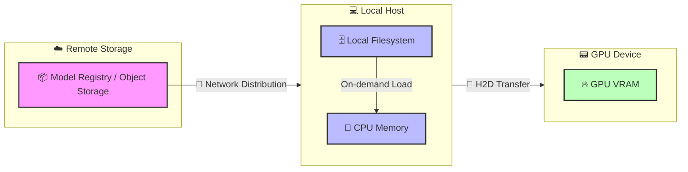
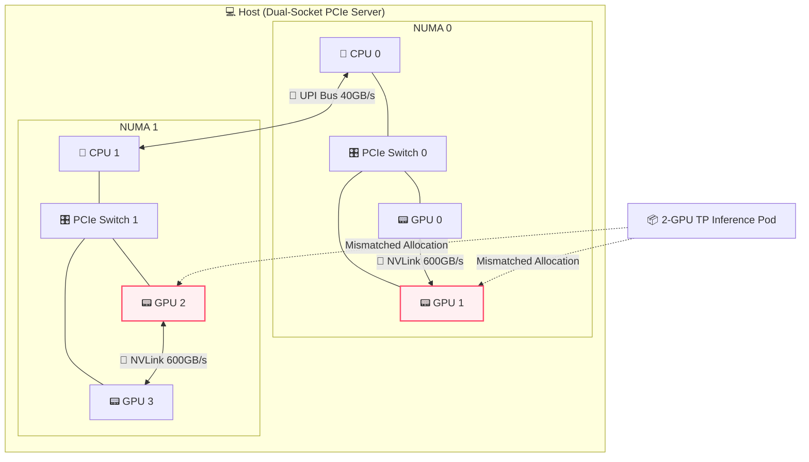
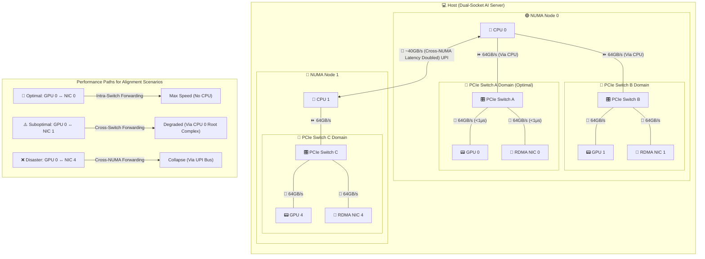
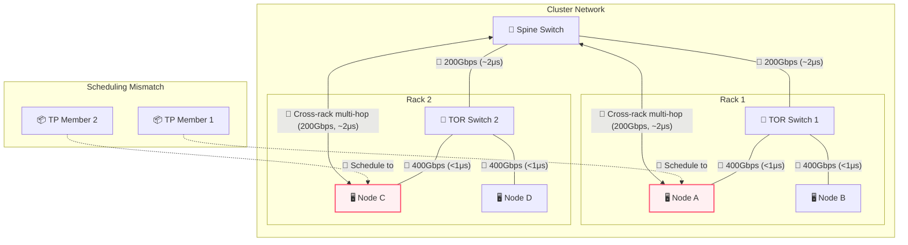
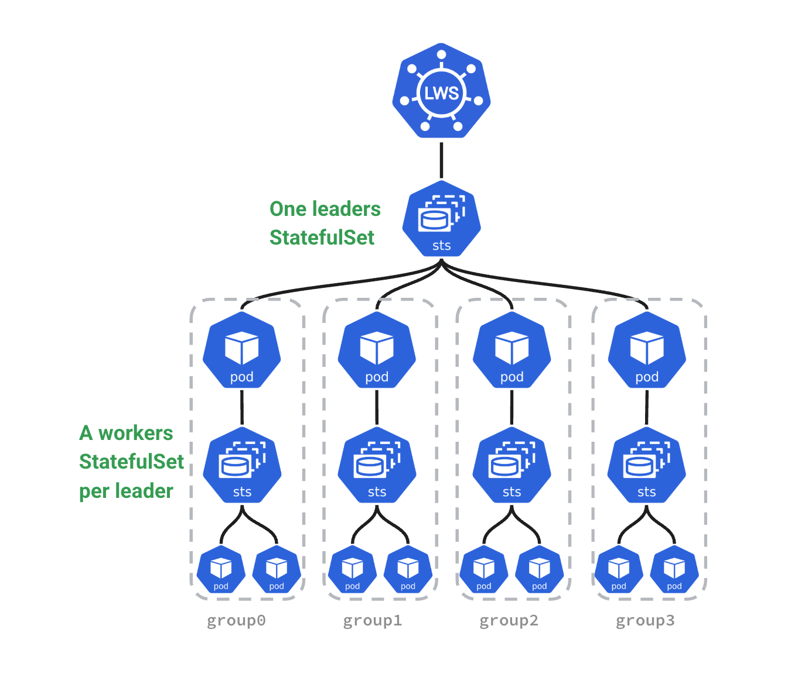

# Part 5: Orchestration —— Taming the Supercomputer: Leveraging Kubernetes for AI Compute

## Table of Contents
- [Chapter 21: When "Loose Coupling" Meets "Tight Coupling": The Collision of K8s and LLM Lifecycles](#chapter-21-when-loose-coupling-meets-tight-coupling-the-collision-of-k8s-and-llm-lifecycles)
  - [Section 1: First Principles: Examining Lifecycle Contradictions under Distributed Inference](#section-1-first-principles-examining-lifecycle-contradictions-under-distributed-inference)
  - [Section 2: Workload Lifecycle: Core Contradictions Throughout](#section-2-workload-lifecycle-core-contradictions-throughout)
  - [Section 3: Cluster Lifecycle: Heterogeneous Hardware Bootstrapping and Expensive Graceful Termination](#section-3-cluster-lifecycle-heterogeneous-hardware-bootstrapping-and-expensive-graceful-termination)
- [Chapter 22: Racing Against Time: Model Distribution and Cold Start Optimization](#chapter-22-racing-against-time-model-distribution-and-cold-start-optimization)
  - [Section 1: Separation of Image and Weights: Choice of Model Formats](#section-1-separation-of-image-and-weights-choice-of-model-formats)
  - [Section 2: Mass Data Distribution: Packaging Protocols and Pod Mounting](#section-2-mass-data-distribution-packaging-protocols-and-pod-mounting)
  - [Section 3: VRAM Loading Optimization: Three Schools of Data Paths and Trade-offs](#section-3-vram-loading-optimization-three-schools-of-data-paths-and-trade-offs)
- [Chapter 23: Tentacles Reaching into the Motherboard: DRA and Hardware Topology Aware Scheduling](#chapter-23-tentacles-reaching-into-the-motherboard-dra-and-hardware-topology-aware-scheduling)
  - [Section 1: Topology Black Hole: Why Scalar Counting Fails in Distributed Inference](#section-1-topology-black-hole-why-scalar-counting-fails-in-distributed-inference)
  - [Section 2: Evolution: DRA (Dynamic Resource Allocation) and Resource Management Paradigm Revolution](#section-2-evolution-dra-dynamic-resource-allocation-and-resource-management-paradigm-revolution)
  - [Section 3: Single-Node Battle: Facing Hardware Locality](#section-3-single-node-battle-facing-hardware-locality)
  - [Section 4: Beyond Single Node: Cluster-Level Network Topology and Multi-Machine Synergy](#section-4-beyond-single-node-cluster-level-network-topology-and-multi-machine-synergy)
- [Chapter 24: Breaking Silos: LeaderWorkerSet and Distributed LLM Orchestration](#chapter-24-breaking-silos-leaderworkerset-and-distributed-llm-orchestration)
  - [Section 1: Limitations of Traditional Controllers: Why the Microservices Paradigm Fails](#section-1-limitations-of-traditional-controllers-why-the-microservices-paradigm-fails)
  - [Section 2: NCCL: The Fragile Lifeline of Distributed Inference](#section-2-nccl-the-fragile-lifeline-of-distributed-inference)
  - [Section 3: The Birth of LeaderWorkerSet: Primitives Tailored for AI](#section-3-the-birth-of-leaderworkerset-primitives-tailored-for-ai)
  - [Section 4: Practical Exercise: Deploying Distributed vLLM with LWS](#section-4-practical-exercise-deploying-distributed-vllm-with-lws)
- [Chapter 25: All-or-Nothing: Gang Scheduling and Resource Deadlocks](#chapter-25-all-or-nothing-gang-scheduling-and-resource-deadlocks)
  - [Section 1: From Loose to Tight Coupling: Limitations of Native K8s Scheduling](#section-1-from-loose-to-tight-coupling-limitations-of-native-k8s-scheduling)
  - [Section 2: Return of a Classic Strategy: How Gang Scheduling Breaks Deadlocks](#section-2-return-of-a-classic-strategy-how-gang-scheduling-breaks-deadlocks)
  - [Section 3: Gang Scheduling Implementations in Kubernetes](#section-3-gang-scheduling-implementations-in-kubernetes)
  - [Section 4: Kueue: Job Queuing and Quota Management](#section-4-kueue-job-queuing-and-quota-management)
- [Chapter 26: Breathing of the Pool: Pod and Node Autoscaling in LLM Inference](#chapter-26-breathing-of-the-pool-pod-and-node-autoscaling-in-llm-inference)
  - [Section 1: Pod Autoscaling: Shifting from Metrics to Events](#section-1-pod-autoscaling-shifting-from-metrics-to-events)
  - [Section 2: Autoscaling Bottlenecks: Latency and Atomicity](#section-2-autoscaling-bottlenecks-latency-and-atomicity)
- [Chapter 27: Operations and Upgrades: Continuity vs. Heavy Assets](#chapter-27-operations-and-upgrades-continuity-vs-heavy-assets)
  - [Section 1: Traditional K8s Paradigms: Misalignment with LLM Inference](#section-1-traditional-k8s-paradigms-misalignment-with-llm-inference)
  - [Section 2: Seamless Upgrades: Engineering Practices](#section-2-seamless-upgrades-engineering-practices)
  - [Section 3: Upgrade Cold Starts: State Retention Challenges](#section-3-upgrade-cold-starts-state-retention-challenges)
- [Part 5 Summary: Core Contradictions and Breakthroughs in LLM Orchestration](#part-5-summary-core-contradictions-and-breakthroughs-in-llm-orchestration)


## Chapter 21: When "Loose Coupling" Meets "Tight Coupling": The Collision of K8s and LLM Lifecycles

### Section 1: First Principles: Examining Lifecycle Contradictions under Distributed Inference

From first principles, Kubernetes (K8s) is a control plane based on declarative state and eventual consistency. It abstracts heterogeneous infrastructure into a unified resource pool and decouples compute from state. K8s was designed for loosely coupled, stateless microservices.

In contrast, large-scale distributed LLM inference performs massive matrix multiplications under strict latency and memory (KV Cache) constraints. It is highly deterministic, topology-dependent, and requires high-speed inter-process communication (e.g., NVLink, InfiniBand). Tasks in Tensor Parallelism (TP) and Pipeline Parallelism (PP) are tightly coupled, pseudo-stateful (weights and cache), and follow the 'All-or-Nothing' (Gang) principle. Managing them is effectively managing a distributed supercomputer.

This fundamental contradiction constitutes the core challenge of orchestrating LLM inference on K8s.

### Section 2: Workload Lifecycle: Core Contradictions Throughout

The workload lifecycle spans image pulling, scheduling, execution, scaling, and termination. Distributed LLM inference brings unique challenges to this chain. This part analyzes these conflicts in detail:

1.  **Submission & Distribution: Separation of Image and Weights**
    *   **Challenge**: Model weights are huge (tens to hundreds of GBs). Packaging them in images causes pull timeouts and violates compute-data decoupling.
    *   **Direction**: The industry separates images from weights. Weights are stored as OCI Artifacts, not regular images. Kubernetes introduced Image Volumes to mount OCI weights directly. P2P and stream loading optimize distribution (see Chapter 21).

2.  **Scheduling: Topology Awareness and All-or-Nothing**
    *   **Challenge**: Native K8s schedulers use scalar counting and ignore complex PCIe, NUMA, and NVLink topologies. Distributed inference relies on NCCL rings; missing one card halts the group.
    *   **Direction**: Scheduling must be topology-aware to avoid performance drops (see Chapter 22) and support Gang Scheduling to prevent deadlocks (see Chapter 24).

3.  **Execution & Scaling: Breathing of the Compute Pool**
    *   **Challenge**: HPA based on CPU/memory fails because VRAM is pre-allocated and compute is bursty. Pod scaling is limited by node cold start speed.
    *   **Direction**: Scaling metrics must shift to engine internal metrics (e.g., queue length). Placeholders (Pause Pods) can hide cold start times (see Chapter 25).

4.  **Lifecycle Management: "All-or-Nothing" Throughout**
    *   **Challenge**: Startup, health checks, updates, and recovery all require atomicity. Killing one Pod creates zombies; updating one Pod causes version mismatches and deadlocks.
    *   **Direction**: K8s must move beyond independent Pod management. Primitives like LeaderWorkerSet manage group lifecycles to ensure atomicity (see Chapter 23).

### Section 3: Cluster Lifecycle: Heterogeneous Hardware Bootstrapping and Expensive Graceful Termination

The cluster lifecycle includes infrastructure provisioning, node bootstrapping, component upgrading, and maintenance.

1.  **Provisioning & Bootstrapping**
    *   **Challenge**: Node initialization is complex. It depends on complex driver stacks (NVIDIA Driver, CUDA, OFED) with fragile compatibility matrices. Networking requires SR-IOV or direct RDMA card mounting.
    *   **Direction**: Use IaC (like NVIDIA GPU Operator) to containerize driver installation. Configure dual networks (Multus CNI): standard Ethernet for control flow and high-speed cards for data flow.

2.  **Operations & Upgrading**
    *   **Challenge**: K8s default graceful termination is too short for long-context tasks. Evicting Pods with long connections and high memory usage is expensive.
    *   **Direction**: Use service meshes or smart gateways to stop routing new requests to nodes before upgrades, letting existing requests drain. Future directions include hot migration of KV Cache state.

---

## Chapter 22: Racing Against Time: Model Distribution and Cold Start Optimization

Before diving into optimization details, let's use a birds-eye view diagram to understand the complete lifecycle of model weights from remote cloud storage straight to GPU VRAM, including physical boundaries and bus transfers:



---

### Section 1: Separation of Image and Weights: Choice of Model Formats

In LLM inference, packaging weights into Docker images is an anti-pattern. The image pull mechanism cannot handle concurrent I/O of hundreds of gigabytes, causing K8s nodes to time out or run out of disk space.

The industry has converged on **separating images from weights**. Container images only contain the inference engine (like vLLM) and the runtime environment. Model weights are managed as independent static data.

#### Format War: Why Safetensors Became the Most Popular Format

To maximize I/O throughput and minimize cold starts, the industry has adopted Hugging Face's **`Safetensors`** as the de facto standard.

##### 1. The Past: Pickle's Security Nightmare and Performance Bottleneck
Before Safetensors, PyTorch's default `.pt` or `.bin` formats dominated. These formats rely on Python's `pickle` library for serialization.
*   **Security Risks**: Pickle can execute arbitrary Python code during deserialization. A downloaded model could execute malicious code upon loading. This created significant security concerns for production environments.
*   **Performance Issues**: Pickle lacks a clear separation between metadata and data. The CPU must parse the entire file and reconstruct complex objects, consuming massive CPU cycles. This prevents using `mmap` for zero-copy loading, leading to slow memory copies and long cold starts.

##### 2. The Present: Design Essence and Advantages of Safetensors
Hugging Face designed Safetensors to solve these pain points:
*   **Absolute Safety**: It stores pure tensor data and a light JSON header, preventing code execution.
*   **Header and Data Separation**: The file begins with a JSON string describing tensor topologies (names, shapes, data types) and file offsets. Engines only need to read a few kilobytes of the header to map the model in virtual memory instantly.
*   **Perfect for mmap**: The data section contains continuous, uncompressed raw binary data. The OS reads data from disk only when accessed, eliminating CPU copy overhead and minimizing loading times.

##### 3. Sharding and On-Demand Loading
Large models are usually split into shards (e.g., `model-00001-of-00004.safetensors`) with an `index.json` file mapping tensors to shards. For example, in the Hugging Face repository for [google/gemma-4-31B](https://huggingface.co/google/gemma-4-31B/tree/main), the model is stored in shards following this convention.
This sharding enables real optimizations in distributed inference:
*   In **Pipeline Parallelism**, GPUs only download and read shards containing the layers they need, skipping the rest to save bandwidth.
*   In **Tensor Parallelism**, all cards read all files, but `mmap` eliminates eager preloading — weights are faulted in on access, spreading load across inference rather than front-loading it at startup. This is widely used in engines like vLLM.

##### Other Model Formats
Besides Safetensors, the industry uses other formats for different scenarios:
*   **`.pt` / `.bin` (Legacy PyTorch)**: Based on Python's `pickle`. Phased out due to code execution risks and high CPU deserialization costs preventing effective `mmap` usage.
*   **`GGUF`**: Popular for edge and local inference. Designed for CPU/GPU hybrid execution and single-machine quantization, but lacks efficient support for large-scale distributed inference (TP and PP).
*   **`.tensors` (CoreWeave Tensorizer)**: An extremely optimized format from CoreWeave. It loads data directly from S3/HTTP to GPU VRAM, bypassing CPU memory. While offering impressive cold start performance, its ecosystem is closed and lacks general support.

Safetensors solves local reading but not rapid cluster distribution. For massive model weights in cloud-native environments, we must address packaging protocols, Pod mounting methods, and P2P/streaming pull to eliminate bottlenecks and minimize cold starts. The next section explores these topics.

---

### Section 2: Mass Data Distribution: Packaging Protocols and Pod Mounting

Separating weights from images turns distribution into a distributed storage and data orchestration problem. We must safely and quickly deliver data to containers.

#### 1. Packaging Protocols: Git LFS vs OCI Artifact

Before data reaches containers, we must package it. A battle of packaging protocols is playing out at the intersection of AI and cloud-native.

**Background:**
*   **Git LFS (Large File Storage)**: Git was designed for text code. Storing hundreds of gigabytes of binary files directly would crash repositories. Git LFS solves this by leaving small text pointer files in the Git repo and storing the actual large files on dedicated LFS servers (usually backed by object storage). **Thanks to Hugging Face, Git LFS is the de facto standard for AI asset management.**
*   **OCI Artifact**: Driven by the **OCI (Open Container Initiative)** under the Linux Foundation. Originally for container images, OCI specifications now extend to any file type (like model weights or Helm Charts). OCI Artifact packages files into specifications similar to Docker images, stored in standard **OCI Registries**. **As a newcomer in cloud-native infrastructure, it represents the future.**

The table below compares the two approaches:

| Dimension | Git LFS | OCI Artifact |
| :--- | :--- | :--- |
| **Background & Ecosystem** | Solves Git large file storage; **Hugging Face foundation** | **CNCF cloud-native standard**; treats models as images |
| **Storage Mechanism** | Text pointers in Git; large files in object storage | Packaged as OCI layers; stored in OCI Registry |
| **Distribution** | Standard HTTP(S) downloads; lacks native P2P and layer caching | Leverages mature image networks (P2P, streaming) |
| **Key Advantages** | Developer-friendly; native version branching and rollbacks | Fits cloud-native infrastructure; supports security signing (Cosign) |
| **Key Disadvantages** | Not designed for high-concurrency distribution; creates bottlenecks | Ecosystem not fully connected; requires conversion from HF |
| **Popularity** | **Dominant** (de facto AI standard) | **Rising Star** (future of cloud-native AI orchestration) |

**Reality**: A hybrid model is emerging. Developers use Git LFS on Hugging Face for management. For production (Kubernetes), automated pipelines convert models to OCI Artifacts to leverage image distribution networks.

#### 2. How Models Enter Pods
Delivering weights to containers quickly involves four approaches, each with trade-offs:

*   **Route 1: Distributed Filesystems (CSI + PVC, e.g., JuiceFS / Alluxio)**
    *   **Principle**: Mount distributed cache systems as PVCs via CSI drivers. Data streams from remote or local cache when the engine reads files.
    *   **Trade-offs**:
        *   **Advantages**: Support for stream loading, second-level Pod starts, and transparency to applications.
        *   **Disadvantages**: High operational costs to maintain high-availability cache clusters.
*   **Route 2: Asset Image-ization (OCI Artifact + Image Volume)**
    *   **Principle**: Treat models as images. Native Image Volumes (Beta in K8s 1.33) allow CRIs to unpack and mount OCI model images directly as volumes.
    *   **Trade-offs**:
        *   **Advantages**: Perfect integration with cloud-native distribution networks, reusing concurrent pulls and layer caching.
        *   **Disadvantages**: Incomplete ecosystem adoption.
*   **Route 3: Pod-Level Glue (Init Container / Sidecar)**
    *   **Trade-offs**:
        *   **Advantages**: High flexibility for custom "glue logic."
        *   **Disadvantages**: Disastrous cold starts (minutes) for full downloads via Init Containers, and increased resource overhead and orchestration complexity for Sidecars.
*   **Route 4: Node Pre-downloading (HostPath Mounting)**
    *   **Principle**: Pre-download weights to local NVMe disks of GPU nodes via external automation (Ansible or DaemonSets). Pods use them directly via `hostPath`.
    *   **Trade-offs**:
        *   **Advantages**: Physical limit I/O performance, zero cold start overhead, no network dependency, and high determinism.
        *   **Disadvantages**: Violating "immutable infrastructure" principles, making nodes stateful pets, and causing scheduling constraints and resource waste.

#### 3. P2P and Streaming: Accelerating Weight Distribution and Cold Starts

Distributing hundreds of gigabytes of model weights to thousands of nodes and minimizing Pod cold starts is a core challenge for cloud-native AI platforms. Optimization solutions incorporate three core optimization dimensions at the substrate:

*   **Local Cache**: Caching downloaded data blocks locally on computing nodes (e.g., NVMe SSDs). Pod recreations or local scale-outs short-circuit reads directly from disk, bypassing network overhead.
*   **P2P Sharing**: Leveraging high-speed intra-cluster networks so nodes missing weight files pull data from adjacent Peers, breaking the bandwidth bottleneck of centralized storage.
*   **Streaming / Lazy Loading**: Slicing large files into Chunks. A Pod pulls just a few megabytes of metadata to become Ready. The underlying filesystem faults in necessary chunks only when the engine accesses a specific weight, eliminating full download wait times.

In response to these three dimensions, the aforementioned schools have converged on the following technical combinations:

##### ① Corresponding to Route 1 (CSI + PVC): Volume / Filesystem-centric Mode (Model as Data)
<!-- TODO: Currently modifying weight caching -->
*   **Representative Stack**: **`Fluid + Alluxio / JuiceFS`**
*   **Principle**: Embedding a distributed cache network under the Persistent Volume Claim (PVC). Fluid acts as the data orchestration control plane on K8s, while Alluxio pools each node's local SSD into a distributed cache.
*   **Advantages**: Entirely transparent to serving engines like vLLM. The engine reads the mount point as a local filesystem, reducing integration overhead.

##### ② Corresponding to Route 2 (Asset Image-ization): Artifact / Image-centric Mode (Model as Image)
*   **Representative Stack**: **`Dragonfly + Nydus`**
*   **Principle**: Packaging weights as a standard **OCI Artifact**. Nydus acts as the Snapshotter in the container runtime (containerd), paired with Dragonfly to hijack network traffic and provide topology-aware P2P transfers.
*   **Advantages**: Fits container image distribution networks, offers native OCI Tag versioning, requires no heavy persistent cache cluster deployment, and keeps the operational footprint stateless.

##### ③ Evolution of Route 3 (Pod-Level Glue): Object-storage-native Mode (Direct Stream Reading)
*   **Representative Stack**: **`Run:ai Model Streamer / Mountpoint for Amazon S3 / AIBrix`**
*   **Principle**: Skipping distributed cache clusters and initiating high-concurrency sharded streaming directly via object storage SDKs or FUSE drivers.
*   **Trade-offs**: Highly lightweight, eliminating persistent cluster planning and operations, but sacrifices intra-cluster P2P sharing.
*   **Scenario Considerations**: Common in premium public cloud environments (e.g., AWS, GCP). Backed by hyperscaler infrastructure and object storage delivering tens of gigabytes of bandwidth, they can guarantee performance even **without Local Caching**. However, not all on-prem compute centers share these lavish network baselines. In bandwidth-constrained setups, lacking local caching and P2P sharing often leads to network gridlocks.

> [!IMPORTANT]
> **Determining Factors for Adopting P2P**
> 
> The deciding factor for architects assessing **P2P** deployment is the strength of the underlying infrastructure:
> *   **On-prem / Air-gapped Environments**: Centralized registries or object storage face extreme concurrent bandwidth limits. P2P is an **absolute necessity** to prevent a Thundering Herd from crashing the central cluster.
> *   **Public Cloud Environments**: Hyperscaler storage like S3 / GCS delivers massive throughput, making P2P less critical. It remains a **cost and latency optimization** for reducing cross-AZ / egress traffic charges and compressing cold starts during large-scale autoscaling.


---

### Section 3: VRAM Loading Optimization: Three Schools of Data Paths and Trade-offs

Loading weights from the local filesystem to GPU VRAM involves three solutions:

#### 1. Route 1: `mmap` + Traditional Copy (Single-Threaded Page Triggered)

The default for most engines like vLLM.

*   **Data Path**:
    Storage Medium -> [DMA] -> Kernel Page Cache (Pageable) -> [CPU Copy] -> CUDA Internal Pinned Buffer -> [DMA] -> GPU VRAM
*   **Principle**:
    Engines use `mmap` to map files to virtual memory. Reading triggers page faults, reading data from storage to page cache on demand. `mmap` shares memory between kernel and user space, eliminating the CPU copy from kernel to user space found in traditional `read`. **However, when calling `cudaMemcpy` to send data from `mmap` memory to the GPU, CUDA must first copy data to a hidden pinned buffer (Staging Buffer) because `mmap` memory is pageable. It then moves it to the GPU via DMA.**
*   **Trade-offs**:
    *   **Advantages**: No hardware or driver dependencies; works on any Linux system and storage medium.
    *   **Disadvantages**: Implicit CPU memory copies exist; high page fault overhead; single-threaded reads cannot saturate bandwidth.

#### 2. Route 2: Multi-threaded `pread` + Pinned Memory (e.g., Run:ai Streamer)

An advanced solution in high-performance scenarios leveraging CPU multi-core capabilities.

*   **Data Path**:
    Storage Medium -> [DMA] -> Kernel Page Cache -> [CPU Copy] -> User Pinned Memory -> [DMA] -> GPU VRAM
*   **Principle**:
    Abandon `mmap` and page fault mechanisms. The application actively requests large blocks of **Pinned Memory**. Multiple CPU threads concurrently issue **`pread`** calls at different file offsets; the kernel copies data from the page cache into pinned memory, which is then sent to the GPU via DMA.
*   **Trade-offs**:
    *   **Advantages**: **Multi-threaded concurrency** and **pipelining**. Reading files and sending to GPU happen concurrently, perfectly overlapping I/O and H2D transfer, much faster than `mmap`.
    *   **Disadvantages**: Still involves one CPU-participated memory copy (from page cache to pinned memory), consuming some CPU cycles.

#### 3. Route 3: GPUDirect Storage (GDS) (Ultimate Hardware Direct Path)

A "heavy armor" solution for physical limit performance, common in high-end HPC or proprietary AI clusters.

*   **Data Path**:
    Storage Medium (Local NVMe or Remote RDMA Storage) -> [Hardware Direct DMA] -> GPU VRAM
*   **Principle**:
    Files must be opened with **`O_DIRECT`** (bypassing page cache). Utilizing NVIDIA's GDS technology, data flows directly from the storage controller (or NIC) over the PCIe bus via DMA to GPU VRAM. **The CPU only issues commands and touches no data throughout the process.**
*   **Trade-offs**:
    *   **Advantages**: **Zero CPU memory transit, zero CPU compute overhead**; physical limit I/O throughput.
    *   **Disadvantages**: High threshold. Requires specific hardware (NVMe/RDMA) and drivers, and because of mandatory `O_DIRECT`, it is incompatible with many virtual filesystems (like Nydus) that rely on page cache.

---

**Summary and Linkage**:
The choice of loading solution is closely related to the "distribution and mounting solution" in the previous section:
* If you use **Nydus**, a stream distribution system heavily reliant on page cache, Route 2 (Streamer) is the best partner because they both use POSIX interfaces, and Streamer's concurrent reads can trigger Nydus's concurrent pulls.
* If you pursue extreme performance and use **GDS**, you must give up Nydus and turn to high-performance shared filesystems supporting `O_DIRECT` (e.g., WekaFS/VAST) or HostPath pre-downloading.

---

## Chapter 23: Tentacles Reaching into the Motherboard: DRA and Hardware Topology Aware Scheduling

Traditional Kubernetes abstracts hardware as a flat "resource pool" (CPU, memory, disk). Schedulers perform simple addition and subtraction: if a node has 4 CPUs left and a Pod requests 2, it schedules it there. This works well for microservices. However, in the era of large language model (LLM) distributed inference, this disregard for underlying hardware topology kills performance.

### Section 1: Topology Black Hole: Why Scalar Counting Fails in Distributed Inference

Kubernetes Device Plugins abstract GPUs as one-dimensional **scalar integers** (e.g., `nvidia.com/gpu: 8`). Schedulers only know "there are 8 GPUs." They ignore VRAM size, architecture (Hopper vs. Ampere), NVLink interconnects, and NUMA nodes.

In large-scale distributed LLM inference, tasks are **topology-dependent**.

Ignoring topology in distributed LLM inference causes severe problems across multiple dimensions:

##### 1. Intra-node GPU Topology Black Hole
Tensor Parallelism (TP) splits model layers across GPUs, requiring high-frequency `All-Reduce` per layer.
*   **Problem**: If K8s randomly assigns 4 GPUs across different PCIe switches or NUMA nodes (on PCIe servers without NVSwitch), communication falls back to slow CPU buses instead of NVLink, crashing performance.



##### 2. GPU-NIC Alignment Mismatch
Large-scale inference (cross-node TP/PP or disaggregated serving) relies heavily on RDMA.
*   **Problem**: **GPUDirect RDMA** achieves peak performance when the GPU and RDMA NIC share the same **PCIe Switch**.
    *   **Worst Case (Cross-NUMA)**: If the scheduler assigns a GPU on NUMA 0 and a NIC on NUMA 1, data must cross the CPU interconnect (e.g., UPI). Since UPI's effective bandwidth (~40GB/s) is less than the 50GB/s needed by a 400G NIC (400Gbps ÷ 8), the bus becomes a bottleneck, destroying the RDMA advantage.
    *   **Suboptimal Case (Cross-Switch within same NUMA)**: Even within the same NUMA node, pairing devices on different PCIe switches (e.g., GPU 0 and NIC 3) forces data up to the CPU's PCIe Root Complex. This prevents direct forwarding within the switch, adding latency (PCIe Gen5 x16 provides 64GB/s in one direction, perfectly covering the 50GB/s requirement of a 400G NIC).



##### 3. CPU-GPU Alignment Issues
While inference runs on GPUs, CPU-GPU affinity matters in critical scenarios:
*   **Cold Starts & Weight Loading**: Loading huge models from disk/RAM to VRAM across NUMA nodes prolongs cold starts and degrades TTFT.
*   **KV Cache Offloading**: In serving engines (like vLLM), when VRAM is full due to high concurrency or long contexts, systems often use a swapping mechanism to offload KV cache to CPU RAM to avoid OOM. Cross-NUMA bandwidth limits stall requests during this offload and reload process.
*   **Control Plane Overhead**: The inference engine (e.g., vLLM) scheduler runs on the CPU, launching CUDA kernels frequently. Cross-NUMA placement increases CUDA launch latency, impacting ultra-low latency tasks.

```mermaid
graph TD
    subgraph Host ["Host"]
        direction TB
        subgraph NUMA0 ["NUMA Node 0"]
            direction TB
            CPU0["🧠 CPU 0 (Running vLLM)"] ---|"🚀 ~200GB/s"| RAM0["🧠 Memory 0 (KV Cache Offload)"]
        end
        subgraph NUMA1 ["NUMA Node 1"]
            direction TB
            CPU1["🧠 CPU 1"] ---|"PCIe ~64GB/s"| GPU1["📟 GPU 1 (Running Model)"]
            CPU1 ---|"🚀 ~200GB/s"| RAM1["🧠 Memory 1 (Idle)"]
        end
        CPU0 <-->|"🐌 UPI ~40GB/s"| CPU1
    end
    
    subgraph Mismatch ["Performance Bottleneck"]
        GPU1 -.->|"VRAM full, offload KV Cache"| CPU1
        CPU1 -.->|"Cross-NUMA write 🐌 ~40GB/s"| RAM0
        note["⚠️ Cross-NUMA bandwidth only ~40GB/s, far below local ~200GB/s"]
    end
    
    style CPU0 fill:#fff0f2,stroke:#ff4d6d,stroke-width:2px
```



##### 4. Cluster-Level Network Topology Collision
Distributed inference also depends on cluster networks (RDMA blocks).
*   **Problem**: Multi-node TP/PP or **disaggregated serving** (for quantitative comparison, see [Part 4 Chapter 20 Section 3](part4_distributed.md#section-3-parallel-modes-data-volumes-and-metric-impacts)) requires frequent cross-node communication. Schedulers lacking network topology awareness might scatter Pods for the same model across racks (crossing Spine switches). Long-tail latency from multiple hops drags down the entire NCCL ring.



> [!NOTE]
> **Note on Network Architecture and Oversubscription Ratio**:
> *   **What is Oversubscription Ratio**: It is the ratio of the total **downlink bandwidth** (to servers) to the total **uplink bandwidth** (to upper switches) of a switch. It stems from cost-performance trade-offs in data center design. In traditional microservices, not all servers communicate across racks at full speed simultaneously, so engineers reduce uplink counts to save costs on expensive optical modules and core switches. However, in AI distributed computing, concurrent collective communication demands are extremely high, making oversubscription a direct cause of network congestion and performance degradation.
> *   **Architecture A (Non-blocking Network)**: Top-tier AI clusters (like InfiniBand Fat-Tree) typically use a 1:1 non-blocking design where cross-rack bandwidth is identical to intra-rack bandwidth (both 400Gbps). The main penalty is the extra hops and microsecond-level latency.
> *   **Architecture B (Oversubscribed Network)**: To visually illustrate the penalty of scheduling mismatch, this diagram assumes a **1:2 oversubscription ratio** (uplink bandwidth is half of the downlink). In this case, cross-rack communication suffers from both higher latency (from <1μs to ~2μs) and reduced bandwidth (from 400Gbps to 200Gbps).

We call this "count-only" scheduling the **Topology Black Hole**.

### Section 2: Evolution: DRA (Dynamic Resource Allocation) and Resource Management Paradigm Revolution

To break free from scalar counting, Kubernetes introduced **DRA (Dynamic Resource Allocation)** in 1.26. This is a revolutionary shift in K8s resource management.

#### 1. What is DRA?
DRA replaces the traditional Device Plugin model, which was designed for simple discovery and static allocation. Similar to PVCs in storage, DRA uses decoupled API objects to manage resources granularly.

The core data model consists of:
*   **ResourceClass**: Analogous to `StorageClass`. It defines a resource class, specifies the handling **Resource Driver**, and includes parameters.
*   **ResourceClaim**: Analogous to `PVC`. It represents a Pod's resource request. Pods reference a claim instead of requesting `gpu: 4`. It describes granular needs (e.g., "4 GPUs", "NVLink connected").
*   **ResourceClaimTemplate**: Analogous to `PersistentVolumeClaimTemplate`. It creates templates to generate claims dynamically for Pods managed by controllers like StatefulSet.
*   **Pod Spec Extensions**:
    *   `Pod.spec.resourceClaims`: References a `ResourceClaim` or `ResourceClaimTemplate`.
    *   `Pod.spec.containers[].resources.claims`: Specifies which claim the container consumes.
*   **Resource Driver**: Vendor-provided drivers that sense physical topology and bind claims to hardware.

#### 2. Motivations and Pain Points Solved by DRA
DRA is not just for expressing topology. It solves several hardware management pain points in the AI era:

*   **Motivation 1: Topology Expressiveness Beyond Counting**
    Device Plugins only express quantity. DRA allows declaring complex constraints (e.g., "4 GPUs in the same NUMA node with NVLink").

*   **Motivation 2: Parameterized Dynamic Hardware Configuration**
    Traditional allocation is static. DRA allows passing parameters in claims for dynamic runtime configuration without node reboots.
    *   **Example 1: Dynamic GPU Slicing (Dynamic MIG)**: Instead of static admin configuration, a Pod requests a "15GB VRAM" claim. The driver slices the card in real-time and recycles it on termination, improving utilization.
    *   **Example 2: Dynamic Network Configuration**: In distributed inference, Pods may need specific RDMA isolation. With DRA, a Pod claims specific network needs (e.g., "exclusive RDMA VF"), and the network driver dynamically configures the NIC (like SR-IOV VF) for isolation.

*   **Motivation 3: Multi-Dimensional Resource Co-allocation**
    In distributed inference, both GPUs and RDMA NICs must align. DRA allows co-allocating GPUs and network resources on the same PCIe Root Complex for perfect **GPUDirect RDMA**.

*   **Motivation 4: Decoupling and Reusing Resource Claims**
    Claims can exist independently of Pods. Resources can persist across Pod restarts, avoiding repeated hardware initialization overheads (like dynamic MIG slicing).

### Section 3: Single-Node Battle: Facing Hardware Locality

After understanding the upper abstraction of DRA, we must still dive into the physical reality of the motherboard. The three pain points mentioned in Section 1 (GPU interconnect, GPU-NIC alignment, CPU-GPU alignment) are all, in essence, problems of **hardware locality**.

Hardware locality determines the speed and cost of data movement between components, directly impacting distributed inference performance:
*   **GPU Interconnect Topology (Problem 1)**: Determines whether GPUs can use ultra-fast NVLink or are forced to fallback to slow cross-CPU buses.
*   **GPU-NIC Alignment (Problem 2)**: Determines whether **GPUDirect RDMA** can be completed within the same PCIe Switch or must cross CPU/NUMA boundaries, causing bandwidth bottlenecks on buses like UPI.
*   **CPU-GPU Alignment (Problem 3)**: Involves the strict **NUMA (Non-Uniform Memory Access)** architecture. If the inference process on the CPU and the controlled GPU span across NUMA nodes, KV Cache offloading and CUDA Launch overheads suffer severe performance penalties (e.g., TTFT jitter and throughput drops). Before DRA, K8s relied on Kubelet's **Topology Manager** to reject cross-zone allocations, but it was too pessimistic and failed to handle complex multi-dimensional alignments.

#### 1. Ultimate Solution: Solving Three Topology Pain Points with DRA
Recall these three pain points. DRA provides ultimate declarative solutions through parameterized decoupled design.

The following examples show how DRA solves these problems, based on the actual Kubernetes DRA (v1beta1) design.

##### Solving Pain Point 1: Intra-node GPU Topology (Requiring NVLink Clique)
In servers without NVSwitch (like legacy dual-island topologies), GPUs are split into NVLink cliques. DRA supports `matchAttribute` in `constraints` to ensure allocated devices share the exact same attribute value. The NVIDIA driver exposes `gpu.nvidia.com/nvlink-clique-id` in `ResourceSlice`.

```yaml
apiVersion: resource.k8s.io/v1beta1
kind: ResourceClaim
metadata:
  name: nvlink-gpu-claim
spec:
  devices:
    requests:
    - name: gpus
      deviceClassName: gpu.nvidia.com
      count: 4
    constraints:
    - requests: ["gpus"]
      matchAttribute: "gpu.nvidia.com/nvlink-clique-id" # Core: Requires GPUs to share the same clique ID
```

> [!NOTE]
> **Note on NVSwitch**: The limitation of NVLink cliques described above applies only to legacy or cost-sensitive architectures without NVSwitch (like dual-island topologies). In modern top-tier servers like **HGX A100/H100/H200**, the introduction of **NVSwitch** enables full interconnectivity among all 8 GPUs with equal bandwidth. Thus, clique constraints are no longer necessary. However, communication from GPUs to CPUs and NICs still obeys NUMA boundaries, as discussed later.
>

##### Solving Pain Point 2: GPU-NIC Alignment
To achieve physical limit **GPUDirect RDMA**, the GPU and RDMA NIC must be aligned in topology.

In **flagship interconnected servers** (such as HGX H100/H200), usually **only one main PCIe Switch is attached under each NUMA node**. In this case, achieving **NUMA node alignment** naturally places the GPU and NIC under the same PCIe Switch, enabling ultra-fast local forwarding.

However, in **some PCIe-only inference servers** (e.g., machines with **NVIDIA L40S** or **A10** that lack NVLink and rely entirely on PCIe for communication), **multiple PCIe Switches are often attached under a single NUMA node**. If the GPU and NIC are allocated to different PCIe Switches under the same NUMA node, data must still go up to the CPU's PCIe Root Complex for routing, adding latency and consuming CPU bandwidth. Here, allocation must be precise down to the **PCIe Switch level**.

To solve this multi-dimensional alignment, the community open-sourced **[DraNet](https://github.com/kubernetes-sigs/dranet)**. It exposes attributes like NUMA and PCIe Switch IDs of network interfaces in `ResourceSlice`s.

Here are DRA (v1beta1) declaration examples for both scenarios:

###### Scenario A: Coarse-Grained NUMA Alignment (For Standard HGX)
Requires GPU and RDMA NIC to be in the same NUMA node.

```yaml
apiVersion: resource.k8s.io/v1beta1
kind: ResourceClaim
metadata:
  name: numa-aligned-claim
spec:
  devices:
    requests:
    - name: gpus
      deviceClassName: gpu.nvidia.com
      count: 1
    - name: nics
      deviceClassName: dranet.kubernetes-sigs.io
      count: 1
      selectors:
      - cel:
          expression: 'device.attributes["dra.net"].rdma == true'
    constraints:
    - requests: ["gpus", "nics"]
      matchAttribute: "gpu.nvidia.com/numa-node-id" # Core: Requires being in the same NUMA node
```

###### Scenario B: Fine-Grained PCIe Switch Alignment (For Complex Topologies)
Requires GPU and RDMA NIC to be under the same PCIe Switch.

```yaml
apiVersion: resource.k8s.io/v1beta1
kind: ResourceClaim
metadata:
  name: switch-aligned-claim
spec:
  devices:
    requests:
    - name: gpus
      deviceClassName: gpu.nvidia.com
      count: 1
    - name: nics
      deviceClassName: dranet.kubernetes-sigs.io
      count: 1
      selectors:
      - cel:
          expression: 'device.attributes["dra.net"].rdma == true'
    constraints:
    - requests: ["gpus", "nics"]
      matchAttribute: "kubernetes.io/pcie-switch-id" # Core: Requires being under the same PCIe Switch
```

##### Solving Pain Point 3: CPU-GPU Alignment (NUMA Affinity)
In distributed inference, severe performance penalties occur if the CPU process and its controlled GPU span across NUMA nodes.

DRA exposes hardware topology in `ResourceSlice`s (e.g., `"gpu.nvidia.com/numa-node-id"`), enabling the scheduler to align allocations. However, **this also requires Kubelet configuration and Pod spec alignment** to bind physical cores:

1.  **Kubelet Configuration**: Kubelet must enable **CPU Manager** with a static policy (`--cpu-manager-policy=static`) and **Topology Manager** (e.g., `--topology-manager-policy=single-numa-node`).
2.  **Pod Must Be Guaranteed QoS Class**: To bind exclusive physical cores, the Pod's CPU and memory `requests` must equal `limits`, and the CPU request must be an integer.

Here is a realistic Pod spec example consuming the `numa-aligned-claim` created in Scenario A (note the QoS attributes):

```yaml
apiVersion: v1
kind: Pod
metadata:
  name: vllm-pod
spec:
  containers:
  - name: vllm-worker
    image: vllm/vllm-openai:latest
    resources:
      requests:
        cpu: "16"
        memory: "64Gi"
      limits:
        cpu: "16"      # Must equal requests and be an integer
        memory: "64Gi"   # Must equal requests
      claims:
      - name: gpus  # Consume the claim
  resourceClaims:
  - name: gpus
    resourceClaimName: numa-aligned-claim  # References the claim from Scenario A
```

### Section 4: Beyond Single Node: Cluster-Level Network Topology and Multi-Machine Synergy

However, in most current data centers, large model inference (e.g., hybrid TP/PP) or **Disaggregated Serving** (see Part 4 [Chapter 20: Network Communication and High-Speed Interconnects in LLM Inference](part4_distributed.md)) still requires spanning multiple physical nodes. When inference tasks span nodes, single-node topology alignment is only the first step; cluster-level network topology becomes decisive.

#### 1. Problem Restated: Random Collisions of Cluster Network Topology (Problem 4)
As mentioned in Section 1, large-scale distributed inference relies heavily on RDMA communication. Random node assignment by K8s causes:
*   **Cost of Network Hops**: In multi-node TP, nodes frequently sync tensors. Random assignment to different racks forces data across the core switch (Spine Switch), causing long-tail latency and traffic jams in NCCL rings.
*   **KV Cache Transfer Problem**: In disaggregated serving, Prefill nodes instantly transfer massive KV Cache to Decode nodes. If they are far apart, cross-node network bottlenecks will significantly increase Time to First Token (TTFT) and severely weaken the benefits of separation.

#### 2. Solution: Native K8s Topology-Aware Scheduling
To solve cross-node network bottlenecks, Kubernetes provides native **Affinity and Anti-Affinity** mechanisms with labels and Topology Keys to give the scheduler "location awareness."

Administrators typically label nodes with their physical location (e.g., rack or switch), such as `topology.kubernetes.io/rack=rack-1`.

For distributed inference Pod groups, the scheduler aligns topology via:
*   **Pod Affinity**: Declaring that Pods sharing the same inference task must be scheduled in the same `topologyKey` (e.g., `rack`), ensuring communication stays within a high-bandwidth, low-latency domain.

#### 3. Configuration Example: Rack Alignment via Pod Affinity
Here is an example declaring Pod affinity.

```yaml
apiVersion: apps/v1
kind: Deployment
metadata:
  name: vllm-distributed-worker
spec:
  replicas: 4
  template:
    metadata:
      labels:
        app: vllm-distributed
    spec:
      # Plain-language semantics: When selecting a node, I (the current Pod) must (Required) be placed in the same rack as existing Pods labeled app=vllm-distributed. If no such rack is found, I will remain Pending.
      affinity:
        podAffinity:
          requiredDuringSchedulingIgnoredDuringExecution:
          - labelSelector:
              matchExpressions:
              - key: app
                operator: In
                values:
                - vllm-distributed
            topologyKey: topology.kubernetes.io/rack
      containers:
      - name: vllm-worker
        image: vllm/vllm-openai:latest
        # ... resource requests, etc.
```

> [!NOTE]
> **The "Self-Affinity" Mechanism of the First Pod**
> 
> Readers might wonder: if all Pods require being co-located with others in the group, what does the first Pod affiliate with when none exist yet?
> 
> The Kubernetes scheduler handles this with fine-grained logic: it checks whether the labels of the Pod currently being scheduled can match the affinity condition (self-affinity). If it is self-affinity, and no matching Pods exist in the cluster yet, the scheduler allows the Pod to be scheduled (acting as the first anchor).
> 
> Note that if the affinity condition points to **other** non-existent components (non-self-affinity), the scheduler will **not** ignore the constraint, and the Pod will remain Pending.

This prevents the K8s scheduler from randomly scattering distributed inference nodes across racks, protecting high-frequency communication performance.

## Chapter 24: Breaking Silos: LeaderWorkerSet and Distributed LLM Orchestration

Large-scale distributed LLM inference often requires deploying a model across multiple GPUs or nodes (e.g., Tensor Parallelism TP or Pipeline Parallelism PP). This brings entirely new challenges to traditional Kubernetes workload controllers like Deployment or StatefulSet.

### Section 1: Limitations of Traditional Controllers: Why the Microservices Paradigm Fails

In microservices, Pods are stateless and independent. Deployments maintain replica counts, replacing failed Pods independently. Pods are loosely coupled.

Distributed LLM inference changes this fundamentally:
1.  **All-or-Nothing**: A TP group of 4 Pods must exist simultaneously to build the NCCL ring. Starting only 3 is useless.
2.  **Tight Coupling**: Leader Pods expose endpoints and coordinate Workers. Workers require high-speed interconnects (NVLink/RDMA).
3.  **Linked Lifecycles**: If one Worker crashes, others hang due to timeouts. Restarting a single Pod fails because it cannot join the existing communication domain. The entire group must restart.

Deployments cannot express this "group" concept. StatefulSets provide stable network IDs but fail at failure linkage and topology affinity.

### Section 2: NCCL: The Fragile Lifeline of Distributed Inference

#### 1. What is NCCL and Why is it Important?
NCCL is NVIDIA's custom acceleration library for multi-GPU collective communications.
In distributed LLM inference, especially in Tensor Parallelism (TP), computing each layer requires data synchronization among GPUs (e.g., `All-Reduce`). Using traditional CPU memory for transfer yields extremely low bandwidth and high latency.

NCCL **abstracts complex hardware topologies like NVLink, PCIe switches, and InfiniBand/RoCE NICs**, providing unified and extremely optimized communication primitives for upper-layer engines like vLLM. It acts as the "nervous system" connecting multi-GPU and multi-node inference; its efficiency directly determines overall throughput.

#### 2. Why is NCCL So Fragile?
Unlike traditional HTTP interfaces or microservices, NCCL is a **tightly coupled** system. It requires all participating GPUs to handshake and establish a closed communication Ring or Tree at startup.

This architecture is extremely fragile:
*   **All-or-Nothing**: NCCL requires all participating nodes to be online and enter the same state at the **same time**.
*   **Single Point of Failure**: In a communication ring of 8 cards, if 1 card crashes due to OOM, hardware failure, or network packet loss, the entire NCCL ring breaks instantly.
*   **Deadlocks and Hangs**: When the ring breaks, the remaining 7 cards do not exit automatically. They hang indefinitely in `cudaMemcpy` or NCCL calls, waiting until high timeout thresholds are reached.

#### 3. What to Do When NCCL Breaks?
In microservices, K8s defaults to restarting the failed Pod in place or elsewhere.

For NCCL, this local self-healing is **completely ineffective**:
*   The restarted Pod is a new process with new network handles; it cannot join the broken NCCL ring.
*   Remaining Pods are deadlocked and cannot handshake with the new Pod.

Therefore, when an NCCL ring breaks, the only correct solution is an **"All-or-Nothing" group-level restart**:
1.  **Identify Failure**: Monitors or Operators must quickly sense NCCL timeouts or Pod anomalies.
2.  **Group Termination**: Immediately kill **all** Pods in the group to clean up deadlocked processes.
3.  **Rebuild Ring**: The controller allocates clean resources for all Pods to restart and rebuild the NCCL ring from scratch.

This cruel "guilt by association" restart requirement is the core driver shifting K8s orchestration from StatefulSet to LeaderWorkerSet.

### Section 3: The Birth of LeaderWorkerSet: Primitives Tailored for AI

To fill this gap, the Kubernetes community introduced [LeaderWorkerSet (LWS)](https://github.com/kubernetes-sigs/leaderworkerset), a custom controller for tightly coupled AI/HPC workloads.

LWS introduces the concept of a **"Group"**, binding a Leader Pod and a set of Worker Pods as an indivisible unit.

To understand this visually, let's look at the overall architecture and Pod composition of LWS (referenced from [official LWS documentation](https://lws.sigs.k8s.io/docs/overview/)):




#### 1. Core Policies: Taming Tightly Coupled Lifecycles

To handle the harsh lifecycle challenges in distributed inference, LWS provides several key policies that make it superior to traditional controllers:

##### ① `restartPolicy`: The Ultimate Weapon for NCCL Ring Breaks
In traditional K8s, failed Pods restart independently. In LWS, you can configure `restartPolicy: RecreateGroupOnPodRestart`.
*   **Mechanism**: If any Worker Pod in a group fails (e.g., OOM or hardware hang), LWS does not attempt to restart it alone. Instead, it **takes decisive action and immediately kills and recreates all Pods in the group**.
*   **Value**: This ensures the NCCL communication domain rebuilds cleanly from scratch, eliminating zombie Pods and deadlock waits, serving as the foundation for high availability.

##### ② `startupPolicy`: Elegant Startup Orchestration
Startup order often matters in distributed inference.
*   **Mechanism**: LWS supports `LeaderCreated` (Workers created immediately when Leader is created) and `LeaderReady` (Workers created only after the Leader Pod is fully Ready).
*   **Value**: In complex engines, the Leader may need to load metadata or establish control planes first. Using `LeaderReady` prevents Workers from starting blindly and idling, saving valuable GPU compute.

#### 2. Upgrade Policy and Behavior

Besides runtime policies, LWS provides `rolloutStrategy` (rolling update strategy).
*   **Behavior**: It supports partition update mechanisms similar to StatefulSets. During model upgrades, you can control updating only a portion of inference groups at a time, ensuring surviving groups continue serving.
*   **Note**: Upgrading a group involves reloading hundreds of gigabytes of weights, a slow and expensive process. We will discuss graceful traffic shifting and draining requests during updates in detail in the subsequent "Cluster Upgrades" chapter.

#### 3. Predictable Naming Strategy and Network Identity

In distributed LLM inference (like NCCL ring building), Pods need to know each other's identity (Rank) and network addresses. LWS adopts a highly regular and predictable naming strategy to solve this pain point.

LWS naming rules:
*   **Leader Pods**: Named `[LWS_NAME]-[GroupIndex]`. For example, if the LWS is named `vllm-model`, the Leader Pod of group 0 is `vllm-model-0`.
*   **Worker Pods**: Named `[LeaderPodName]-[WorkerIndex]`. **Notably, worker indices start from 1**. For example, workers under `vllm-model-0` are named `vllm-model-0-1`, `vllm-model-0-2`, etc.

Additionally, LWS automatically injects labels via a webhook, allowing inference engines to determine their roles easily:
*   `leaderworkerset.sigs.k8s.io/group-index`: The index of the replica group.
*   `leaderworkerset.sigs.k8s.io/worker-index`: The index within the group (Leader is always `0`, Workers are `1, 2, 3...`).

This deterministic naming and labeling mechanism simplifies rank calculation and ring building for distributed inference engines. Additionally, Leader Pods acquire stable DNS names, facilitating routing by external clients or gateways (like GKE Inference Gateway) without worrying about Worker changes.

#### 4. Exclusive Topology Scheduling: "Reserved Seating" for Multiple Groups

In production, we typically deploy multiple multi-host inference groups (replicas) to handle high concurrency. The core challenge here is **ensuring that each inference group exclusively maps to its own independent topology domain (e.g., an independent rack) without interference**.

Using traditional Pod Affinity or Anti-Affinity rules becomes extremely complex and prone to scheduling deadlocks in multi-replica scenarios. LWS solves this elegantly via the `leaderworkerset.sigs.k8s.io/exclusive-topology` annotation.

##### How LWS "Sets the Rules" (Under the Hood)
When you configure LWS with `exclusive-topology: rack`, the LWS controller acts as a smart translator. Before Pods are submitted to Kubernetes, it **automatically rewrites the Pod YAMLs in the background** to generate complex affinity rules:
*   **Injecting Identity**: It labels Pods in group 0 with `group-index: 0`, group 1 with `group-index: 1`, and so on.
*   **Injecting Affinity (Intra-group Aggregation)**: It generates a rule: "Pods with `group-index: 0` must be in the same `rack`."
*   **Injecting Anti-Affinity (Inter-group Exclusivity)**: It generates another rule: "The `rack` containing Pods with `group-index: 0` must NOT contain Pods with other `group-index` values."

**For example**:
Suppose we have an LWS with `replicas: 3` (deploying 3 independent inference groups) and `leaderworkerset.sigs.k8s.io/exclusive-topology: rack` set.
LWS guarantees to the scheduler that:
*   All Pods of **Inference Group 0** (Replica 0) are forced onto **Rack A**.
*   All Pods of **Inference Group 1** (Replica 1) are forced onto **Rack B**.
*   All Pods of **Inference Group 2** (Replica 2) are forced onto **Rack C**.

Each inference group gets "reserved seating" in its dedicated rack. This ensures high intra-group communication bandwidth while avoiding bandwidth contention among different replicas in the same rack.

### Section 4: Practical Exercise: Deploying Distributed vLLM with LWS

Here is a conceptual YAML example deploying a 2-machine 16-card (8 cards per machine) vLLM TP service using LWS (Note: This is a simplified example for educational purposes; for complete production configurations, please refer to the [vLLM Official LWS Deployment Documentation](https://docs.vllm.ai/en/stable/deployment/frameworks/lws/)).

```yaml
apiVersion: leaderworkerset.x-k8s.io/v1
kind: LeaderWorkerSet
metadata:
  name: vllm-llama3-400b
  annotations:
    leaderworkerset.sigs.k8s.io/exclusive-topology: rack # Ensures each inference group exclusively occupies an independent rack
spec:
  replicas: 2 # Deploys 2 independent inference groups
  leaderWorkerTemplate:
    size: 2 # 1 Leader + 1 Worker per group (Total 2 Pods)
    leaderTemplate:
      metadata:
        labels:
          role: leader
      spec:
        containers:
        - name: vllm-leader
          image: vllm/vllm-openai:v0.8.5
          ports:
          - containerPort: 8000
          env:
          - name: TP_SIZE
            value: "16"
    workerTemplate:
      metadata:
        labels:
          role: worker
      spec:
        containers:
        - name: vllm-worker
          image: vllm/vllm-openai:v0.8.5
```

## Chapter 25: All-or-Nothing: Gang Scheduling and Resource Deadlocks

In large-scale distributed LLM inference (TP, PP), tightly coupled tasks face a scheduling challenge: **All-or-Nothing**. If a group of Pods cannot get all required resources simultaneously, the partially scheduled Pods become "zombies" holding resources, leading to deadlocks. This chapter explores Gang Scheduling principles and implementations in cloud-native AI.

### Section 1: From Loose to Tight Coupling: Limitations of Native K8s Scheduling

For highly regular **distributed inference tasks** on **static dedicated resources** (e.g., long-term job monopoly), the system might still operate normally without special scheduling.

However, in **dynamic** and **shared** environments, problems quickly emerge. Specifically, three scenarios in distributed inference expose the flaws of native scheduling:

1.  **Dynamic Scaling and Automatic Recovery**: Failures or traffic spikes trigger dynamic Pod creation. Without all-or-nothing guarantees, new Pods easily deadlock by grabbing partial resources, failing scaling or self-healing.
2.  **Multi-Tenant Shared Clusters**: With concurrent competition and preemption, resources fluctuate constantly. Schedulers without a global atomic view cause deadlocks or leave preempted resources unusable.
3.  **Mixed Tasks Generating Fragmented Resources**: Mixing inference, fine-tuning, and processing creates fragmented demands (1, 2, or 4 GPUs). Over time, clusters fill with fragments. Deadlocks and queue thrashing become reality.

In these scenarios, the microservice-oriented view of the default K8s scheduler (a greedy "fit what you can" algorithm) causes three disasters:

1.  **Resource Deadlock**:
    *   **Scenario**: Cluster has 4 free GPUs. Task A and Task B both need 4 GPUs.
    *   **Result**: Scheduler allocates 2 to A and 2 to B. Both wait for more, holding resources indefinitely. Deadlock.
2.  **Resource Fragmentation & Waste**:
    *   **Scenario**: A task needs 100 CPUs. Cluster has only 90.
    *   **Result**: Default scheduler schedules the 90 Pods. They run or init, consuming resources but doing no work without the full group.
3.  **Job Starvation (Head-of-Line Blocking)**:
    *   **Scenario**: A large task needs 64 GPUs.
    *   **Result**: Small tasks (1 GPU) consume newly freed resources immediately. The large task never finds 64 free GPUs simultaneously and starves.

### Section 2: Return of a Classic Strategy: How Gang Scheduling Breaks Deadlocks

To solve the limitations of native Kubernetes scheduling, **Gang Scheduling** (or Coscheduling) — a classic strategy — has returned to the center stage in the AI era.

Its core semantics are simple: **when a job consists of multiple collaborative tasks (Pods), the scheduler must ensure that either all tasks get resources and are scheduled simultaneously, or none are.** Think of it as forming a raid team: you need tanks, healers, and DPS to start. If only tanks and healers get in while DPS are locked out, the raid fails, and those inside waste time waiting.

To implement this, Gang Scheduling introduces the concept of treating a **"group of Pods" as the atomic scheduling unit**. The scheduler evaluates resources for the "group" rather than individual Pods:

*   **All or Nothing (Full Bind)**: If free resources meet the group's **minimum available count (MinAvailable)**, all Pods are bound to nodes at once.
*   **Wait in Queue (No Fragment Hogging)**: If resources are insufficient, the entire group waits in the global queue (Pending) and **never preemptively occupies scattered resources**, avoiding deadlocks.
*   **Group Preemption (Atomic Eviction)**: In systems supporting preemption, a high-priority group short on resources will **atomically preempt** resources of a lower-priority job as a whole, rather than evicting Pods piecemeal, preventing new deadlocks.

By elevating the scheduling unit from a single Pod to a Pod group, Gang Scheduling eliminates deadlocks caused by partial allocation and enables efficient resource flow.

### Section 3: Gang Scheduling Implementations in Kubernetes

Three ways to implement Gang Scheduling in cloud-native AI:

#### 1. Standalone Schedulers
*   **Principle**: Bypass the native `kube-scheduler` entirely, using a new scheduling engine for complex batch and AI tasks.
*   **Pros**: Native support for strict Gang Scheduling, priority preemption, and fair-share queues.
*   **Cons**: Split from the native ecosystem, missing out on evolving features like topology awareness and DRA.
*   **Typical Implementations**:
    *   **Volcano**: [Volcano](https://volcano.sh/) is the first CNCF cloud-native batch system, designed for AI/HPC workloads.
    *   **KAI Scheduler**: [KAI Scheduler](https://github.com/kai-scheduler/KAI-Scheduler) is a CNCF Sandbox project maintained by NVIDIA, combining Gang Scheduling with Topology-Aware Scheduling (TAS).

#### 2. Coscheduling Plugin (via Scheduler Framework)
*   **Principle**: Kubernetes introduced the Scheduler Framework, allowing developers to extend the native `kube-scheduler` via plugins. The community provides a [coscheduling plugin](https://github.com/kubernetes-sigs/scheduler-plugins/tree/master/pkg/coscheduling) in `kubernetes-sigs/scheduler-plugins`.
*   **Mechanism**: The plugin intercepts Pods at the `Permit` stage. Pods pause until `minAvailable` Pods arrive, triggering atomic cross-node binding.
*   **Pros**: Low intrusion; integrates seamlessly with other plugins like topology awareness.
*   **Cons**: High deployment costs requiring a dual-scheduler architecture; insufficient preemption support (per-Pod preemption causes thrashing); fragmented API ecosystem due to custom CRD usage.

#### 3. Native Kubernetes Gang Scheduling (Native Support, Evolving)
*   **Principle**: To solve batch scheduling pain points in cloud-native environments, Kubernetes introduced native Gang Scheduling support in **v1.35/v1.36** (based on [KEP-4671](https://github.com/kubernetes/enhancements/issues/4671)), bringing "All-or-Nothing" logic directly into the core `kube-scheduler`. It **treats multiple Pods as a single unit for resource admission and scheduling evaluation**, abandoning the greedy "fit what you can" strategy, ensuring the entire group's resource demands are atomically met via the core scheduler's global snapshot view.
*   **Mechanism**: Uses a **Barrier** sync mechanism. The scheduler snapshots cluster state; if the `minCount` in `PodGroup` is met, all Pods cross the barrier for atomic binding. Otherwise, the whole group pends and backs off.
*   **API Definitions & Workflow**:
    *   **API Definitions**: Introduces `Workload` (long-lifecycle policy declaration defining intent) and `PodGroup` (runtime scheduling state tracking execution) APIs.
    *   **Component Interaction (e.g., LWS)**:
        1.  **LWS Controller**: Automatically creates a `Workload` (declaring Gang policy) and a `PodGroup` instance, and **creates StatefulSet(s) that reference this `PodGroup`**. This process is transparent to users.
        2.  **Core Scheduler**: Traces Pods back to `PodGroup` and `Workload`, evaluating resources at the Barrier to bind them only if `minCount` is met.
*   **Status & Future Plans**:
    *   **Status**: Currently in **Alpha** stage in Kubernetes **v1.35/v1.36**.
    *   **Future Plans**: Pushing **Workload-Aware Preemption ([KEP-5710](https://github.com/kubernetes/enhancements/issues/5710))** for group-level preemption; integrating with Autoscaler for precise scaling; and providing a standard interface for frameworks like Spark and Ray.

### Section 4: Kueue: Job Queuing and Quota Management

After exploring low-level Gang Scheduling, we must introduce **Kueue**, another core component of cloud-native AI scheduling. Beginners often confuse Kueue with Gang Scheduling. From first principles, they belong to the **control plane policy** and **scheduling execution layer** respectively, and usually need to be used together in production.

#### 1. Problems Solved by Kueue
In multi-tenant shared large AI clusters, traditional K8s resource management faces the following pain points:
* **Lack of Job-Perspective Queuing**: The native K8s scheduler treats Pods as the smallest unit. When a Job containing 100 Pods is submitted, K8s processes Pods individually. If resources are insufficient, it leads to a deadlock where some Pods start while others are pending, causing resource idling and waste.
* **Limitations of Static Quotas (ResourceQuota)**: Native ResourceQuota imposes rigid hard limits. It cannot achieve cross-namespace **resource borrowing**, **dynamic reclamation**, or **priority-based fair-share**.

#### 2. Relationship with Gang Scheduling
* **Kueue Handles Admission Control**: As the cluster's gatekeeper, Kueue does not directly bind Pods to nodes. Instead, it controls the **Workload status**, determining *when* a job is allowed to instantiate. Kueue releases the job (via the Suspend mechanism) only when the quota meets the needs of the entire job.
* **Gang Scheduling Handles Atomic Scheduling**: Once Kueue releases a job, the underlying scheduler handles the micro-level **atomic scheduling**. Although Kueue enables job-level queuing, it cannot handle resource fragmentation competition during the scheduling instant. Therefore, **Kueue handles macro quota admission, while Gang Scheduling handles micro execution synchronization**.

#### 3. Typical Use Cases for Kueue
* **Multi-Tenancy and Elastic Quotas**: When multiple teams share expensive GPU pools and need elastic sharing mechanisms like 'borrow when idle, return when busy'.
* **Large-Scale Distributed Job Management**: Managing global queues for bulk jobs to prevent massive Pods from flooding the scheduler and causing system overload (Thrashing/Churn).
* **Heterogeneous Resource Topology Management**: Working with compute topologies (defined by ClusterQueue) to manage quotas for different types of acceleration hardware more gracefully.

## Chapter 26: Breathing of the Pool: Pod and Node Autoscaling in LLM Inference

Large-scale distributed LLM inference traffic is highly bursty. To guarantee low latency while controlling expensive compute costs, autoscaling is indispensable.

Autoscaling in LLM inference occurs at two levels: **Pod Autoscaling** and **Node Autoscaling**.

### Section 1: Pod Autoscaling: Shifting from Metrics to Events

#### 1. Failure of Native HPA: Why CPU/Memory Metrics Fail in LLM Scenarios
Kubernetes native Horizontal Pod Autoscaler (HPA) defaults to CPU or memory utilization. This fails in LLM inference:
*   **Bottleneck Mismatch**: The bottleneck is usually **GPU memory bandwidth** and **KV Cache occupancy**, not CPU. When concurrency spikes, CPU might remain low while VRAM is full.
*   **Reactive Lag**: Native HPA is reactive. For LLM Pods with long cold starts, reacting to metric spikes causes request timeouts.

#### 2. Custom Metrics and KEDA: Event-Driven Scaling
To reflect congestion accurately, the industry uses custom metrics from inference engines.

**KEDA (Kubernetes Event-driven Autoscaling)** acts as an extension to HPA. While native HPA supports Custom/External Metrics, configuring adapters for different sources is complex. KEDA shields this complexity by providing a unified, pluggable framework that maps external events to HPA-consumable metrics and automatically manages HPA lifecycles.

Key advantages of KEDA:
*   **Rich Scalers**: With over 60 built-in scalers (including Prometheus), it easily pulls real vLLM business metrics like waiting requests (`vllm:num_requests_waiting`) and KV Cache usage (`vllm:gpu_cache_usage_perc`).
*   **Zero-to-One Scaling**: Native HPA cannot scale from 0 to 1. KEDA's Operator monitors event sources (like queues) and forces the first Pod creation when events > 0. HPA then handles 1-to-N scaling.

#### 3. Group Scaling: LWS + HPA Synergy
In distributed inference (e.g., multi-node TP), scaling individual Pods breaks NCCL rings.

By targeting **LeaderWorkerSet (LWS)** instead of Deployments:
*   HPA scales the number of LWS `replicas`.
*   LWS controller creates or destroys Pods atomically as a group, ensuring atomicity.

### Section 2: Autoscaling Bottlenecks: Latency and Atomicity

When Pod scaling exhausts physical resources, Node Autoscaling triggers.

#### 1. Two Approaches to Node Autoscaling: Cluster Autoscaler and Karpenter
*   **Cluster Autoscaler (CA)**: Operates on Node Groups. It adds nodes to groups when Pods are Pending. It lacks flexibility and causes fragmentation.
*   **Karpenter (and GKE NAP, Node Auto-Provisioning)**: Brings "Group-less" provisioning. It reads Pending Pod specs and provisions the most cost-effective instance type dynamically, maximizing bin-packing efficiency.

#### 2. Node Autoscaling Challenges: Latency and Atomicity

Both Cluster Autoscaler and Karpenter face two critical flaws in LLM inference: **Latency** and **Lack of Atomicity**.

##### ① Latency: Reactive Provisioning
Autoscalers trigger only on "Pending Pods." Provisioning starts only after resources exhaust. Node booting, weight pulling, and engine initialization take minutes.

Scaling involves:
1.  **HPA Sensing**: HPA polls metrics (default 15s). The delay from traffic spike to Pending Pod creation adds tens of seconds.
2.  Cloud provider VM provisioning (seconds to minutes).
3.  Node bootstrapping and driver installation (minutes).
4.  Pulling massive weights (minutes).
5.  Engine startup and NCCL ring building (seconds).

Total cold start takes minutes, causing request timeouts during spikes.

##### ② Lack of Atomicity: Resource Idling and Retries
In LWS (LeaderWorkerSet) distributed inference, a replica (1 Leader + N Workers) must be **fully ready** to serve. This is essentially the **"All-or-Nothing"** atomic scheduling problem discussed in the previous chapter.
However, default K8s schedulers and autoscalers process Pods individually. This causes efficiency issues:
*   **GPU Idling Cost**: If the autoscaler provisions only partial nodes (e.g., Leader schedules but Worker pends due to stock shortages), ready GPUs idle and waste money.
*   **Retry Latency & Compounded Waste**: Although systems eventually converge via timeouts and retries (e.g., Kueue's `waitForPodsReady`), this loop significantly prolongs cold starts. Worse, while waiting for retries, GPUs on already-provisioned nodes continue to idle, exponentially compounding costs.

Thus, atomicity in node scaling is an **efficiency and cost problem**, not a correctness problem.

#### 3. Pragmatic Solutions

No perfect solution exists. The industry uses these methods, categorized by the challenges they address: latency and atomicity.

##### ① Latency Solutions: Racing Against Time

Solutions to latency either "provision proactively" or "accelerate startup."

*   **Proactive Provisioning**
    *   **Early HPA Indicators**: While HPA is reactive, using sensitive metrics (like vLLM queue length or KV cache usage) instead of CPU/memory triggers scaling earlier, buying time for node startup.
    *   **Capacity Buffers**: **Balloon Pods** (low-priority placeholder Pods running `sleep` to hold capacity) are a common implementation. High-priority inference Pods preempt them instantly. To avoid manual management churn, systems use GKE's **[`CapacityBuffer` API](https://docs.cloud.google.com/kubernetes-engine/docs/concepts/capacity-buffer)**. Additionally, GKE supports **Standby Buffers** (via suspended VMs) to reduce cost, primarily for CPU machines (e.g., Agent use cases); GPU and TPU machine types are not supported.
    *   **Predictive and Cadence Scaling**: Use fixed schedules for known peak hours (e.g., via **KEDA's native Cron scaler**) or machine learning models to predict traffic trends (Predictive Scaling), provisioning machines before spikes arrive.
*   **Accelerated Node Startup**
    *   **Reality**: **No silver bullet exists**. Teams compress steps using pre-baked AMIs/OS images with drivers, P2P distribution (Dragonfly) with lazy loading (Nydus), or GPU memory snapshots (e.g., via gVisor). These methods require high technical investment and cannot eliminate physical overheads.

##### ② Atomicity Solutions: Pursuing "All-or-Nothing"

Solutions to atomicity ensure the autoscaler and scheduler share a "group" perspective.

*   **LWS + Kueue + CA + ProvisioningRequest (End-to-End Atomicity)**
    *   This is the most complete solution. On supported clouds (e.g., GKE with Cluster Autoscaler), Kueue controls workloads. Instead of creating Pods directly, Kueue issues a **`ProvisioningRequest`** to the CA. The CA verifies and reserves all physical resources needed for the group. Pods schedule only after all nodes are physically ready.
*   **Best-Effort Atomicity**
    *   Without `ProvisioningRequest`, modern autoscalers like **Karpenter** use a **Batching Window**. They collect pending Pods for a short time and attempt to provision nodes for them all at once. This works usually but risks partial failure when cloud inventory is low.
*   **Reserved Resources**
    *   Using **Balloon Pods** or **Capacity Buffers** naturally solves atomicity. Since resources already exist in sufficient quantity, the Pod group schedules instantly.

##### ③ Trade-offs: To Reserve or Not to Reserve?

Reserving resources (Capacity Buffer) is effective for both latency and atomicity but introduces a classic trade-off: **Cost vs. Experience**.

*   **Reserving Resources (Trading Cost for Time)**:
    *   **Advantages**: Eliminates cold start latency and guarantees atomicity, offering the best user experience.
    *   **Disadvantages**: Extremely expensive. GPU nodes incur costs even when running `sleep`. Poor traffic prediction causes significant waste.
*   **No Reservation (Pure Dynamic Elasticity)**:
    *   **Advantages**: Optimal cost efficiency; pay-as-you-go with no idle waste.
    *   **Disadvantages**: Users suffer minute-level cold start delays, and resource shortages risk partial failures and retries due to lack of atomicity.

In practice, engineering teams combine these: **buffers handle sudden bursts (ensuring core experience), accelerated startup shortens buffer replenishment time, and dynamic elasticity handles long-tail traffic.**

## Chapter 27: Operations and Upgrades: Continuity vs. Heavy Assets

In large-scale distributed LLM inference clusters, cluster upgrades and maintenance (e.g., OS patches, driver updates, K8s version upgrades) face unique challenges compared to traditional microservices. Abrupt evictions and restarts cause severe service disruptions and waste expensive compute resources.

### Section 1: Traditional K8s Paradigms: Misalignment with LLM Inference

Native K8s upgrades rely on **Rolling Updates** and **Node Draining (Cordon & Drain)**. This paradigm fails in LLM inference due to several pain points:

#### 1. Insufficient Graceful Shutdown Time and Long Connections
*   **Pain Point**: The default 30-second `terminationGracePeriodSeconds` fails for LLM inference, which relies heavily on WebSockets or SSE for long-lived streaming connections. A long-context decode or large batch execution can take minutes. Simply cutting traffic at the load balancer fails to drain connections without user-perceivable interruptions.
*   **Consequence**: Abruptly killing Pods interrupts active streaming, degrading user experience. It also wastes the GPU compute spent on the active batch.

#### 2. Eviction and Version Dilemmas in All-or-Nothing Scenarios
In distributed inference (e.g., multi-node TP), both Pods and their bound Nodes exhibit extreme coupling (Gang). Traditional sequential eviction and upgrade strategies fail at two levels:
*   **Pod-Level "All-or-Nothing"**: Killing a single worker breaks the NCCL ring, bringing down the entire group (Leader + Workers). Sequential draining causes repeated interruptions and restarts, wasting resources. Native PodDisruptionBudget (PDB) operates at the Pod level and cannot natively define a budget for *inference groups*.
*   **Node-Level "Strong Consistency" and Topology Requirements**:
    *   **Driver and Software Stack Version Risks**: While CUDA and drivers offer backward compatibility, version mismatches (NVIDIA drivers, OFED) across nodes can cause subtle performance jitter or disable advanced features like GPUDirect RDMA in high-performance distributed inference. Maintaining consistency during the upgrade window is a best practice to avoid unpredictable risks.
    *   **Repeated Disruptions and Concurrent Avalanches (Disruption & Avalanche)**: A distributed inference group spanning multiple nodes will be disrupted every time a single node is upgraded sequentially, forcing LWS to recreate the group repeatedly (e.g., 4 cold starts for a 4-node group). Conversely, if multiple nodes are upgraded concurrently without gang awareness, it risks hitting nodes belonging to different groups simultaneously, causing many replicas to fail at once and leading to a capacity avalanche.

#### 3. Physical Cold Start Prolongs Upgrade Cycles and Costs
*   **Pain Point**: As discussed in the autoscaling chapter, LLM Pod cold starts (loading massive weights, building NCCL rings, and KV Cache allocation and creation) are extremely time-consuming.
*   **Consequence**: This prolongs rolling upgrade cycles significantly, expanding the maintenance window risk. In Blue-Green deployments, it forces both expensive GPU pools to overlap for a longer duration, driving up transition costs.

### Section 2: Seamless Upgrades: Engineering Practices

To upgrade nodes without affecting business continuity, the industry relies on a combination of Connection Draining, graceful termination, and group-level rollouts.

#### 1. Connection Draining and Extra-Long Graceful Termination
To achieve seamless upgrades, fine-grained control over traffic shifting and process termination is mandatory:
*   **Stopping New Requests (Gateway Switching)**: Before upgrading a node, mark it as unschedulable (Cordon). At this moment, rely on the Endpoint controller's asynchronous synchronization. By deploying the native **[`sleep` action](https://kubernetes.io/docs/concepts/containers/container-lifecycle-hooks/#container-hooks)** recently added to the `preStop` phase, an engine can enforce a pause before receiving the `SIGTERM` signal. This grants enough time for endpoints to be removed from the upstream gateway or load balancers (LB) without having to maintain fragile shell scripts with `sleep` commands.
*   **Processing Existing Requests (Handling `SIGTERM` in vLLM)**:
    *   **Engine Behavior**: When inference engines like vLLM receive a `SIGTERM` signal, they stop accepting new requests by default but continue processing active ones in the queue.
    *   **Loss Prevention**: Abruptly interrupting these requests degrades the streaming user experience and wastes expensive GPU compute already spent.
    *   **Longer Graceful Period**: Consequently, the cluster must support **longer graceful termination times**. You must increase Pod `terminationGracePeriodSeconds` from the default 30 seconds to a duration measured in minutes, depending on the maximum context inference time allowed.
    *   **Operations Planning Impact**: This prolonged wait implies that SRE teams must account for **increased total upgrade durations**. This requires teams to plan accordingly, such as carefully scheduling **Maintenance Windows** or adopting more flexible strategies like **Pause & Resume**.

#### 2. Addressing All-or-Nothing: Group Upgrades vs. Blue-Green
Engineering teams address PDB and sequential eviction limitations at both Pod and Node levels:
*   **Pod-Level Solutions**:
    *   **LWS Native Rolling Update**: This is LWS's base capability. LWS provides a rolling update mechanism similar to Deployment and StatefulSet, but operates at the **Group** level. By configuring `rolloutStrategy.type: RollingUpdate`, LWS performs a unified Readiness check for the entire group of Pods and supports parameters similar to `maxUnavailable` to control the number of unavailable groups, ensuring each update occurs at the unit of a complete inference group and avoiding deadlocks caused by rolling individual Pods.
*   **Node-Level Solutions (Breaking Single-Node Upgrade Inertia)**:
    To avoid repeated disruptions and capacity avalanches, node upgrades must be Gang-aware.
    1.  **Blue-Green Node Pool Upgrades**: Spin up a new, matching Node Pool (Green), deploy a completely new set of inference groups (e.g., LeaderWorkerSets) onto it, wait for the entire group to be Ready before seamlessly switching traffic, and then destroy the old pool (Blue) along with its previous workloads. This avoids in-place upgrade risks entirely but **requires extra redundant resources (the volume of extra resources depends on the number of inference groups being upgraded simultaneously)**.
    2.  **HA Upgrades Based on Upgrade Domains and Delegated Readiness**: To address PDB's inability to perceive groups, the author proposes a generic HA upgrade solution linking Upgrade Domains, Readiness probe aggregation, and standard PDBs. The strategy utilizes a three-layer contract to achieve secure rolling upgrades for multi-host workloads while strictly relying on Kubernetes native mechanisms. For details, see the standalone proposal [idea_multi_host_inference_ha_upgrade.md](./ideas/idea_multi_host_inference_ha_upgrade.md).

### Section 3: Upgrade Cold Starts: State Retention Challenges

Chapter 21 discussed model distribution and cold start optimizations (e.g., P2P, lazy loading) primarily for **scaling out** or new deployments. However, **service upgrades** present a different cold start profile.

During upgrades, the goal shifts from just speeding up Pod readiness to leveraging existing states to avoid cold start penalties. Two dimensions differ significantly:

#### 1. Model Weights: Reusing Local Cache
Scaling out forces new Pods onto new nodes, requiring full weight downloads. Pod upgrades (e.g., updating the vLLM engine version without changing the model) differ:
*   **Download Necessity**: Depends on storage architecture and scheduling.
*   **Local Cache Dividends**: If the cluster uses `hostPath`, Local PV, or local blob caches (like Dragonfly), and the new Pod schedules onto the **same node** (or updates in-place), the weights already exist in the node's disk or OS page cache. The new Pod only needs to load them into VRAM (via `mmap`), bypassing network downloads.
*   **Challenge**: Default K8s `RollingUpdate` creates new Pods before deleting old ones, usually placing new Pods on other nodes with free resources. This loses the local cache advantage. Exploiting this requires strict node affinity or In-place Update mechanisms.

#### 2. KV Cache: From Scratch vs. State Inheritance
True cold starts begin with empty VRAM. Upgrades, however, occur in an active system with rich KV states:
*   **VRAM State Evaporation**: Evicting a node destroys its cached KV Cache (system prompts, RAG contexts). Migrated traffic forces the new Pod to redo Prefill computations, spiking TTFT.
*   **Inheritance Potential**: Unlike fresh starts, upgrades allow new Pods to potentially inherit these states:
    *   **KV Cache Live Migration**: Before a forced restart, copy the KV Cache from the source GPU VRAM to a standby node's VRAM over high-speed RDMA.
    *   **Disaggregated KV Cache**: If KV Cache resides in a remote memory pool, the new Pod pulls the state directly, bypassing Prefill entirely.
*   **Status**: These techniques (especially Live Migration) require deep integration between inference frameworks (like vLLM's distributed KV cache) and K8s Operators. They remain in the prototype stage.

---

## Part 5 Summary: Core Contradictions and Breakthroughs in LLM Orchestration

Stepping back from these specific components and engineering details, the core pain points encountered in Part 5 (Chapters 21 to 26) stem from **two core contradictions**. The cutting-edge technologies and pragmatic solutions we discussed (LWS, DRA, Gang Scheduling, KEDA, Nydus, etc.) are efforts to reconcile these two contradictions.

### Contradiction 1: Heavy "Soft State" — The Cost of Creation and Reconstruction

Traditional Kubernetes assumes **stateless** microservices, where Pods are disposable and easily recreated. LLM inference, however, deals with extremely heavy "soft states":
*   **Definition**: Hundreds of gigabytes of **model weights** and dynamically generated, massive **KV Caches**. Losing them causes no data corruption, but rebuilding them consumes enormous **network bandwidth** or **GPU compute**.
*   **Pain Point Mapping**:
    *   **Cold Start Optimization (Chapter 21)**: Accelerating initial weight loading forces us to use P2P distribution (Dragonfly) and lazy loading (Nydus).
    *   **Reactive Autoscaling (Chapter 25)**: Because state building is too slow, we must use early business indicators for HPA to buy time for Pod startup, and use Capacity Buffers at the node level to eliminate physical cold start waits.
    *   **Upgrade Pain (Chapter 26)**: During rolling updates, to prevent KV Caches from evaporating, we explore complex "KV Cache Live Migration" and disaggregated architectures.

### Contradiction 2: Rigid "Compute Topology" — Collision Between Tight and Loose Coupling

Traditional Kubernetes adheres to a **loose coupling** philosophy with scalar resource counting ("fit what you can"). Distributed LLM inference is a **topology-aware** and **tightly coupled** system:
*   **Definition**: GPUs must use NVLink intra-node, align with NICs under the same PCIe Switch (GPUDirect RDMA), exclusively occupy racks cross-node, and all Pods in a group must share a linked lifecycle.
*   **Pain Point Mapping**:
    *   **Breaking Scalar Counting (Chapter 22)**: To let the scheduler see physical reality, K8s introduces DRA, replacing Device Plugins.
    *   **Reshaping Orchestration Primitives (Chapter 23)**: LWS emerges to manage multi-node groups as indivisible units, preventing deadlocks from NCCL ring breaks.
    *   **Atomic Scheduling (Chapter 24)**: Gang Scheduling returns to prevent deadlocks in multi-tenant, dynamic environments.
    *   **Lack of Atomicity in Scaling and Upgrades (Chapters 25 & 26)**: We force Autoscalers and PDBs to adopt a "Group" perspective to avoid GPU idling waste from partial readiness.

---

**Conclusion**:
Kubernetes is undergoing its most severe paradigm shift since inception: moving from "Independent Services" to "Collaborative Compute Groups," from "Loose Coupling" to "Tight Coupling," and from "Stateless" to "Heavy Soft-State." Understanding these two core contradictions provides the key to mastering large model inference in the cloud-native era.
