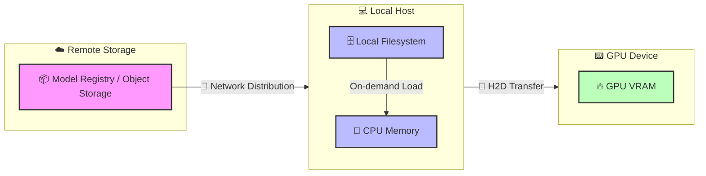
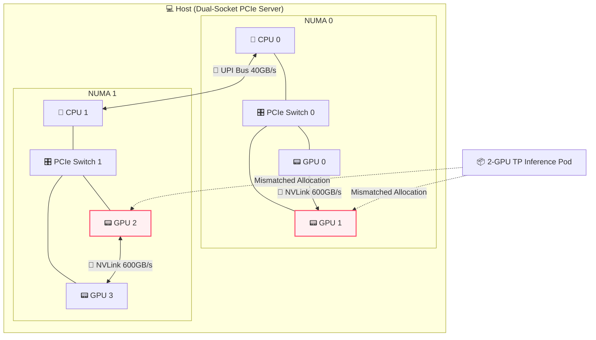
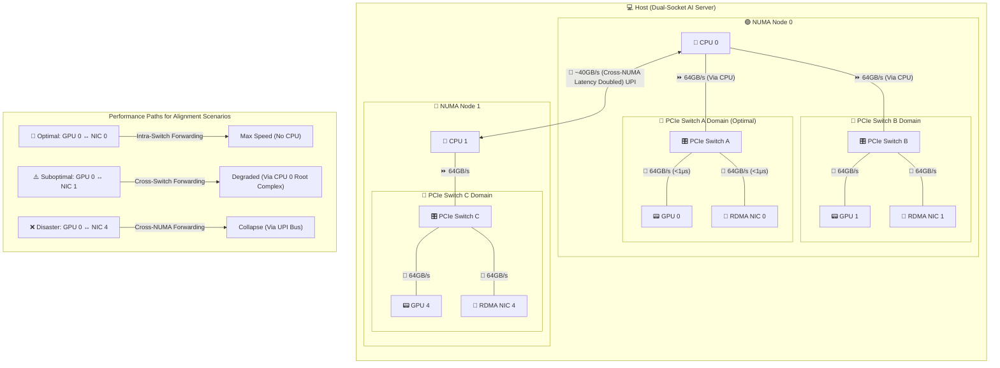
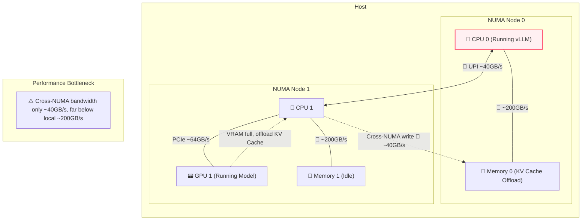
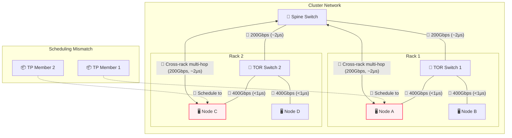

# Part Five: Orchestration —— Taming the Supercomputer: Leveraging Kubernetes for AI Compute

## Chapter 20: When "Loose Coupling" Meets "Tight Coupling": The Collision of K8s and LLM Lifecycles

### Section 1: First Principles: Examining Lifecycle Contradictions under Distributed Inference

From first principles, Kubernetes (K8s) is a control plane based on declarative state and eventual consistency. It abstracts heterogeneous infrastructure into a unified resource pool and decouples compute from state. K8s was designed for loosely coupled, stateless microservices.

In contrast, large-scale distributed LLM inference performs massive matrix multiplications under strict latency and memory (KV Cache) constraints. It is highly deterministic, topology-dependent, and requires high-speed inter-process communication (e.g., NVLink, InfiniBand). Tasks in Tensor Parallelism (TP) and Pipeline Parallelism (PP) are tightly coupled, pseudo-stateful (weights and cache), and follow the 'All-or-Nothing' (Gang) principle. Managing them is effectively managing a distributed supercomputer.

This fundamental contradiction constitutes the core challenge of orchestrating LLM inference on K8s.

### Section 2: Workload Lifecycle: Core Contradictions Throughout

The workload lifecycle spans image pulling, scheduling, execution, scaling, and termination. Distributed LLM inference brings unique challenges to this chain. This part analyzes these conflicts in detail:

1.  **Submission & Distribution: Separation of Image and Weights**
    *   **Challenge**: Model weights are huge (tens to hundreds of GBs). Packaging them in images causes pull timeouts and violates compute-data decoupling.
    *   **Direction**: The industry separates images from weights. Weights are stored as OCI Artifacts, not regular images. Kubernetes introduced Image Volumes to mount OCI weights directly. P2P and stream loading optimize distribution (see Chapter 21).

2.  **Scheduling: Topology Awareness and All-or-Nothing**
    *   **Challenge**: Native K8s schedulers use scalar counting and ignore complex PCIe, NUMA, and NVLink topologies. Distributed inference relies on NCCL rings; missing one card halts the group.
    *   **Direction**: Scheduling must be topology-aware to avoid performance drops (see Chapter 22) and support Gang Scheduling to prevent deadlocks (see Chapter 23).

3.  **Execution & Scaling: Breathing of the Compute Pool**
    *   **Challenge**: HPA based on CPU/memory fails because VRAM is pre-allocated and compute is bursty. Pod scaling is limited by node cold start speed.
    *   **Direction**: Scaling metrics must shift to engine internal metrics (e.g., queue length). Placeholders (Pause Pods) can hide cold start times (see Chapter 25).

4.  **Lifecycle Management: "All-or-Nothing" Throughout**
    *   **Challenge**: Startup, health checks, updates, and recovery all require atomicity. Killing one Pod creates zombies; updating one Pod causes version mismatches and deadlocks.
    *   **Direction**: K8s must move beyond independent Pod management. Primitives like LeaderWorkerSet manage group lifecycles to ensure atomicity (see Chapter 24).

### Section 3: Cluster Lifecycle: Heterogeneous Hardware Bootstrapping and Expensive Graceful Termination

The cluster lifecycle includes infrastructure provisioning, node bootstrapping, component upgrading, and maintenance.

1.  **Provisioning & Bootstrapping**
    *   **Challenge**: Node initialization is complex. It depends on complex driver stacks (NVIDIA Driver, CUDA, OFED) with fragile compatibility matrices. Networking requires SR-IOV or direct RDMA card mounting.
    *   **Direction**: Use IaC (like NVIDIA GPU Operator) to containerize driver installation. Configure dual networks (Multus CNI): standard Ethernet for control flow and high-speed cards for data flow.

2.  **Operations & Upgrading**
    *   **Challenge**: K8s default graceful termination is too short for long-context tasks. Evicting Pods with long connections and high memory usage is expensive.
    *   **Direction**: Use service meshes or smart gateways to stop routing new requests to nodes before upgrades, letting existing requests drain. Future directions include hot migration of KV Cache state.

---

## Chapter 21: Racing Against Time: Model Distribution and Cold Start Optimization

Before diving into optimization details, let's use a birds-eye view diagram to understand the complete lifecycle of model weights from remote cloud storage straight to GPU VRAM, including physical boundaries and bus transfers:



---

### Section 1: Separation of Image and Weights: Choice of Model Formats

In LLM inference, packaging weights into Docker images is an anti-pattern. The image pull mechanism cannot handle concurrent I/O of hundreds of gigabytes, causing K8s nodes to time out or run out of disk space.

The industry has converged on **separating images from weights**. Container images only contain the inference engine (like vLLM) and the runtime environment. Model weights are managed as independent static data.

#### Format War: Why Safetensors Became the Most Popular Format

To maximize I/O throughput and minimize cold starts, the industry has adopted Hugging Face's **`Safetensors`** as the de facto standard.

##### 1. The Past: Pickle's Security Nightmare and Performance Bottleneck
Before Safetensors, PyTorch's default `.pt` or `.bin` formats dominated. These formats rely on Python's `pickle` library for serialization.
*   **Security Risks**: Pickle can execute arbitrary Python code during deserialization. A downloaded model could execute malicious code upon loading. This created significant security concerns for production environments.
*   **Performance Issues**: Pickle lacks a clear separation between metadata and data. The CPU must parse the entire file and reconstruct complex objects, consuming massive CPU cycles. This prevents using `mmap` for zero-copy loading, leading to slow memory copies and long cold starts.

##### 2. The Present: Design Essence and Advantages of Safetensors
Hugging Face designed Safetensors to solve these pain points:
*   **Absolute Safety**: It stores pure tensor data and a light JSON header, preventing code execution.
*   **Header and Data Separation**: The file begins with a JSON string describing tensor topologies (names, shapes, data types) and file offsets. Engines only need to read a few kilobytes of the header to map the model in virtual memory instantly.
*   **Perfect for mmap**: The data section contains continuous, uncompressed raw binary data. The OS reads data from disk only when accessed, eliminating CPU copy overhead and minimizing loading times.

##### 3. Sharding and On-Demand Loading
Large models are usually split into shards (e.g., `model-00001-of-00004.safetensors`) with an `index.json` file mapping tensors to shards. For example, in the Hugging Face repository for [google/gemma-4-31B](https://huggingface.co/google/gemma-4-31B/tree/main), the model is stored in shards following this convention.
This sharding enables real optimizations in distributed inference:
*   In **Pipeline Parallelism**, GPUs only download and read shards containing the layers they need, skipping the rest to save bandwidth.
*   In **Tensor Parallelism**, all cards read all files, but `mmap` eliminates eager preloading — weights are faulted in on access, spreading load across inference rather than front-loading it at startup. This is widely used in engines like vLLM.

##### Other Model Formats
Besides Safetensors, the industry uses other formats for different scenarios:
*   **`.pt` / `.bin` (Legacy PyTorch)**: Based on Python's `pickle`. Phased out due to code execution risks and high CPU deserialization costs preventing effective `mmap` usage.
*   **`GGUF`**: Popular for edge and local inference. Designed for CPU/GPU hybrid execution and single-machine quantization, but lacks efficient support for large-scale distributed inference (TP and PP).
*   **`.tensors` (CoreWeave Tensorizer)**: An extremely optimized format from CoreWeave. It loads data directly from S3/HTTP to GPU VRAM, bypassing CPU memory. While offering impressive cold start performance, its ecosystem is closed and lacks general support.

Safetensors solves local reading but not rapid cluster distribution. For massive model weights in cloud-native environments, we must address packaging protocols, Pod mounting methods, and P2P/streaming pull to eliminate bottlenecks and minimize cold starts. The next section explores these topics.

---

### Section 2: Mass Data Distribution: Packaging Protocols and Pod Mounting

Separating weights from images turns distribution into a distributed storage and data orchestration problem. We must safely and quickly deliver data to containers.

#### 1. Packaging Protocols: Git LFS vs OCI Artifact

Before data reaches containers, we must package it. A battle of packaging protocols is playing out at the intersection of AI and cloud-native.

**Background:**
*   **Git LFS (Large File Storage)**: Git was designed for text code. Storing hundreds of gigabytes of binary files directly would crash repositories. Git LFS solves this by leaving small text pointer files in the Git repo and storing the actual large files on dedicated LFS servers (usually backed by object storage). **Thanks to Hugging Face, Git LFS is the de facto standard for AI asset management.**
*   **OCI Artifact**: Driven by the **OCI (Open Container Initiative)** under the Linux Foundation. Originally for container images, OCI specifications now extend to any file type (like model weights or Helm Charts). OCI Artifact packages files into specifications similar to Docker images, stored in standard **OCI Registries**. **As a newcomer in cloud-native infrastructure, it represents the future.**

The table below compares the two approaches:

| Dimension | Git LFS | OCI Artifact |
| :--- | :--- | :--- |
| **Background & Ecosystem** | Solves Git large file storage; **Hugging Face foundation** | **CNCF cloud-native standard**; treats models as images |
| **Storage Mechanism** | Text pointers in Git; large files in object storage | Packaged as OCI layers; stored in OCI Registry |
| **Distribution** | Standard HTTP(S) downloads; lacks native P2P and layer caching | Leverages mature image networks (P2P, streaming) |
| **Key Advantages** | Developer-friendly; native version branching and rollbacks | Fits cloud-native infrastructure; supports security signing (Cosign) |
| **Key Disadvantages** | Not designed for high-concurrency distribution; creates bottlenecks | Ecosystem not fully connected; requires conversion from HF |
| **Popularity** | **Dominant** (de facto AI standard) | **Rising Star** (future of cloud-native AI orchestration) |

**Reality**: A hybrid model is emerging. Developers use Git LFS on Hugging Face for management. For production (Kubernetes), automated pipelines convert models to OCI Artifacts to leverage image distribution networks.

#### 2. How Models Enter Pods
Delivering weights to containers quickly involves four approaches, each with trade-offs:

*   **Route 1: Distributed Filesystems (CSI + PVC, e.g., JuiceFS / Alluxio)**
    *   **Principle**: Mount distributed cache systems as PVCs via CSI drivers. Data streams from remote or local cache when the engine reads files.
    *   **Trade-offs**:
        *   **Advantages**: Support for stream loading, second-level Pod starts, and transparency to applications.
        *   **Disadvantages**: High operational costs to maintain high-availability cache clusters.
*   **Route 2: Asset Image-ization (OCI Artifact + Image Volume)**
    *   **Principle**: Treat models as images. Native Image Volumes (Beta in K8s 1.33) allow CRIs to unpack and mount OCI model images directly as volumes.
    *   **Trade-offs**:
        *   **Advantages**: Perfect integration with cloud-native distribution networks, reusing concurrent pulls and layer caching.
        *   **Disadvantages**: Incomplete ecosystem adoption.
*   **Route 3: Pod-Level Glue (Init Container / Sidecar)**
    *   **Trade-offs**:
        *   **Advantages**: High flexibility for custom "glue logic."
        *   **Disadvantages**: Disastrous cold starts (minutes) for full downloads via Init Containers, and increased resource overhead and orchestration complexity for Sidecars.
*   **Route 4: Node Pre-downloading (HostPath Mounting)**
    *   **Principle**: Pre-download weights to local NVMe disks of GPU nodes via external automation (Ansible or DaemonSets). Pods use them directly via `hostPath`.
    *   **Trade-offs**:
        *   **Advantages**: Physical limit I/O performance, zero cold start overhead, no network dependency, and high determinism.
        *   **Disadvantages**: Violating "immutable infrastructure" principles, making nodes stateful pets, and causing scheduling constraints and resource waste.

#### 3. P2P and Streaming: Accelerating Weight Distribution and Cold Starts
Distributing hundreds of gigabytes of model weights to thousands of nodes and minimizing Pod cold starts is a core challenge for cloud-native AI platforms. The industry combines **P2P (peer-to-peer) distribution** and **streaming pull (lazy loading)** for extreme optimization.

*   **Dragonfly: P2P-Based Massive Distribution Acceleration**
    *   **Principle**: Dragonfly is an open-source P2P file distribution system. Traditional pulls hit centralized storage (Object Storage or Registry) simultaneously, bottlenecking the center node's bandwidth. Dragonfly uses a P2P architecture, splitting large files into chunks. Nodes download chunks while acting as seeds to share data with other nodes.
    *   **Advantages in AI**: For massive model weights, Dragonfly shifts central storage pressure to node-to-node assistance. As node count increases, total distribution bandwidth grows significantly, drastically speeding up weight distribution during massive scale-outs.

*   **Nydus: On-Demand Loading Streaming Filesystem**
    *   **Principle**: Nydus is an open-source container image service that implements "lazy loading." Traditional images/files require full download and decompression before use. Nydus separates file metadata from data, supporting stream loading.
    *   **Advantages in AI**: Paired with FUSE (User-space Filesystem) or EROFS (Read-only Filesystem), a Pod only pulls tiny metadata to instantly start the container. Nydus fetches remote data only when the inference engine actually reads a specific weight chunk. This eliminates waiting for full downloads, compressing cold start times from minutes to seconds.

**The Ultimate Combo: Dragonfly + Nydus**
Nydus alone enables second-level Pod starts. However, if massive Pods start simultaneously and access the same initial data blocks (e.g., the first model layer), they still overload the backend storage. The best practice combines both: **Nydus handles on-demand stream reading, while Nydus fetches chunks via Dragonfly's P2P network**. This achieves second-level cold starts without overloading central storage.

---

### Section 3: VRAM Loading Optimization: Three Schools of Data Paths and Trade-offs

Loading weights from the local filesystem to GPU VRAM involves three solutions:

#### 1. Route 1: `mmap` + Traditional Copy (Single-Threaded Page Triggered)

The default for most engines like vLLM.

*   **Data Path**:
    Storage Medium -> [DMA] -> Kernel Page Cache (Pageable) -> [CPU Copy] -> CUDA Internal Pinned Buffer -> [DMA] -> GPU VRAM
*   **Principle**:
    Engines use `mmap` to map files to virtual memory. Reading triggers page faults, reading data from storage to page cache on demand. `mmap` shares memory between kernel and user space, eliminating the CPU copy from kernel to user space found in traditional `read`. **However, when calling `cudaMemcpy` to send data from `mmap` memory to the GPU, CUDA must first copy data to a hidden pinned buffer (Staging Buffer) because `mmap` memory is pageable. It then moves it to the GPU via DMA.**
*   **Trade-offs**:
    *   **Advantages**: No hardware or driver dependencies; works on any Linux system and storage medium.
    *   **Disadvantages**: Implicit CPU memory copies exist; high page fault overhead; single-threaded reads cannot saturate bandwidth.

#### 2. Route 2: Multi-threaded `pread` + Pinned Memory (e.g., Run:ai Streamer)

An advanced solution in high-performance scenarios leveraging CPU multi-core capabilities.

*   **Data Path**:
    Storage Medium -> [DMA] -> Kernel Page Cache -> [CPU Copy] -> User Pinned Memory -> [DMA] -> GPU VRAM
*   **Principle**:
    Abandon `mmap` and page fault mechanisms. The application actively requests large blocks of **Pinned Memory**. Multiple CPU threads concurrently issue **`pread`** calls at different file offsets; the kernel copies data from the page cache into pinned memory, which is then sent to the GPU via DMA.
*   **Trade-offs**:
    *   **Advantages**: **Multi-threaded concurrency** and **pipelining**. Reading files and sending to GPU happen concurrently, perfectly overlapping I/O and H2D transfer, much faster than `mmap`.
    *   **Disadvantages**: Still involves one CPU-participated memory copy (from page cache to pinned memory), consuming some CPU cycles.

#### 3. Route 3: GPUDirect Storage (GDS) (Ultimate Hardware Direct Path)

A "heavy armor" solution for physical limit performance, common in high-end HPC or proprietary AI clusters.

*   **Data Path**:
    Storage Medium (Local NVMe or Remote RDMA Storage) -> [Hardware Direct DMA] -> GPU VRAM
*   **Principle**:
    Files must be opened with **`O_DIRECT`** (bypassing page cache). Utilizing NVIDIA's GDS technology, data flows directly from the storage controller (or NIC) over the PCIe bus via DMA to GPU VRAM. **The CPU only issues commands and touches no data throughout the process.**
*   **Trade-offs**:
    *   **Advantages**: **Zero CPU memory transit, zero CPU compute overhead**; physical limit I/O throughput.
    *   **Disadvantages**: High threshold. Requires specific hardware (NVMe/RDMA) and drivers, and because of mandatory `O_DIRECT`, it is incompatible with many virtual filesystems (like Nydus) that rely on page cache.

---

**Summary and Linkage**:
The choice of loading solution is closely related to the "distribution and mounting solution" in the previous section:
* If you use **Nydus**, a stream distribution system heavily reliant on page cache, Route 2 (Streamer) is the best partner because they both use POSIX interfaces, and Streamer's concurrent reads can trigger Nydus's concurrent pulls.
* If you pursue extreme performance and use **GDS**, you must give up Nydus and turn to high-performance shared filesystems supporting `O_DIRECT` (e.g., WekaFS/VAST) or HostPath pre-downloading.

---

## Chapter 22: Tentacles Reaching into the Motherboard: DRA and Hardware Topology Aware Scheduling

Traditional Kubernetes abstracts hardware as a flat "resource pool" (CPU, memory, disk). Schedulers perform simple addition and subtraction: if a node has 4 CPUs left and a Pod requests 2, it schedules it there. This works well for microservices. However, in the era of large language model (LLM) distributed inference, this disregard for underlying hardware topology kills performance.

### Section 1: Topology Black Hole: Why Scalar Counting Fails in Distributed Inference

Kubernetes Device Plugins abstract GPUs as one-dimensional **scalar integers** (e.g., `nvidia.com/gpu: 8`). Schedulers only know "there are 8 GPUs." They ignore VRAM size, architecture (Hopper vs. Ampere), NVLink interconnects, and NUMA nodes.

In large-scale distributed LLM inference, tasks are **topology-dependent**.

Ignoring topology in distributed LLM inference causes severe problems across multiple dimensions:

##### 1. Intra-node GPU Topology Black Hole
Tensor Parallelism (TP) splits model layers across GPUs, requiring high-frequency `All-Reduce` per layer.
*   **Problem**: If K8s randomly assigns 4 GPUs across different PCIe switches or NUMA nodes (on PCIe servers without NVSwitch), communication falls back to slow CPU buses instead of NVLink, crashing performance.



##### 2. GPU-NIC Alignment Mismatch
Large-scale inference (cross-node TP/PP or disaggregated serving) relies heavily on RDMA.
*   **Problem**: **GPUDirect RDMA** achieves peak performance when the GPU and RDMA NIC share the same **PCIe Switch**.
    *   **Worst Case (Cross-NUMA)**: If the scheduler assigns a GPU on NUMA 0 and a NIC on NUMA 1, data must cross the CPU interconnect (e.g., UPI). Since UPI's effective bandwidth (~40GB/s) is less than the 50GB/s needed by a 400G NIC (400Gbps ÷ 8), the bus becomes a bottleneck, destroying the RDMA advantage.
    *   **Suboptimal Case (Cross-Switch within same NUMA)**: Even within the same NUMA node, pairing devices on different PCIe switches (e.g., GPU 0 and NIC 3) forces data up to the CPU's PCIe Root Complex. This prevents direct forwarding within the switch, adding latency (PCIe Gen5 x16 provides 64GB/s in one direction, perfectly covering the 50GB/s requirement of a 400G NIC).



##### 3. CPU-GPU Alignment Issues
While inference runs on GPUs, CPU-GPU affinity matters in critical scenarios:
*   **Cold Starts & Weight Loading**: Loading huge models from disk/RAM to VRAM across NUMA nodes prolongs cold starts and degrades TTFT.
*   **KV Cache Offloading**: In serving engines (like vLLM), when VRAM is full due to high concurrency or long contexts, systems often use a swapping mechanism to offload KV cache to CPU RAM to avoid OOM. Cross-NUMA bandwidth limits stall requests during this offload and reload process.
*   **Control Plane Overhead**: The inference engine (e.g., vLLM) scheduler runs on the CPU, launching CUDA kernels frequently. Cross-NUMA placement increases CUDA launch latency, impacting ultra-low latency tasks.



##### 4. Cluster-Level Network Topology Collision
Distributed inference also depends on cluster networks (RDMA blocks).
*   **Problem**: Multi-node TP/PP or **disaggregated serving** (for quantitative comparison, see [Part 4 Chapter 19 Section 3](part4_distributed.md#section-3-parallel-modes-data-volumes-and-metric-impacts)) requires frequent cross-node communication. Schedulers lacking network topology awareness might scatter Pods for the same model across racks (crossing Spine switches). Long-tail latency from multiple hops drags down the entire NCCL ring.



> [!NOTE]
> **Note on Network Architecture and Oversubscription Ratio**:
> *   **What is Oversubscription Ratio**: It is the ratio of the total **downlink bandwidth** (to servers) to the total **uplink bandwidth** (to upper switches) of a switch. It stems from cost-performance trade-offs in data center design. In traditional microservices, not all servers communicate across racks at full speed simultaneously, so engineers reduce uplink counts to save costs on expensive optical modules and core switches. However, in AI distributed computing, concurrent collective communication demands are extremely high, making oversubscription a direct cause of network congestion and performance degradation.
> *   **Architecture A (Non-blocking Network)**: Top-tier AI clusters (like InfiniBand Fat-Tree) typically use a 1:1 non-blocking design where cross-rack bandwidth is identical to intra-rack bandwidth (both 400Gbps). The main penalty is the extra hops and microsecond-level latency.
> *   **Architecture B (Oversubscribed Network)**: To visually illustrate the penalty of scheduling mismatch, this diagram assumes a **1:2 oversubscription ratio** (uplink bandwidth is half of the downlink). In this case, cross-rack communication suffers from both higher latency (from <1μs to ~2μs) and reduced bandwidth (from 400Gbps to 200Gbps).


We call this "count-only" scheduling the **Topology Black Hole**.

### Section 2: Evolution: DRA (Dynamic Resource Allocation) and Resource Management Paradigm Revolution

To break free from scalar counting, Kubernetes introduced **DRA (Dynamic Resource Allocation)** in 1.26. This is a revolutionary shift in K8s resource management.

#### 1. What is DRA?
DRA replaces the traditional Device Plugin model, which was designed for simple discovery and static allocation. Similar to PVCs in storage, DRA uses decoupled API objects to manage resources granularly.

The core data model consists of:
*   **ResourceClass**: Analogous to `StorageClass`. It defines a resource class, specifies the handling **Resource Driver**, and includes parameters.
*   **ResourceClaim**: Analogous to `PVC`. It represents a Pod's resource request. Pods reference a claim instead of requesting `gpu: 4`. It describes granular needs (e.g., "4 GPUs", "NVLink connected").
*   **ResourceClaimTemplate**: Analogous to `PersistentVolumeClaimTemplate`. It creates templates to generate claims dynamically for Pods managed by controllers like StatefulSet.
*   **Pod Spec Extensions**:
    *   `Pod.spec.resourceClaims`: References a `ResourceClaim` or `ResourceClaimTemplate`.
    *   `Pod.spec.containers[].resources.claims`: Specifies which claim the container consumes.
*   **Resource Driver**: Vendor-provided drivers that sense physical topology and bind claims to hardware.

#### 2. Motivations and Pain Points Solved by DRA
DRA is not just for expressing topology. It solves several hardware management pain points in the AI era:

*   **Motivation 1: Topology Expressiveness Beyond Counting**
    Device Plugins only express quantity. DRA allows declaring complex constraints (e.g., "4 GPUs in the same NUMA node with NVLink").

*   **Motivation 2: Parameterized Dynamic Hardware Configuration**
    Traditional allocation is static. DRA allows passing parameters in claims for dynamic runtime configuration without node reboots.
    *   **Example 1: Dynamic GPU Slicing (Dynamic MIG)**: Instead of static admin configuration, a Pod requests a "15GB VRAM" claim. The driver slices the card in real-time and recycles it on termination, improving utilization.
    *   **Example 2: Dynamic Network Configuration**: In distributed inference, Pods may need specific RDMA isolation. With DRA, a Pod claims specific network needs (e.g., "exclusive RDMA VF"), and the network driver dynamically configures the NIC (like SR-IOV VF) for isolation.

*   **Motivation 3: Multi-Dimensional Resource Co-allocation**
    In distributed inference, both GPUs and RDMA NICs must align. DRA allows co-allocating GPUs and network resources on the same PCIe Root Complex for perfect **GPUDirect RDMA**.

*   **Motivation 4: Decoupling and Reusing Resource Claims**
    Claims can exist independently of Pods. Resources can persist across Pod restarts, avoiding repeated hardware initialization overheads (like dynamic MIG slicing).

### Section 3: Single-Node Battle: Facing Hardware Locality

After understanding the upper abstraction of DRA, we must still dive into the physical reality of the motherboard. The three pain points mentioned in Section 1 (GPU interconnect, GPU-NIC alignment, CPU-GPU alignment) are all, in essence, problems of **hardware locality**.

Hardware locality determines the speed and cost of data movement between components, directly impacting distributed inference performance:
*   **GPU Interconnect Topology (Problem 1)**: Determines whether GPUs can use ultra-fast NVLink or are forced to fallback to slow cross-CPU buses.
*   **GPU-NIC Alignment (Problem 2)**: Determines whether **GPUDirect RDMA** can be completed within the same PCIe Switch or must cross CPU/NUMA boundaries, causing bandwidth bottlenecks on buses like UPI.
*   **CPU-GPU Alignment (Problem 3)**: Involves the strict **NUMA (Non-Uniform Memory Access)** architecture. If the inference process on the CPU and the controlled GPU span across NUMA nodes, KV Cache offloading and CUDA Launch overheads suffer severe performance penalties (e.g., TTFT jitter and throughput drops). Before DRA, K8s relied on Kubelet's **Topology Manager** to reject cross-zone allocations, but it was too pessimistic and failed to handle complex multi-dimensional alignments.

#### 1. Ultimate Solution: Solving Three Topology Pain Points with DRA
Recall these three pain points. DRA provides ultimate declarative solutions through parameterized decoupled design.

The following examples show how DRA solves these problems, based on the actual Kubernetes DRA (v1beta1) design.

##### Solving Pain Point 1: Intra-node GPU Topology (Requiring NVLink Clique)
In servers without NVSwitch (like legacy dual-island topologies), GPUs are split into NVLink cliques. DRA supports `matchAttribute` in `constraints` to ensure allocated devices share the exact same attribute value. The NVIDIA driver exposes `gpu.nvidia.com/nvlink-clique-id` in `ResourceSlice`.

```yaml
apiVersion: resource.k8s.io/v1beta1
kind: ResourceClaim
metadata:
  name: nvlink-gpu-claim
spec:
  devices:
    requests:
    - name: gpus
      deviceClassName: gpu.nvidia.com
      count: 4
    constraints:
    - requests: ["gpus"]
      matchAttribute: "gpu.nvidia.com/nvlink-clique-id" # Core: Requires GPUs to share the same clique ID
```

> [!NOTE]
> **Note on NVSwitch**: The limitation of NVLink cliques described above applies only to legacy or cost-sensitive architectures without NVSwitch (like dual-island topologies). In modern top-tier servers like **HGX A100/H100/H200**, the introduction of **NVSwitch** enables full interconnectivity among all 8 GPUs with equal bandwidth. Thus, clique constraints are no longer necessary. However, communication from GPUs to CPUs and NICs still obeys NUMA boundaries, as discussed later.
>

##### Solving Pain Point 2: GPU-NIC Alignment
To achieve physical limit **GPUDirect RDMA**, the GPU and RDMA NIC must be aligned in topology.

In **flagship interconnected servers** (such as HGX H100/H200), usually **only one main PCIe Switch is attached under each NUMA node**. In this case, achieving **NUMA node alignment** naturally places the GPU and NIC under the same PCIe Switch, enabling ultra-fast local forwarding.

However, in **some PCIe-only inference servers** (e.g., machines with **NVIDIA L40S** or **A10** that lack NVLink and rely entirely on PCIe for communication), **multiple PCIe Switches are often attached under a single NUMA node**. If the GPU and NIC are allocated to different PCIe Switches under the same NUMA node, data must still go up to the CPU's PCIe Root Complex for routing, adding latency and consuming CPU bandwidth. Here, allocation must be precise down to the **PCIe Switch level**.

To solve this multi-dimensional alignment, the community open-sourced **[DraNet](https://github.com/kubernetes-sigs/dranet)**. It exposes attributes like NUMA and PCIe Switch IDs of network interfaces in `ResourceSlice`s.

Here are DRA (v1beta1) declaration examples for both scenarios:

###### Scenario A: Coarse-Grained NUMA Alignment (For Standard HGX)
Requires GPU and RDMA NIC to be in the same NUMA node.

```yaml
apiVersion: resource.k8s.io/v1beta1
kind: ResourceClaim
metadata:
  name: numa-aligned-claim
spec:
  devices:
    requests:
    - name: gpus
      deviceClassName: gpu.nvidia.com
      count: 1
    - name: nics
      deviceClassName: dranet.kubernetes-sigs.io
      count: 1
      selectors:
      - cel:
          expression: 'device.attributes["dra.net"].rdma == true'
    constraints:
    - requests: ["gpus", "nics"]
      matchAttribute: "gpu.nvidia.com/numa-node-id" # Core: Requires being in the same NUMA node
```

###### Scenario B: Fine-Grained PCIe Switch Alignment (For Complex Topologies)
Requires GPU and RDMA NIC to be under the same PCIe Switch.

```yaml
apiVersion: resource.k8s.io/v1beta1
kind: ResourceClaim
metadata:
  name: switch-aligned-claim
spec:
  devices:
    requests:
    - name: gpus
      deviceClassName: gpu.nvidia.com
      count: 1
    - name: nics
      deviceClassName: dranet.kubernetes-sigs.io
      count: 1
      selectors:
      - cel:
          expression: 'device.attributes["dra.net"].rdma == true'
    constraints:
    - requests: ["gpus", "nics"]
      matchAttribute: "kubernetes.io/pcie-switch-id" # Core: Requires being under the same PCIe Switch
```

##### Solving Pain Point 3: CPU-GPU Alignment (NUMA Affinity)
In distributed inference, severe performance penalties occur if the CPU process and its controlled GPU span across NUMA nodes.

DRA exposes hardware topology in `ResourceSlice`s (e.g., `"gpu.nvidia.com/numa-node-id"`), enabling the scheduler to align allocations. However, **this also requires Kubelet configuration and Pod spec alignment** to bind physical cores:

1.  **Kubelet Configuration**: Kubelet must enable **CPU Manager** with a static policy (`--cpu-manager-policy=static`) and **Topology Manager** (e.g., `--topology-manager-policy=single-numa-node`).
2.  **Pod Must Be Guaranteed QoS Class**: To bind exclusive physical cores, the Pod's CPU and memory `requests` must equal `limits`, and the CPU request must be an integer.

Here is a realistic Pod spec example consuming the `numa-aligned-claim` created in Scenario A (note the QoS attributes):

```yaml
apiVersion: v1
kind: Pod
metadata:
  name: vllm-pod
spec:
  containers:
  - name: vllm-worker
    image: vllm/vllm-openai:latest
    resources:
      requests:
        cpu: "16"
        memory: "64Gi"
      limits:
        cpu: "16"      # Must equal requests and be an integer
        memory: "64Gi"   # Must equal requests
      claims:
      - name: gpus  # Consume the claim
  resourceClaims:
  - name: gpus
    resourceClaimName: numa-aligned-claim  # References the claim from Scenario A
```


### Section 4: Beyond Single Node: Cluster-Level Network Topology and Multi-Machine Synergy

However, in most current data centers, large model inference (e.g., hybrid TP/PP) or **Disaggregated Serving** (see Part 4 [Chapter 19: Network Communication and High-Speed Interconnects in LLM Inference](part4_distributed.md)) still requires spanning multiple physical nodes. When inference tasks span nodes, single-node topology alignment is only the first step; cluster-level network topology becomes decisive.

#### 1. Problem Restated: Random Collisions of Cluster Network Topology (Problem 4)
As mentioned in Section 1, large-scale distributed inference relies heavily on RDMA communication. Random node assignment by K8s causes:
*   **Cost of Network Hops**: In multi-node TP, nodes frequently sync tensors. Random assignment to different racks forces data across the core switch (Spine Switch), causing long-tail latency and traffic jams in NCCL rings.
*   **KV Cache Transfer Problem**: In disaggregated serving, Prefill nodes instantly transfer massive KV Cache to Decode nodes. If they are far apart, cross-node network bottlenecks will significantly increase Time to First Token (TTFT) and severely weaken the benefits of separation.

#### 2. Solution: Native K8s Topology-Aware Scheduling
To solve cross-node network bottlenecks, Kubernetes provides native **Affinity and Anti-Affinity** mechanisms with labels and Topology Keys to give the scheduler "location awareness."

Administrators typically label nodes with their physical location (e.g., rack or switch), such as `topology.kubernetes.io/rack=rack-1`.

For distributed inference Pod groups, the scheduler aligns topology via:
*   **Pod Affinity**: Declaring that Pods sharing the same inference task must be scheduled in the same `topologyKey` (e.g., `rack`), ensuring communication stays within a high-bandwidth, low-latency domain.

#### 3. Configuration Example: Rack Alignment via Pod Affinity
Here is an example declaring Pod affinity.

```yaml
apiVersion: apps/v1
kind: Deployment
metadata:
  name: vllm-distributed-worker
spec:
  replicas: 4
  template:
    metadata:
      labels:
        app: vllm-distributed
    spec:
      # Plain-language semantics: When selecting a node, I (the current Pod) must (Required) be placed in the same rack as existing Pods labeled app=vllm-distributed. If no such rack is found, I will remain Pending.
      affinity:
        podAffinity:
          requiredDuringSchedulingIgnoredDuringExecution:
          - labelSelector:
              matchExpressions:
              - key: app
                operator: In
                values:
                - vllm-distributed
            topologyKey: topology.kubernetes.io/rack
      containers:
      - name: vllm-worker
        image: vllm/vllm-openai:latest
        # ... resource requests, etc.
```

> [!NOTE]
> **The "Self-Affinity" Mechanism of the First Pod**
> 
> Readers might wonder: if all Pods require being co-located with others in the group, what does the first Pod affiliate with when none exist yet?
> 
> The Kubernetes scheduler handles this with fine-grained logic: it checks whether the labels of the Pod currently being scheduled can match the affinity condition (self-affinity). If it is self-affinity, and no matching Pods exist in the cluster yet, the scheduler allows the Pod to be scheduled (acting as the first anchor).
> 
> Note that if the affinity condition points to **other** non-existent components (non-self-affinity), the scheduler will **not** ignore the constraint, and the Pod will remain Pending.

This prevents the K8s scheduler from randomly scattering distributed inference nodes across racks, protecting high-frequency communication performance.
